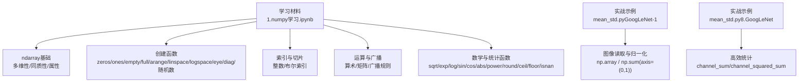
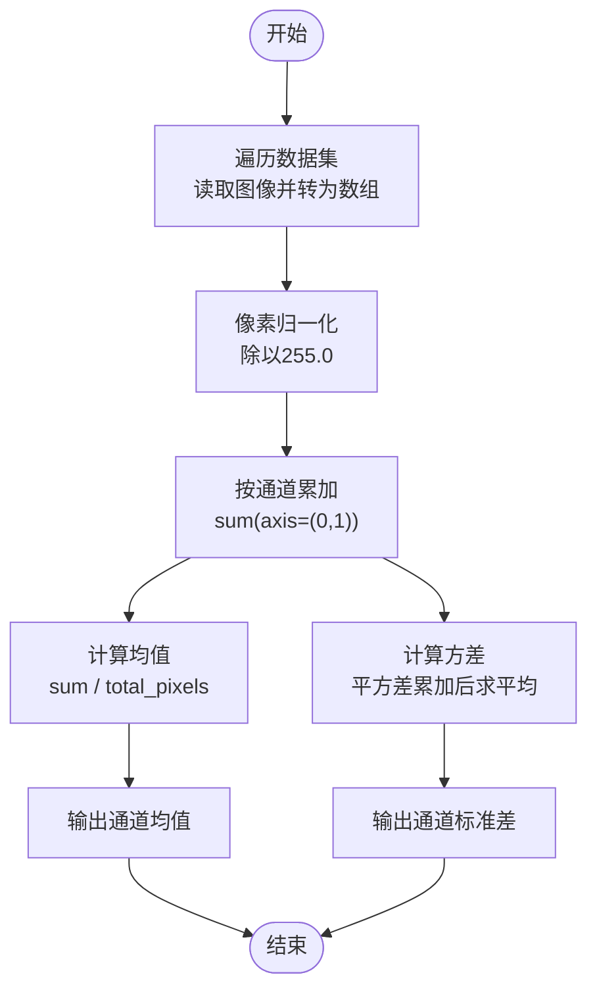
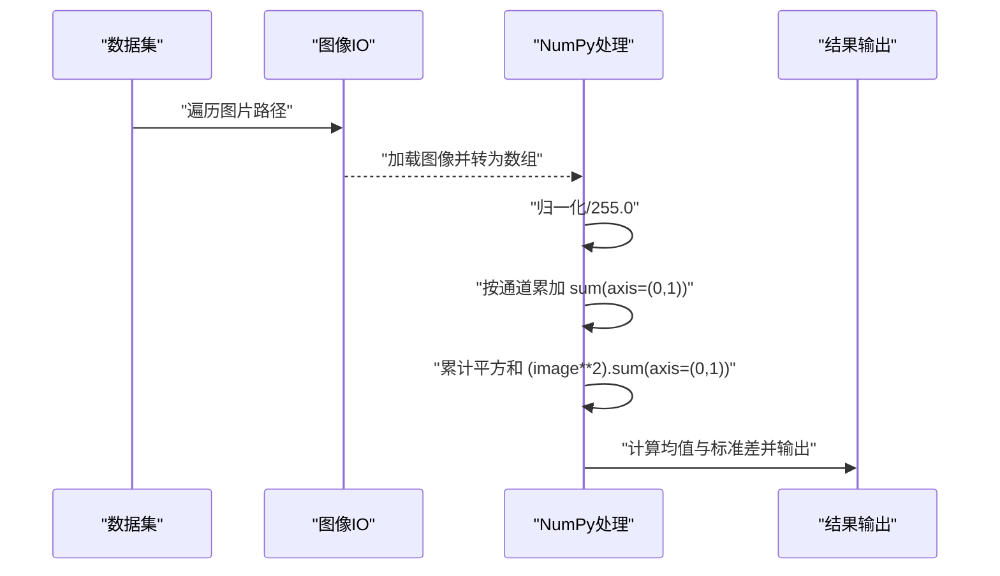
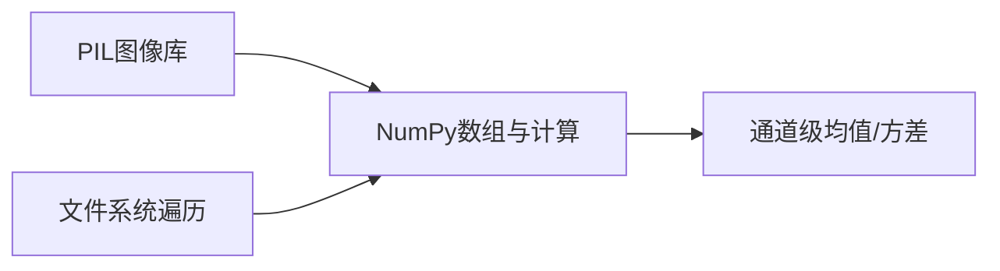

# NumPy基础操作

<cite>
**本文引用的文件**
- [1.numpy学习.ipynb](file://study/研究生学习/1.numpy学习/1.numpy学习.ipynb)
- [mean_std.py（GoogLeNet-1）](file://study/上传课件、源码/源码/GoogLeNet-1/mean_std.py)
- [mean_std.py（8.GoogLeNet）](file://study/研究生学习/8.GoogLeNet/mean_std.py)
</cite>

## 目录
1. [简介](#简介)
2. [项目结构](#项目结构)
3. [核心组件](#核心组件)
4. [架构总览](#架构总览)
5. [详细组件分析](#详细组件分析)
6. [依赖关系分析](#依赖关系分析)
7. [性能考虑](#性能考虑)
8. [故障排查指南](#故障排查指南)
9. [结论](#结论)
10. [附录](#附录)

## 简介
本文件围绕NumPy基础操作，系统讲解ndarray数组的核心特性与常用用法，包括：
- ndarray的多维性与同质性
- 常用属性（shape、ndim、size、dtype等）
- 创建方法（zeros、ones、empty、full、arange、linspace、logspace、eye、diag、随机数生成等）
- 数据类型系统与转换注意事项
- 索引与切片（含布尔索引）
- 广播机制与向量化运算
- 数学与统计函数
- 在深度学习中的数据预处理实践（图像均值方差计算）
- 内存布局优化与GPU加速的说明与建议

内容既适合初学者入门，也为有经验的开发者提供高级用法参考。

## 项目结构
仓库中与NumPy相关的学习资料与实践代码主要位于“研究生学习”和“上传课件、源码”两个目录下。其中：
- “1.numpy学习.ipynb”是系统的NumPy入门教程，涵盖ndarray特性、属性、创建、索引切片、运算、广播、数学与统计函数等。
- “mean_std.py”展示了在真实数据场景下使用NumPy进行图像归一化与通道级均值方差计算的流程。

图表来源
- [1.numpy学习.ipynb](file://study/研究生学习/1.numpy学习/1.numpy学习.ipynb)
- [mean_std.py（GoogLeNet-1）](file://study/上传课件、源码/源码/GoogLeNet-1/mean_std.py)
- [mean_std.py（8.GoogLeNet）](file://study/研究生学习/8.GoogLeNet/mean_std.py)

章节来源
- [1.numpy学习.ipynb](file://study/研究生学习/1.numpy学习/1.numpy学习.ipynb)
- [mean_std.py（GoogLeNet-1）](file://study/上传课件、源码/源码/GoogLeNet-1/mean_std.py)
- [mean_std.py（8.GoogLeNet）](file://study/研究生学习/8.GoogLeNet/mean_std.py)

## 核心组件
本节聚焦ndarray的核心概念与关键API，结合笔记本中的实际演示路径，帮助读者快速定位示例。

- 多维性与同质性
  - 多维性：支持0维到N维数组；通过ndim查看维度数量，shape查看各维长度。
  - 同质性：同一数组内元素类型一致，混合输入会被强制转换为统一类型。
  - 示例路径：[多维性演示](file://study/研究生学习/1.numpy学习/1.numpy学习.ipynb)、[同质性演示](file://study/研究生学习/1.numpy学习/1.numpy学习.ipynb)

- 常用属性
  - shape：形状元组
  - ndim：维度数
  - size：元素总数
  - dtype：数据类型
  - T：转置视图
  - 示例路径：[属性访问](file://study/研究生学习/1.numpy学习/1.numpy学习.ipynb)

- 创建方法
  - zeros/ones/empty/full：按形状与类型初始化
  - arange/linspace/logspace：等差/等间隔/对数间隔序列
  - eye/diag：单位矩阵/对角矩阵
  - 随机数：rand/uniform/randint/normal(randn)，可设置种子seed
  - 示例路径：[预定义形状与复制](file://study/研究生学习/1.numpy学习/1.numpy学习.ipynb)、[等差/等间隔/对数间隔](file://study/研究生学习/1.numpy学习/1.numpy学习.ipynb)、[特殊矩阵](file://study/研究生学习/1.numpy学习/1.numpy学习.ipynb)、[随机数与种子](file://study/研究生学习/1.numpy学习/1.numpy学习.ipynb)

- 数据类型系统
  - 布尔、整型、浮点、复数等；可通过dtype指定或自动推断
  - 注意溢出与精度问题（如int16范围限制）
  - 示例路径：[数据类型与溢出](file://study/研究生学习/1.numpy学习/1.numpy学习.ipynb)

- 索引与切片
  - 一维/二维索引与切片；步长slice(start,end,step)
  - 布尔索引：基于条件筛选
  - 示例路径：[一维索引与切片](file://study/研究生学习/1.numpy学习/1.numpy学习.ipynb)、[二维索引与切片](file://study/研究生学习/1.numpy学习/1.numpy学习.ipynb)

- 广播机制
  - 规则：从右向左对齐维度，任一维度为1时可广播
  - 常见错误：形状不兼容导致ValueError
  - 示例路径：[广播示例与报错](file://study/研究生学习/1.numpy学习/1.numpy学习.ipynb)

- 数学与统计函数
  - 基本数学：sqrt/exp/log/sin/cos/abs/power/round/ceil/floor/isnan
  - 统计：sum/mean/median/var/std/max/min/argmax/argmin/percentile/cumsum/cumprod
  - 示例路径：[基本数学函数](file://study/研究生学习/1.numpy学习/1.numpy学习.ipynb)、[统计函数](file://study/研究生学习/1.numpy学习/1.numpy学习.ipynb)

章节来源
- [1.numpy学习.ipynb](file://study/研究生学习/1.numpy学习/1.numpy学习.ipynb)

## 架构总览
下图展示NumPy在深度学习数据预处理中的典型工作流：从图像读取、归一化、累加统计到最终输出通道级均值与标准差。

图表来源
- [mean_std.py（GoogLeNet-1）](file://study/上传课件、源码/源码/GoogLeNet-1/mean_std.py)
- [mean_std.py（8.GoogLeNet）](file://study/研究生学习/8.GoogLeNet/mean_std.py)

## 详细组件分析

### 组件A：ndarray基础与属性
- 目标：理解ndarray的多维性与同质性，掌握shape、ndim、size、dtype等属性的含义与用途。
- 关键点：
  - 多维性：不同嵌套层级对应不同维度；ndim返回维度数。
  - 同质性：混合类型会被提升为更通用的类型（如int与float→float）。
  - 属性访问：shape为元组，size为元素总数，dtype为具体类型，T为转置视图。
- 示例路径：
  - [多维性演示](file://study/研究生学习/1.numpy学习/1.numpy学习.ipynb)
  - [同质性演示](file://study/研究生学习/1.numpy学习/1.numpy学习.ipynb)
  - [属性访问](file://study/研究生学习/1.numpy学习/1.numpy学习.ipynb)

章节来源
- [1.numpy学习.ipynb](file://study/研究生学习/1.numpy学习/1.numpy学习.ipynb)

### 组件B：数组创建与初始化
- 目标：掌握常用创建函数的参数选项与返回值格式。
- 要点：
  - zeros(shape, dtype=...)：全零数组
  - ones(shape, dtype=...)：全一数组
  - empty(shape, dtype=...)：未初始化（更快但不安全）
  - full(shape, fill_value, dtype=...)：填充固定值
  - arange(start, stop, step)：等差序列
  - linspace(start, stop, num, endpoint=True, retstep=False, dtype=None)：等间隔序列
  - logspace(start, stop, num, base=10.0)：对数间隔序列
  - eye(N, M=None, k=0, dtype=float)：单位矩阵
  - diag(v, k=0)：对角矩阵
  - 随机数：rand(size)/uniform(low, high, size)/randint(low, high, size)/normal(loc, scale, size)；可用seed控制可重复性
- 示例路径：
  - [预定义形状与复制](file://study/研究生学习/1.numpy学习/1.numpy学习.ipynb)
  - [等差/等间隔/对数间隔](file://study/研究生学习/1.numpy学习/1.numpy学习.ipynb)
  - [特殊矩阵](file://study/研究生学习/1.numpy学习/1.numpy学习.ipynb)
  - [随机数与种子](file://study/研究生学习/1.numpy学习/1.numpy学习.ipynb)

章节来源
- [1.numpy学习.ipynb](file://study/研究生学习/1.numpy学习/1.numpy学习.ipynb)

### 组件C：索引与切片
- 目标：熟练进行一维/二维数组的元素访问与切片，理解布尔索引。
- 要点：
  - 一维：arr[i]、arr[start:end:step]、arr[(cond1)&(cond2)]
  - 二维：arr[i,j]、arr[i,start:end]、arr[:,j]
  - 布尔索引：基于条件表达式筛选子集
- 示例路径：
  - [一维索引与切片](file://study/研究生学习/1.numpy学习/1.numpy学习.ipynb)
  - [二维索引与切片](file://study/研究生学习/1.numpy学习/1.numpy学习.ipynb)

章节来源
- [1.numpy学习.ipynb](file://study/研究生学习/1.numpy学习/1.numpy学习.ipynb)

### 组件D：广播机制与向量化运算
- 目标：理解广播规则，避免形状不匹配错误，利用向量化替代循环。
- 要点：
  - 广播规则：从右向左对齐维度，任一维度为1时扩展
  - 常见错误：形状不可广播时报ValueError
  - 向量化：优先使用数组运算而非Python循环
- 示例路径：
  - [广播示例与报错](file://study/研究生学习/1.numpy学习/1.numpy学习.ipynb)

章节来源
- [1.numpy学习.ipynb](file://study/研究生学习/1.numpy学习/1.numpy学习.ipynb)

### 组件E：数学与统计函数
- 目标：掌握常用数学与统计函数，用于数据处理与分析。
- 要点：
  - 数学：sqrt/exp/log/sin/cos/abs/power/round/ceil/floor/isnan
  - 统计：sum/mean/median/var/std/max/min/argmax/argmin/percentile/cumsum/cumprod
- 示例路径：
  - [基本数学函数](file://study/研究生学习/1.numpy学习/1.numpy学习.ipynb)
  - [统计函数](file://study/研究生学习/1.numpy学习/1.numpy学习.ipynb)

章节来源
- [1.numpy学习.ipynb](file://study/研究生学习/1.numpy学习/1.numpy学习.ipynb)

### 组件F：深度学习中的数据预处理（图像均值与方差）
- 目标：在真实数据上应用NumPy进行通道级统计，支撑模型训练的数据标准化。
- 流程：
  - 遍历图片路径，读取并转为数组
  - 归一化至[0,1]区间
  - 按通道累加像素和与平方和
  - 计算均值与标准差
- 示例路径：
  - [GoogLeNet-1均值方差计算](file://study/上传课件、源码/源码/GoogLeNet-1/mean_std.py)
  - [8.GoogLeNet均值方差计算](file://study/研究生学习/8.GoogLeNet/mean_std.py)

图表来源
- [mean_std.py（GoogLeNet-1）](file://study/上传课件、源码/源码/GoogLeNet-1/mean_std.py)
- [mean_std.py（8.GoogLeNet）](file://study/研究生学习/8.GoogLeNet/mean_std.py)

章节来源
- [mean_std.py（GoogLeNet-1）](file://study/上传课件、源码/源码/GoogLeNet-1/mean_std.py)
- [mean_std.py（8.GoogLeNet）](file://study/研究生学习/8.GoogLeNet/mean_std.py)

## 依赖关系分析
- 学习材料依赖NumPy核心模块，用于数组创建、索引、广播与数学统计。
- 实战脚本依赖PIL进行图像读取，并使用NumPy进行数值计算与统计。
- 整体耦合度低，职责清晰：IO负责数据载入，NumPy负责数值计算。

图表来源
- [mean_std.py（GoogLeNet-1）](file://study/上传课件、源码/源码/GoogLeNet-1/mean_std.py)
- [mean_std.py（8.GoogLeNet）](file://study/研究生学习/8.GoogLeNet/mean_std.py)

章节来源
- [mean_std.py（GoogLeNet-1）](file://study/上传课件、源码/源码/GoogLeNet-1/mean_std.py)
- [mean_std.py（8.GoogLeNet）](file://study/研究生学习/8.GoogLeNet/mean_std.py)

## 性能考虑
- 内存布局与缓存友好
  - 尽量保持数组连续存储（C顺序），避免频繁转置与跨步切片造成非连续视图。
  - 使用axis参数进行批量统计（如sum(axis=(0,1))）可减少Python层循环开销。
- 向量化优于循环
  - 用数组运算替代for循环，充分利用底层SIMD与BLAS优化。
- 数据类型选择
  - 根据精度需求选择合适的dtype（如float32常用于深度学习以节省内存与带宽）。
  - 注意整型溢出（如int16范围较小），必要时提升到更高精度。
- 广播与中间数组
  - 合理使用广播减少显式复制；但注意大数组广播可能产生临时副本，需评估内存占用。
- GPU加速支持
  - NumPy本身运行于CPU；如需GPU加速，可使用CuPy（与NumPy API兼容）或将数据迁移至深度学习框架（如PyTorch/TensorFlow）的张量对象。

[本节为通用指导，无需特定文件引用]

## 故障排查指南
- 广播错误
  - 现象：ValueError提示operands could not be broadcast together with shapes(...)
  - 原因：形状无法按广播规则对齐
  - 解决：检查并调整形状，必要时使用reshape或expand_dims
  - 示例路径：[广播报错示例](file://study/研究生学习/1.numpy学习/1.numpy学习.ipynb)

- 数据类型溢出
  - 现象：数值被截断或出现异常值
  - 原因：整型范围不足（如int16）
  - 解决：提升dtype（如int32/int64或float64）
  - 示例路径：[数据类型与溢出](file://study/研究生学习/1.numpy学习/1.numpy学习.ipynb)

- 文件路径不存在
  - 现象：FileNotFoundError
  - 原因：相对路径错误或目录缺失
  - 解决：确认路径存在或使用绝对路径
  - 示例路径：[文件写入错误示例](file://study/研究生学习/1.numpy学习/1.numpy学习.ipynb)

章节来源
- [1.numpy学习.ipynb](file://study/研究生学习/1.numpy学习/1.numpy学习.ipynb)

## 结论
通过本文件的学习，读者应能：
- 熟练掌握ndarray的多维性与同质性，以及常用属性与方法
- 灵活使用各类创建函数构建不同形状与类型的数组
- 正确进行索引与切片，并利用布尔索引进行条件筛选
- 理解广播机制，编写高效的向量化代码
- 运用数学与统计函数完成数据处理任务
- 在深度学习场景中，使用NumPy实现图像归一化与通道级统计

这些能力是后续深入学习深度学习框架与高性能数值计算的重要基础。

[本节为总结性内容，无需特定文件引用]

## 附录
- 推荐练习
  - 尝试将笔记本中的示例改写为函数封装，增加参数校验与文档字符串
  - 在mean_std.py基础上添加进度条与异常处理，提高鲁棒性
  - 对比不同dtype对内存与速度的影响，记录实验结果

[本节为建议性内容，无需特定文件引用]