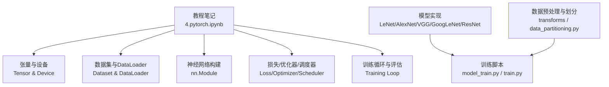
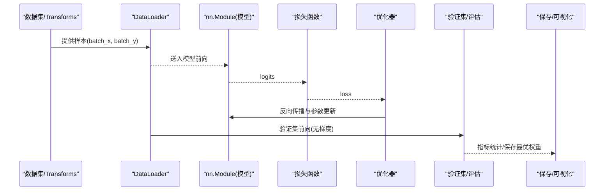
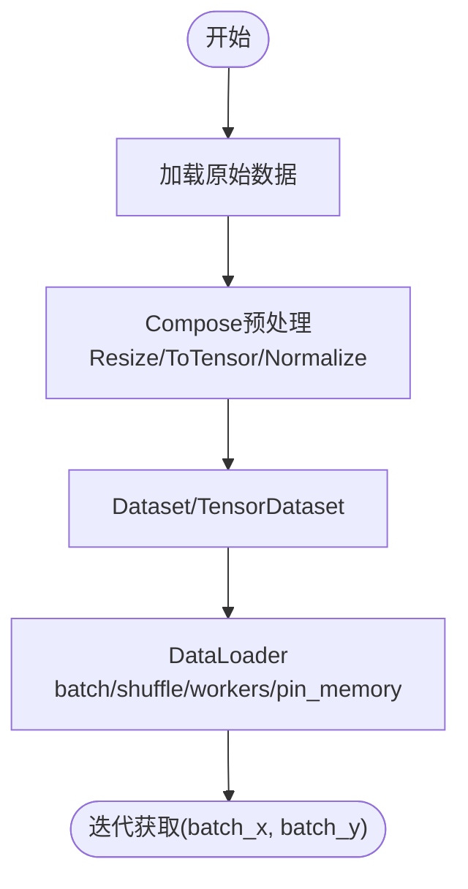
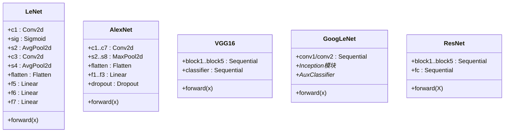
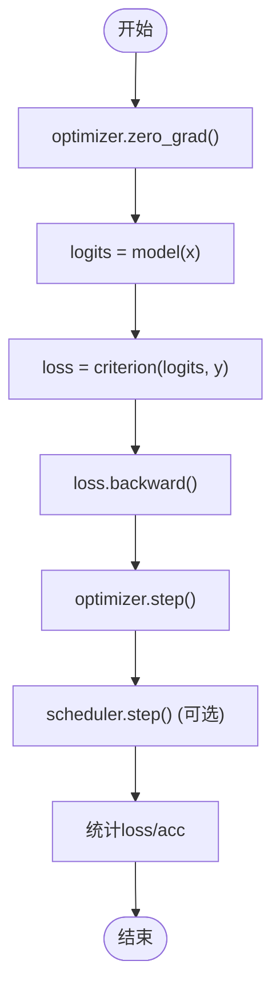
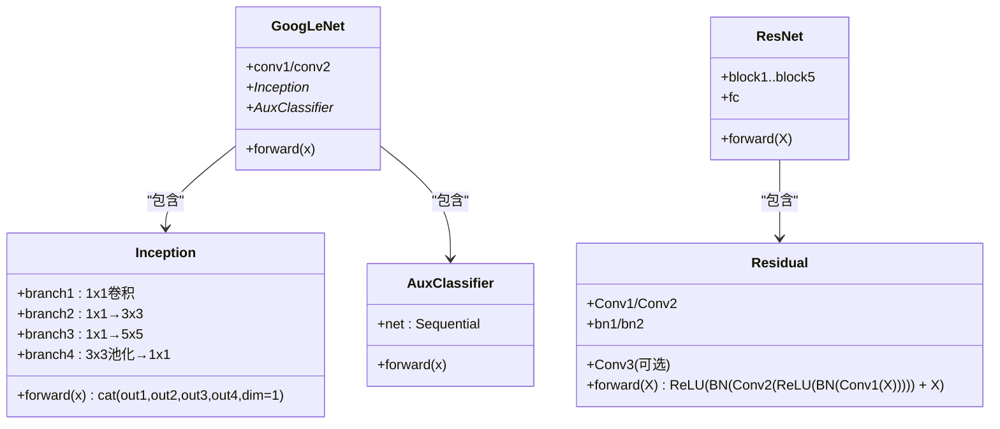
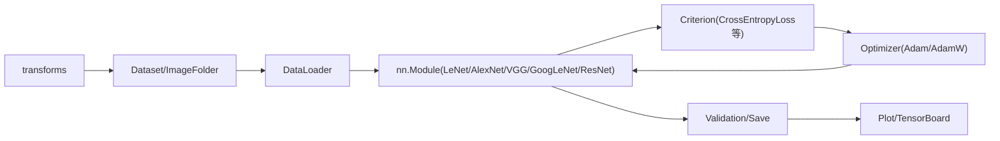

# PyTorch框架使用

<cite>
**本文引用的文件**   
- [4.pytorch.ipynb](file://study/研究生学习/4.pytorch/4.pytorch.ipynb)
- [model.py（AlexNet）](file://study/上传课件、源码/源码/AlexNet/model.py)
- [model_train.py（AlexNet）](file://study/上传课件、源码/源码/AlexNet/model_train.py)
- [model.py（LeNet，课件版）](file://study/上传课件、源码/源码/LeNet/model.py)
- [model_train.py（LeNet，课件版）](file://study/上传课件、源码/源码/LeNet/model_train.py)
- [model.py（LeNet，学习版）](file://study/研究生学习/5.LeNet/model.py)
- [train.py（LeNet，学习版）](file://study/研究生学习/5.LeNet/train.py)
- [model.py（AlexNet，学习版）](file://study/研究生学习/6.AlexNet/model.py)
- [train.py（AlexNet，学习版）](file://study/研究生学习/6.AlexNet/train.py)
- [model.py（VGG16）](file://study/研究生学习/7.VGG_16/model.py)
- [model.py（GoogLeNet）](file://study/研究生学习/8.GoogLeNet/model.py)
- [model.py（ResNet）](file://study/研究生学习/9.ResNet/model.py)
- [model_train.py（GoogLeNet-1）](file://study/上传课件、源码/源码/GoogLeNet-1/model_train.py)
- [data_partitioning.py（数据划分脚本）](file://study/上传课件、源码/源码/GoogLeNet-1/data_partitioning.py)
</cite>

## 目录
1. [简介](#简介)
2. [项目结构](#项目结构)
3. [核心组件](#核心组件)
4. [架构总览](#架构总览)
5. [详细组件分析](#详细组件分析)
6. [依赖关系分析](#依赖关系分析)
7. [性能与内存管理](#性能与内存管理)
8. [故障排查指南](#故障排查指南)
9. [结论](#结论)
10. [附录：最佳实践与代码规范](#附录最佳实践与代码规范)

## 简介
本指南面向PyTorch初学者与有经验的开发者，系统讲解张量操作、自动求导、nn.Module建模、数据加载与处理、训练与评估流程、GPU加速与内存管理、模型保存与加载、可视化等主题。文档结合仓库中的实际示例，覆盖从基础到进阶的完整开发路径，并给出调试技巧与性能优化建议。

## 项目结构
仓库包含两类内容：
- 教程型Jupyter Notebook：系统讲解Tensor、Dataset/DataLoader、nn.Module、损失函数与优化器、训练循环、推理等基础知识。
- 实战型模型实现：LeNet、AlexNet、VGG16、GoogLeNet、ResNet的网络定义与训练脚本，以及图像分类的数据预处理与划分工具。

图表来源
- [4.pytorch.ipynb](file://study/研究生学习/4.pytorch/4.pytorch.ipynb)
- [model.py（AlexNet）](file://study/上传课件、源码/源码/AlexNet/model.py)
- [model_train.py（AlexNet）](file://study/上传课件、源码/源码/AlexNet/model_train.py)
- [model.py（LeNet，课件版）](file://study/上传课件、源码/源码/LeNet/model.py)
- [model_train.py（LeNet，课件版）](file://study/上传课件、源码/源码/LeNet/model_train.py)
- [model.py（VGG16）](file://study/研究生学习/7.VGG_16/model.py)
- [model.py（GoogLeNet）](file://study/研究生学习/8.GoogLeNet/model.py)
- [model.py（ResNet）](file://study/研究生学习/9.ResNet/model.py)
- [data_partitioning.py（数据划分脚本）](file://study/上传课件、源码/源码/GoogLeNet-1/data_partitioning.py)

章节来源
- [4.pytorch.ipynb](file://study/研究生学习/4.pytorch/4.pytorch.ipynb)

## 核心组件
- 张量与设备管理：统一通过device对象管理CPU/GPU，确保模型与数据同设备；常用创建、形状变换、类型转换与detach/cpu().numpy()等。
- 数据集与DataLoader：自定义Dataset或TensorDataset配合DataLoader进行分批、打乱、并行加载；transforms.Compose组合图像预处理。
- nn.Module建模：在__init__中声明层，forward中组织计算图；支持Sequential与分支逻辑。
- 损失函数与优化器：CrossEntropyLoss/BCEWithLogitsLoss/MSELoss等；Adam/AdamW/SGD及学习率调度器StepLR/CosineAnnealingLR/ReduceLROnPlateau。
- 训练与评估：model.train()/model.eval()切换模式；no_grad用于推理；标准更新顺序zero_grad→forward→backward→step。
- 可视化：matplotlib绘制训练曲线；Notebook中可集成TensorBoard记录日志。

章节来源
- [4.pytorch.ipynb](file://study/研究生学习/4.pytorch/4.pytorch.ipynb)

## 架构总览
下图展示一个典型端到端流程：数据准备→模型定义→训练循环→验证与保存→可视化。

图表来源
- [model_train.py（AlexNet）](file://study/上传课件、源码/源码/AlexNet/model_train.py)
- [train.py（LeNet，学习版）](file://study/研究生学习/5.LeNet/train.py)
- [model.py（AlexNet）](file://study/上传课件、源码/源码/AlexNet/model.py)

## 详细组件分析

### 张量与设备（Tensor & Device）
- 设备选择：优先cuda，否则cpu；所有输入与模型需统一到同一设备。
- 常用操作：创建、view/reshape、unsqueeze/squeeze、permute、cat/stack、to(device)、float()/long()、detach()、cpu().numpy()。
- 注意事项：分类标签为LongTensor且形状为[batch]；网络输入通常为float32。

章节来源
- [4.pytorch.ipynb](file://study/研究生学习/4.pytorch/4.pytorch.ipynb)

### 数据集与DataLoader（Dataset & DataLoader）
- TensorDataset：将已有张量封装为数据集。
- 自定义Dataset：实现__len__和__getitem__，返回(input, label)。
- DataLoader：batch_size、shuffle、num_workers、drop_last、pin_memory等关键参数。
- transforms.Compose：Resize/ToTensor/Normalize等步骤按序执行。

图表来源
- [4.pytorch.ipynb](file://study/研究生学习/4.pytorch/4.pytorch.ipynb)

章节来源
- [4.pytorch.ipynb](file://study/研究生学习/4.pytorch/4.pytorch.ipynb)

### 神经网络构建（nn.Module）
- 基本范式：__init__声明层，forward组织计算；复杂结构可用Sequential简化。
- 常见层：Conv2d/Linear/MaxPool2d/AvgPool2d/BatchNorm/Dropout/Flatten/Embedding/LSTM/TransformerEncoderLayer等。
- 激活函数：ReLU/LeakyReLU/Sigmoid/Tanh/GELU/Softmax等。
- 初始化：对卷积与全连接层进行合理初始化（如Kaiming）。

图表来源
- [model.py（LeNet，课件版）](file://study/上传课件、源码/源码/LeNet/model.py)
- [model.py（AlexNet）](file://study/上传课件、源码/源码/AlexNet/model.py)
- [model.py（VGG16）](file://study/研究生学习/7.VGG_16/model.py)
- [model.py（GoogLeNet）](file://study/研究生学习/8.GoogLeNet/model.py)
- [model.py（ResNet）](file://study/研究生学习/9.ResNet/model.py)

章节来源
- [model.py（LeNet，课件版）](file://study/上传课件、源码/源码/LeNet/model.py)
- [model.py（AlexNet）](file://study/上传课件、源码/源码/AlexNet/model.py)
- [model.py（VGG16）](file://study/研究生学习/7.VGG_16/model.py)
- [model.py（GoogLeNet）](file://study/研究生学习/8.GoogLeNet/model.py)
- [model.py（ResNet）](file://study/研究生学习/9.ResNet/model.py)

### 损失函数、优化器与学习率调度
- 损失函数：CrossEntropyLoss（多分类）、BCEWithLogitsLoss（二分类/多标签）、MSELoss/L1Loss（回归）。
- 优化器：Adam/AdamW/SGD；常用lr、weight_decay、momentum。
- 学习率调度：StepLR/CosineAnnealingLR/ReduceLROnPlateau；在epoch末调用scheduler.step()。

章节来源
- [4.pytorch.ipynb](file://study/研究生学习/4.pytorch/4.pytorch.ipynb)

### 训练循环与评估（Training Loop）
- 标准顺序：optimizer.zero_grad() → model(x) → loss = criterion(logits, y) → loss.backward() → optimizer.step() → scheduler.step()。
- 模式切换：model.train()用于训练（Dropout生效、BN统计更新），model.eval()用于验证/推理（关闭随机性，使用累计统计）。
- 推理：with torch.no_grad()避免记录梯度，减少显存占用并加速。
- 指标：loss与accuracy；对比训练/验证趋势判断过拟合或欠拟合。

图表来源
- [4.pytorch.ipynb](file://study/研究生学习/4.pytorch/4.pytorch.ipynb)
- [train.py（LeNet，学习版）](file://study/研究生学习/5.LeNet/train.py)
- [model_train.py（AlexNet）](file://study/上传课件、源码/源码/AlexNet/model_train.py)

章节来源
- [4.pytorch.ipynb](file://study/研究生学习/4.pytorch/4.pytorch.ipynb)
- [train.py（LeNet，学习版）](file://study/研究生学习/5.LeNet/train.py)
- [model_train.py（AlexNet）](file://study/上传课件、源码/源码/AlexNet/model_train.py)

### 模型保存与加载
- 保存：仅保存state_dict以减小体积；在验证指标最优时保存best_model_wts。
- 加载：使用load_state_dict恢复参数；注意与当前模型结构一致。
- 路径管理：建议使用相对路径或Path对象，便于跨平台运行。

章节来源
- [model_train.py（AlexNet）](file://study/上传课件、源码/源码/AlexNet/model_train.py)
- [model_train.py（LeNet，课件版）](file://study/上传课件、源码/源码/LeNet/model_train.py)
- [train.py（LeNet，学习版）](file://study/研究生学习/5.LeNet/train.py)

### 可视化与日志
- matplotlib：绘制训练/验证损失与准确率曲线。
- TensorBoard：可在训练循环中记录scalar（loss/acc）、图像、直方图等；适合长期实验追踪。

章节来源
- [model_train.py（AlexNet）](file://study/上传课件、源码/源码/AlexNet/model_train.py)
- [model_train.py（LeNet，课件版）](file://study/上传课件、源码/源码/LeNet/model_train.py)
- [train.py（LeNet，学习版）](file://study/研究生学习/5.LeNet/train.py)

### 自定义网络层与复杂结构
- Inception模块：多尺度并行分支并在通道维度拼接，提升特征表达能力。
- 辅助分类头：GoogLeNet在中间层输出辅助分类结果，增强梯度信号。
- 残差块：Residual模块通过恒等映射解决深层网络退化问题。

图表来源
- [model.py（GoogLeNet）](file://study/研究生学习/8.GoogLeNet/model.py)
- [model.py（ResNet）](file://study/研究生学习/9.ResNet/model.py)

章节来源
- [model.py（GoogLeNet）](file://study/研究生学习/8.GoogLeNet/model.py)
- [model.py（ResNet）](file://study/研究生学习/9.ResNet/model.py)

### 数据预处理与划分
- transforms：Resize/RandomHorizontalFlip/RandomRotation/RandomAffine/ToTensor/Normalize等组合。
- ImageFolder：按目录结构自动加载图像；常用于自定义数据集。
- 数据划分脚本：按类别随机抽取一定比例作为验证集，其余放入训练集。

章节来源
- [train.py（AlexNet，学习版）](file://study/研究生学习/6.AlexNet/train.py)
- [model_train.py（GoogLeNet-1）](file://study/上传课件、源码/源码/GoogLeNet-1/model_train.py)
- [data_partitioning.py（数据划分脚本）](file://study/上传课件、源码/源码/GoogLeNet-1/data_partitioning.py)

## 依赖关系分析
- 模型与训练脚本解耦：模型定义集中于model.py，训练流程在model_train.py/train.py中编排。
- 数据流：Dataset/Transforms→DataLoader→模型前向→损失→优化器更新。
- 外部库：torchvision用于数据集与transforms；matplotlib用于绘图；pandas用于记录训练过程。

图表来源
- [model.py（AlexNet）](file://study/上传课件、源码/源码/AlexNet/model.py)
- [model_train.py（AlexNet）](file://study/上传课件、源码/源码/AlexNet/model_train.py)
- [train.py（LeNet，学习版）](file://study/研究生学习/5.LeNet/train.py)

章节来源
- [model.py（AlexNet）](file://study/上传课件、源码/源码/AlexNet/model.py)
- [model_train.py（AlexNet）](file://study/上传课件、源码/源码/AlexNet/model_train.py)
- [train.py（LeNet，学习版）](file://study/研究生学习/5.LeNet/train.py)

## 性能与内存管理
- 设备一致性：确保模型与数据在同一设备，避免DeviceMismatch错误。
- pin_memory：在CUDA环境下开启DataLoader的pin_memory以提升CPU→GPU传输效率。
- num_workers：适当增加并行加载进程数，Windows/Jupyter下可先设为0以避免多进程问题。
- drop_last：BatchNorm训练时对最后不足batch的数据可选择丢弃，保持统计稳定性。
- no_grad：推理与验证阶段使用no_grad减少显存占用与计算开销。
- 混合精度训练（进阶）：可使用torch.cuda.amp自动混合精度，降低显存并提升吞吐。
- 梯度裁剪：复杂模型中clip_grad_norm_防止梯度爆炸。
- 模型规模控制：合理设置batch_size与网络深度，避免OOM。

章节来源
- [4.pytorch.ipynb](file://study/研究生学习/4.pytorch/4.pytorch.ipynb)
- [train.py（LeNet，学习版）](file://study/研究生学习/5.LeNet/train.py)
- [model_train.py（AlexNet）](file://study/上传课件、源码/源码/AlexNet/model_train.py)

## 故障排查指南
- Device mismatch：检查模型与数据是否都.to(device)，打印device确认。
- 数据类型不匹配：分类标签应为LongTensor，输入应为float32。
- DataLoader多进程报错：Windows/Jupyter下将num_workers设为0或改用multiprocessing启动方式。
- 过拟合：观察训练/验证loss分离；引入Dropout、权重衰减、数据增强或早停策略。
- 训练不收敛：调整学习率、使用AdamW、添加学习率调度器、检查数据归一化。
- 显存不足：减小batch_size、启用混合精度、减少模型宽度/深度、及时释放中间变量。
- 保存/加载失败：确保加载的state_dict与当前模型结构一致；使用copy.deepcopy保存最优权重。

章节来源
- [4.pytorch.ipynb](file://study/研究生学习/4.pytorch/4.pytorch.ipynb)
- [model_train.py（AlexNet）](file://study/上传课件、源码/源码/AlexNet/model_train.py)
- [train.py（LeNet，学习版）](file://study/研究生学习/5.LeNet/train.py)

## 结论
本指南基于仓库中的教程与实战代码，系统梳理了PyTorch的核心API与使用模式，涵盖从张量与数据加载到模型构建、训练评估、可视化与部署保存的全流程。通过模块化设计与清晰的数据流，读者可以快速上手并逐步掌握高级特性（如混合精度、学习率调度、数据增强等），同时获得性能优化与问题排查的实践建议。

## 附录：最佳实践与代码规范
- 代码组织：模型定义与训练脚本分离，便于复用与测试。
- 配置集中：设备、批大小、workers、路径等常量集中管理。
- 随机种子：固定种子保证可复现性。
- 日志与可视化：每个epoch记录指标，使用matplotlib或TensorBoard持久化。
- 权重保存：仅保存state_dict，按验证指标最优保存，避免保存整个模型对象。
- 数据管道：transforms顺序正确（Resize→ToTensor→Normalize），训练集打乱，验证集不打乱。
- 安全与健壮：异常捕获、断言输入形状与类型、打印关键信息便于调试。