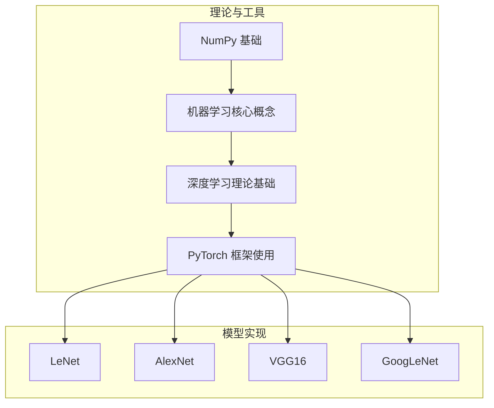
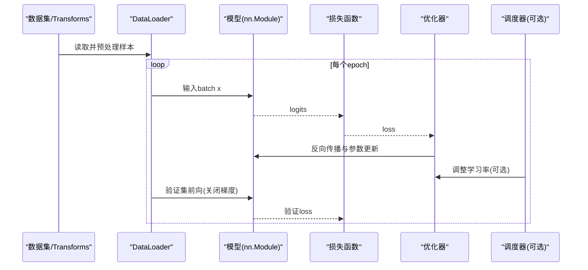
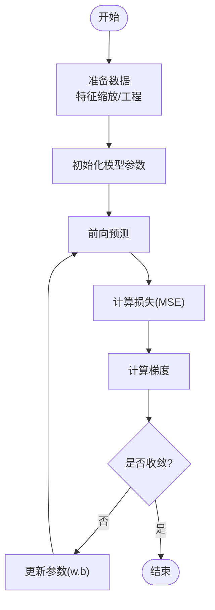
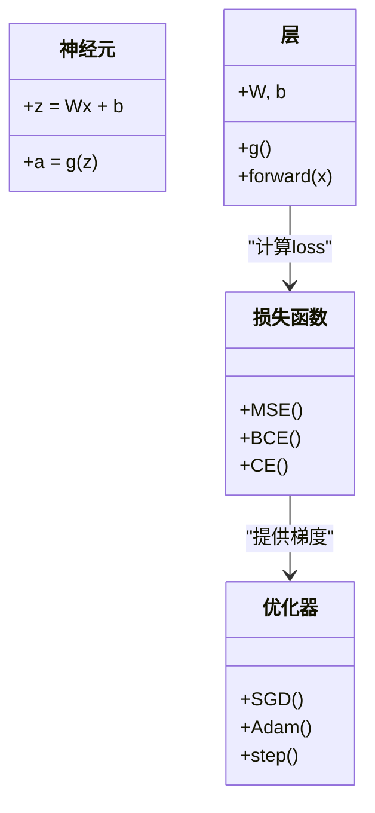
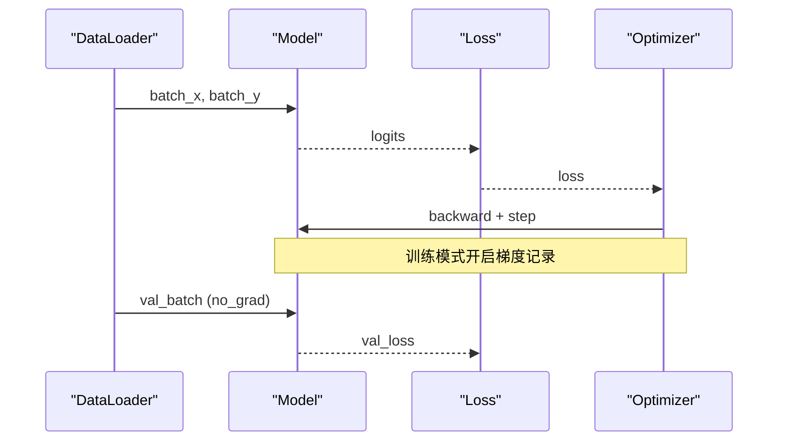
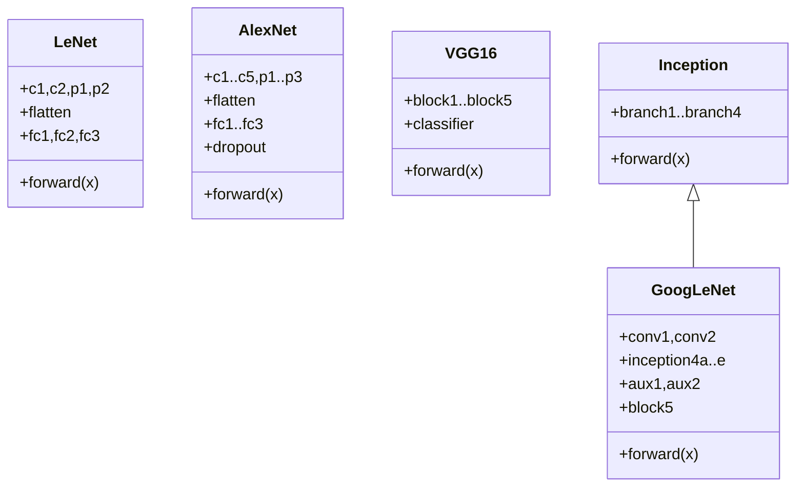
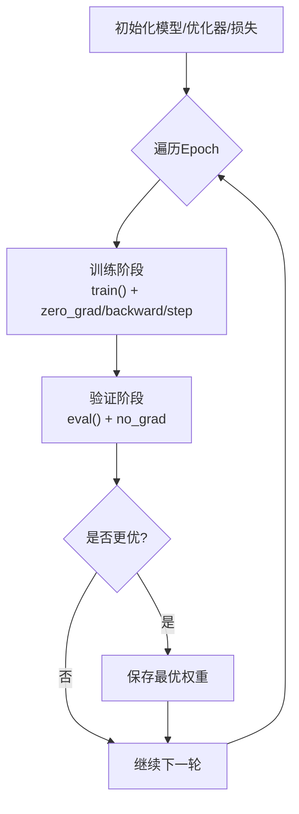
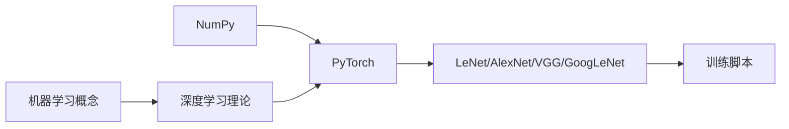

# 基础理论学习

<cite>
**本文引用的文件列表**
- [1.numpy学习.ipynb](file://study/研究生学习/1.numpy学习/1.numpy学习.ipynb)
- [2.机器学习.ipynb](file://study/研究生学习/2.机器学习/2.机器学习.ipynb)
- [3.深度学习.ipynb](file://study/研究生学习/3.深度学习/3.深度学习.ipynb)
- [4.pytorch.ipynb](file://study/研究生学习/4.pytorch/4.pytorch.ipynb)
- [LeNet/model.py](file://study/研究生学习/5.LeNet/model.py)
- [LeNet/train.py](file://study/研究生学习/5.LeNet/train.py)
- [AlexNet/model.py](file://study/研究生学习/6.AlexNet/model.py)
- [AlexNet/train.py](file://study/研究生学习/6.AlexNet/train.py)
- [VGG_16/model.py](file://study/研究生学习/7.VGG_16/model.py)
- [GoogLeNet/model.py](file://study/研究生学习/8.GoogLeNet/model.py)
</cite>

## 目录
1. [引言](#引言)
2. [项目结构](#项目结构)
3. [核心组件](#核心组件)
4. [架构总览](#架构总览)
5. [详细组件分析](#详细组件分析)
6. [依赖关系分析](#依赖关系分析)
7. [性能与训练要点](#性能与训练要点)
8. [故障排查指南](#故障排查指南)
9. [结论](#结论)
10. [附录：接口、参数与返回值速查](#附录接口参数与返回值速查)

## 引言
本文件面向“基础理论学习模块”，系统梳理从 NumPy 张量操作到机器学习核心概念，再到深度学习理论基础与 PyTorch 框架实践的全链路知识。内容覆盖：
- 张量操作与数据类型、索引切片、随机数生成等 NumPy 基础
- 监督/无监督学习、线性回归、代价函数、梯度下降、特征缩放与工程、多项式回归
- 神经网络基础（神经元、层、前向传播、损失、反向传播）、激活函数、优化器、CNN 原理（卷积、池化、感受野）
- PyTorch 张量与设备、数据集与 DataLoader、nn.Module 模型构建、损失与优化器、标准训练循环、推理流程
- 经典网络实现细节：LeNet、AlexNet、VGG16、GoogLeNet（Inception 模块与辅助分类器）
- 常见配置项、参数与返回值的说明，以及与各组件的关系
- 常见问题与解决方案

## 项目结构
仓库以“课程笔记 + 代码示例”的方式组织，理论部分以 Jupyter Notebook 呈现，实战部分以 Python 脚本和模型定义为主。整体结构如下：
- 理论与工具
  - NumPy 基础：数组创建、属性、类型、索引切片、随机数等
  - 机器学习：线性回归、梯度下降、特征工程
  - 深度学习：神经网络、损失与优化、CNN 基础
  - PyTorch：张量、数据加载、模型搭建、训练循环、推理
- 模型实现
  - LeNet/AlexNet/VGG16/GoogLeNet 的模型定义与训练脚本

[本节为概览性描述，不直接分析具体文件]

## 核心组件
- NumPy 张量与操作：多维数组、同质性、形状/维度/元素个数/数据类型、预定义数组、等差/等间隔/对数序列、特殊矩阵、随机分布、索引与切片等
- 机器学习核心：点积、监督/无监督学习、线性回归（单变量/多元）、代价函数（MSE）、梯度下降（批量/随机/小批量）、学习率、正规方程、特征缩放（标准化/归一化/对数变换）、特征工程、多项式回归
- 深度学习基础：神经元与层、全连接网络、前向传播、损失函数（MSE/BCE/CE）、反向传播、优化器（SGD/Momentum/Adam）、CNN（卷积核、步幅、填充、池化、下采样、感受野、输出尺寸与参数量公式）
- PyTorch 实践：Tensor 与 Device、Dataset/DataLoader、transforms、nn.Module、常用层与激活、损失与优化器、学习率调度、标准训练循环与评估、推理与概率输出

**章节来源**
- [1.numpy学习.ipynb:1-800](file://study/研究生学习/1.numpy学习/1.numpy学习.ipynb#L1-L800)
- [2.机器学习.ipynb:1-558](file://study/研究生学习/2.机器学习/2.机器学习.ipynb#L1-L558)
- [3.深度学习.ipynb:1-800](file://study/研究生学习/3.深度学习/3.深度学习.ipynb#L1-L800)
- [4.pytorch.ipynb:1-800](file://study/研究生学习/4.pytorch/4.pytorch.ipynb#L1-L800)

## 架构总览
下图展示从数据到模型的端到端流程：数据预处理与加载 → 模型前向计算 → 损失计算 → 反向传播与参数更新 → 验证与保存最优模型。

[本图为概念性流程图，未映射到具体源码文件]

## 详细组件分析

### 组件A：NumPy 张量与操作
- 关键能力
  - 多维性与同质性：统一数据类型，便于向量化运算
  - 属性与方法：shape、ndim、size、dtype、转置等
  - 创建方式：zeros/ones/empty/full_like、arange/linspace/logspace、eye/diag、随机分布（uniform/randint/randn）
  - 索引与切片：高级索引、布尔索引、广播机制
- 复杂度与性能
  - 大多数操作底层由 BLAS/LAPACK 或 SIMD 加速，时间复杂度近似 O(n) 或 O(n^d)
  - 避免在循环中逐元素操作，优先使用向量化
- 典型用法路径
  - 数组创建与属性访问
  - 随机种子设置与可复现实验
  - 特殊矩阵构造（单位阵、对角阵）
  - 数值序列生成（等差/等间隔/对数）

**章节来源**
- [1.numpy学习.ipynb:1-800](file://study/研究生学习/1.numpy学习/1.numpy学习.ipynb#L1-L800)

### 组件B：机器学习核心概念
- 线性回归与梯度下降
  - 假设函数 f(x)=wx+b；代价函数 MSE；同时更新 w,b
  - 学习率影响收敛速度与稳定性；批量/随机/小批量策略权衡
- 特征工程与缩放
  - 标准化（Z-score）、归一化（Min-Max）、对数变换
  - 特征选择与构造提升表达能力
- 多项式回归
  - 通过高次项拟合非线性关系，注意过拟合控制

**章节来源**
- [2.机器学习.ipynb:1-558](file://study/研究生学习/2.机器学习/2.机器学习.ipynb#L1-L558)

### 组件C：深度学习理论基础
- 神经元与层
  - 线性组合 z=Wx+b，激活 a=g(z)；多层叠加引入非线性
- 前向传播与损失
  - 回归用 MSE，二分类用 BCE，多分类用 CE；输出层与损失匹配
- 反向传播与优化
  - 链式法则计算梯度；SGD/Momentum/Adam 等优化器
- CNN 基础
  - 卷积核提取局部模式；池化压缩与扩大感受野；输出尺寸与参数量公式
  - 感受野随层数加深而增大，利于高层语义建模

**章节来源**
- [3.深度学习.ipynb:1-800](file://study/研究生学习/3.深度学习/3.深度学习.ipynb#L1-L800)

### 组件D：PyTorch 框架使用
- 张量与设备
  - Tensor 属性 shape/dtype/device/requires_grad；to(device)、detach()、numpy()
- 数据加载
  - Dataset/DataLoader；random_split；transforms.Compose；FashionMNIST 灰度图通道=1
- 模型构建
  - nn.Module 继承；Sequential 堆叠；常用层（Conv2d/Linear/MaxPool2d/BatchNorm/Dropout/Flatten）
- 训练循环
  - model.train()/eval()；no_grad；zero_grad/backward/step；clip_grad_norm_
- 推理
  - eval+no_grad；argmax 取类别；softmax 获取概率

**章节来源**
- [4.pytorch.ipynb:1-800](file://study/研究生学习/4.pytorch/4.pytorch.ipynb#L1-L800)

### 组件E：经典网络实现（LeNet/AlexNet/VGG16/GoogLeNet）
- LeNet
  - 卷积+Sigmoid+平均池化→展平→全连接；适用于手写数字/小图像
- AlexNet
  - 大卷积核+ReLU+最大池化+Dropout；适合更大输入尺寸
- VGG16
  - 重复的小卷积核块+最大池化；分类头含多个全连接层；Kaiming 初始化
- GoogLeNet
  - Inception 多分支并行（1x1/3x3/5x5/池化+1x1），辅助分类器；自适应池化+全局平均池化

**图表来源**
- [LeNet/model.py:1-38](file://study/研究生学习/5.LeNet/model.py#L1-L38)
- [AlexNet/model.py:1-50](file://study/研究生学习/6.AlexNet/model.py#L1-L50)
- [VGG_16/model.py:1-85](file://study/研究生学习/7.VGG_16/model.py#L1-L85)
- [GoogLeNet/model.py:1-144](file://study/研究生学习/8.GoogLeNet/model.py#L1-L144)

**章节来源**
- [LeNet/model.py:1-38](file://study/研究生学习/5.LeNet/model.py#L1-L38)
- [AlexNet/model.py:1-50](file://study/研究生学习/6.AlexNet/model.py#L1-L50)
- [VGG_16/model.py:1-85](file://study/研究生学习/7.VGG_16/model.py#L1-L85)
- [GoogLeNet/model.py:1-144](file://study/研究生学习/8.GoogLeNet/model.py#L1-L144)

### 组件F：训练流程与最佳实践
- 数据预处理与增强
  - Resize/ToTensor/Normalize；随机翻转/旋转/Affine（AlexNet 示例）
- 训练循环
  - 清空梯度→前向→计算损失→反向→更新；必要时梯度裁剪
- 验证与早停
  - 保存验证集指标最优的权重；监控 train/val 双曲线
- 可视化
  - 绘制 loss/acc 曲线，辅助诊断过拟合/欠拟合

**章节来源**
- [LeNet/train.py:1-202](file://study/研究生学习/5.LeNet/train.py#L1-L202)
- [AlexNet/train.py:1-218](file://study/研究生学习/6.AlexNet/train.py#L1-L218)

## 依赖关系分析
- 理论与实现的耦合
  - NumPy 作为数值基础，贯穿数据处理与实验调试
  - 机器学习概念为深度学习提供数学直觉（如梯度下降、损失函数）
  - PyTorch 将理论落地为可执行计算图
- 模型与训练脚本的解耦
  - 模型定义集中于 model.py，训练逻辑集中在 train.py，便于复用与替换
- 外部库与第三方工具
  - torchsummary 用于打印模型结构与参数量
  - torchvision.transforms 与 datasets 提供数据管道

[本图为概念性依赖图，未映射到具体源码文件]

## 性能与训练要点
- 批大小与学习率
  - 较大 batch 稳定但可能泛化略差；较小 batch 噪声大但常有助于跳出局部极小
  - 学习率过大震荡/发散，过小收敛慢；配合调度器逐步衰减
- 正则化与防过拟合
  - Dropout、权重衰减、数据增强、早停、交叉验证
- 数值稳定性
  - 使用 Kaiming/正态初始化；避免饱和激活；合理归一化
- GPU 利用
  - 确保模型与数据同设备；pin_memory=True；num_workers 合理设置

[本节为通用指导，不直接分析具体文件]

## 故障排查指南
- 设备不一致
  - 现象：RuntimeError: Expected all tensors to be on the same device
  - 解决：统一 .to(device)，检查 DataLoader 与模型初始化
- 数据类型不匹配
  - 现象：CrossEntropyLoss 需要 long 标签；输入需 float
  - 解决：y.long()，x.float()；注意 FashionMNIST 通道=1
- 梯度爆炸/消失
  - 现象：loss NaN 或不降
  - 解决：梯度裁剪 clip_grad_norm_；更换激活/初始化；调小学习率
- 内存不足
  - 现象：CUDA out of memory
  - 解决：减小 batch_size；减少网络深度/宽度；启用梯度累积
- 数据管道问题
  - 现象：num_workers 导致 Windows/Jupyter 报错
  - 解决：num_workers=0；persistent_workers 谨慎使用

**章节来源**
- [4.pytorch.ipynb:1-800](file://study/研究生学习/4.pytorch/4.pytorch.ipynb#L1-L800)
- [LeNet/train.py:1-202](file://study/研究生学习/5.LeNet/train.py#L1-L202)
- [AlexNet/train.py:1-218](file://study/研究生学习/6.AlexNet/train.py#L1-L218)

## 结论
本模块从 NumPy 基础出发，逐步过渡到机器学习与深度学习理论，最终在 PyTorch 中完成从数据到模型、从训练到推理的完整闭环。通过 LeNet/AlexNet/VGG16/GoogLeNet 的经典实现，读者可掌握卷积神经网络的核心思想与实践方法。建议结合训练曲线与验证指标进行迭代调参，关注数值稳定性与正则化策略，以获得稳健的性能。

[本节为总结性内容，不直接分析具体文件]

## 附录：接口、参数与返回值速查
- 张量与设备
  - 属性：shape、dtype、device、requires_grad
  - 转换：to(device)、float()/long()、detach()、cpu().numpy()
- 数据加载
  - TensorDataset(x,y)；DataLoader(dataset, batch_size, shuffle, num_workers, pin_memory)
  - transforms.Compose([...])；Resize/ToTensor/Normalize
- 模型构建
  - nn.Module 子类；__init__ 定义层；forward 定义计算流
  - 常用层：Conv2d(in_ch,out_ch,kernel,stride,padding)、Linear(in,out)、MaxPool2d、BatchNorm1d/2d、Dropout(p)、Flatten
- 损失与优化
  - CrossEntropyLoss(logits, target_long)；BCEWithLogitsLoss；MSELoss
  - Adam/AdamW(lr, weight_decay)；StepLR/CosineAnnealingLR/ReduceLROnPlateau
- 训练循环
  - model.train()/model.eval()；optimizer.zero_grad()；loss.backward()；optimizer.step()
  - 指标：avg_loss、accuracy；保存 best_model_wts
- 推理
  - with torch.no_grad(): logits=model(x)；pred=logits.argmax(dim=1)；prob=torch.softmax(logits,dim=1)

**章节来源**
- [4.pytorch.ipynb:1-800](file://study/研究生学习/4.pytorch/4.pytorch.ipynb#L1-L800)
- [LeNet/train.py:1-202](file://study/研究生学习/5.LeNet/train.py#L1-L202)
- [AlexNet/train.py:1-218](file://study/研究生学习/6.AlexNet/train.py#L1-L218)