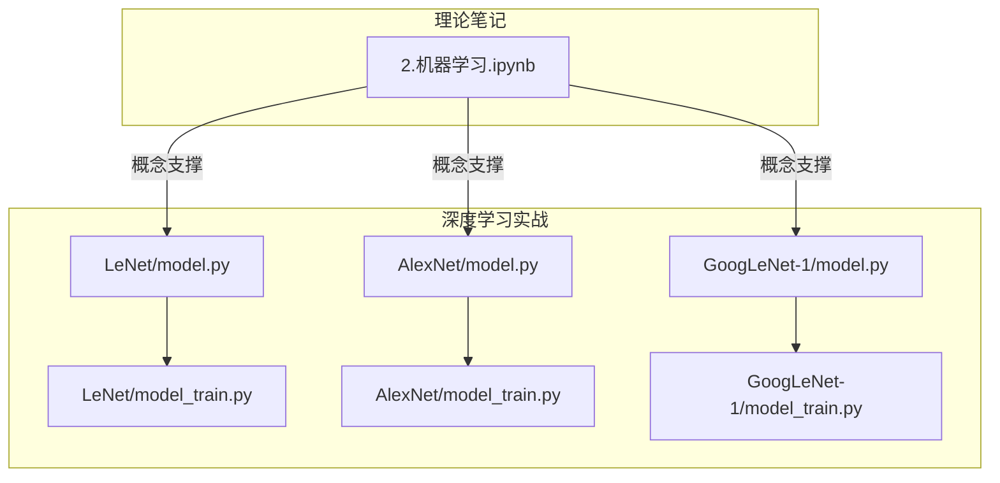
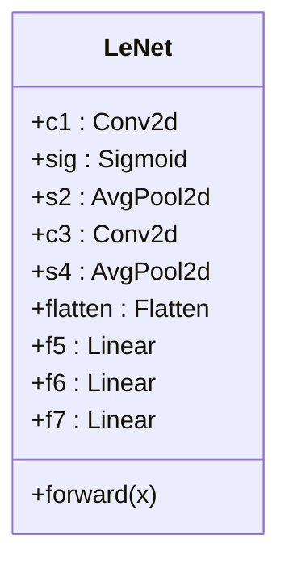
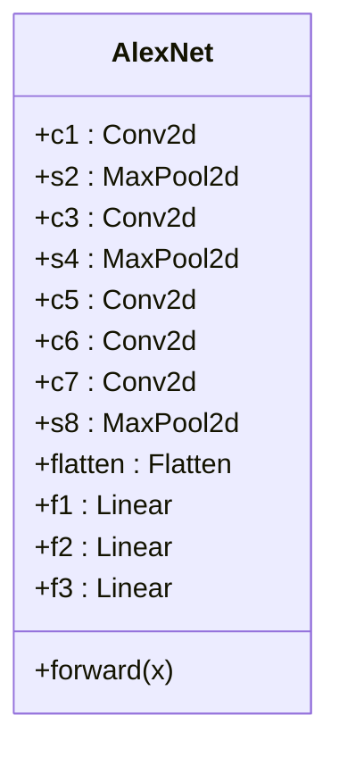
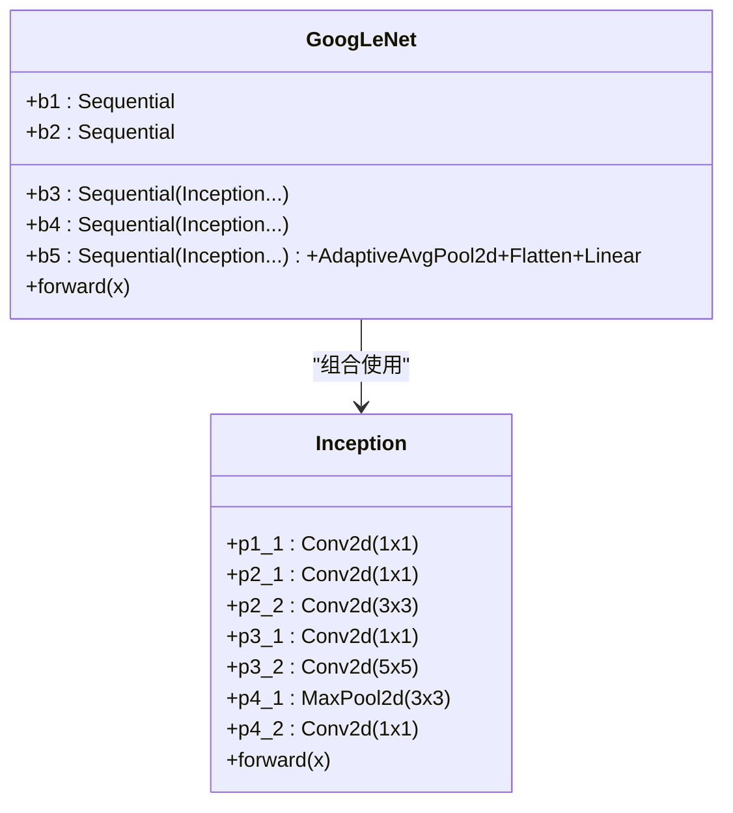
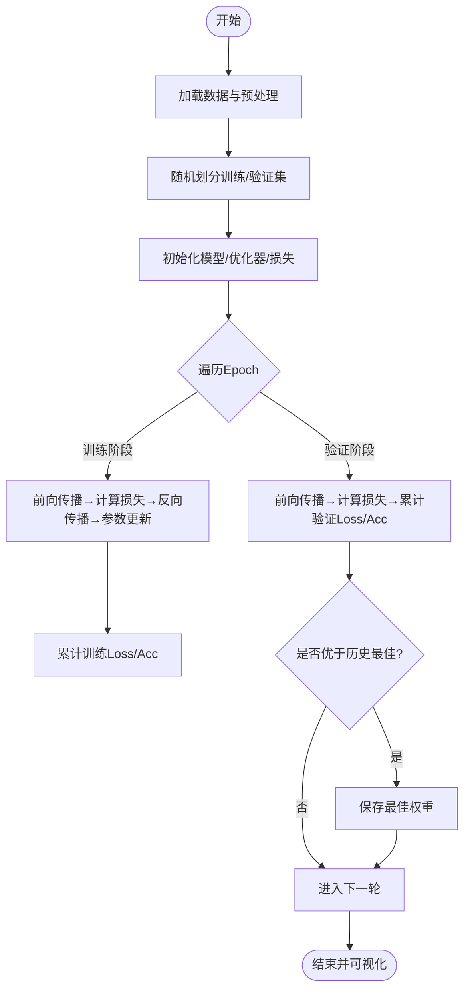

# 机器学习核心概念

<cite>
**本文引用的文件**   
- [2.机器学习.ipynb](file://study/研究生学习/2.机器学习/2.机器学习.ipynb)
- [model.py（AlexNet）](file://study/上传课件、源码/源码/AlexNet/model.py)
- [model_train.py（AlexNet）](file://study/上传课件、源码/源码/AlexNet/model_train.py)
- [model.py（LeNet）](file://study/上传课件、源码/源码/LeNet/model.py)
- [model_train.py（LeNet）](file://study/上传课件、源码/源码/LeNet/model_train.py)
- [model.py（GoogLeNet-1）](file://study/上传课件、源码/源码/GoogLeNet-1/model.py)
- [model_train.py（GoogLeNet-1）](file://study/上传课件、源码/源码/GoogLeNet-1/model_train.py)
</cite>

## 目录
1. [引言](#引言)
2. [项目结构](#项目结构)
3. [核心组件](#核心组件)
4. [架构总览](#架构总览)
5. [详细组件分析](#详细组件分析)
6. [依赖关系分析](#依赖关系分析)
7. [性能与调优](#性能与调优)
8. [故障排查指南](#故障排查指南)
9. [结论](#结论)
10. [附录：实践清单与参考路径](#附录实践清单与参考路径)

## 引言
本文件面向初学者与实践者，系统梳理机器学习核心概念与工程实践。内容覆盖：
- 监督学习、无监督学习、强化学习的基本原理与适用场景
- 经典算法的数学思想与实现要点（线性回归、逻辑回归、决策树、支持向量机）
- 损失函数设计、梯度下降优化、过拟合与正则化
- 模型评估指标（准确率、精确率、召回率、F1分数）与数据预处理方法
- 特征工程、标准化与交叉验证
- 基于仓库中PyTorch示例的训练流程与可视化监控
- 参数调优策略与性能优化技巧
- 常见问题定位与训练稳定性建议

## 项目结构
仓库包含两类材料：
- 理论笔记：以Jupyter Notebook形式呈现，涵盖机器学习基础概念、线性回归、代价函数、梯度下降、特征缩放与工程等内容
- 深度学习实战：基于PyTorch的经典卷积网络实现与训练脚本（LeNet、AlexNet、GoogLeNet），提供完整的数据加载、训练循环、验证与结果可视化



图表来源
- [2.机器学习.ipynb](file://study/研究生学习/2.机器学习/2.机器学习.ipynb)
- [model.py（LeNet）](file://study/上传课件、源码/源码/LeNet/model.py)
- [model_train.py（LeNet）](file://study/上传课件、源码/源码/LeNet/model_train.py)
- [model.py（AlexNet）](file://study/上传课件、源码/源码/AlexNet/model.py)
- [model_train.py（AlexNet）](file://study/上传课件、源码/源码/AlexNet/model_train.py)
- [model.py（GoogLeNet-1）](file://study/上传课件、源码/源码/GoogLeNet-1/model.py)
- [model_train.py（GoogLeNet-1）](file://study/上传课件、源码/源码/GoogLeNet-1/model_train.py)

章节来源
- [2.机器学习.ipynb](file://study/研究生学习/2.机器学习/2.机器学习.ipynb)

## 核心组件
- 理论模块（2.机器学习.ipynb）
  - 监督学习与无监督学习的定义与任务划分
  - 线性回归假设函数、均方误差代价函数、梯度下降更新规则与学习率影响
  - 多元线性回归与正规方程法
  - 特征缩放（标准化、归一化、对数变换）与特征工程
  - 多项式回归与过拟合风险
- 深度学习模块（LeNet/AlexNet/GoogLeNet）
  - 模型定义（卷积层、池化层、全连接层、激活函数、Dropout等）
  - 训练流程（数据加载、随机划分、批训练、反向传播、参数更新、早停保存最优权重）
  - 评估与可视化（训练/验证损失与准确率曲线）

章节来源
- [2.机器学习.ipynb](file://study/研究生学习/2.机器学习/2.机器学习.ipynb)
- [model.py（LeNet）](file://study/上传课件、源码/源码/LeNet/model.py)
- [model_train.py（LeNet）](file://study/上传课件、源码/源码/LeNet/model_train.py)
- [model.py（AlexNet）](file://study/上传课件、源码/源码/AlexNet/model.py)
- [model_train.py（AlexNet）](file://study/上传课件、源码/源码/AlexNet/model_train.py)
- [model.py（GoogLeNet-1）](file://study/上传课件、源码/源码/GoogLeNet-1/model.py)
- [model_train.py（GoogLeNet-1）](file://study/上传课件、源码/源码/GoogLeNet-1/model_train.py)

## 架构总览
从“概念—实现—训练—评估”的端到端视角，将理论与代码对应起来：

```mermaid
sequenceDiagram
participant Note as "理论笔记<br/>2.机器学习.ipynb"
participant Data as "数据加载与预处理"
participant Model as "模型定义<br/>LeNet/AlexNet/GoogLeNet"
participant Train as "训练循环<br/>model_train.py"
participant Eval as "评估与可视化"
Note->>Data : 指导特征缩放/工程思路
Note->>Model : 启发损失函数/优化器选择
Data->>Train : 提供批次数据
Train->>Model : 前向传播计算输出
Train->>Train : 计算损失并反向传播
Train->>Train : 参数更新(Adam/GD)
Train->>Eval : 记录Loss/Acc并绘图
Eval-->>Note : 反馈收敛与泛化情况
```

图表来源
- [2.机器学习.ipynb](file://study/研究生学习/2.机器学习/2.机器学习.ipynb)
- [model_train.py（LeNet）](file://study/上传课件、源码/源码/LeNet/model_train.py)
- [model_train.py（AlexNet）](file://study/上传课件、源码/源码/AlexNet/model_train.py)
- [model_train.py（GoogLeNet-1）](file://study/上传课件、源码/源码/GoogLeNet-1/model_train.py)

## 详细组件分析

### 理论模块：机器学习基础与线性回归
- 监督学习：输入x与标签y配对，目标为学习映射f(x)→y；回归预测连续值，分类预测离散类别
- 无监督学习：仅输入x，目标是发现数据结构（聚类、降维、异常检测）
- 线性回归
  - 假设函数：单变量与多元形式，向量表示便于批量计算
  - 代价函数：均方误差（MSE），衡量预测与真实差距
  - 梯度下降：同时更新w与b，学习率控制步长；批量/随机/小批量三种变体
  - 多元线性回归：多特征联合建模，正规方程适用于小规模问题
- 特征工程与缩放
  - 标准化（Z-score）、归一化（Min-Max）、对数变换
  - 特征选择、构造与变换提升模型表达能力
- 多项式回归：通过高次项拟合非线性关系，需配合正则化与验证集防止过拟合

章节来源
- [2.机器学习.ipynb](file://study/研究生学习/2.机器学习/2.机器学习.ipynb)

### 模型组件A：LeNet
- 结构要点
  - 卷积+平均池化交替提取空间特征
  - Sigmoid激活与全连接层进行判别
  - Flatten后接多层感知机输出类别得分
- 训练要点
  - FashionMNIST数据集，Resize至28×28，ToTensor归一化到[0,1]
  - Adam优化器，交叉熵损失，训练/验证双循环
  - 保存验证集最高准确率的权重，绘制Loss/Acc曲线



图表来源
- [model.py（LeNet）](file://study/上传课件、源码/源码/LeNet/model.py)

章节来源
- [model.py（LeNet）](file://study/上传课件、源码/源码/LeNet/model.py)
- [model_train.py（LeNet）](file://study/上传课件、源码/源码/LeNet/model_train.py)

### 模型组件B：AlexNet
- 结构要点
  - 大核卷积+最大池化快速下采样
  - 多个卷积块堆叠，ReLU激活
  - 全连接层+Dropout缓解过拟合
  - 输出维度适配FashionMNIST（10类）
- 训练要点
  - 输入尺寸227×227，Resize+ToTensor
  - Adam优化器，交叉熵损失
  - 训练/验证双循环，保存最佳权重，可视化Loss/Acc



图表来源
- [model.py（AlexNet）](file://study/上传课件、源码/源码/AlexNet/model.py)

章节来源
- [model.py（AlexNet）](file://study/上传课件、源码/源码/AlexNet/model.py)
- [model_train.py（AlexNet）](file://study/上传课件、源码/源码/AlexNet/model_train.py)

### 模型组件C：GoogLeNet（Inception模块）
- Inception模块
  - 并行多尺度分支：1×1、3×3、5×5卷积与最大池化+1×1卷积
  - 通道拼接融合多尺度信息
- GoogLeNet主体
  - 初始卷积与池化，随后多个Inception块
  - 自适应全局平均池化+全连接输出
  - Kaiming初始化与偏置常数初始化
- 训练要点
  - ImageFolder自定义图像数据，Resize至224×224，按通道均值方差标准化
  - Adam优化器，交叉熵损失，训练/验证双循环，保存最佳权重，可视化Loss/Acc



图表来源
- [model.py（GoogLeNet-1）](file://study/上传课件、源码/源码/GoogLeNet-1/model.py)

章节来源
- [model.py（GoogLeNet-1）](file://study/上传课件、源码/源码/GoogLeNet-1/model.py)
- [model_train.py（GoogLeNet-1）](file://study/上传课件、源码/源码/GoogLeNet-1/model_train.py)

### 训练流程与评估可视化
- 数据准备
  - FashionMNIST：自动下载，Resize与ToTensor
  - ImageFolder：自定义图像目录，Resize与标准化
- 训练循环
  - 设备选择（GPU优先）
  - 优化器：Adam，学习率0.001
  - 损失函数：CrossEntropyLoss
  - 每轮统计训练/验证Loss与Accuracy，保存最佳权重
- 可视化
  - 子图分别展示Loss与Accuracy随epoch变化



图表来源
- [model_train.py（LeNet）](file://study/上传课件、源码/源码/LeNet/model_train.py)
- [model_train.py（AlexNet）](file://study/上传课件、源码/源码/AlexNet/model_train.py)
- [model_train.py（GoogLeNet-1）](file://study/上传课件、源码/源码/GoogLeNet-1/model_train.py)

## 依赖关系分析
- 理论到实践的映射
  - 2.机器学习.ipynb中的线性回归、代价函数、梯度下降、特征缩放等概念，为理解模型训练与优化提供理论基础
  - model_train.py统一采用Adam优化器与交叉熵损失，体现现代深度学习常用配置
- 模块耦合
  - 各模型定义与训练脚本解耦良好，训练脚本仅依赖模型接口（forward）
  - 数据加载与训练流程在三个项目中保持一致性，便于迁移与对比实验


图表来源
- [2.机器学习.ipynb](file://study/研究生学习/2.机器学习/2.机器学习.ipynb)
- [model_train.py（LeNet）](file://study/上传课件、源码/源码/LeNet/model_train.py)
- [model_train.py（AlexNet）](file://study/上传课件、源码/源码/AlexNet/model_train.py)
- [model_train.py（GoogLeNet-1）](file://study/上传课件、源码/源码/GoogLeNet-1/model_train.py)

## 性能与调优
- 优化器与学习率
  - 当前使用Adam，lr=0.001；可尝试学习率衰减或Warmup策略
- 正则化与防过拟合
  - Dropout（AlexNet中使用）
  - 权重初始化（GoogLeNet使用Kaiming）
  - 早停（保存验证集最佳权重）
- 数据增强与标准化
  - 图像标准化（GoogLeNet按通道均值方差）
  - 可引入随机裁剪、翻转等增强手段
- 批大小与并行
  - DataLoader设置shuffle与num_workers，提高I/O效率
- 监控与诊断
  - 训练/验证Loss与Accuracy曲线观察过拟合/欠拟合
  - 若验证集Loss上升而训练Loss下降，考虑正则化或减少模型复杂度

章节来源
- [model_train.py（LeNet）](file://study/上传课件、源码/源码/LeNet/model_train.py)
- [model_train.py（AlexNet）](file://study/上传课件、源码/源码/AlexNet/model_train.py)
- [model_train.py（GoogLeNet-1）](file://study/上传课件、源码/源码/GoogLeNet-1/model_train.py)
- [model.py（AlexNet）](file://study/上传课件、源码/源码/AlexNet/model.py)
- [model.py（GoogLeNet-1）](file://study/上传课件、源码/源码/GoogLeNet-1/model.py)

## 故障排查指南
- 常见错误
  - 形状不匹配：检查输入尺寸与模型首层卷积/全连接输入维度
  - 内存不足：减小batch_size或输入分辨率
  - 训练不收敛：调整学习率、检查数据标准化、确认损失函数与输出维度一致
- 调试建议
  - 打印每个阶段的张量形状
  - 逐步简化模型（如先跑通LeNet再扩展）
  - 使用较小的数据集验证流程正确性

章节来源
- [model_train.py（LeNet）](file://study/上传课件、源码/源码/LeNet/model_train.py)
- [model_train.py（AlexNet）](file://study/上传课件、源码/源码/AlexNet/model_train.py)
- [model_train.py（GoogLeNet-1）](file://study/上传课件、源码/源码/GoogLeNet-1/model_train.py)

## 结论
本仓库将机器学习基础理论与深度学习实践有机结合：
- 理论部分清晰阐述监督/无监督学习、线性回归、代价函数与梯度下降、特征工程与缩放
- 实践部分提供LeNet/AlexNet/GoogLeNet的完整实现与训练流程，便于快速上手与对比实验
- 通过统一的训练脚本与可视化，帮助读者建立从数据到模型的闭环认知，并为后续深入研究与工程落地打下坚实基础

## 附录：实践清单与参考路径
- 概念复习
  - 监督/无监督学习、线性回归、代价函数、梯度下降、特征缩放与工程
  - 参考路径：[2.机器学习.ipynb](file://study/研究生学习/2.机器学习/2.机器学习.ipynb)
- 模型实现
  - LeNet：轻量级CNN，适合入门
    - 参考路径：[model.py（LeNet）](file://study/上传课件、源码/源码/LeNet/model.py)、[model_train.py（LeNet）](file://study/上传课件、源码/源码/LeNet/model_train.py)
  - AlexNet：较深网络，含Dropout与较大卷积核
    - 参考路径：[model.py（AlexNet）](file://study/上传课件、源码/源码/AlexNet/model.py)、[model_train.py（AlexNet）](file://study/上传课件、源码/源码/AlexNet/model_train.py)
  - GoogLeNet：Inception多尺度融合，适合复杂图像任务
    - 参考路径：[model.py（GoogLeNet-1）](file://study/上传课件、源码/源码/GoogLeNet-1/model.py)、[model_train.py（GoogLeNet-1）](file://study/上传课件、源码/源码/GoogLeNet-1/model_train.py)
- 训练与评估
  - 数据加载、随机划分、批训练、反向传播、参数更新、保存最佳权重、可视化
  - 参考路径：各项目的[model_train.py](file://study/上传课件、源码/源码/LeNet/model_train.py)