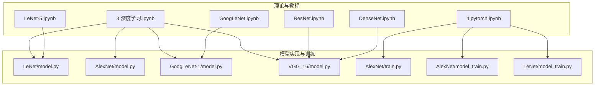
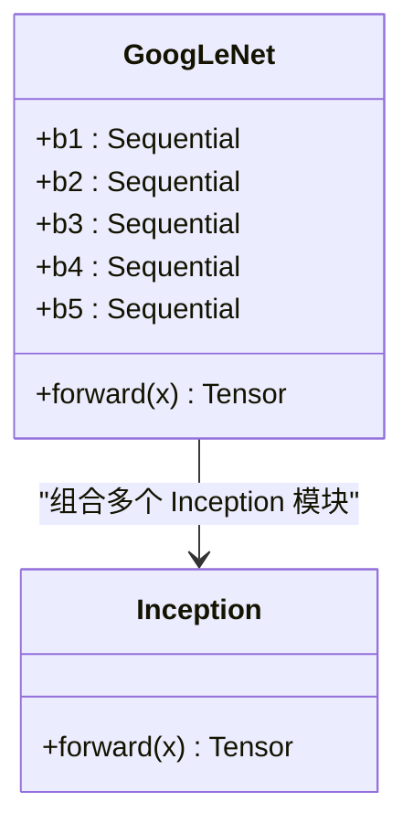
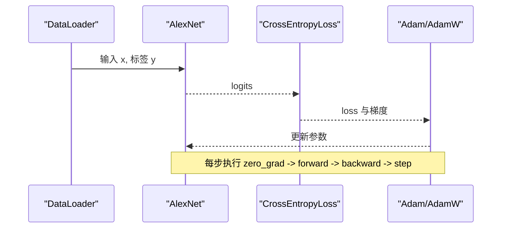
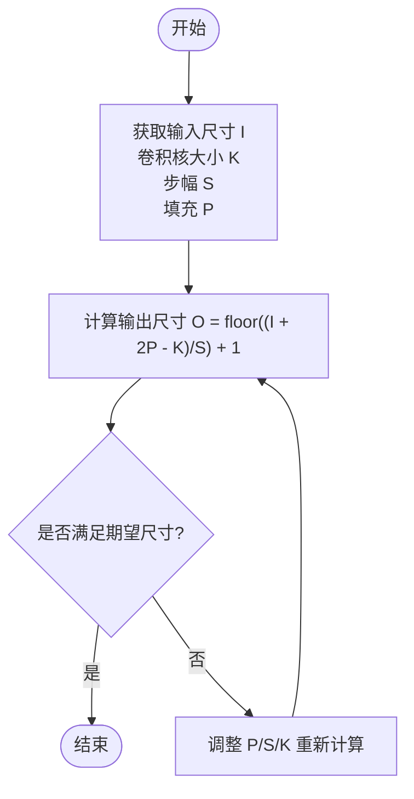
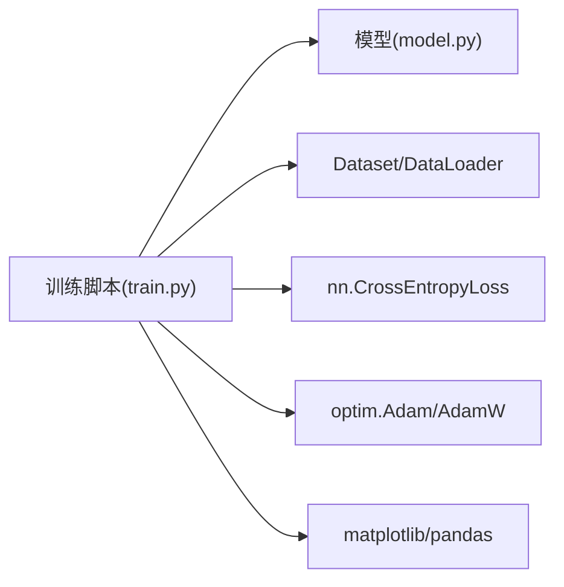

# 深度学习理论基础

<cite>
**本文引用的文件列表**
- [3.深度学习.ipynb](file://study/研究生学习/3.深度学习/3.深度学习.ipynb)
- [4.pytorch.ipynb](file://study/研究生学习/4.pytorch/4.pytorch.ipynb)
- [LeNet/model.py](file://study/上传课件、源码/源码/LeNet/model.py)
- [AlexNet/model.py](file://study/上传课件、源码/源码/AlexNet/model.py)
- [GoogLeNet-1/model.py](file://study/上传课件、源码/源码/GoogLeNet-1/model.py)
- [VGG_16/model.py](file://study/研究生学习/7.VGG_16/model.py)
- [LeNet-5.ipynb](file://study/研究生学习/5.LeNet/LeNet-5.ipynb)
- [GoogLeNet.ipynb](file://study/研究生学习/8.GoogLeNet/GoogLeNet.ipynb)
- [ResNet.ipynb](file://study/研究生学习/9.ResNet/ResNet.ipynb)
- [DenseNet.ipynb](file://study/研究生学习/10.DenseNet/DenseNet.ipynb)
- [AlexNet/train.py](file://study/研究生学习/6.AlexNet/train.py)
- [AlexNet/model_train.py](file://study/上传课件、源码/源码/AlexNet/model_train.py)
- [LeNet/model_train.py](file://study/上传课件、源码/源码/LeNet/model_train.py)
</cite>

## 目录
1. [引言](#引言)
2. [项目结构](#项目结构)
3. [核心组件](#核心组件)
4. [架构总览](#架构总览)
5. [详细组件分析](#详细组件分析)
6. [依赖关系分析](#依赖关系分析)
7. [性能与训练要点](#性能与训练要点)
8. [故障排查指南](#故障排查指南)
9. [结论](#结论)
10. [附录：数学推导与可视化示例](#附录数学推导与可视化示例)

## 引言
本模块围绕深度学习基础理论，系统梳理神经网络基本架构、前向与反向传播的数学原理、激活函数选择、卷积网络核心概念、损失函数与优化器、正则化技术、梯度不稳定问题的解决方案，并结合仓库中的经典网络实现（LeNet、AlexNet、VGG-16、GoogLeNet、ResNet、DenseNet）给出实践指导。内容既适合理论学习，也能为实际建模提供可操作的参考路径。

## 项目结构
仓库包含两部分：
- 理论与教程：以 Jupyter Notebook 形式组织，覆盖从神经元、层、CNN 到具体模型（LeNet、AlexNet、VGG、GoogLeNet、ResNet、DenseNet）的系统讲解。
- 实战代码：各模型的 PyTorch 实现与训练脚本，便于对照理解结构与训练流程。



图表来源
- [3.深度学习.ipynb:1-200](file://study/研究生学习/3.深度学习/3.深度学习.ipynb#L1-L200)
- [4.pytorch.ipynb:1-200](file://study/研究生学习/4.pytorch/4.pytorch.ipynb#L1-L200)
- [LeNet/model.py:1-37](file://study/上传课件、源码/源码/LeNet/model.py#L1-L37)
- [AlexNet/model.py:1-52](file://study/上传课件、源码/源码/AlexNet/model.py#L1-L52)
- [GoogLeNet-1/model.py:1-102](file://study/上传课件、源码/源码/GoogLeNet-1/model.py#L1-L102)
- [VGG_16/model.py:1-85](file://study/研究生学习/7.VGG_16/model.py#L1-L85)
- [AlexNet/train.py:1-218](file://study/研究生学习/6.AlexNet/train.py#L1-L218)
- [AlexNet/model_train.py:1-193](file://study/上传课件、源码/源码/AlexNet/model_train.py#L1-L193)
- [LeNet/model_train.py:1-191](file://study/上传课件、源码/源码/LeNet/model_train.py#L1-L191)

章节来源
- [3.深度学习.ipynb:1-200](file://study/研究生学习/3.深度学习/3.深度学习.ipynb#L1-L200)
- [4.pytorch.ipynb:1-200](file://study/研究生学习/4.pytorch/4.pytorch.ipynb#L1-L200)

## 核心组件
- 神经元与层：线性变换与非线性激活的组合，构成多层感知机与 CNN 的基本单元。
- 卷积层/池化层/全连接层：图像特征提取、下采样与分类映射的核心构件。
- 损失函数：回归用 MSE/MAE；二分类用 BCE；多分类用 Cross-Entropy。
- 优化器：SGD/Momentum/Adam/AdamW 等，配合学习率调度策略。
- 正则化：BatchNorm、Dropout、权重衰减、数据增强等。
- 典型网络：LeNet、AlexNet、VGG-16、GoogLeNet、ResNet、DenseNet。

章节来源
- [3.深度学习.ipynb:55-196](file://study/研究生学习/3.深度学习/3.深度学习.ipynb#L55-L196)
- [4.pytorch.ipynb:411-578](file://study/研究生学习/4.pytorch/4.pytorch.ipynb#L411-L578)

## 架构总览
下图展示从输入到输出的端到端流程，以及关键模块在仓库中的对应位置。

```mermaid
sequenceDiagram
participant Data as "数据集/预处理"
participant Model as "模型(LeNet/AlexNet/VGG/GoogLeNet/ResNet/DenseNet)"
participant Loss as "损失函数"
participant Opt as "优化器"
participant Eval as "验证/测试"
Data->>Model : 输入张量 (B,C,H,W)
Model->>Model : 卷积/池化/全连接/归一化/激活
Model-->>Loss : 输出 logits
Loss-->>Opt : 计算 loss 并反向传播得到梯度
Opt-->>Model : 更新参数
Model-->>Eval : 推理/评估指标
```

图表来源
- [4.pytorch.ipynb:624-739](file://study/研究生学习/4.pytorch/4.pytorch.ipynb#L624-L739)
- [AlexNet/train.py:60-189](file://study/研究生学习/6.AlexNet/train.py#L60-L189)
- [LeNet/model.py:6-29](file://study/上传课件、源码/源码/LeNet/model.py#L6-L29)
- [AlexNet/model.py:7-41](file://study/上传课件、源码/源码/AlexNet/model.py#L7-L41)
- [GoogLeNet-1/model.py:39-91](file://study/上传课件、源码/源码/GoogLeNet-1/model.py#L39-L91)
- [VGG_16/model.py:5-76](file://study/研究生学习/7.VGG_16/model.py#L5-L76)

## 详细组件分析

### 激活函数：Sigmoid、Tanh、ReLU 及其变体
- Sigmoid：输出范围 (0,1)，常用于二分类输出层；易出现梯度消失。
- Tanh：输出范围 (-1,1)，以 0 为中心，较 Sigmoid 更利于隐藏层训练。
- ReLU：计算简单、缓解梯度消失，但存在“死神经元”问题。
- Leaky ReLU：负区间保留小斜率，缓解死神经元。
- Softmax：多分类输出概率分布。

章节来源
- [3.深度学习.ipynb:293-391](file://study/研究生学习/3.深度学习/3.深度学习.ipynb#L293-L391)
- [4.pytorch.ipynb:435-445](file://study/研究生学习/4.pytorch/4.pytorch.ipynb#L435-L445)

### 损失函数设计：交叉熵与均方误差
- 回归任务：MSE/MAE。
- 二分类：Binary Cross-Entropy（常配合 sigmoid）。
- 多分类：Cross-Entropy（常配合 softmax 或直接在 logits 上计算）。

章节来源
- [3.深度学习.ipynb:406-472](file://study/研究生学习/3.深度学习/3.深度学习.ipynb#L406-L472)
- [4.pytorch.ipynb:529-578](file://study/研究生学习/4.pytorch/4.pytorch.ipynb#L529-L578)

### 优化器原理：SGD、Adam
- SGD：简单稳定，配合 Momentum 可加速收敛。
- Adam：自适应学习率，结合动量与 RMSprop 思想，常用默认优化器。
- AdamW：改进版权重衰减，现代模型常用。

章节来源
- [3.深度学习.ipynb:487-556](file://study/研究生学习/3.深度学习/3.深度学习.ipynb#L487-L556)
- [4.pytorch.ipynb:548-578](file://study/研究生学习/4.pytorch/4.pytorch.ipynb#L548-L578)

### 卷积神经网络核心概念
- 卷积层：局部感受野与权重共享，逐层抽象出边缘→纹理→部件→语义。
- 池化层：最大/平均池化，降低空间分辨率，提升平移不变性与感受野。
- 全连接层：将高层特征映射到类别空间。
- 感受野：随层数加深而扩大，影响上下文利用能力。

章节来源
- [3.深度学习.ipynb:571-770](file://study/研究生学习/3.深度学习/3.深度学习.ipynb#L571-L770)
- [LeNet-5.ipynb:45-111](file://study/研究生学习/5.LeNet/LeNet-5.ipynb#L45-L111)

### 正则化技术：批量归一化、Dropout、权重衰减
- BatchNorm：稳定训练、加速收敛，训练时统计当前 batch 均值方差，推理时使用累计统计。
- Dropout：随机丢弃神经元，减少过拟合。
- 权重衰减：L2 正则，抑制过大权重。

章节来源
- [4.pytorch.ipynb:421-451](file://study/研究生学习/4.pytorch/4.pytorch.ipynb#L421-L451)
- [AlexNet/model.py:36-40](file://study/上传课件、源码/源码/AlexNet/model.py#L36-L40)

### 梯度消失与爆炸问题及解决方案
- 原因：深层链式求导导致梯度指数级衰减或增长；饱和激活函数（如 Sigmoid/Tanh）在大绝对值区域梯度接近 0。
- 解决：使用 ReLU/Leaky ReLU；引入残差连接（ResNet）、稠密连接（DenseNet）；合理初始化（Kaiming/He）；使用 BatchNorm；梯度裁剪。

章节来源
- [3.深度学习.ipynb:311-362](file://study/研究生学习/3.深度学习/3.深度学习.ipynb#L311-L362)
- [ResNet.ipynb:45-101](file://study/研究生学习/9.ResNet/ResNet.ipynb#L45-L101)
- [DenseNet.ipynb:57-106](file://study/研究生学习/10.DenseNet/DenseNet.ipynb#L57-L106)
- [GoogLeNet-1/model.py:74-84](file://study/上传课件、源码/源码/GoogLeNet-1/model.py#L74-L84)

### 经典网络结构与适用场景
- LeNet：早期手写数字识别，结构简单，适合教学与小规模灰度图。
- AlexNet：首次大规模应用 ReLU、Dropout、数据增强，适合中等规模图像分类。
- VGG-16：规则堆叠小卷积核，结构清晰，参数量较大，适合作为骨干网络。
- GoogLeNet：Inception 多分支并行与 1x1 降维，兼顾深度与宽度，参数效率更高。
- ResNet：残差连接解决退化问题，支持极深网络，广泛用于视觉任务。
- DenseNet：稠密连接促进特征复用，参数效率高，适合资源受限场景。

章节来源
- [LeNet-5.ipynb:16-30](file://study/研究生学习/5.LeNet/LeNet-5.ipynb#L16-L30)
- [GoogLeNet.ipynb:16-30](file://study/研究生学习/8.GoogLeNet/GoogLeNet.ipynb#L16-L30)
- [ResNet.ipynb:16-30](file://study/研究生学习/9.ResNet/ResNet.ipynb#L16-L30)
- [DenseNet.ipynb:16-42](file://study/研究生学习/10.DenseNet/DenseNet.ipynb#L16-L42)

#### 类图：GoogLeNet 与 Inception 模块


图表来源
- [GoogLeNet-1/model.py:7-35](file://study/上传课件、源码/源码/GoogLeNet-1/model.py#L7-L35)
- [GoogLeNet-1/model.py:39-91](file://study/上传课件、源码/源码/GoogLeNet-1/model.py#L39-L91)

#### 序列图：标准训练流程（以 AlexNet 为例）


图表来源
- [AlexNet/train.py:60-189](file://study/研究生学习/6.AlexNet/train.py#L60-L189)
- [AlexNet/model.py:7-41](file://study/上传课件、源码/源码/AlexNet/model.py#L7-L41)

#### 流程图：卷积输出尺寸计算


图表来源
- [LeNet-5.ipynb:128-177](file://study/研究生学习/5.LeNet/LeNet-5.ipynb#L128-L177)
- [GoogLeNet.ipynb:179-247](file://study/研究生学习/8.GoogLeNet/GoogLeNet.ipynb#L179-L247)

## 依赖关系分析
- 模型与训练脚本解耦：model.py 定义网络结构，train.py 负责数据加载、训练循环与评估。
- 通用训练模板：4.pytorch.ipynb 提供了标准训练流程，可作为其他模型训练的参考。
- 常见依赖：torch、torchvision、matplotlib/pandas（用于记录与可视化）。



图表来源
- [AlexNet/train.py:1-218](file://study/研究生学习/6.AlexNet/train.py#L1-L218)
- [AlexNet/model.py:1-52](file://study/上传课件、源码/源码/AlexNet/model.py#L1-L52)
- [4.pytorch.ipynb:624-739](file://study/研究生学习/4.pytorch/4.pytorch.ipynb#L624-L739)

章节来源
- [AlexNet/train.py:1-218](file://study/研究生学习/6.AlexNet/train.py#L1-L218)
- [4.pytorch.ipynb:624-739](file://study/研究生学习/4.pytorch/4.pytorch.ipynb#L624-L739)

## 性能与训练要点
- 数据增强：随机翻转、旋转、仿射变换等，提升泛化能力。
- 学习率策略：StepLR/CosineAnnealing/ReduceLROnPlateau，避免震荡或停滞。
- 批大小与设备：GPU 显存限制下平衡 batch size 与训练速度。
- 早停与模型保存：基于验证集最佳指标保存权重，防止过拟合。
- 指标监控：同时观察训练/验证 loss 与准确率，判断收敛与泛化情况。

章节来源
- [AlexNet/train.py:21-57](file://study/研究生学习/6.AlexNet/train.py#L21-L57)
- [4.pytorch.ipynb:562-578](file://study/研究生学习/4.pytorch/4.pytorch.ipynb#L562-L578)
- [AlexNet/model_train.py:143-156](file://study/上传课件、源码/源码/AlexNet/model_train.py#L143-L156)

## 故障排查指南
- 维度不匹配：确保卷积/池化后尺寸与后续全连接层输入一致；注意通道顺序 (NCHW)。
- 设备不一致：模型与数据需在同一设备上，避免 device mismatch。
- 标签类型错误：CrossEntropyLoss 需要类别编号（long），而非 one-hot。
- 模式切换遗漏：训练/验证需正确设置 model.train()/model.eval()，并在推理时使用 no_grad。
- 梯度异常：检查是否存在饱和激活、未初始化或数值溢出；必要时进行梯度裁剪。

章节来源
- [4.pytorch.ipynb:150-155](file://study/研究生学习/4.pytorch/4.pytorch.ipynb#L150-L155)
- [4.pytorch.ipynb:634-663](file://study/研究生学习/4.pytorch/4.pytorch.ipynb#L634-L663)
- [AlexNet/train.py:105-152](file://study/研究生学习/6.AlexNet/train.py#L105-L152)

## 结论
本模块通过系统化理论讲解与经典网络实现，帮助读者建立从基础概念到工程实践的完整知识体系。建议在学习过程中结合 notebook 的理论推导与 model.py/train.py 的代码对照，逐步掌握网络结构设计、训练流程与调参技巧，并针对具体问题选择合适的正则化与优化策略。

## 附录：数学推导与可视化示例

### 前向传播与反向传播
- 前向传播：逐层线性变换与非线性激活，最终得到预测值。
- 反向传播：从输出层开始，按链式法则计算各层参数的梯度，再经优化器更新。

章节来源
- [3.深度学习.ipynb:145-196](file://study/研究生学习/3.深度学习/3.深度学习.ipynb#L145-L196)

### 卷积输出尺寸与参数量
- 输出尺寸公式：O = floor((I + 2P - K)/S) + 1。
- 参数量：Kh × Kw × Cin × Cout + Cout（含偏置）。

章节来源
- [3.深度学习.ipynb:737-770](file://study/研究生学习/3.深度学习/3.深度学习.ipynb#L737-L770)
- [LeNet-5.ipynb:128-177](file://study/研究生学习/5.LeNet/LeNet-5.ipynb#L128-L177)

### 感受野与压缩的关系
- 感受野随层数加深而扩大，stride 与 pooling 能加速扩大感受野，但会牺牲位置精度。

章节来源
- [3.深度学习.ipynb:686-736](file://study/研究生学习/3.深度学习/3.深度学习.ipynb#L686-L736)

### 正则化与训练稳定性
- BatchNorm 与 ReLU 的配合顺序对训练稳定性至关重要。
- Dropout 在训练时启用，推理时关闭。

章节来源
- [4.pytorch.ipynb:421-451](file://study/研究生学习/4.pytorch/4.pytorch.ipynb#L421-L451)
- [ResNet.ipynb:383-394](file://study/研究生学习/9.ResNet/ResNet.ipynb#L383-L394)

### 不同网络结构的适用场景与性能特点
- LeNet：轻量、适合教学与小数据集。
- AlexNet：引入 ReLU/Dropout/数据增强，适合中等规模分类。
- VGG-16：结构规整、易于扩展，但参数量大。
- GoogLeNet：多分支并行与 1x1 降维，参数效率高。
- ResNet：残差连接，支持极深网络，广泛作为 backbone。
- DenseNet：稠密连接，特征复用强，参数效率高。

章节来源
- [LeNet-5.ipynb:16-30](file://study/研究生学习/5.LeNet/LeNet-5.ipynb#L16-L30)
- [GoogLeNet.ipynb:16-30](file://study/研究生学习/8.GoogLeNet/GoogLeNet.ipynb#L16-L30)
- [ResNet.ipynb:16-30](file://study/研究生学习/9.ResNet/ResNet.ipynb#L16-L30)
- [DenseNet.ipynb:16-42](file://study/研究生学习/10.DenseNet/DenseNet.ipynb#L16-L42)