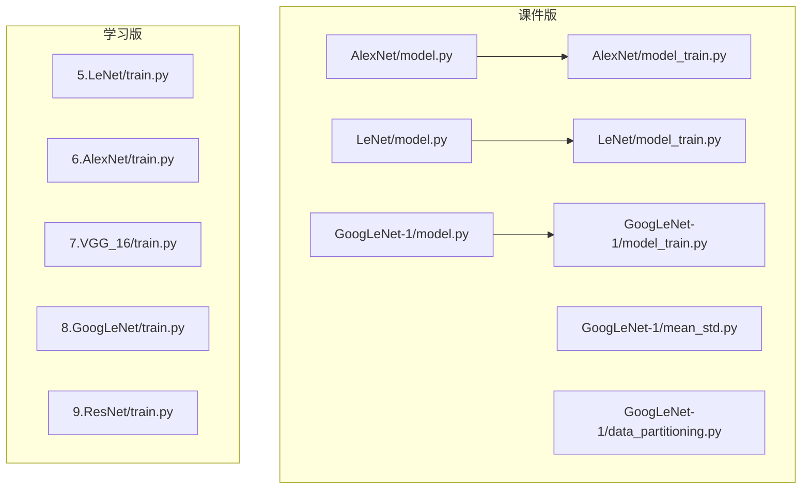
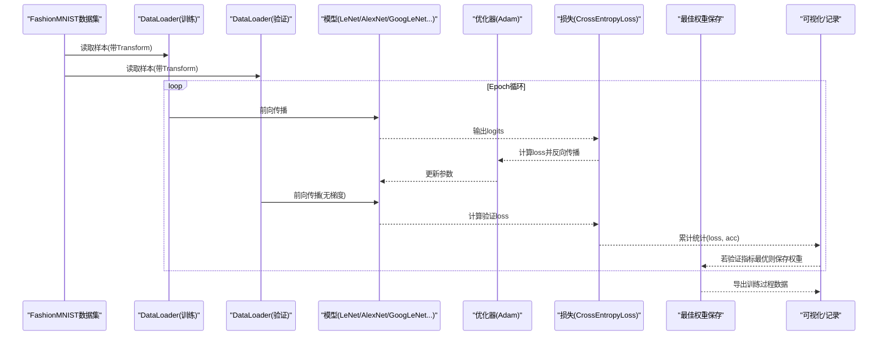
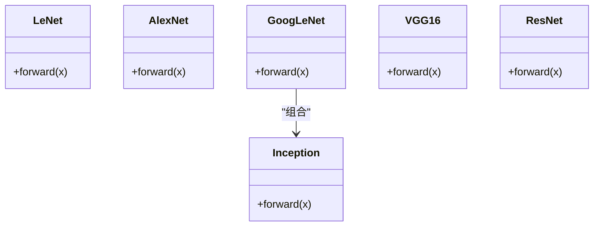
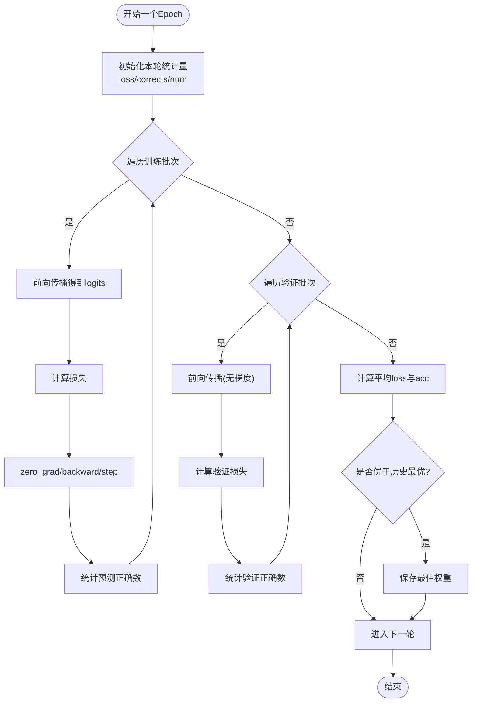
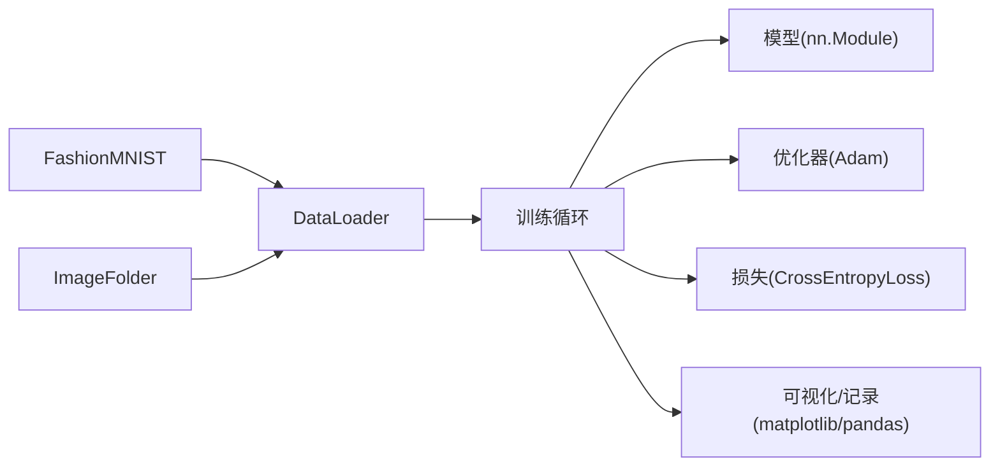

# 实验训练系统

<cite>
**本文引用的文件**   
- [AlexNet模型定义](file://study/上传课件、源码/源码/AlexNet/model.py)
- [AlexNet训练脚本](file://study/上传课件、源码/源码/AlexNet/model_train.py)
- [LeNet模型定义](file://study/上传课件、源码/源码/LeNet/model.py)
- [LeNet训练脚本（课件版）](file://study/上传课件、源码/源码/LeNet/model_train.py)
- [GoogLeNet模型定义](file://study/上传课件、源码/源码/GoogLeNet-1/model.py)
- [GoogLeNet训练脚本（课件版）](file://study/上传课件、源码/源码/GoogLeNet-1/model_train.py)
- [均值方差计算工具](file://study/上传课件、源码/源码/GoogLeNet-1/mean_std.py)
- [数据集划分工具](file://study/上传课件、源码/源码/GoogLeNet-1/data_partitioning.py)
- [LeNet训练脚本（学习版）](file://study/研究生学习/5.LeNet/train.py)
- [AlexNet训练脚本（学习版）](file://study/研究生学习/6.AlexNet/train.py)
- [VGG16训练脚本](file://study/研究生学习/7.VGG_16/train.py)
- [GoogLeNet训练脚本（学习版）](file://study/研究生学习/8.GoogLeNet/train.py)
- [ResNet训练脚本](file://study/研究生学习/9.ResNet/train.py)
</cite>

## 目录
1. [简介](#简介)
2. [项目结构](#项目结构)
3. [核心组件](#核心组件)
4. [架构总览](#架构总览)
5. [详细组件分析](#详细组件分析)
6. [依赖关系分析](#依赖关系分析)
7. [性能与优化](#性能与优化)
8. [故障排查指南](#故障排查指南)
9. [结论](#结论)
10. [附录：关键流程参考路径](#附录关键流程参考路径)

## 简介
本技术文档面向“实验训练系统”，围绕FashionMNIST图像分类任务，系统化梳理数据预处理、模型训练循环、性能监控与结果可视化等实现细节。文档覆盖以下要点：
- FashionMNIST加载与处理、数据增强策略、标准化方法
- 优化器选择、损失函数设计原则、超参数调优思路
- 完整训练流程、验证机制、准确率与损失监控
- GPU加速配置、内存管理优化、批量数据处理策略
- 训练曲线绘制、性能对比分析与结果报告生成

## 项目结构
仓库包含两套代码风格相近的训练脚本：
- “上传课件、源码”目录下的基础版本，侧重最小可用实现
- “研究生学习”目录下的进阶版本，引入更完善的工程化实践（如pin_memory、no_grad、权重衰减、随机种子、早停指标切换等）

图表来源
- [AlexNet训练脚本:1-193](file://study/上传课件、源码/源码/AlexNet/model_train.py#L1-L193)
- [LeNet训练脚本（课件版）:1-191](file://study/上传课件、源码/源码/LeNet/model_train.py#L1-L191)
- [GoogLeNet训练脚本（课件版）:1-197](file://study/上传课件、源码/源码/GoogLeNet-1/model_train.py#L1-L197)
- [LeNet训练脚本（学习版）:1-202](file://study/研究生学习/5.LeNet/train.py#L1-L202)
- [AlexNet训练脚本（学习版）:1-218](file://study/研究生学习/6.AlexNet/train.py#L1-L218)
- [VGG16训练脚本:1-195](file://study/研究生学习/7.VGG_16/train.py#L1-L195)
- [GoogLeNet训练脚本（学习版）:1-206](file://study/研究生学习/8.GoogLeNet/train.py#L1-L206)
- [ResNet训练脚本:1-206](file://study/研究生学习/9.ResNet/train.py#L1-L206)

章节来源
- [AlexNet训练脚本:1-193](file://study/上传课件、源码/源码/AlexNet/model_train.py#L1-L193)
- [LeNet训练脚本（课件版）:1-191](file://study/上传课件、源码/源码/LeNet/model_train.py#L1-L191)
- [GoogLeNet训练脚本（课件版）:1-197](file://study/上传课件、源码/源码/GoogLeNet-1/model_train.py#L1-L197)
- [LeNet训练脚本（学习版）:1-202](file://study/研究生学习/5.LeNet/train.py#L1-L202)
- [AlexNet训练脚本（学习版）:1-218](file://study/研究生学习/6.AlexNet/train.py#L1-L218)
- [VGG16训练脚本:1-195](file://study/研究生学习/7.VGG_16/train.py#L1-L195)
- [GoogLeNet训练脚本（学习版）:1-206](file://study/研究生学习/8.GoogLeNet/train.py#L1-L206)
- [ResNet训练脚本:1-206](file://study/研究生学习/9.ResNet/train.py#L1-L206)

## 核心组件
- 数据管道：基于torchvision.datasets.FashionMNIST构建，使用transforms.Compose进行Resize与ToTensor；部分版本加入RandomHorizontalFlip、RandomRotation、RandomAffine等增强；支持按固定比例随机切分训练/验证集；DataLoader配置batch_size、shuffle、num_workers等。
- 模型模块：提供LeNet、AlexNet、GoogLeNet（含Inception块）、VGG16、ResNet等经典网络实现。
- 训练循环：标准epoch级训练+验证，记录每轮train/val的loss与acc，保存最佳模型权重。
- 可视化：使用matplotlib绘制训练/验证loss与acc曲线；使用pandas将过程数据保存为DataFrame便于后续分析。
- 设备与IO：自动检测GPU并迁移到cuda；部分版本开启pin_memory与persistent_workers提升I/O吞吐。

章节来源
- [AlexNet训练脚本:15-33](file://study/上传课件、源码/源码/AlexNet/model_train.py#L15-L33)
- [LeNet训练脚本（学习版）:24-48](file://study/研究生学习/5.LeNet/train.py#L24-L48)
- [AlexNet训练脚本（学习版）:21-57](file://study/研究生学习/6.AlexNet/train.py#L21-L57)
- [GoogLeNet训练脚本（课件版）:14-35](file://study/上传课件、源码/源码/GoogLeNet-1/model_train.py#L14-L35)

## 架构总览
下图展示从数据加载到训练、验证、保存与可视化的端到端流程。

图表来源
- [LeNet训练脚本（学习版）:50-178](file://study/研究生学习/5.LeNet/train.py#L50-L178)
- [AlexNet训练脚本（学习版）:60-189](file://study/研究生学习/6.AlexNet/train.py#L60-L189)
- [GoogLeNet训练脚本（学习版）:36-168](file://study/研究生学习/8.GoogLeNet/train.py#L36-L168)
- [ResNet训练脚本:36-168](file://study/研究生学习/9.ResNet/train.py#L36-L168)

## 详细组件分析

### 数据预处理与增强
- 基础处理：Resize至目标尺寸（如28/224/227），ToTensor将像素归一化到[0,1]区间。
- 数据增强（学习版AlexNet示例）：RandomHorizontalFlip、RandomRotation、RandomAffine，用于提升泛化能力。
- 标准化：在自定义图像分类任务中通过Normalize传入通道均值与方差；对于FashionMNIST单通道灰度图，可考虑对单通道做标准化（当前示例未显式使用）。
- 数据集划分：random_split或Subset+随机索引，确保训练/验证集分布一致且可复现（设置随机种子）。
- DataLoader：batch_size控制批大小；shuffle在训练时启用，验证时通常关闭；num_workers提升并行读盘效率；pin_memory与persistent_workers在GPU环境下可显著降低CPU-GPU传输开销。

章节来源
- [AlexNet训练脚本（学习版）:21-57](file://study/研究生学习/6.AlexNet/train.py#L21-L57)
- [LeNet训练脚本（学习版）:24-48](file://study/研究生学习/5.LeNet/train.py#L24-L48)
- [GoogLeNet训练脚本（课件版）:14-35](file://study/上传课件、源码/源码/GoogLeNet-1/model_train.py#L14-L35)
- [均值方差计算工具:1-58](file://study/上传课件、源码/源码/GoogLeNet-1/mean_std.py#L1-L58)
- [数据集划分工具:1-49](file://study/上传课件、源码/源码/GoogLeNet-1/data_partitioning.py#L1-L49)

### 模型定义与结构
- LeNet：卷积+Sigmoid+平均池化+全连接，适合小分辨率输入。
- AlexNet：多卷积层+ReLU+MaxPool+Dropout+全连接，适配227x227输入。
- GoogLeNet：Inception块组合，多尺度特征融合，辅助分支损失（学习版训练脚本体现）。
- VGG16/ResNet：更深网络结构，配合更大输入尺寸与更强数据增强。

图表来源
- [LeNet模型定义:1-37](file://study/上传课件、源码/源码/LeNet/model.py#L1-L37)
- [AlexNet模型定义:1-52](file://study/上传课件、源码/源码/AlexNet/model.py#L1-L52)
- [GoogLeNet模型定义:1-102](file://study/上传课件、源码/源码/GoogLeNet-1/model.py#L1-L102)

章节来源
- [LeNet模型定义:1-37](file://study/上传课件、源码/源码/LeNet/model.py#L1-L37)
- [AlexNet模型定义:1-52](file://study/上传课件、源码/源码/AlexNet/model.py#L1-L52)
- [GoogLeNet模型定义:1-102](file://study/上传课件、源码/源码/GoogLeNet-1/model.py#L1-L102)

### 训练循环与验证机制
- 设备选择：优先使用CUDA，否则回退CPU。
- 优化器：默认Adam，学习率常见0.001；学习版AlexNet引入weight_decay缓解过拟合。
- 损失函数：CrossEntropyLoss；GoogLeNet训练脚本在训练阶段结合辅助分支损失加权求和。
- 模式切换：model.train()/model.eval()；验证阶段使用with torch.no_grad()避免梯度累积。
- 指标统计：逐batch累加loss与正确数，按样本总数求均值；保存每轮train/val的loss与acc。
- 模型保存：以验证集指标最优为准保存best_model_wts（acc或loss均可作为早停依据）。

图表来源
- [LeNet训练脚本（学习版）:50-178](file://study/研究生学习/5.LeNet/train.py#L50-L178)
- [AlexNet训练脚本（学习版）:60-189](file://study/研究生学习/6.AlexNet/train.py#L60-L189)
- [GoogLeNet训练脚本（学习版）:36-168](file://study/研究生学习/8.GoogLeNet/train.py#L36-L168)
- [ResNet训练脚本:36-168](file://study/研究生学习/9.ResNet/train.py#L36-L168)

章节来源
- [LeNet训练脚本（学习版）:50-178](file://study/研究生学习/5.LeNet/train.py#L50-L178)
- [AlexNet训练脚本（学习版）:60-189](file://study/研究生学习/6.AlexNet/train.py#L60-L189)
- [GoogLeNet训练脚本（学习版）:36-168](file://study/研究生学习/8.GoogLeNet/train.py#L36-L168)
- [ResNet训练脚本:36-168](file://study/研究生学习/9.ResNet/train.py#L36-L168)

### 性能监控与结果可视化
- 监控指标：每轮记录train_loss、val_loss、train_acc、val_acc，并打印耗时。
- 可视化：使用matplotlib在同一图中绘制两条曲线（训练/验证），便于观察过拟合与收敛情况。
- 结果导出：将训练过程数据封装为pandas.DataFrame，便于后续导出CSV或进一步分析。

章节来源
- [AlexNet训练脚本（学习版）:183-207](file://study/研究生学习/6.AlexNet/train.py#L183-L207)
- [LeNet训练脚本（学习版）:180-201](file://study/研究生学习/5.LeNet/train.py#L180-L201)
- [GoogLeNet训练脚本（学习版）:171-186](file://study/研究生学习/8.GoogLeNet/train.py#L171-L186)
- [ResNet训练脚本:171-186](file://study/研究生学习/9.ResNet/train.py#L171-L186)

### 标准化与数据增强策略
- 标准化：在RGB图像任务中通过Normalize传入通道均值与方差；对于FashionMNIST单通道，可按需添加单通道标准化以提升数值稳定性。
- 数据增强：学习版AlexNet展示了水平翻转、旋转、仿射变换等常用增强手段，有助于提高泛化能力。
- 均值方差估算：提供独立脚本遍历数据集计算通道均值与方差，便于为Normalize提供合理参数。

章节来源
- [AlexNet训练脚本（学习版）:21-57](file://study/研究生学习/6.AlexNet/train.py#L21-L57)
- [均值方差计算工具:1-58](file://study/上传课件、源码/源码/GoogLeNet-1/mean_std.py#L1-L58)

### 优化器与损失函数设计
- 优化器：Adam作为默认选择，学习率0.001；学习版AlexNet引入weight_decay正则项。
- 损失函数：CrossEntropyLoss适用于多分类；GoogLeNet训练脚本在训练阶段结合辅助分支损失加权求和，有助于缓解深层网络梯度消失问题。
- 超参数调优建议：
  - 学习率：可从1e-3起步，结合学习率调度（如StepLR/CosineAnnealing）逐步下降。
  - Batch size：根据GPU显存调整，兼顾吞吐与稳定性。
  - 正则化：Dropout、Weight Decay、数据增强协同使用。
  - 早停策略：以验证集loss或acc为基准，设定耐心值防止过拟合。

章节来源
- [AlexNet训练脚本（学习版）:60-189](file://study/研究生学习/6.AlexNet/train.py#L60-L189)
- [GoogLeNet训练脚本（学习版）:36-168](file://study/研究生学习/8.GoogLeNet/train.py#L36-L168)

### GPU加速与内存管理
- 设备迁移：统一device选择逻辑，模型与数据均迁移至目标设备。
- pin_memory：在GPU模式下开启，减少CPU-GPU拷贝延迟。
- persistent_workers：在多worker下保持进程常驻，降低重复启动开销。
- no_grad：验证阶段禁用梯度计算，节省显存与时间。
- 批量策略：增大batch_size提升吞吐，但需关注显存占用；必要时采用梯度累积或混合精度（扩展方向）。

章节来源
- [LeNet训练脚本（学习版）:16-48](file://study/研究生学习/5.LeNet/train.py#L16-L48)
- [AlexNet训练脚本（学习版）:60-189](file://study/研究生学习/6.AlexNet/train.py#L60-L189)
- [GoogLeNet训练脚本（学习版）:36-168](file://study/研究生学习/8.GoogLeNet/train.py#L36-L168)
- [ResNet训练脚本:36-168](file://study/研究生学习/9.ResNet/train.py#L36-L168)

## 依赖关系分析
- 数据侧：torchvision.datasets.FashionMNIST与ImageFolder分别用于内置数据集与自定义文件夹数据集。
- 模型侧：各模型类继承nn.Module，遵循PyTorch标准接口。
- 训练侧：torch.optim.Adam、torch.nn.CrossEntropyLoss、torch.utils.data.DataLoader、matplotlib/pandas用于可视化与记录。
- 工具侧：mean_std与data_partitioning为数据准备阶段的辅助脚本。

图表来源
- [AlexNet训练脚本（学习版）:1-218](file://study/研究生学习/6.AlexNet/train.py#L1-L218)
- [LeNet训练脚本（学习版）:1-202](file://study/研究生学习/5.LeNet/train.py#L1-L202)
- [GoogLeNet训练脚本（学习版）:1-206](file://study/研究生学习/8.GoogLeNet/train.py#L1-L206)
- [ResNet训练脚本:1-206](file://study/研究生学习/9.ResNet/train.py#L1-L206)

章节来源
- [AlexNet训练脚本（学习版）:1-218](file://study/研究生学习/6.AlexNet/train.py#L1-L218)
- [LeNet训练脚本（学习版）:1-202](file://study/研究生学习/5.LeNet/train.py#L1-L202)
- [GoogLeNet训练脚本（学习版）:1-206](file://study/研究生学习/8.GoogLeNet/train.py#L1-L206)
- [ResNet训练脚本:1-206](file://study/研究生学习/9.ResNet/train.py#L1-L206)

## 性能与优化
- I/O优化：开启pin_memory与persistent_workers，增加num_workers；对大图像任务建议使用ImageFolder与缓存策略。
- 计算优化：验证阶段使用no_grad；训练阶段按需使用梯度裁剪防止爆炸；对GoogLeNet可利用辅助分支损失稳定训练。
- 正则化：Dropout（AlexNet）、Weight Decay（学习版AlexNet）、数据增强协同抑制过拟合。
- 批大小与学习率：根据显存与收敛速度权衡；可采用学习率预热与余弦退火策略。
- 监控与早停：以验证集loss或acc为基准，结合耐心值与最低验证损失保存策略。

[本节为通用指导，不直接分析具体文件]

## 故障排查指南
- 维度不匹配：检查输入尺寸与模型首层卷积/全连接层输入维度是否一致（例如AlexNet期望227x227，LeNet期望28x28）。
- 标签格式错误：CrossEntropyLoss要求类别标签为整数类型，范围在[0, num_classes-1]。
- 显存不足：减小batch_size、降低输入分辨率、关闭不必要的日志与可视化、使用no_grad验证。
- 数据加载慢：增加num_workers、开启pin_memory与persistent_workers、预取数据或使用缓存。
- 过拟合迹象：增强数据、引入Dropout/Weight Decay、早停策略、学习率衰减。

章节来源
- [AlexNet模型定义:1-52](file://study/上传课件、源码/源码/AlexNet/model.py#L1-L52)
- [LeNet模型定义:1-37](file://study/上传课件、源码/源码/LeNet/model.py#L1-L37)
- [AlexNet训练脚本（学习版）:60-189](file://study/研究生学习/6.AlexNet/train.py#L60-L189)
- [LeNet训练脚本（学习版）:50-178](file://study/研究生学习/5.LeNet/train.py#L50-L178)

## 结论
该实验训练系统提供了从数据预处理、模型定义、训练循环到可视化与结果保存的完整闭环。通过学习版脚本的工程化改进（如no_grad、pin_memory、权重衰减、随机种子、早停指标切换等），系统在准确性、稳定性与运行效率上均有显著提升。针对FashionMNIST任务，建议在现有基础上补充单通道标准化与更丰富的数据增强，并结合学习率调度与早停策略进一步优化收敛效果。

[本节为总结性内容，不直接分析具体文件]

## 附录：关键流程参考路径
- 数据加载与增强（FashionMNIST）
  - [数据加载与增强（学习版AlexNet）:21-57](file://study/研究生学习/6.AlexNet/train.py#L21-L57)
  - [数据加载（学习版LeNet）:24-48](file://study/研究生学习/5.LeNet/train.py#L24-L48)
  - [数据加载（课件版GoogLeNet）:14-35](file://study/上传课件、源码/源码/GoogLeNet-1/model_train.py#L14-L35)
- 训练循环与验证
  - [训练循环（学习版LeNet）:50-178](file://study/研究生学习/5.LeNet/train.py#L50-L178)
  - [训练循环（学习版AlexNet）:60-189](file://study/研究生学习/6.AlexNet/train.py#L60-L189)
  - [训练循环（学习版GoogLeNet）:36-168](file://study/研究生学习/8.GoogLeNet/train.py#L36-L168)
  - [训练循环（ResNet）:36-168](file://study/研究生学习/9.ResNet/train.py#L36-L168)
- 可视化与结果导出
  - [可视化（学习版AlexNet）:183-207](file://study/研究生学习/6.AlexNet/train.py#L183-L207)
  - [可视化（学习版LeNet）:180-201](file://study/研究生学习/5.LeNet/train.py#L180-L201)
  - [可视化（学习版GoogLeNet）:171-186](file://study/研究生学习/8.GoogLeNet/train.py#L171-L186)
  - [可视化（ResNet）:171-186](file://study/研究生学习/9.ResNet/train.py#L171-L186)
- 标准化与数据准备工具
  - [均值方差计算:1-58](file://study/上传课件、源码/源码/GoogLeNet-1/mean_std.py#L1-L58)
  - [数据集划分工具:1-49](file://study/上传课件、源码/源码/GoogLeNet-1/data_partitioning.py#L1-L49)