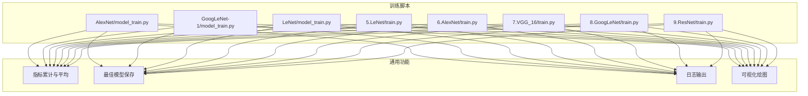
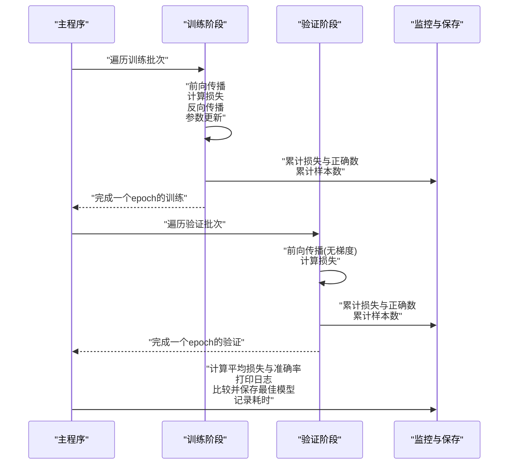
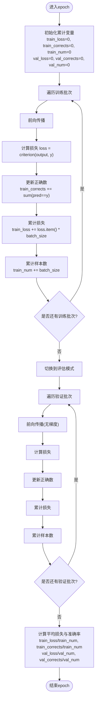
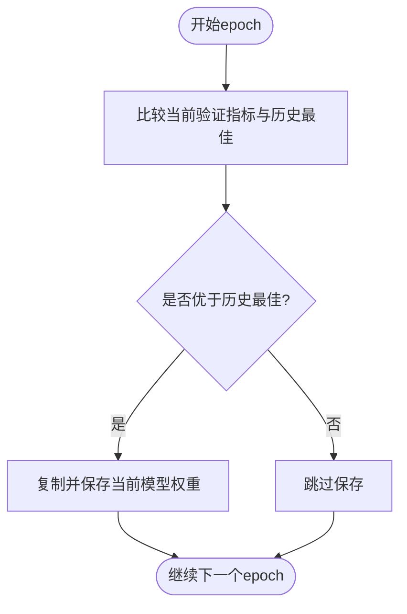
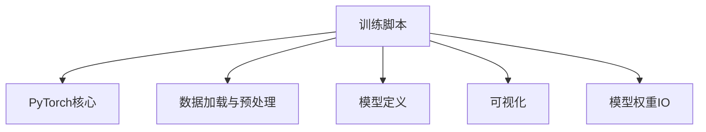

# 性能监控

<cite>
**本文引用的文件**   
- [AlexNet/model_train.py](file://study/上传课件、源码/源码/AlexNet/model_train.py)
- [GoogLeNet-1/model_train.py](file://study/上传课件、源码/源码/GoogLeNet-1/model_train.py)
- [LeNet/model_train.py](file://study/上传课件、源码/源码/LeNet/model_train.py)
- [5.LeNet/train.py](file://study/研究生学习/5.LeNet/train.py)
- [6.AlexNet/train.py](file://study/研究生学习/6.AlexNet/train.py)
- [7.VGG_16/train.py](file://study/研究生学习/7.VGG_16/train.py)
- [8.GoogLeNet/train.py](file://study/研究生学习/8.GoogLeNet/train.py)
- [9.ResNet/train.py](file://study/研究生学习/9.ResNet/train.py)
</cite>

## 目录
1. [简介](#简介)
2. [项目结构](#项目结构)
3. [核心组件](#核心组件)
4. [架构总览](#架构总览)
5. [详细组件分析](#详细组件分析)
6. [依赖关系分析](#依赖关系分析)
7. [性能考量](#性能考量)
8. [故障排查指南](#故障排查指南)
9. [结论](#结论)
10. [附录](#附录)

## 简介
本技术文档聚焦于仓库中多个模型训练脚本中的“性能监控”能力，系统性梳理以下方面：
- 训练过程中的指标收集机制：损失值计算、准确率统计与训练时间记录
- 训练集与验证集指标的分离计算方法：累加求和与平均值计算
- 最佳模型跟踪机制：基于验证准确率的比较与权重保存策略
- 训练进度日志输出格式与内容设计
- 过拟合检测方法：训练集与验证集性能差异分析
- 内存使用监控与GPU利用率优化实践建议

上述内容均来源于仓库内各模型的训练脚本实现。

## 项目结构
仓库包含多个独立模型（LeNet、AlexNet、VGG16、GoogLeNet、ResNet）的训练脚本，每个脚本都实现了相似的性能监控流程：数据加载、训练循环、验证循环、指标累计与平均、最佳模型保存、日志打印与可视化。

图表来源
- [AlexNet/model_train.py:1-193](file://study/上传课件、源码/源码/AlexNet/model_train.py#L1-L193)
- [GoogLeNet-1/model_train.py:1-197](file://study/上传课件、源码/源码/GoogLeNet-1/model_train.py#L1-L197)
- [LeNet/model_train.py:1-191](file://study/上传课件、源码/源码/LeNet/model_train.py#L1-L191)
- [5.LeNet/train.py:1-202](file://study/研究生学习/5.LeNet/train.py#L1-L202)
- [6.AlexNet/train.py:1-218](file://study/研究生学习/6.AlexNet/train.py#L1-L218)
- [7.VGG_16/train.py:1-195](file://study/研究生学习/7.VGG_16/train.py#L1-L195)
- [8.GoogLeNet/train.py:1-206](file://study/研究生学习/8.GoogLeNet/train.py#L1-L206)
- [9.ResNet/train.py:1-206](file://study/研究生学习/9.ResNet/train.py#L1-L206)

章节来源
- [AlexNet/model_train.py:1-193](file://study/上传课件、源码/源码/AlexNet/model_train.py#L1-L193)
- [GoogLeNet-1/model_train.py:1-197](file://study/上传课件、源码/源码/GoogLeNet-1/model_train.py#L1-L197)
- [LeNet/model_train.py:1-191](file://study/上传课件、源码/源码/LeNet/model_train.py#L1-L191)
- [5.LeNet/train.py:1-202](file://study/研究生学习/5.LeNet/train.py#L1-L202)
- [6.AlexNet/train.py:1-218](file://study/研究生学习/6.AlexNet/train.py#L1-L218)
- [7.VGG_16/train.py:1-195](file://study/研究生学习/7.VGG_16/train.py#L1-L195)
- [8.GoogLeNet/train.py:1-206](file://study/研究生学习/8.GoogLeNet/train.py#L1-L206)
- [9.ResNet/train.py:1-206](file://study/研究生学习/9.ResNet/train.py#L1-L206)

## 核心组件
- 指标收集器：在每个epoch内对训练集与验证集分别累计损失与正确样本数，并在epoch末除以样本总数得到平均值
- 最佳模型跟踪器：以验证集指标为基准（多数脚本采用验证准确率，个别脚本采用验证损失），当出现更优时更新并保存权重
- 计时器：记录从训练开始到当前epoch的耗时，用于评估训练效率
- 日志输出器：按固定格式打印每轮训练与验证的关键指标
- 可视化器：将训练与验证的损失与准确率绘制成曲线图

章节来源
- [AlexNet/model_train.py:35-165](file://study/上传课件、源码/源码/AlexNet/model_train.py#L35-L165)
- [GoogLeNet-1/model_train.py:39-169](file://study/上传课件、源码/源码/GoogLeNet-1/model_train.py#L39-L169)
- [LeNet/model_train.py:35-162](file://study/上传课件、源码/源码/LeNet/model_train.py#L35-L162)
- [5.LeNet/train.py:50-178](file://study/研究生学习/5.LeNet/train.py#L50-L178)
- [6.AlexNet/train.py:60-189](file://study/研究生学习/6.AlexNet/train.py#L60-L189)
- [7.VGG_16/train.py:36-167](file://study/研究生学习/7.VGG_16/train.py#L36-L167)
- [8.GoogLeNet/train.py:36-168](file://study/研究生学习/8.GoogLeNet/train.py#L36-L168)
- [9.ResNet/train.py:36-168](file://study/研究生学习/9.ResNet/train.py#L36-L168)

## 架构总览
下图展示了典型训练脚本在单个epoch内的执行顺序与关键监控点：

图表来源
- [5.LeNet/train.py:79-178](file://study/研究生学习/5.LeNet/train.py#L79-L178)
- [6.AlexNet/train.py:86-189](file://study/研究生学习/6.AlexNet/train.py#L86-L189)
- [7.VGG_16/train.py:62-167](file://study/研究生学习/7.VGG_16/train.py#L62-L167)
- [8.GoogLeNet/train.py:62-168](file://study/研究生学习/8.GoogLeNet/train.py#L62-L168)
- [9.ResNet/train.py:62-168](file://study/研究生学习/9.ResNet/train.py#L62-L168)

## 详细组件分析

### 指标收集机制（损失与准确率）
- 损失值计算
  - 训练阶段：每个batch计算交叉熵损失后，乘以该batch样本数进行累加；epoch末除以总样本数得到平均损失
  - 验证阶段：同样逐batch累加损失，最后取平均
- 准确率统计
  - 通过argmax获取预测类别并与真实标签比较，累加正确样本数；epoch末除以总样本数得到准确率
- 数值稳定性
  - 部分实现中将正确数转换为double再计算比率，避免整型除法精度问题

图表来源
- [AlexNet/model_train.py:80-141](file://study/上传课件、源码/源码/AlexNet/model_train.py#L80-L141)
- [GoogLeNet-1/model_train.py:84-145](file://study/上传课件、源码/源码/GoogLeNet-1/model_train.py#L84-L145)
- [LeNet/model_train.py:80-141](file://study/上传课件、源码/源码/LeNet/model_train.py#L80-L141)
- [5.LeNet/train.py:94-157](file://study/研究生学习/5.LeNet/train.py#L94-L157)
- [6.AlexNet/train.py:105-166](file://study/研究生学习/6.AlexNet/train.py#L105-L166)
- [7.VGG_16/train.py:81-142](file://study/研究生学习/7.VGG_16/train.py#L81-L142)
- [8.GoogLeNet/train.py:81-143](file://study/研究生学习/8.GoogLeNet/train.py#L81-L143)
- [9.ResNet/train.py:81-143](file://study/研究生学习/9.ResNet/train.py#L81-L143)

章节来源
- [AlexNet/model_train.py:80-141](file://study/上传课件、源码/源码/AlexNet/model_train.py#L80-L141)
- [GoogLeNet-1/model_train.py:84-145](file://study/上传课件、源码/源码/GoogLeNet-1/model_train.py#L84-L145)
- [LeNet/model_train.py:80-141](file://study/上传课件、源码/源码/LeNet/model_train.py#L80-L141)
- [5.LeNet/train.py:94-157](file://study/研究生学习/5.LeNet/train.py#L94-L157)
- [6.AlexNet/train.py:105-166](file://study/研究生学习/6.AlexNet/train.py#L105-L166)
- [7.VGG_16/train.py:81-142](file://study/研究生学习/7.VGG_16/train.py#L81-L142)
- [8.GoogLeNet/train.py:81-143](file://study/研究生学习/8.GoogLeNet/train.py#L81-L143)
- [9.ResNet/train.py:81-143](file://study/研究生学习/9.ResNet/train.py#L81-L143)

### 训练集与验证集指标的分离计算
- 分离策略
  - 训练阶段：开启梯度计算，执行反向传播与参数更新；累计损失与正确数
  - 验证阶段：关闭梯度计算（部分脚本显式使用no_grad上下文），仅做前向传播与指标累计
- 平均值计算
  - 所有脚本均采用“总累计值 / 总样本数”的方式计算平均损失与准确率，保证不同batch大小下的公平性

章节来源
- [5.LeNet/train.py:130-157](file://study/研究生学习/5.LeNet/train.py#L130-L157)
- [6.AlexNet/train.py:132-166](file://study/研究生学习/6.AlexNet/train.py#L132-L166)
- [7.VGG_16/train.py:108-142](file://study/研究生学习/7.VGG_16/train.py#L108-L142)
- [8.GoogLeNet/train.py:108-143](file://study/研究生学习/8.GoogLeNet/train.py#L108-L143)
- [9.ResNet/train.py:108-143](file://study/研究生学习/9.ResNet/train.py#L108-L143)

### 最佳模型跟踪机制
- 比较基准
  - 多数脚本以“验证准确率”作为比较基准，若当前epoch的验证准确率高于历史最高则更新
  - 个别脚本以“验证损失”作为比较基准（如AlexNet研究生学习版），选择更低验证损失对应的权重
- 权重保存策略
  - 当出现更优指标时，复制当前模型权重并保存到磁盘；训练结束后再次加载最优权重并持久化
- 最佳轮次记录
  - 部分实现额外记录达到最佳指标的epoch编号，便于后续分析与恢复

图表来源
- [AlexNet/model_train.py:143-156](file://study/上传课件、源码/源码/AlexNet/model_train.py#L143-L156)
- [GoogLeNet-1/model_train.py:147-160](file://study/上传课件、源码/源码/GoogLeNet-1/model_train.py#L147-L160)
- [LeNet/model_train.py:143-154](file://study/上传课件、源码/源码/LeNet/model_train.py#L143-L154)
- [5.LeNet/train.py:159-170](file://study/研究生学习/5.LeNet/train.py#L159-L170)
- [6.AlexNet/train.py:168-180](file://study/研究生学习/6.AlexNet/train.py#L168-L180)
- [7.VGG_16/train.py:144-158](file://study/研究生学习/7.VGG_16/train.py#L144-L158)
- [8.GoogLeNet/train.py:145-159](file://study/研究生学习/8.GoogLeNet/train.py#L145-L159)
- [9.ResNet/train.py:145-159](file://study/研究生学习/9.ResNet/train.py#L145-L159)

章节来源
- [AlexNet/model_train.py:143-156](file://study/上传课件、源码/源码/AlexNet/model_train.py#L143-L156)
- [GoogLeNet-1/model_train.py:147-160](file://study/上传课件、源码/源码/GoogLeNet-1/model_train.py#L147-L160)
- [LeNet/model_train.py:143-154](file://study/上传课件、源码/源码/LeNet/model_train.py#L143-L154)
- [5.LeNet/train.py:159-170](file://study/研究生学习/5.LeNet/train.py#L159-L170)
- [6.AlexNet/train.py:168-180](file://study/研究生学习/6.AlexNet/train.py#L168-L180)
- [7.VGG_16/train.py:144-158](file://study/研究生学习/7.VGG_16/train.py#L144-L158)
- [8.GoogLeNet/train.py:145-159](file://study/研究生学习/8.GoogLeNet/train.py#L145-L159)
- [9.ResNet/train.py:145-159](file://study/研究生学习/9.ResNet/train.py#L145-L159)

### 训练进度日志输出格式与内容
- 每轮输出字段
  - 轮次标识（epoch）
  - 训练集损失与准确率
  - 验证集损失与准确率
  - 累计训练耗时（分钟与秒）
- 输出示例（文本描述）
  - “第X轮训练集损失: Y.YYYY, 训练集准确率: Z.ZZZZ”
  - “第X轮验证集损失: Y.YYYY, 验证集准确率: Z.ZZZZ”
  - “第X轮训练时间: M分 S秒”
- 可视化辅助
  - 训练结束后生成两张子图：左图为损失曲线（训练与验证），右图为准确率曲线（训练与验证）

章节来源
- [5.LeNet/train.py:155-170](file://study/研究生学习/5.LeNet/train.py#L155-L170)
- [6.AlexNet/train.py:165-176](file://study/研究生学习/6.AlexNet/train.py#L165-L176)
- [7.VGG_16/train.py:141-152](file://study/研究生学习/7.VGG_16/train.py#L141-L152)
- [8.GoogLeNet/train.py:142-153](file://study/研究生学习/8.GoogLeNet/train.py#L142-L153)
- [9.ResNet/train.py:142-153](file://study/研究生学习/9.ResNet/train.py#L142-L153)
- [AlexNet/model_train.py:140-151](file://study/上传课件、源码/源码/AlexNet/model_train.py#L140-L151)
- [GoogLeNet-1/model_train.py:144-155](file://study/上传课件、源码/源码/GoogLeNet-1/model_train.py#L144-L155)
- [LeNet/model_train.py:140-151](file://study/上传课件、源码/源码/LeNet/model_train.py#L140-L151)

### 过拟合检测方法
- 方法概述
  - 对比训练集与验证集的准确率或损失变化趋势
  - 当训练集指标持续上升而验证集指标停滞或下降，且两者差距扩大时，提示可能过拟合
- 具体实现
  - 各脚本均在每个epoch末尾记录并打印训练与验证指标，可通过观察日志或可视化曲线判断过拟合
  - 最佳模型保存通常基于验证指标，有助于缓解过拟合带来的泛化退化

章节来源
- [5.LeNet/train.py:155-170](file://study/研究生学习/5.LeNet/train.py#L155-L170)
- [6.AlexNet/train.py:165-176](file://study/研究生学习/6.AlexNet/train.py#L165-L176)
- [7.VGG_16/train.py:141-152](file://study/研究生学习/7.VGG_16/train.py#L141-L152)
- [8.GoogLeNet/train.py:142-153](file://study/研究生学习/8.GoogLeNet/train.py#L142-L153)
- [9.ResNet/train.py:142-153](file://study/研究生学习/9.ResNet/train.py#L142-L153)

### 内存使用监控与GPU利用率优化实践建议
- 内存使用监控
  - 可在验证阶段使用no_grad上下文减少中间激活与梯度占用
  - 定期清理不再需要的张量引用，避免累积导致内存泄漏
- GPU利用率优化
  - 合理设置批大小与num_workers，提升数据加载并行度
  - 启用pin_memory与persistent_workers（在GPU环境下）加速数据传输
  - 使用混合精度训练（如AMP）降低显存占用并提高吞吐
  - 监控GPU显存与利用率（例如使用nvidia-smi或PyTorch内置工具），根据资源情况调整批大小与线程数

[本节为通用实践建议，不直接分析具体文件]

## 依赖关系分析
- 模块耦合
  - 训练脚本主要依赖PyTorch核心库（torch、torch.nn、torch.optim）、数据加载（torchvision.datasets、torch.utils.data）、可视化（matplotlib）与数据处理（pandas）
- 外部集成点
  - 数据集路径与预处理配置
  - 模型定义文件（model.py）
  - 模型权重保存路径（best_model.pth）

图表来源
- [5.LeNet/train.py:1-202](file://study/研究生学习/5.LeNet/train.py#L1-L202)
- [6.AlexNet/train.py:1-218](file://study/研究生学习/6.AlexNet/train.py#L1-L218)
- [7.VGG_16/train.py:1-195](file://study/研究生学习/7.VGG_16/train.py#L1-L195)
- [8.GoogLeNet/train.py:1-206](file://study/研究生学习/8.GoogLeNet/train.py#L1-L206)
- [9.ResNet/train.py:1-206](file://study/研究生学习/9.ResNet/train.py#L1-L206)

章节来源
- [5.LeNet/train.py:1-202](file://study/研究生学习/5.LeNet/train.py#L1-L202)
- [6.AlexNet/train.py:1-218](file://study/研究生学习/6.AlexNet/train.py#L1-L218)
- [7.VGG_16/train.py:1-195](file://study/研究生学习/7.VGG_16/train.py#L1-L195)
- [8.GoogLeNet/train.py:1-206](file://study/研究生学习/8.GoogLeNet/train.py#L1-L206)
- [9.ResNet/train.py:1-206](file://study/研究生学习/9.ResNet/train.py#L1-L206)

## 性能考量
- 指标计算的复杂度
  - 每个epoch的指标累计为O(N)，其中N为样本总数；平均值计算为常数时间操作
- 内存与I/O瓶颈
  - DataLoader的num_workers与pin_memory会影响数据加载速度；过大可能导致CPU压力过高
- 最佳模型保存频率
  - 仅在指标改善时保存权重，减少频繁IO开销
- 日志与可视化的开销
  - 大量print与绘图会拖慢训练；建议在长训练中减少日志频率或使用异步写入

[本节提供一般性指导，不直接分析具体文件]

## 故障排查指南
- 常见问题
  - 验证阶段未关闭梯度导致显存暴涨：确保验证阶段使用no_grad上下文或eval模式
  - 批大小不一致导致平均计算偏差：确认每个batch的样本数参与加权累计
  - 最佳模型未保存：检查比较逻辑与保存路径权限
- 定位步骤
  - 查看每轮日志输出，确认指标是否合理收敛
  - 检查保存的best_model.pth是否存在且可加载
  - 使用可视化工具核对训练与验证曲线是否出现明显过拟合迹象

章节来源
- [5.LeNet/train.py:130-170](file://study/研究生学习/5.LeNet/train.py#L130-L170)
- [6.AlexNet/train.py:132-180](file://study/研究生学习/6.AlexNet/train.py#L132-L180)
- [7.VGG_16/train.py:108-158](file://study/研究生学习/7.VGG_16/train.py#L108-L158)
- [8.GoogLeNet/train.py:108-159](file://study/研究生学习/8.GoogLeNet/train.py#L108-L159)
- [9.ResNet/train.py:108-159](file://study/研究生学习/9.ResNet/train.py#L108-L159)

## 结论
仓库中的多个训练脚本实现了统一的性能监控范式：在训练与验证阶段分别累计损失与正确数，并以样本数为权重计算平均值；以验证指标为依据进行最佳模型跟踪与权重保存；通过结构化日志与可视化辅助诊断训练过程与过拟合风险。在此基础上，结合内存与GPU优化实践，可进一步提升训练效率与稳定性。

[本节为总结性内容，不直接分析具体文件]

## 附录
- 术语说明
  - 训练集：用于参数更新的样本集合
  - 验证集：不参与参数更新，用于评估泛化性能的样本集合
  - 最佳模型：在验证集上表现最优的模型权重快照
  - 过拟合：模型在训练集上表现良好但在验证集上表现退化的现象

[本节为概念性说明，不直接分析具体文件]