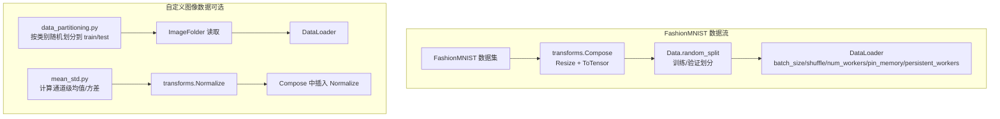
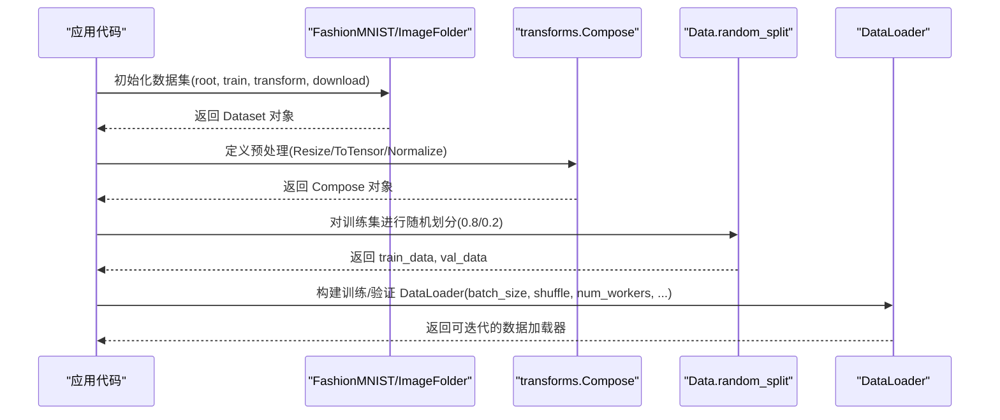
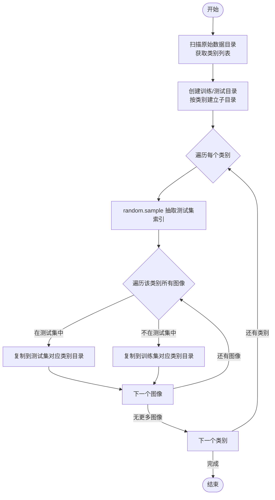
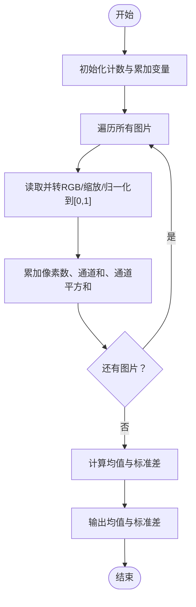
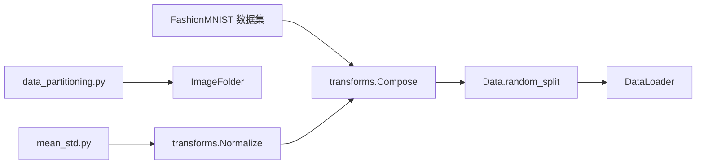

# 数据预处理

<cite>
**本文引用的文件**   
- [train.py](file://study/研究生学习/5.LeNet/train.py)
- [4.pytorch.ipynb](file://study/研究生学习/4.pytorch/4.pytorch.ipynb)
- [data_partitioning.py（GoogLeNet-1）](file://study/上传课件、源码/源码/GoogLeNet-1/data_partitioning.py)
- [mean_std.py（GoogLeNet-1）](file://study/上传课件、源码/源码/GoogLeNet-1/mean_std.py)
- [model_train.py（GoogLeNet-1）](file://study/上传课件、源码/源码/GoogLeNet-1/model_train.py)
- [data_partitioning.py（8.GoogLeNet）](file://study/研究生学习/8.GoogLeNet/data_partitioning.py)
- [mean_std.py（8.GoogLeNet）](file://study/研究生学习/8.GoogLeNet/mean_std.py)
</cite>

## 目录
1. [简介](#简介)
2. [项目结构](#项目结构)
3. [核心组件](#核心组件)
4. [架构总览](#架构总览)
5. [详细组件分析](#详细组件分析)
6. [依赖关系分析](#依赖关系分析)
7. [性能与GPU加速](#性能与gpu加速)
8. [故障排查指南](#故障排查指南)
9. [结论](#结论)
10. [附录：完整配置示例与调优建议](#附录完整配置示例与调优建议)

## 简介
本技术文档聚焦于数据预处理模块，围绕 FashionMNIST 数据集的加载与预处理流程展开，系统讲解 transforms.Compose 的使用方式、Resize 与 ToTensor 的作用机制；详细说明基于 random_split 的训练集/验证集划分策略；记录自定义数据划分工具 data_partitioning.py 的实现原理与使用方法；解释标准化处理 mean_std.py 的功能与均值、标准差计算方法；并提供完整的数据加载器 DataLoader 配置示例与参数调优建议，包括 GPU 加速相关的 pin_memory 与 persistent_workers 配置说明。

## 项目结构
仓库中与数据预处理相关的关键位置如下：
- FashionMNIST 训练与数据加载：study/研究生学习/5.LeNet/train.py
- FashionMNIST 基础用法与 Compose 示例：study/研究生学习/4.pytorch/4.pytorch.ipynb
- 自定义图像数据划分脚本（两类实现）：
  - study/上传课件、源码/源码/GoogLeNet-1/data_partitioning.py
  - study/研究生学习/8.GoogLeNet/data_partitioning.py
- 自定义图像数据标准化统计脚本（两类实现）：
  - study/上传课件、源码/源码/GoogLeNet-1/mean_std.py
  - study/研究生学习/8.GoogLeNet/mean_std.py
- 基于本地 ImageFolder 的训练入口（含 Normalize 使用）：study/上传课件、源码/源码/GoogLeNet-1/model_train.py

图表来源
- [train.py:16-48](file://study/研究生学习/5.LeNet/train.py#L16-L48)
- [4.pytorch.ipynb:376-395](file://study/研究生学习/4.pytorch/4.pytorch.ipynb#L376-L395)
- [data_partitioning.py（GoogLeNet-1）:1-49](file://study/上传课件、源码/源码/GoogLeNet-1/data_partitioning.py#L1-L49)
- [mean_std.py（GoogLeNet-1）:1-58](file://study/上传课件、源码/源码/GoogLeNet-1/mean_std.py#L1-L58)
- [model_train.py:14-35](file://study/上传课件、源码/源码/GoogLeNet-1/model_train.py#L14-L35)
- [data_partitioning.py（8.GoogLeNet）:1-51](file://study/研究生学习/8.GoogLeNet/data_partitioning.py#L1-L51)
- [mean_std.py（8.GoogLeNet）:1-56](file://study/研究生学习/8.GoogLeNet/mean_std.py#L1-L56)

章节来源
- [train.py:16-48](file://study/研究生学习/5.LeNet/train.py#L16-L48)
- [4.pytorch.ipynb:376-395](file://study/研究生学习/4.pytorch/4.pytorch.ipynb#L376-L395)
- [data_partitioning.py（GoogLeNet-1）:1-49](file://study/上传课件、源码/源码/GoogLeNet-1/data_partitioning.py#L1-L49)
- [mean_std.py（GoogLeNet-1）:1-58](file://study/上传课件、源码/源码/GoogLeNet-1/mean_std.py#L1-L58)
- [model_train.py:14-35](file://study/上传课件、源码/源码/GoogLeNet-1/model_train.py#L14-L35)
- [data_partitioning.py（8.GoogLeNet）:1-51](file://study/研究生学习/8.GoogLeNet/data_partitioning.py#L1-L51)
- [mean_std.py（8.GoogLeNet）:1-56](file://study/研究生学习/8.GoogLeNet/mean_std.py#L1-L56)

## 核心组件
本节从“数据加载—预处理—划分—装载”的全链路角度，梳理关键组件及其职责。

- 数据集加载
  - FashionMNIST：通过 torchvision.datasets.FashionMNIST 自动下载并缓存至指定 root 目录，支持 train=True/False 切换训练/测试集。
  - 自定义图像数据：通过 ImageFolder 读取以类别为子目录的结构化图片集合。

- 预处理流水线
  - transforms.Compose：将多个变换按顺序组合执行，典型顺序为 Resize → ToTensor → Normalize（可选）。
  - Resize：将输入图像缩放到目标尺寸，适配模型输入要求。
  - ToTensor：将 PIL.Image 或 numpy.ndarray 转换为 torch.Tensor，并将像素值归一化到 [0,1] 区间，同时调整通道维度。
  - Normalize：按通道进行标准化，输入为均值和标准差列表，常用于提升训练稳定性与收敛速度。

- 数据划分
  - Data.random_split：在已有 Dataset 上按给定长度比例随机切分为训练集与验证集，保证可复现性可通过设置 generator 控制。

- 数据装载
  - DataLoader：负责批量化、打乱、多进程读取等。常用参数包括 batch_size、shuffle、num_workers、pin_memory、persistent_workers。

章节来源
- [train.py:16-48](file://study/研究生学习/5.LeNet/train.py#L16-L48)
- [4.pytorch.ipynb:376-395](file://study/研究生学习/4.pytorch/4.pytorch.ipynb#L376-L395)
- [model_train.py:14-35](file://study/上传课件、源码/源码/GoogLeNet-1/model_train.py#L14-L35)

## 架构总览
下图展示了 FashionMNIST 数据预处理与装载的整体流程，以及可选的自定义图像数据路径。

图表来源
- [train.py:16-48](file://study/研究生学习/5.LeNet/train.py#L16-L48)
- [4.pytorch.ipynb:376-395](file://study/研究生学习/4.pytorch/4.pytorch.ipynb#L376-L395)
- [model_train.py:14-35](file://study/上传课件、源码/源码/GoogLeNet-1/model_train.py#L14-L35)

## 详细组件分析

### FashionMNIST 数据加载与预处理
- 数据集实例化
  - root：指定数据根目录，首次运行会自动下载。
  - train：True 表示训练集，False 表示测试集。
  - transform：传入 transforms.Compose 定义的预处理流水线。
  - download：首次运行时自动下载数据集。

- transforms.Compose 与具体操作
  - Resize(size=224)：将 28x28 灰度图放大到 224x224，便于接入更大感受野的 CNN。
  - ToTensor()：将图像转为 Tensor，形状由 (H,W) 变为 (C,H,W)，像素值范围 [0,1]。
  - Normalize(mean,std)：按通道减去均值并除以标准差，使数据分布更稳定（可选，取决于任务与模型）。

- 数据划分
  - Data.random_split(dataset, [round(0.8*len), round(0.2*len)])：按比例切分训练集与验证集。

- 数据装载
  - DataLoader(dataset, batch_size, shuffle, num_workers, ...)：提供批量迭代能力。

章节来源
- [train.py:16-48](file://study/研究生学习/5.LeNet/train.py#L16-L48)
- [4.pytorch.ipynb:376-395](file://study/研究生学习/4.pytorch/4.pytorch.ipynb#L376-L395)

### 自定义数据划分工具 data_partitioning.py
该脚本用于将原始分类数据按类别文件夹进行随机划分，生成独立的训练集与测试集目录结构，供后续 ImageFolder 读取。

- 核心逻辑
  - 扫描原始数据目录下的类别子目录。
  - 为每个类别随机抽取一定比例的样本作为测试集，其余放入训练集。
  - 创建目标目录结构（如 data/train 与 data/test），并按类别复制文件。

- 关键函数与流程
  - mkfile(file)：若目录不存在则创建。
  - 遍历类别与图像，使用 random.sample 抽样确定测试集索引。
  - 根据是否在抽样结果中，将图像复制到对应目录。

- 使用建议
  - 修改 split_rate 控制测试集比例。
  - 确保源目录结构与预期一致（每类一个子目录）。
  - 运行后检查生成的目录是否包含所有类别。

图表来源
- [data_partitioning.py（GoogLeNet-1）:1-49](file://study/上传课件、源码/源码/GoogLeNet-1/data_partitioning.py#L1-L49)
- [data_partitioning.py（8.GoogLeNet）:1-51](file://study/研究生学习/8.GoogLeNet/data_partitioning.py#L1-L51)

章节来源
- [data_partitioning.py（GoogLeNet-1）:1-49](file://study/上传课件、源码/源码/GoogLeNet-1/data_partitioning.py#L1-L49)
- [data_partitioning.py（8.GoogLeNet）:1-51](file://study/研究生学习/8.GoogLeNet/data_partitioning.py#L1-L51)

### 标准化处理 mean_std.py
该脚本用于统计训练集图像的通道级均值与标准差，以便在 transforms.Normalize 中使用，从而提升训练稳定性与收敛效果。

- 核心算法
  - 遍历所有图片，读取为数组并归一化到 [0,1]。
  - 累计像素总数与通道像素和，计算均值。
  - 二次遍历或使用平方和公式计算方差，再开方得到标准差。

- 两种实现差异
  - GoogLeNet-1 版本：两次遍历分别计算均值与方差，简单直观。
  - 8.GoogLeNet 版本：一次遍历累积像素数、通道和与通道平方和，利用方差公式一次性求解，效率更高。

- 输出与使用
  - 打印各通道的均值与标准差（或方差）。
  - 将结果填入 transforms.Normalize([mean], [std]) 中，并在 Compose 中置于 ToTensor 之后。

图表来源
- [mean_std.py（GoogLeNet-1）:1-58](file://study/上传课件、源码/源码/GoogLeNet-1/mean_std.py#L1-L58)
- [mean_std.py（8.GoogLeNet）:1-56](file://study/研究生学习/8.GoogLeNet/mean_std.py#L1-L56)

章节来源
- [mean_std.py（GoogLeNet-1）:1-58](file://study/上传课件、源码/源码/GoogLeNet-1/mean_std.py#L1-L58)
- [mean_std.py（8.GoogLeNet）:1-56](file://study/研究生学习/8.GoogLeNet/mean_std.py#L1-L56)

### 基于 ImageFolder 的训练入口与 Normalize 集成
对于自定义图像数据，通常先使用 data_partitioning.py 划分出 train/test 目录，再通过 ImageFolder 加载，并在 Compose 中加入 Normalize。

- 关键点
  - ROOT_TRAIN 指向训练集根目录。
  - normalize = transforms.Normalize([mean], [std]) 使用预先计算的均值与标准差。
  - train_transform = transforms.Compose([Resize((224,224)), ToTensor(), normalize])。
  - 使用 Data.DataLoader 构建训练与验证加载器。

章节来源
- [model_train.py:14-35](file://study/上传课件、源码/源码/GoogLeNet-1/model_train.py#L14-L35)

## 依赖关系分析
- 外部库
  - torchvision.datasets.FashionMNIST：内置数据集加载。
  - torchvision.transforms：数据预处理工具。
  - torch.utils.data.DataLoader：数据装载与并行读取。
  - shutil、os、random：文件与随机采样操作（自定义划分脚本）。
  - PIL、numpy：图像处理与数值计算（标准化脚本）。

- 内部依赖
  - 训练脚本依赖数据预处理与划分逻辑。
  - 标准化脚本独立运行，输出结果被训练脚本引用。

图表来源
- [train.py:16-48](file://study/研究生学习/5.LeNet/train.py#L16-L48)
- [model_train.py:14-35](file://study/上传课件、源码/源码/GoogLeNet-1/model_train.py#L14-L35)
- [data_partitioning.py（GoogLeNet-1）:1-49](file://study/上传课件、源码/源码/GoogLeNet-1/data_partitioning.py#L1-L49)
- [mean_std.py（GoogLeNet-1）:1-58](file://study/上传课件、源码/源码/GoogLeNet-1/mean_std.py#L1-L58)

章节来源
- [train.py:16-48](file://study/研究生学习/5.LeNet/train.py#L16-L48)
- [model_train.py:14-35](file://study/上传课件、源码/源码/GoogLeNet-1/model_train.py#L14-L35)
- [data_partitioning.py（GoogLeNet-1）:1-49](file://study/上传课件、源码/源码/GoogLeNet-1/data_partitioning.py#L1-L49)
- [mean_std.py（GoogLeNet-1）:1-58](file://study/上传课件、源码/源码/GoogLeNet-1/mean_std.py#L1-L58)

## 性能与GPU加速
- DataLoader 关键参数
  - batch_size：增大可提升吞吐，但需考虑显存限制。
  - shuffle：训练集建议开启，验证集通常关闭。
  - num_workers：多进程预取数据，提高 IO 吞吐；Windows 下需注意 spawn 启动开销。
  - pin_memory：启用后可加速 CPU→GPU 数据传输（仅在 CUDA 可用时有效）。
  - persistent_workers：当 num_workers > 0 时保持 worker 进程常驻，减少重复创建开销。

- 参考配置
  - 训练集：batch_size=256，shuffle=True，num_workers=4，pin_memory=True，persistent_workers=True。
  - 验证集：batch_size=256，shuffle=False，num_workers=4，pin_memory=True，persistent_workers=True。

- 调优建议
  - 逐步增加 num_workers，观察吞吐与内存占用变化。
  - 在 GPU 环境下开启 pin_memory 与 persistent_workers，可显著降低数据加载瓶颈。
  - 若遇到 OOM，优先降低 batch_size 或减小图像尺寸。

章节来源
- [train.py:16-48](file://study/研究生学习/5.LeNet/train.py#L16-L48)

## 故障排查指南
- 常见问题
  - 找不到数据目录：确认 root 路径正确且已下载或已生成 train/test 目录。
  - 类别缺失：检查 data_partitioning.py 的输出目录是否包含所有类别子目录。
  - 标准化异常：确保 Normalize 的 mean/std 与数据格式一致（RGB 三通道）。
  - 多进程报错：Windows 下尝试将 num_workers 设为 0 或改用 spawn 启动策略。

- 定位方法
  - 打印 DataLoader 第一个 batch 的形状与类型，确认预处理是否正确。
  - 单独运行 mean_std.py，核对输出的均值与标准差是否符合预期。
  - 使用小批量数据快速验证 pipeline 是否工作正常。

章节来源
- [data_partitioning.py（GoogLeNet-1）:1-49](file://study/上传课件、源码/源码/GoogLeNet-1/data_partitioning.py#L1-L49)
- [mean_std.py（GoogLeNet-1）:1-58](file://study/上传课件、源码/源码/GoogLeNet-1/mean_std.py#L1-L58)
- [train.py:16-48](file://study/研究生学习/5.LeNet/train.py#L16-L48)

## 结论
本仓库提供了完整的 FashionMNIST 数据预处理与加载范式，并通过自定义脚本实现了可扩展的图像数据划分与标准化统计。借助 transforms.Compose 的灵活组合、Data.random_split 的便捷划分以及 DataLoader 的高性能装载，可在不同任务与硬件条件下获得稳定的数据供给与训练体验。建议在 GPU 环境中合理配置 pin_memory 与 persistent_workers，并结合实际数据规模与模型大小调优 batch_size 与 num_workers。

## 附录：完整配置示例与调优建议
- FashionMNIST 训练数据加载器配置要点
  - 预处理：Resize(size=224) + ToTensor() + Normalize(mean,std)（可选）。
  - 划分：Data.random_split(train_data, [round(0.8*len), round(0.2*len)])。
  - DataLoader：batch_size=256，shuffle=True，num_workers=4，pin_memory=True，persistent_workers=True。

- 自定义图像数据（ImageFolder）配置要点
  - 先用 data_partitioning.py 生成 train/test 目录。
  - 运行 mean_std.py 计算通道均值与标准差。
  - 在 Compose 中加入 Normalize，并使用 ImageFolder 加载。
  - DataLoader 配置同上。

- 调优建议
  - 小数据集：适当增大 batch_size，开启 pin_memory 与 persistent_workers。
  - 大数据集：适度增加 num_workers，监控 IO 瓶颈与内存占用。
  - 复杂模型：优先降低图像尺寸或 batch_size，避免显存溢出。

章节来源
- [train.py:16-48](file://study/研究生学习/5.LeNet/train.py#L16-L48)
- [model_train.py:14-35](file://study/上传课件、源码/源码/GoogLeNet-1/model_train.py#L14-L35)
- [data_partitioning.py（GoogLeNet-1）:1-49](file://study/上传课件、源码/源码/GoogLeNet-1/data_partitioning.py#L1-L49)
- [mean_std.py（GoogLeNet-1）:1-58](file://study/上传课件、源码/源码/GoogLeNet-1/mean_std.py#L1-L58)