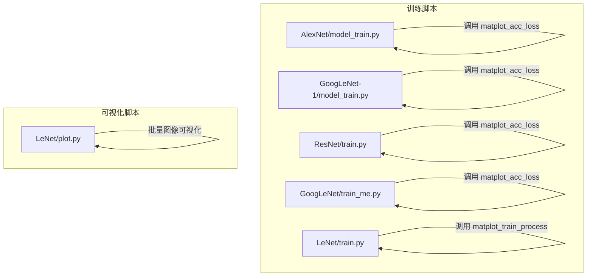
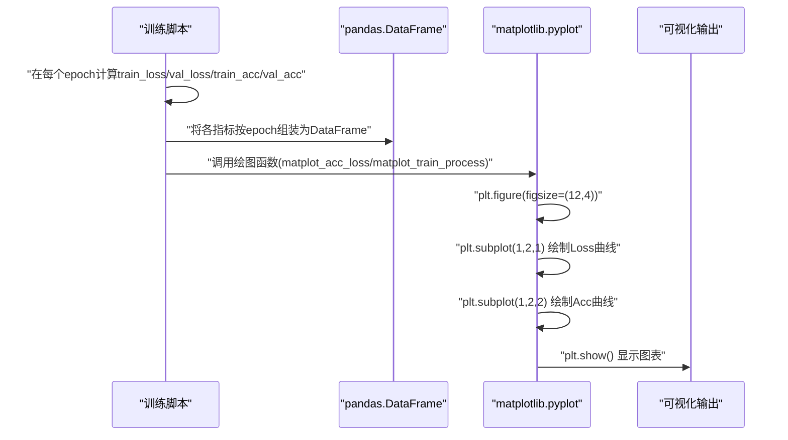
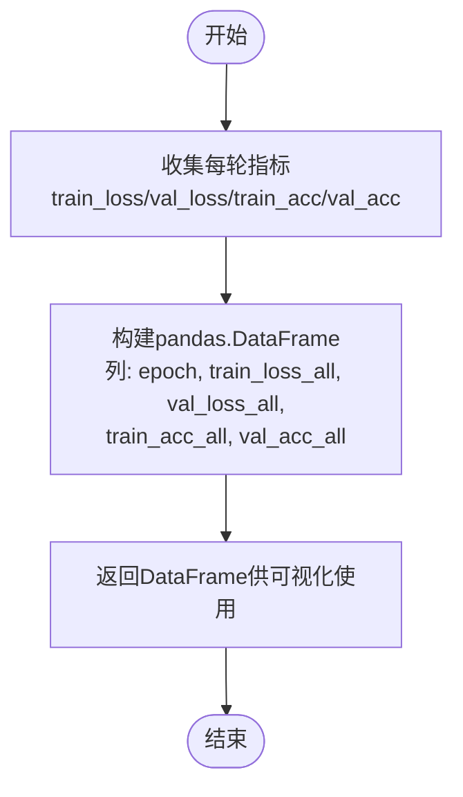
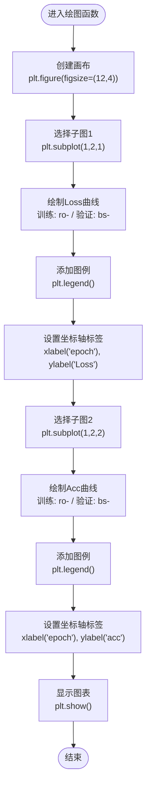
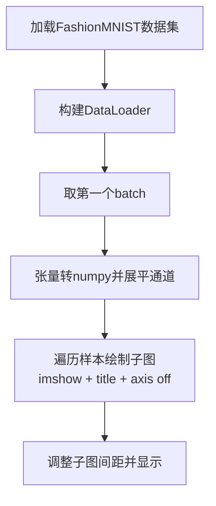
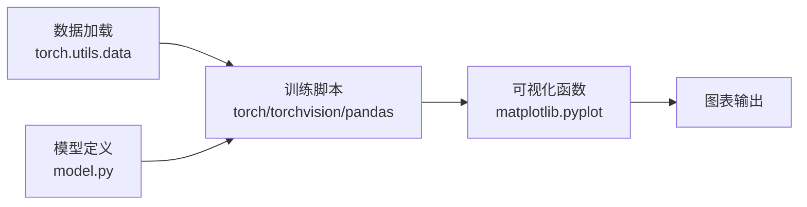

# 结果可视化

<cite>
**本文引用的文件**   
- [AlexNet/model_train.py](file://study/上传课件、源码/源码/AlexNet/model_train.py)
- [GoogLeNet-1/model_train.py](file://study/上传课件、源码/源码/GoogLeNet-1/model_train.py)
- [ResNet/train.py](file://study/研究生学习/9.ResNet/train.py)
- [GoogLeNet/train_me.py](file://study/研究生学习/8.GoogLeNet/train_me.py)
- [LeNet/train.py](file://study/研究生学习/5.LeNet/train.py)
- [LeNet/plot.py](file://study/上传课件、源码/源码/LeNet/plot.py)
</cite>

## 目录
1. [简介](#简介)
2. [项目结构](#项目结构)
3. [核心组件](#核心组件)
4. [架构总览](#架构总览)
5. [详细组件分析](#详细组件分析)
6. [依赖关系分析](#依赖关系分析)
7. [性能与可扩展性](#性能与可扩展性)
8. [故障排查指南](#故障排查指南)
9. [结论](#结论)
10. [附录](#附录)

## 简介
本技术文档聚焦于“结果可视化模块”，围绕训练曲线绘制功能展开，涵盖以下要点：
- 使用 matplotlib 绘制损失曲线与准确率曲线
- 对比展示训练集与验证集数据
- 多子图布局设计与坐标轴设置
- 图表样式定制（颜色、标记、标签、图例）
- 训练过程数据的保存与加载（pandas DataFrame）
- 可视化结果的分析指导，帮助理解模型训练状态与性能变化趋势

## 项目结构
仓库中涉及可视化与训练流程的关键文件分布如下：
- 训练脚本统一负责收集每轮的训练/验证指标，构建 pandas DataFrame，并调用绘图函数进行可视化
- 部分示例包含图像批次可视化脚本，用于检查数据预处理效果

图示来源
- [AlexNet/model_train.py:168-193](file://study/上传课件、源码/源码/AlexNet/model_train.py#L168-L193)
- [GoogLeNet-1/model_train.py:172-197](file://study/上传课件、源码/源码/GoogLeNet-1/model_train.py#L172-L197)
- [ResNet/train.py:171-206](file://study/研究生学习/9.ResNet/train.py#L171-L206)
- [GoogLeNet/train_me.py:183-218](file://study/研究生学习/8.GoogLeNet/train_me.py#L183-L218)
- [LeNet/train.py:180-185](file://study/研究生学习/5.LeNet/train.py#L180-L185)
- [LeNet/plot.py:30-38](file://study/上传课件、源码/源码/LeNet/plot.py#L30-L38)

章节来源
- [AlexNet/model_train.py:168-193](file://study/上传课件、源码/源码/AlexNet/model_train.py#L168-L193)
- [GoogLeNet-1/model_train.py:172-197](file://study/上传课件、源码/源码/GoogLeNet-1/model_train.py#L172-L197)
- [ResNet/train.py:171-206](file://study/研究生学习/9.ResNet/train.py#L171-L206)
- [GoogLeNet/train_me.py:183-218](file://study/研究生学习/8.GoogLeNet/train_me.py#L183-L218)
- [LeNet/train.py:180-185](file://study/研究生学习/5.LeNet/train.py#L180-L185)
- [LeNet/plot.py:30-38](file://study/上传课件、源码/源码/LeNet/plot.py#L30-L38)

## 核心组件
- 训练指标收集与存储
  - 在训练循环中累计每个 epoch 的训练/验证损失与准确率，并在结束后以 pandas.DataFrame 形式组织为结构化表格，便于后续分析与可视化
- 可视化函数
  - 统一的绘图函数负责创建画布、划分子图、绘制曲线、设置坐标轴与图例，最终显示或保存图表
- 图像批次可视化（辅助）
  - 独立脚本用于快速查看一个 batch 的输入图像及其类别标签，辅助数据预处理与管道调试

章节来源
- [ResNet/train.py:162-168](file://study/研究生学习/9.ResNet/train.py#L162-L168)
- [GoogLeNet/train_me.py:174-180](file://study/研究生学习/8.GoogLeNet/train_me.py#L174-L180)
- [AlexNet/model_train.py:160-168](file://study/上传课件、源码/源码/AlexNet/model_train.py#L160-L168)
- [GoogLeNet-1/model_train.py:172-187](file://study/上传课件、源码/源码/GoogLeNet-1/model_train.py#L172-L187)
- [LeNet/train.py:172-185](file://study/研究生学习/5.LeNet/train.py#L172-L185)
- [LeNet/plot.py:30-38](file://study/上传课件、源码/源码/LeNet/plot.py#L30-L38)

## 架构总览
下图展示了从训练到可视化的端到端流程：训练脚本收集指标、构造 DataFrame、调用绘图函数，最终输出双子图（损失与准确率）。

图示来源
- [ResNet/train.py:162-186](file://study/研究生学习/9.ResNet/train.py#L162-L186)
- [GoogLeNet/train_me.py:174-198](file://study/研究生学习/8.GoogLeNet/train_me.py#L174-L198)
- [AlexNet/model_train.py:160-183](file://study/上传课件、源码/源码/AlexNet/model_train.py#L160-L183)
- [GoogLeNet-1/model_train.py:172-187](file://study/上传课件、源码/源码/GoogLeNet-1/model_train.py#L172-L187)
- [LeNet/train.py:172-185](file://study/研究生学习/5.LeNet/train.py#L172-L185)

## 详细组件分析

### 训练过程数据保存与加载（pandas DataFrame）
- 数据结构设计
  - 列名包括：epoch、train_loss_all、val_loss_all、train_acc_all、val_acc_all
  - 行索引对应训练轮次，便于按时间序列进行可视化与分析
- 保存时机
  - 训练完成后统一生成 DataFrame，作为后续可视化与导出分析的输入
- 加载方式
  - 当前代码未直接实现 CSV 导出/导入；可在外部通过 pandas 提供的 to_csv/from_csv 方法完成持久化与再加载

图示来源
- [ResNet/train.py:162-168](file://study/研究生学习/9.ResNet/train.py#L162-L168)
- [GoogLeNet/train_me.py:174-180](file://study/研究生学习/8.GoogLeNet/train_me.py#L174-L180)
- [AlexNet/model_train.py:160-168](file://study/上传课件、源码/源码/AlexNet/model_train.py#L160-L168)
- [GoogLeNet-1/model_train.py:172-187](file://study/上传课件、源码/源码/GoogLeNet-1/model_train.py#L172-L187)
- [LeNet/train.py:172-178](file://study/研究生学习/5.LeNet/train.py#L172-L178)

章节来源
- [ResNet/train.py:162-168](file://study/研究生学习/9.ResNet/train.py#L162-L168)
- [GoogLeNet/train_me.py:174-180](file://study/研究生学习/8.GoogLeNet/train_me.py#L174-L180)
- [AlexNet/model_train.py:160-168](file://study/上传课件、源码/源码/AlexNet/model_train.py#L160-L168)
- [GoogLeNet-1/model_train.py:172-187](file://study/上传课件、源码/源码/GoogLeNet-1/model_train.py#L172-L187)
- [LeNet/train.py:172-178](file://study/研究生学习/5.LeNet/train.py#L172-L178)

### 损失曲线与准确率曲线的绘制方法
- 双子图布局
  - 使用 plt.figure(figsize=(12, 4)) 创建宽幅画布
  - 使用 plt.subplot(1, 2, 1) 和 plt.subplot(1, 2, 2) 分别绘制 Loss 与 Acc 曲线
- 数据源
  - 横轴为 epoch，纵轴分别为 Loss 与 Acc
  - 同时绘制训练集与验证集两条曲线，便于对比
- 线条样式
  - 训练集：红色圆点连线（"ro-"）
  - 验证集：蓝色方块连线（"bs-"）
- 标签与图例
  - 通过 label 参数设置图例项
  - 使用 plt.legend() 显示图例
  - 使用 plt.xlabel()/plt.ylabel() 设置坐标轴名称

图示来源
- [AlexNet/model_train.py:168-183](file://study/上传课件、源码/源码/AlexNet/model_train.py#L168-L183)
- [GoogLeNet-1/model_train.py:172-187](file://study/上传课件、源码/源码/GoogLeNet-1/model_train.py#L172-L187)
- [ResNet/train.py:171-186](file://study/研究生学习/9.ResNet/train.py#L171-L186)
- [GoogLeNet/train_me.py:183-198](file://study/研究生学习/8.GoogLeNet/train_me.py#L183-L198)
- [LeNet/train.py:180-185](file://study/研究生学习/5.LeNet/train.py#L180-L185)

章节来源
- [AlexNet/model_train.py:168-183](file://study/上传课件、源码/源码/AlexNet/model_train.py#L168-L183)
- [GoogLeNet-1/model_train.py:172-187](file://study/上传课件、源码/源码/GoogLeNet-1/model_train.py#L172-L187)
- [ResNet/train.py:171-186](file://study/研究生学习/9.ResNet/train.py#L171-L186)
- [GoogLeNet/train_me.py:183-198](file://study/研究生学习/8.GoogLeNet/train_me.py#L183-L198)
- [LeNet/train.py:180-185](file://study/研究生学习/5.LeNet/train.py#L180-L185)

### 图表样式定制选项
- 颜色与标记
  - 训练集：红色圆点连线（"ro-"）
  - 验证集：蓝色方块连线（"bs-"）
- 标签配置
  - 图例文本：如 "Train loss"/"Val loss"/"Train acc"/"Val acc"
  - 坐标轴标签：x 轴为 "epoch"，y 轴分别为 "Loss" 与 "acc"
- 图例显示
  - 通过 plt.legend() 启用图例
- 画布尺寸
  - 使用 figsize=(12, 4) 控制整体宽高比，使左右两个子图横向并列更清晰

章节来源
- [AlexNet/model_train.py:168-183](file://study/上传课件、源码/源码/AlexNet/model_train.py#L168-L183)
- [GoogLeNet-1/model_train.py:172-187](file://study/上传课件、源码/源码/GoogLeNet-1/model_train.py#L172-L187)
- [ResNet/train.py:171-186](file://study/研究生学习/9.ResNet/train.py#L171-L186)
- [GoogLeNet/train_me.py:183-198](file://study/研究生学习/8.GoogLeNet/train_me.py#L183-L198)
- [LeNet/train.py:180-185](file://study/研究生学习/5.LeNet/train.py#L180-L185)

### 多子图布局与坐标轴设置
- 子图布局
  - 采用 1 行 2 列布局，左侧为 Loss 曲线，右侧为 Acc 曲线
- 坐标轴设置
  - x 轴统一为 "epoch"
  - y 轴根据子图内容设置为 "Loss" 或 "acc"
- 对齐与间距
  - 默认间距已满足基本需求；如需进一步调整，可使用 subplot_adjust 等接口

章节来源
- [AlexNet/model_train.py:168-183](file://study/上传课件、源码/源码/AlexNet/model_train.py#L168-L183)
- [GoogLeNet-1/model_train.py:172-187](file://study/上传课件、源码/源码/GoogLeNet-1/model_train.py#L172-L187)
- [ResNet/train.py:171-186](file://study/研究生学习/9.ResNet/train.py#L171-L186)
- [GoogLeNet/train_me.py:183-198](file://study/研究生学习/8.GoogLeNet/train_me.py#L183-L198)
- [LeNet/train.py:180-185](file://study/研究生学习/5.LeNet/train.py#L180-L185)

### 图像批次可视化（辅助）
- 目的
  - 快速检查数据加载与预处理是否正确，确认图像尺寸、灰度映射与标签对应关系
- 实现要点
  - 使用 DataLoader 获取一个 batch 的数据
  - 将张量转换为 numpy 数组后，用 imshow 渲染
  - 使用 subplot 网格排列多个样本，并标注类别标题

图示来源
- [LeNet/plot.py:9-38](file://study/上传课件、源码/源码/LeNet/plot.py#L9-L38)

章节来源
- [LeNet/plot.py:9-38](file://study/上传课件、源码/源码/LeNet/plot.py#L9-L38)

## 依赖关系分析
- 训练脚本依赖
  - torch/torchvision：模型、优化器、损失函数与数据加载
  - pandas：训练过程指标的结构化存储
  - matplotlib：训练曲线可视化
- 可视化脚本依赖
  - matplotlib：图像批次可视化

图示来源
- [ResNet/train.py:1-14](file://study/研究生学习/9.ResNet/train.py#L1-L14)
- [GoogLeNet/train_me.py:1-14](file://study/研究生学习/8.GoogLeNet/train_me.py#L1-L14)
- [AlexNet/model_train.py:1-10](file://study/上传课件、源码/源码/AlexNet/model_train.py#L1-L10)
- [GoogLeNet-1/model_train.py:1-10](file://study/上传课件、源码/源码/GoogLeNet-1/model_train.py#L1-L10)
- [LeNet/plot.py:1-6](file://study/上传课件、源码/源码/LeNet/plot.py#L1-L6)

章节来源
- [ResNet/train.py:1-14](file://study/研究生学习/9.ResNet/train.py#L1-L14)
- [GoogLeNet/train_me.py:1-14](file://study/研究生学习/8.GoogLeNet/train_me.py#L1-L14)
- [AlexNet/model_train.py:1-10](file://study/上传课件、源码/源码/AlexNet/model_train.py#L1-L10)
- [GoogLeNet-1/model_train.py:1-10](file://study/上传课件、源码/源码/GoogLeNet-1/model_train.py#L1-L10)
- [LeNet/plot.py:1-6](file://study/上传课件、源码/源码/LeNet/plot.py#L1-L6)

## 性能与可扩展性
- 性能
  - 可视化阶段主要受限于 matplotlib 渲染与显示开销，通常对整体训练耗时影响较小
- 可扩展性
  - 可轻松扩展为更多子图（例如增加学习率、梯度范数等曲线）
  - 可将 DataFrame 导出为 CSV 以便离线分析或报告生成

[本节提供通用建议，不直接分析具体文件]

## 故障排查指南
- 常见问题
  - 无输出窗口：确保运行环境支持 GUI 显示（如在 Jupyter 中使用 %matplotlib inline）
  - 中文乱码：若需要中文标签，需配置 matplotlib 字体
  - 内存占用：大量样本图像批量可视化时注意内存占用，适当减少 batch 大小
- 定位步骤
  - 检查 DataFrame 列名是否与绘图函数一致
  - 确认 epoch 数量与列表长度匹配
  - 逐步注释绘图语句，定位异常位置

[本节提供通用建议，不直接分析具体文件]

## 结论
该可视化模块以简洁清晰的实现提供了训练过程的直观反馈。通过统一的 DataFrame 结构与标准化的绘图函数，能够在不同模型与数据集之间复用，有效支撑训练诊断与结果汇报。建议在现有基础上补充 CSV 导出/导入能力，并丰富图表样式与统计信息，以提升可维护性与分析深度。

[本节为总结性内容，不直接分析具体文件]

## 附录
- 关键实现路径参考
  - 训练指标收集与 DataFrame 构建
    - [ResNet/train.py:162-168](file://study/研究生学习/9.ResNet/train.py#L162-L168)
    - [GoogLeNet/train_me.py:174-180](file://study/研究生学习/8.GoogLeNet/train_me.py#L174-L180)
    - [AlexNet/model_train.py:160-168](file://study/上传课件、源码/源码/AlexNet/model_train.py#L160-L168)
    - [GoogLeNet-1/model_train.py:172-187](file://study/上传课件、源码/源码/GoogLeNet-1/model_train.py#L172-L187)
    - [LeNet/train.py:172-178](file://study/研究生学习/5.LeNet/train.py#L172-L178)
  - 损失与准确率曲线绘制
    - [AlexNet/model_train.py:168-183](file://study/上传课件、源码/源码/AlexNet/model_train.py#L168-L183)
    - [GoogLeNet-1/model_train.py:172-187](file://study/上传课件、源码/源码/GoogLeNet-1/model_train.py#L172-L187)
    - [ResNet/train.py:171-186](file://study/研究生学习/9.ResNet/train.py#L171-L186)
    - [GoogLeNet/train_me.py:183-198](file://study/研究生学习/8.GoogLeNet/train_me.py#L183-L198)
    - [LeNet/train.py:180-185](file://study/研究生学习/5.LeNet/train.py#L180-L185)
  - 图像批次可视化
    - [LeNet/plot.py:30-38](file://study/上传课件、源码/源码/LeNet/plot.py#L30-L38)