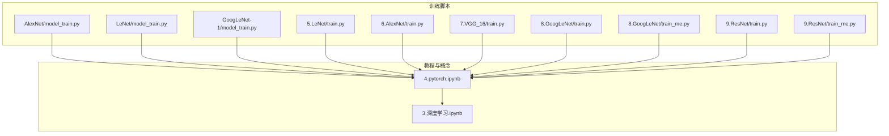
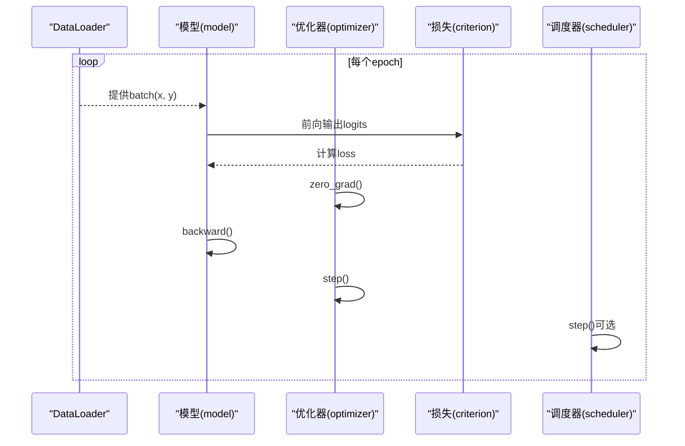
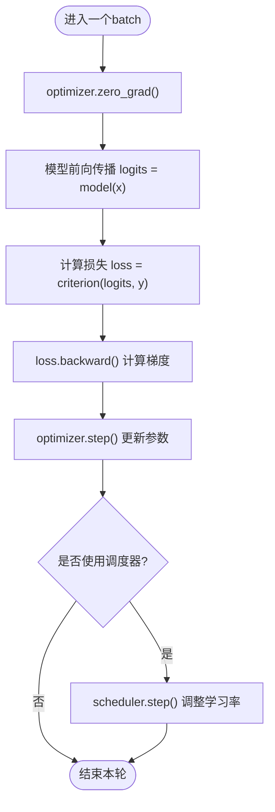
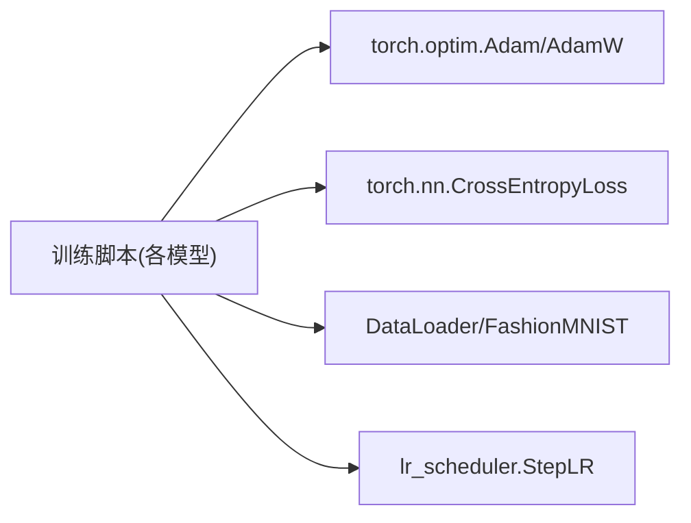

# 优化器配置

<cite>
**本文引用的文件列表**
- [AlexNet/model_train.py](file://study/上传课件、源码/源码/AlexNet/model_train.py)
- [LeNet/model_train.py](file://study/上传课件、源码/源码/LeNet/model_train.py)
- [GoogLeNet-1/model_train.py](file://study/上传课件、源码/源码/GoogLeNet-1/model_train.py)
- [5.LeNet/train.py](file://study/研究生学习/5.LeNet/train.py)
- [6.AlexNet/train.py](file://study/研究生学习/6.AlexNet/train.py)
- [7.VGG_16/train.py](file://study/研究生学习/7.VGG_16/train.py)
- [8.GoogLeNet/train.py](file://study/研究生学习/8.GoogLeNet/train.py)
- [8.GoogLeNet/train_me.py](file://study/研究生学习/8.GoogLeNet/train_me.py)
- [9.ResNet/train.py](file://study/研究生学习/9.ResNet/train.py)
- [9.ResNet/train_me.py](file://study/研究生学习/9.ResNet/train_me.py)
- [4.pytorch.ipynb](file://study/研究生学习/4.pytorch/4.pytorch.ipynb)
- [3.深度学习.ipynb](file://study/研究生学习/3.深度学习/3.深度学习.ipynb)
</cite>

## 目录
1. [简介](#简介)
2. [项目结构](#项目结构)
3. [核心组件](#核心组件)
4. [架构总览](#架构总览)
5. [详细组件分析](#详细组件分析)
6. [依赖关系分析](#依赖关系分析)
7. [性能与内存考量](#性能与内存考量)
8. [超参数调优指南](#超参数调优指南)
9. [故障排查](#故障排查)
10. [结论](#结论)

## 简介
本技术文档聚焦于“优化器配置模块”，围绕仓库中广泛使用的 Adam 优化器展开，系统阐述：
- 为什么选择 Adam 以及默认学习率 0.001 的原理与影响
- 模型参数获取方式 model.parameters() 的作用与注意事项
- 优化器初始化流程与训练循环中的标准更新顺序
- 不同优化器的适用场景与性能对比（SGD、Adam、RMSprop）
- 超参数调优策略（学习率衰减、动量、权重衰减正则化）
- 优化器状态管理与内存优化的最佳实践

## 项目结构
仓库包含多个网络示例的训练脚本，均使用 PyTorch 的优化器接口。优化器相关代码主要分布在以下位置：
- 各模型的训练入口：在训练函数中实例化优化器并执行 zero_grad/backward/step 的标准流程
- 教程笔记：对优化器选择、学习率调度器、训练流程进行说明

图表来源
- [AlexNet/model_train.py:35-100](file://study/上传课件、源码/源码/AlexNet/model_train.py#L35-L100)
- [LeNet/model_train.py:35-100](file://study/上传课件、源码/源码/LeNet/model_train.py#L35-L100)
- [GoogLeNet-1/model_train.py:35-100](file://study/上传课件、源码/源码/GoogLeNet-1/model_train.py#L35-L100)
- [5.LeNet/train.py:45-120](file://study/研究生学习/5.LeNet/train.py#L45-L120)
- [6.AlexNet/train.py:60-130](file://study/研究生学习/6.AlexNet/train.py#L60-L130)
- [7.VGG_16/train.py:30-80](file://study/研究生学习/7.VGG_16/train.py#L30-L80)
- [8.GoogLeNet/train.py:30-80](file://study/研究生学习/8.GoogLeNet/train.py#L30-L80)
- [8.GoogLeNet/train_me.py:40-110](file://study/研究生学习/8.GoogLeNet/train_me.py#L40-L110)
- [9.ResNet/train.py:30-80](file://study/研究生学习/9.ResNet/train.py#L30-L80)
- [9.ResNet/train_me.py:80-120](file://study/研究生学习/9.ResNet/train_me.py#L80-L120)
- [4.pytorch.ipynb:580-610](file://study/研究生学习/4.pytorch/4.pytorch.ipynb#L580-L610)
- [3.深度学习.ipynb:530-556](file://study/研究生学习/3.深度学习/3.深度学习.ipynb#L530-L556)

章节来源
- [AlexNet/model_train.py:35-100](file://study/上传课件、源码/源码/AlexNet/model_train.py#L35-L100)
- [LeNet/model_train.py:35-100](file://study/上传课件、源码/源码/LeNet/model_train.py#L35-L100)
- [GoogLeNet-1/model_train.py:35-100](file://study/上传课件、源码/源码/GoogLeNet-1/model_train.py#L35-L100)
- [5.LeNet/train.py:45-120](file://study/研究生学习/5.LeNet/train.py#L45-L120)
- [6.AlexNet/train.py:60-130](file://study/研究生学习/6.AlexNet/train.py#L60-L130)
- [7.VGG_16/train.py:30-80](file://study/研究生学习/7.VGG_16/train.py#L30-L80)
- [8.GoogLeNet/train.py:30-80](file://study/研究生学习/8.GoogLeNet/train.py#L30-L80)
- [8.GoogLeNet/train_me.py:40-110](file://study/研究生学习/8.GoogLeNet/train_me.py#L40-L110)
- [9.ResNet/train.py:30-80](file://study/研究生学习/9.ResNet/train.py#L30-L80)
- [9.ResNet/train_me.py:80-120](file://study/研究生学习/9.ResNet/train_me.py#L80-L120)
- [4.pytorch.ipynb:580-610](file://study/研究生学习/4.pytorch/4.pytorch.ipynb#L580-L610)
- [3.深度学习.ipynb:530-556](file://study/研究生学习/3.深度学习/3.深度学习.ipynb#L530-L556)

## 核心组件
- 优化器实例化：在各训练脚本中统一通过 torch.optim.Adam(model.parameters(), lr=0.001) 创建优化器，部分示例额外加入 weight_decay 以抑制过拟合
- 参数获取：model.parameters() 返回模型所有可学习参数的迭代器，供优化器跟踪与更新
- 训练循环标准顺序：zero_grad → forward → loss.backward → step → scheduler.step（若启用）
- 学习率调度：教程中展示 StepLR 等调度器用法，配合 optimizer 在每个 epoch 后调用 step 实现衰减

章节来源
- [AlexNet/model_train.py:38-40](file://study/上传课件、源码/源码/AlexNet/model_train.py#L38-L40)
- [LeNet/model_train.py:38-40](file://study/上传课件、源码/源码/LeNet/model_train.py#L38-L40)
- [GoogLeNet-1/model_train.py:40-42](file://study/上传课件、源码/源码/GoogLeNet-1/model_train.py#L40-L42)
- [5.LeNet/train.py:50-55](file://study/研究生学习/5.LeNet/train.py#L50-L55)
- [6.AlexNet/train.py:63-65](file://study/研究生学习/6.AlexNet/train.py#L63-L65)
- [7.VGG_16/train.py:35-40](file://study/研究生学习/7.VGG_16/train.py#L35-L40)
- [8.GoogLeNet/train.py:35-40](file://study/研究生学习/8.GoogLeNet/train.py#L35-L40)
- [8.GoogLeNet/train_me.py:48-52](file://study/研究生学习/8.GoogLeNet/train_me.py#L48-L52)
- [9.ResNet/train.py:35-40](file://study/研究生学习/9.ResNet/train.py#L35-L40)
- [9.ResNet/train_me.py:90-96](file://study/研究生学习/9.ResNet/train_me.py#L90-L96)
- [4.pytorch.ipynb:580-610](file://study/研究生学习/4.pytorch/4.pytorch.ipynb#L580-L610)

## 架构总览
下图展示了典型训练流程中优化器与模型、损失函数、数据加载器之间的交互关系，以及学习率调度器的介入点。

图表来源
- [4.pytorch.ipynb:580-610](file://study/研究生学习/4.pytorch/4.pytorch.ipynb#L580-L610)
- [6.AlexNet/train.py:104-130](file://study/研究生学习/6.AlexNet/train.py#L104-L130)
- [5.LeNet/train.py:93-114](file://study/研究生学习/5.LeNet/train.py#L93-L114)

## 详细组件分析

### Adam 优化器选择与学习率 0.001
- 选择原因：Adam 自适应学习率，收敛快，适合初始实验与复杂模型；仓库中多数训练脚本默认采用 Adam
- 学习率 0.001 的影响：作为经验值，通常能在大多数任务上取得稳定且较快的收敛；过大易震荡或发散，过小则收敛缓慢
- 仓库证据：多份训练脚本统一设置 lr=0.001，体现该值的通用性与稳定性

章节来源
- [AlexNet/model_train.py:38-40](file://study/上传课件、源码/源码/AlexNet/model_train.py#L38-L40)
- [LeNet/model_train.py:38-40](file://study/上传课件、源码/源码/LeNet/model_train.py#L38-L40)
- [GoogLeNet-1/model_train.py:40-42](file://study/上传课件、源码/源码/GoogLeNet-1/model_train.py#L40-L42)
- [5.LeNet/train.py:50-55](file://study/研究生学习/5.LeNet/train.py#L50-L55)
- [6.AlexNet/train.py:63-65](file://study/研究生学习/6.AlexNet/train.py#L63-L65)
- [7.VGG_16/train.py:35-40](file://study/研究生学习/7.VGG_16/train.py#L35-L40)
- [8.GoogLeNet/train.py:35-40](file://study/研究生学习/8.GoogLeNet/train.py#L35-L40)
- [8.GoogLeNet/train_me.py:48-52](file://study/研究生学习/8.GoogLeNet/train_me.py#L48-L52)
- [9.ResNet/train.py:35-40](file://study/研究生学习/9.ResNet/train.py#L35-L40)
- [9.ResNet/train_me.py:90-96](file://study/研究生学习/9.ResNet/train_me.py#L90-L96)
- [3.深度学习.ipynb:536-556](file://study/研究生学习/3.深度学习/3.深度学习.ipynb#L536-L556)

### 模型参数获取 model.parameters()
- 作用：返回模型所有可学习参数的迭代器，使优化器能够追踪并更新这些参数
- 注意：仅包含 requires_grad=True 的参数；冻结层不会参与优化
- 仓库证据：所有优化器初始化均以 model.parameters() 作为参数源

章节来源
- [AlexNet/model_train.py:38-40](file://study/上传课件、源码/源码/AlexNet/model_train.py#L38-L40)
- [LeNet/model_train.py:38-40](file://study/上传课件、源码/源码/LeNet/model_train.py#L38-L40)
- [GoogLeNet-1/model_train.py:40-42](file://study/上传课件、源码/源码/GoogLeNet-1/model_train.py#L40-L42)
- [5.LeNet/train.py:50-55](file://study/研究生学习/5.LeNet/train.py#L50-L55)
- [6.AlexNet/train.py:63-65](file://study/研究生学习/6.AlexNet/train.py#L63-L65)
- [7.VGG_16/train.py:35-40](file://study/研究生学习/7.VGG_16/train.py#L35-L40)
- [8.GoogLeNet/train.py:35-40](file://study/研究生学习/8.GoogLeNet/train.py#L35-L40)
- [8.GoogLeNet/train_me.py:48-52](file://study/研究生学习/8.GoogLeNet/train_me.py#L48-L52)
- [9.ResNet/train.py:35-40](file://study/研究生学习/9.ResNet/train.py#L35-L40)
- [9.ResNet/train_me.py:90-96](file://study/研究生学习/9.ResNet/train_me.py#L90-L96)

### 优化器初始化与训练循环
- 初始化：optimizer = torch.optim.Adam(model.parameters(), lr=0.001)
- 标准更新顺序：zero_grad → forward → loss.backward → step
- 调度器：StepLR 等按 epoch 调整学习率，scheduler.step() 通常在每轮结束后调用

图表来源
- [4.pytorch.ipynb:580-610](file://study/研究生学习/4.pytorch/4.pytorch.ipynb#L580-L610)
- [6.AlexNet/train.py:104-130](file://study/研究生学习/6.AlexNet/train.py#L104-L130)
- [5.LeNet/train.py:93-114](file://study/研究生学习/5.LeNet/train.py#L93-L114)

章节来源
- [4.pytorch.ipynb:580-610](file://study/研究生学习/4.pytorch/4.pytorch.ipynb#L580-L610)
- [6.AlexNet/train.py:104-130](file://study/研究生学习/6.AlexNet/train.py#L104-L130)
- [5.LeNet/train.py:93-114](file://study/研究生学习/5.LeNet/train.py#L93-L114)

### 不同优化器的适用场景与性能特点
- SGD：简单、泛化能力常较好，适合需要细致调参的任务
- SGD + Momentum：比普通 SGD 更稳定，常用于图像分类等常见任务
- Adam：自适应学习率，收敛快，适合初始实验、NLP、复杂模型
- RMSprop：对非平稳目标有效，常用于 RNN 等序列任务（仓库未直接实现，但教程有对比说明）

章节来源
- [3.深度学习.ipynb:546-556](file://study/研究生学习/3.深度学习/3.深度学习.ipynb#L546-L556)

### 超参数调优指南
- 学习率衰减策略
  - StepLR：每隔固定 epoch 乘以 gamma，便于后期稳定训练
  - CosineAnnealingLR：余弦曲线下降，适合较长训练周期
  - ReduceLROnPlateau：当验证指标不提升时降低学习率
- 动量参数设置
  - SGD 常用 momentum 加速收敛；Adam 内部已含一阶矩估计，无需额外设置
- 权重衰减正则化
  - 通过 weight_decay 抑制过拟合；仓库中 AlexNet 示例使用了 weight_decay=1e-4
  - AdamW 将权重衰减与参数更新解耦，常用于现代训练流程

章节来源
- [4.pytorch.ipynb:559-610](file://study/研究生学习/4.pytorch/4.pytorch.ipynb#L559-L610)
- [6.AlexNet/train.py:63-65](file://study/研究生学习/6.AlexNet/train.py#L63-L65)

### 优化器状态管理与内存优化最佳实践
- 梯度清零：每次反向传播前必须调用 optimizer.zero_grad()，避免梯度累积导致数值不稳定
- 评估模式：验证/推理时使用 model.eval() 与 with torch.no_grad()，减少显存占用并加速计算
- 梯度裁剪：复杂模型中可使用 clip_grad_norm_ 防止梯度爆炸
- 优化器状态保存与恢复：保存 best_model_wts 的同时，如需断点续训应一并保存 optimizer.state_dict()
- 内存优化要点
  - 使用 set_to_none=True 的 zero_grad 可减少中间张量分配
  - 合理设置 batch_size 与 num_workers，平衡吞吐与显存
  - 避免在验证阶段保留梯度图

章节来源
- [4.pytorch.ipynb:680-710](file://study/研究生学习/4.pytorch/4.pytorch.ipynb#L680-L710)
- [6.AlexNet/train.py:132-152](file://study/研究生学习/6.AlexNet/train.py#L132-L152)
- [5.LeNet/train.py:93-114](file://study/研究生学习/5.LeNet/train.py#L93-L114)

## 依赖关系分析
- 训练脚本普遍依赖 torch.optim 与 torch.nn 提供的优化器与损失函数
- 学习率调度器依赖 torch.optim.lr_scheduler
- 数据管道依赖 torchvision.datasets 与 torch.utils.data.DataLoader

图表来源
- [AlexNet/model_train.py:35-100](file://study/上传课件、源码/源码/AlexNet/model_train.py#L35-L100)
- [LeNet/model_train.py:35-100](file://study/上传课件、源码/源码/LeNet/model_train.py#L35-L100)
- [GoogLeNet-1/model_train.py:35-100](file://study/上传课件、源码/源码/GoogLeNet-1/model_train.py#L35-L100)
- [4.pytorch.ipynb:580-610](file://study/研究生学习/4.pytorch/4.pytorch.ipynb#L580-L610)

章节来源
- [AlexNet/model_train.py:35-100](file://study/上传课件、源码/源码/AlexNet/model_train.py#L35-L100)
- [LeNet/model_train.py:35-100](file://study/上传课件、源码/源码/LeNet/model_train.py#L35-L100)
- [GoogLeNet-1/model_train.py:35-100](file://study/上传课件、源码/源码/GoogLeNet-1/model_train.py#L35-L100)
- [4.pytorch.ipynb:580-610](file://study/研究生学习/4.pytorch/4.pytorch.ipynb#L580-L610)

## 性能与内存考量
- 学习率过大可能导致震荡甚至发散；过小则收敛缓慢
- Adam 的自适应特性使其对超参数相对鲁棒，但仍需结合调度器与正则化以获得更好泛化
- 使用 no_grad 上下文与 eval 模式可降低显存占用并提高推理速度
- 梯度裁剪有助于稳定训练，尤其在深层网络或大学习率下

章节来源
- [3.深度学习.ipynb:554-556](file://study/研究生学习/3.深度学习/3.深度学习.ipynb#L554-L556)
- [4.pytorch.ipynb:680-710](file://study/研究生学习/4.pytorch/4.pytorch.ipynb#L680-L710)
- [6.AlexNet/train.py:132-152](file://study/研究生学习/6.AlexNet/train.py#L132-L152)

## 超参数调优指南
- 学习率
  - 起始建议 1e-3；根据收敛情况微调
  - 结合 StepLR/CosineAnnealingLR/ReduceLROnPlateau 动态调整
- 动量
  - SGD 场景下设置 momentum 以平滑更新轨迹
  - Adam 场景下无需额外动量参数
- 权重衰减
  - 使用 weight_decay 抑制过拟合；AdamW 推荐用于现代训练流程
- 批大小与步数
  - 增大 batch_size 可提升稳定性，但需权衡显存与收敛行为
- 早停与检查点
  - 基于验证集指标保存最优模型，必要时恢复优化器状态继续训练

章节来源
- [4.pytorch.ipynb:559-610](file://study/研究生学习/4.pytorch/4.pytorch.ipynb#L559-L610)
- [6.AlexNet/train.py:63-65](file://study/研究生学习/6.AlexNet/train.py#L63-L65)

## 故障排查
- 训练不收敛或损失震荡
  - 检查学习率是否过大；尝试减小或使用调度器
  - 确认 zero_grad 是否在每步正确调用
- 显存不足
  - 使用 model.eval() 与 with torch.no_grad() 进行验证
  - 减小 batch_size 或开启梯度累积
- 梯度爆炸
  - 引入梯度裁剪 clip_grad_norm_
- 过拟合
  - 增加 weight_decay 或 Dropout；使用学习率衰减

章节来源
- [4.pytorch.ipynb:680-710](file://study/研究生学习/4.pytorch/4.pytorch.ipynb#L680-L710)
- [6.AlexNet/train.py:132-152](file://study/研究生学习/6.AlexNet/train.py#L132-L152)
- [5.LeNet/train.py:93-114](file://study/研究生学习/5.LeNet/train.py#L93-L114)

## 结论
仓库中广泛采用 Adam 优化器并以 lr=0.001 作为默认学习率，体现了其在多种任务上的稳健性与快速收敛优势。结合学习率调度器与权重衰减正则化，可在保证训练效率的同时提升泛化能力。遵循标准的训练循环与内存优化实践，有助于获得稳定高效的训练过程。对于追求更强泛化的场景，可考虑 SGD+Momentum 并进行更细致的超参数搜索。