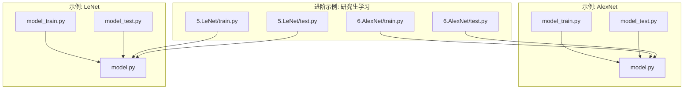
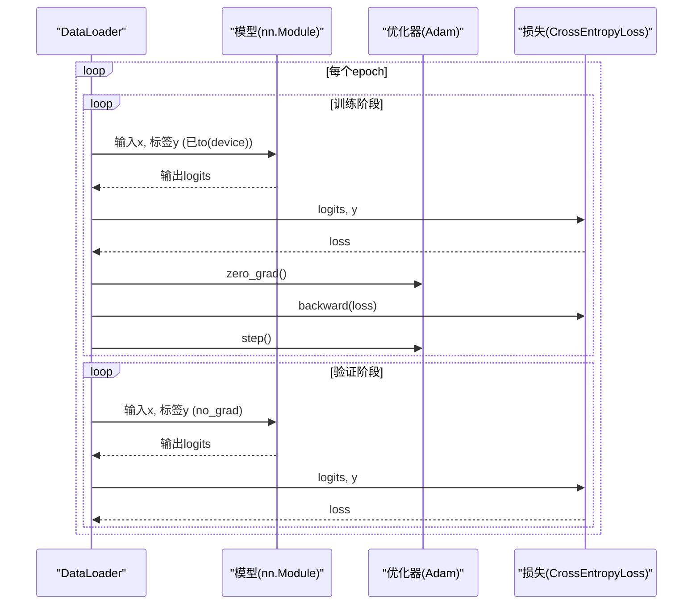
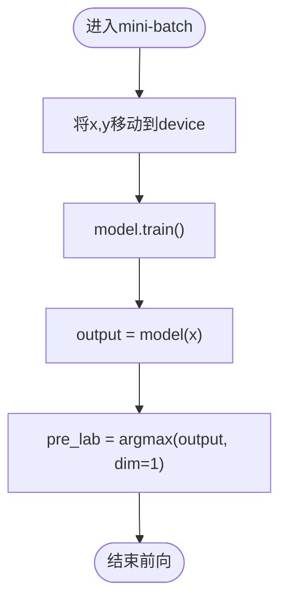
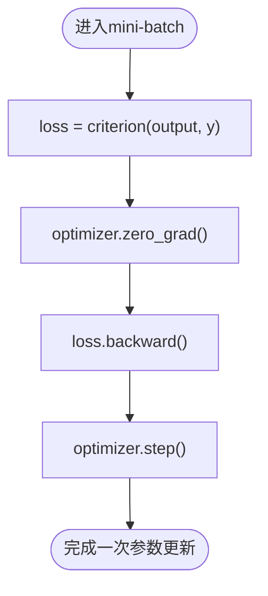
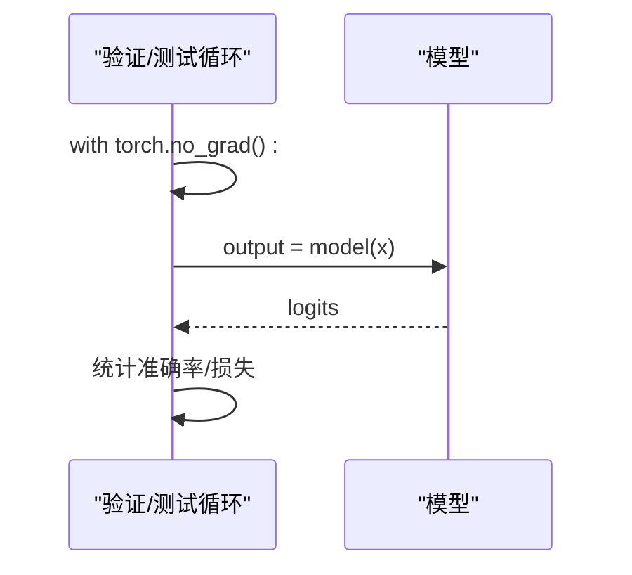
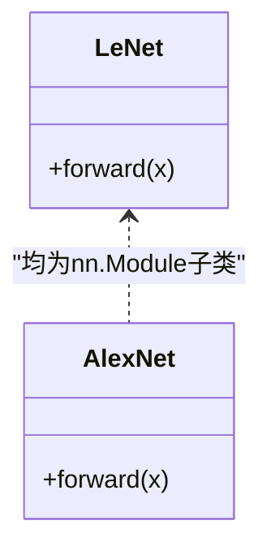
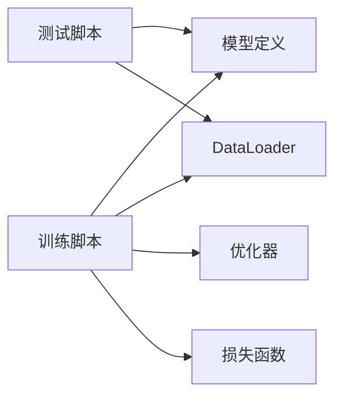

# 前向反向传播

<cite>
**本文引用的文件**   
- [AlexNet/model_train.py](file://study/上传课件、源码/源码/AlexNet/model_train.py)
- [AlexNet/model_test.py](file://study/上传课件、源码/源码/AlexNet/model_test.py)
- [LeNet/model_train.py](file://study/上传课件、源码/源码/LeNet/model_train.py)
- [LeNet/model_test.py](file://study/上传课件、源码/源码/LeNet/model_test.py)
- [研究生学习/6.AlexNet/train.py](file://study/研究生学习/6.AlexNet/train.py)
- [研究生学习/6.AlexNet/test.py](file://study/研究生学习/6.AlexNet/test.py)
- [研究生学习/5.LeNet/train.py](file://study/研究生学习/5.LeNet/train.py)
- [研究生学习/5.LeNet/test.py](file://study/研究生学习/5.LeNet/test.py)
- [AlexNet/model.py](file://study/上传课件、源码/源码/AlexNet/model.py)
- [LeNet/model.py](file://study/上传课件、源码/源码/LeNet/model.py)
</cite>

## 目录
1. [简介](#简介)
2. [项目结构](#项目结构)
3. [核心组件](#核心组件)
4. [架构总览](#架构总览)
5. [详细组件分析](#详细组件分析)
6. [依赖关系分析](#依赖关系分析)
7. [性能考量](#性能考量)
8. [故障排查指南](#故障排查指南)
9. [结论](#结论)
10. [附录](#附录)

## 简介
本技术文档聚焦于前向与反向传播模块的实现细节，围绕以下目标展开：
- 前向传播：数据设备转移、模型训练模式设置、输出计算的具体实现。
- 反向传播：梯度清零、损失计算、参数更新的完整流程。
- torch.no_grad() 上下文管理器在验证/测试阶段的作用与内存优化效果。
- 调试技巧：梯度检查、中间结果监控、计算图可视化方法。
- 常见错误处理与性能优化建议。

## 项目结构
仓库包含多个深度学习示例（LeNet、AlexNet 等），每个示例均提供训练与测试脚本，以及模型定义。训练脚本统一遵循“训练阶段 + 验证阶段”的循环范式；测试脚本则专注于推理评估。

图表来源
- [AlexNet/model_train.py:1-193](file://study/上传课件、源码/源码/AlexNet/model_train.py#L1-L193)
- [AlexNet/model_test.py:1-90](file://study/上传课件、源码/源码/AlexNet/model_test.py#L1-L90)
- [LeNet/model_train.py:1-191](file://study/上传课件、源码/源码/LeNet/model_train.py#L1-L191)
- [LeNet/model_test.py:1-65](file://study/上传课件、源码/源码/LeNet/model_test.py#L1-L65)
- [研究生学习/6.AlexNet/train.py:1-218](file://study/研究生学习/6.AlexNet/train.py#L1-L218)
- [研究生学习/6.AlexNet/test.py:1-99](file://study/研究生学习/6.AlexNet/test.py#L1-L99)
- [研究生学习/5.LeNet/train.py:1-202](file://study/研究生学习/5.LeNet/train.py#L1-L202)
- [研究生学习/5.LeNet/test.py:1-85](file://study/研究生学习/5.LeNet/test.py#L1-L85)

章节来源
- [AlexNet/model_train.py:1-193](file://study/上传课件、源码/源码/AlexNet/model_train.py#L1-L193)
- [LeNet/model_train.py:1-191](file://study/上传课件、源码/源码/LeNet/model_train.py#L1-L191)
- [研究生学习/6.AlexNet/train.py:1-218](file://study/研究生学习/6.AlexNet/train.py#L1-L218)
- [研究生学习/5.LeNet/train.py:1-202](file://study/研究生学习/5.LeNet/train.py#L1-L202)

## 核心组件
- 模型类：继承自 nn.Module，定义 forward 前向逻辑。
- 训练器：封装 epoch 循环、mini-batch 迭代、训练/验证两个阶段。
- 优化器与损失函数：Adam 优化器与交叉熵损失。
- 数据加载：DataLoader 提供批数据，支持多进程与 pin_memory。
- 推理器：测试脚本中仅进行前向计算，使用 no_grad 关闭梯度。

章节来源
- [AlexNet/model.py:1-52](file://study/上传课件、源码/源码/AlexNet/model.py#L1-L52)
- [LeNet/model.py:1-37](file://study/上传课件、源码/源码/LeNet/model.py#L1-L37)
- [AlexNet/model_train.py:35-165](file://study/上传课件、源码/源码/AlexNet/model_train.py#L35-L165)
- [LeNet/model_train.py:35-162](file://study/上传课件、源码/源码/LeNet/model_train.py#L35-L162)
- [研究生学习/6.AlexNet/train.py:60-189](file://study/研究生学习/6.AlexNet/train.py#L60-L189)
- [研究生学习/5.LeNet/train.py:50-178](file://study/研究生学习/5.LeNet/train.py#L50-L178)

## 架构总览
下图展示了典型训练流程中的关键步骤：数据到设备、模型前向、损失计算、梯度清零、反向传播、参数更新，以及验证阶段的无梯度推理。

图表来源
- [AlexNet/model_train.py:80-127](file://study/上传课件、源码/源码/AlexNet/model_train.py#L80-L127)
- [LeNet/model_train.py:80-127](file://study/上传课件、源码/源码/LeNet/model_train.py#L80-L127)
- [研究生学习/6.AlexNet/train.py:105-152](file://study/研究生学习/6.AlexNet/train.py#L105-L152)
- [研究生学习/5.LeNet/train.py:94-153](file://study/研究生学习/5.LeNet/train.py#L94-L153)

## 详细组件分析

### 前向传播过程
- 数据设备转移：在每个 mini-batch 开始时，将输入 x 和标签 y 转移到当前设备（CPU/GPU）。
- 模型训练模式设置：训练阶段调用 model.train()，确保 Dropout/BatchNorm 等层处于训练行为。
- 输出计算：通过 model(x) 执行前向传播，得到 logits；随后用 argmax 获取预测类别。

图表来源
- [AlexNet/model_train.py:80-93](file://study/上传课件、源码/源码/AlexNet/model_train.py#L80-L93)
- [LeNet/model_train.py:80-93](file://study/上传课件、源码/源码/LeNet/model_train.py#L80-L93)
- [研究生学习/6.AlexNet/train.py:105-118](file://study/研究生学习/6.AlexNet/train.py#L105-L118)
- [研究生学习/5.LeNet/train.py:94-107](file://study/研究生学习/5.LeNet/train.py#L94-L107)

章节来源
- [AlexNet/model_train.py:80-93](file://study/上传课件、源码/源码/AlexNet/model_train.py#L80-L93)
- [LeNet/model_train.py:80-93](file://study/上传课件、源码/源码/LeNet/model_train.py#L80-L93)
- [研究生学习/6.AlexNet/train.py:105-118](file://study/研究生学习/6.AlexNet/train.py#L105-L118)
- [研究生学习/5.LeNet/train.py:94-107](file://study/研究生学习/5.LeNet/train.py#L94-L107)

### 反向传播机制
- 梯度清零：optimizer.zero_grad() 在每次反向传播前清空历史梯度，避免累积。
- 损失计算：criterion(output, y) 计算当前 batch 的损失。
- 反向传播：loss.backward() 构建并填充计算图的梯度。
- 参数更新：optimizer.step() 依据梯度更新模型参数。

图表来源
- [AlexNet/model_train.py:93-100](file://study/上传课件、源码/源码/AlexNet/model_train.py#L93-L100)
- [LeNet/model_train.py:93-100](file://study/上传课件、源码/源码/LeNet/model_train.py#L93-L100)
- [研究生学习/6.AlexNet/train.py:118-125](file://study/研究生学习/6.AlexNet/train.py#L118-L125)
- [研究生学习/5.LeNet/train.py:107-114](file://study/研究生学习/5.LeNet/train.py#L107-L114)

章节来源
- [AlexNet/model_train.py:93-100](file://study/上传课件、源码/源码/AlexNet/model_train.py#L93-L100)
- [LeNet/model_train.py:93-100](file://study/上传课件、源码/源码/LeNet/model_train.py#L93-L100)
- [研究生学习/6.AlexNet/train.py:118-125](file://study/研究生学习/6.AlexNet/train.py#L118-L125)
- [研究生学习/5.LeNet/train.py:107-114](file://study/研究生学习/5.LeNet/train.py#L107-L114)

### torch.no_grad() 在验证/测试中的作用
- 作用：禁用梯度计算，从而不构建计算图，显著降低显存占用并提升速度。
- 使用位置：验证阶段与测试阶段的前向计算包裹在 with torch.no_grad(): 内。
- 效果：减少中间张量保存，避免不必要的反向传播开销。

图表来源
- [AlexNet/model_test.py:34-53](file://study/上传课件、源码/源码/AlexNet/model_test.py#L34-L53)
- [LeNet/model_test.py:34-53](file://study/上传课件、源码/源码/LeNet/model_test.py#L34-L53)
- [研究生学习/6.AlexNet/train.py:133-152](file://study/研究生学习/6.AlexNet/train.py#L133-L152)
- [研究生学习/6.AlexNet/test.py:40-59](file://study/研究生学习/6.AlexNet/test.py#L40-L59)
- [研究生学习/5.LeNet/train.py:131-153](file://study/研究生学习/5.LeNet/train.py#L131-L153)
- [研究生学习/5.LeNet/test.py:37-48](file://study/研究生学习/5.LeNet/test.py#L37-L48)

章节来源
- [AlexNet/model_test.py:34-53](file://study/上传课件、源码/源码/AlexNet/model_test.py#L34-L53)
- [LeNet/model_test.py:34-53](file://study/上传课件、源码/源码/LeNet/model_test.py#L34-L53)
- [研究生学习/6.AlexNet/train.py:133-152](file://study/研究生学习/6.AlexNet/train.py#L133-L152)
- [研究生学习/6.AlexNet/test.py:40-59](file://study/研究生学习/6.AlexNet/test.py#L40-L59)
- [研究生学习/5.LeNet/train.py:131-153](file://study/研究生学习/5.LeNet/train.py#L131-L153)
- [研究生学习/5.LeNet/test.py:37-48](file://study/研究生学习/5.LeNet/test.py#L37-L48)

### 模型类与前向逻辑
- LeNet：卷积+池化+全连接，forward 中依次执行各层。
- AlexNet：多层卷积+池化+Dropout+全连接，forward 中组合激活与正则化。

图表来源
- [LeNet/model.py:6-29](file://study/上传课件、源码/源码/LeNet/model.py#L6-L29)
- [AlexNet/model.py:7-41](file://study/上传课件、源码/源码/AlexNet/model.py#L7-L41)

章节来源
- [LeNet/model.py:6-29](file://study/上传课件、源码/源码/LeNet/model.py#L6-L29)
- [AlexNet/model.py:7-41](file://study/上传课件、源码/源码/AlexNet/model.py#L7-L41)

## 依赖关系分析
- 训练脚本依赖模型定义、数据加载、优化器与损失函数。
- 测试脚本依赖模型定义与 DataLoader。
- 不同示例间共享相同的训练/测试范式，便于迁移与复用。

图表来源
- [AlexNet/model_train.py:1-193](file://study/上传课件、源码/源码/AlexNet/model_train.py#L1-L193)
- [AlexNet/model_test.py:1-90](file://study/上传课件、源码/源码/AlexNet/model_test.py#L1-L90)
- [LeNet/model_train.py:1-191](file://study/上传课件、源码/源码/LeNet/model_train.py#L1-L191)
- [LeNet/model_test.py:1-65](file://study/上传课件、源码/源码/LeNet/model_test.py#L1-L65)
- [研究生学习/6.AlexNet/train.py:1-218](file://study/研究生学习/6.AlexNet/train.py#L1-L218)
- [研究生学习/6.AlexNet/test.py:1-99](file://study/研究生学习/6.AlexNet/test.py#L1-L99)
- [研究生学习/5.LeNet/train.py:1-202](file://study/研究生学习/5.LeNet/train.py#L1-L202)
- [研究生学习/5.LeNet/test.py:1-85](file://study/研究生学习/5.LeNet/test.py#L1-L85)

章节来源
- [AlexNet/model_train.py:1-193](file://study/上传课件、源码/源码/AlexNet/model_train.py#L1-L193)
- [LeNet/model_train.py:1-191](file://study/上传课件、源码/源码/LeNet/model_train.py#L1-L191)
- [研究生学习/6.AlexNet/train.py:1-218](file://study/研究生学习/6.AlexNet/train.py#L1-L218)
- [研究生学习/5.LeNet/train.py:1-202](file://study/研究生学习/5.LeNet/train.py#L1-L202)

## 性能考量
- 设备选择与数据移动：优先使用 GPU，并确保模型与数据在同一设备上。
- 批量大小与并行：增大 batch_size 可提升吞吐，但需考虑显存限制；num_workers 与 pin_memory 可加速数据加载。
- 权重衰减与正则化：在优化器中加入 weight_decay，或在模型中使用 Dropout，有助于缓解过拟合。
- 验证阶段关闭梯度：使用 torch.no_grad() 显著降低显存占用并提高速度。
- 最佳模型保存：基于验证集指标（准确率或损失）保存最优权重，避免过拟合。

章节来源
- [研究生学习/6.AlexNet/train.py:60-189](file://study/研究生学习/6.AlexNet/train.py#L60-L189)
- [研究生学习/5.LeNet/train.py:50-178](file://study/研究生学习/5.LeNet/train.py#L50-L178)
- [AlexNet/model_train.py:35-165](file://study/上传课件、源码/源码/AlexNet/model_train.py#L35-L165)
- [LeNet/model_train.py:35-162](file://study/上传课件、源码/源码/LeNet/model_train.py#L35-L162)

## 故障排查指南
- 忘记清空梯度：导致 loss 异常波动或持续上升。解决：每个 batch 前调用 optimizer.zero_grad()。
- 忘记 model.eval()：验证/推理时 BatchNorm/Dropout 行为不一致，结果不稳定。解决：验证/推理前调用 model.eval()。
- 验证时未关闭梯度：显存占用大、速度慢。解决：使用 with torch.no_grad()。
- 模型与数据不在同一设备：报 CPU/CUDA device mismatch。解决：同时使用 .to(device)。
- 标签类型错误：多分类标签应为 long 类型。解决：确保 y 为长整型。
- 学习率过大/过小：loss 不下降或震荡，或收敛缓慢。解决：调整 lr 或使用学习率调度器。
- 单样本维度缺失：形状不匹配。解决：对单样本增加 batch 维度。

章节来源
- [AlexNet/model_train.py:93-100](file://study/上传课件、源码/源码/AlexNet/model_train.py#L93-L100)
- [LeNet/model_train.py:93-100](file://study/上传课件、源码/源码/LeNet/model_train.py#L93-L100)
- [AlexNet/model_test.py:34-53](file://study/上传课件、源码/源码/AlexNet/model_test.py#L34-L53)
- [LeNet/model_test.py:34-53](file://study/上传课件、源码/源码/LeNet/model_test.py#L34-L53)
- [研究生学习/6.AlexNet/train.py:105-152](file://study/研究生学习/6.AlexNet/train.py#L105-L152)
- [研究生学习/5.LeNet/train.py:94-153](file://study/研究生学习/5.LeNet/train.py#L94-L153)

## 结论
本仓库的训练与测试脚本展现了 PyTorch 标准的前向/反向传播范式：数据到设备、模型前向、损失计算、梯度清零、反向传播、参数更新，以及验证/推理阶段的无梯度计算。通过合理配置设备、批量大小、优化器与正则化策略，并结合 torch.no_grad() 与 model.eval()，可在保证正确性的前提下显著提升训练与推理效率。

## 附录

### 调试技巧
- 梯度检查：打印部分参数的 grad 是否为 None，确认是否成功反向传播。
- 中间结果监控：记录关键层的输出范数或均值，定位数值不稳定问题。
- 计算图可视化：使用 tensorboardX 或 torchviz 可视化计算图，辅助理解复杂网络的数据流。

[本节为通用指导，不直接分析具体文件]