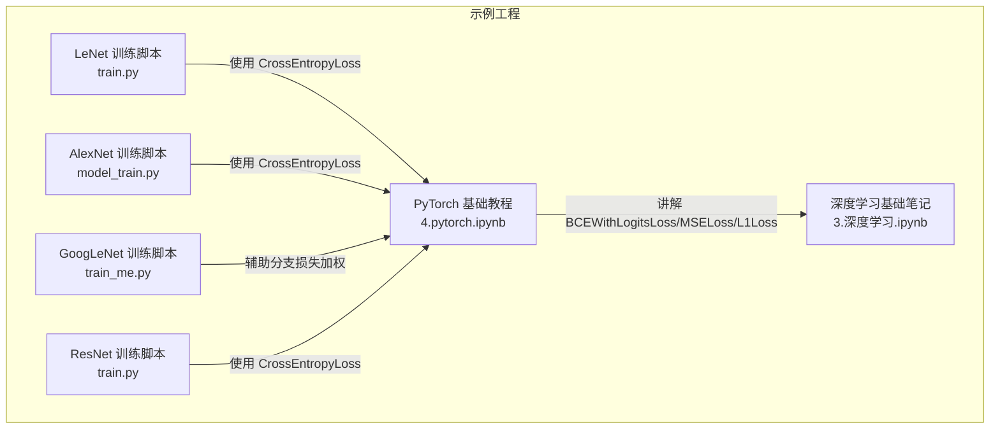
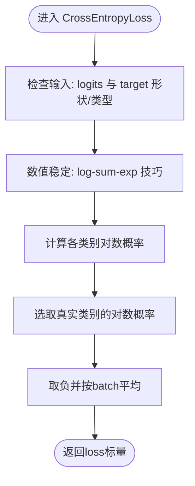
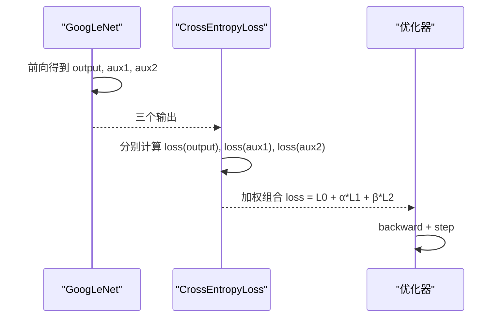
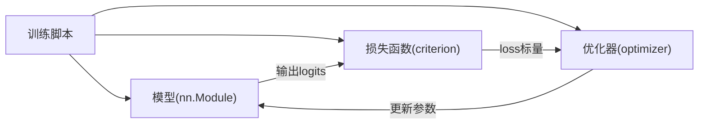

# 损失函数

<cite>
**本文引用的文件列表**
- [4.pytorch.ipynb](file://study/研究生学习/4.pytorch/4.pytorch.ipynb)
- [3.深度学习.ipynb](file://study/研究生学习/3.深度学习/3.深度学习.ipynb)
- [model_train.py（AlexNet）](file://study/上传课件、源码/源码/AlexNet/model_train.py)
- [model_train.py（LeNet）](file://study/上传课件、源码/源码/LeNet/model_train.py)
- [train.py（LeNet）](file://study/研究生学习/5.LeNet/train.py)
- [train.py（ResNet）](file://study/研究生学习/9.ResNet/train.py)
- [train_me.py（GoogLeNet）](file://study/研究生学习/8.GoogLeNet/train_me.py)
</cite>

## 目录
1. [引言](#引言)
2. [项目结构](#项目结构)
3. [核心组件](#核心组件)
4. [架构总览](#架构总览)
5. [详细组件分析](#详细组件分析)
6. [依赖关系分析](#依赖关系分析)
7. [性能与数值稳定性](#性能与数值稳定性)
8. [故障排查指南](#故障排查指南)
9. [结论](#结论)
10. [附录：损失函数选择指南](#附录损失函数选择指南)

## 引言
本技术文档聚焦于损失函数模块，围绕交叉熵损失函数（CrossEntropyLoss）的数学原理、在分类任务中的应用、计算过程与梯度传播机制进行深入解析；同时对比均方误差（MSE）、二元交叉熵（BCE/BCEWithLogitsLoss）等常用损失函数的适用场景，并给出多分类、二分类与回归任务的损失函数选择原则。文档还包含数值稳定性考虑以及梯度爆炸/消失问题的解决方案建议，帮助读者在实际工程中稳定高效地训练模型。

## 项目结构
仓库中包含多个经典网络（LeNet、AlexNet、VGG、GoogLeNet、ResNet）的训练脚本与模型定义，广泛使用 PyTorch 的损失函数进行训练。其中，交叉熵损失在多分类任务中被普遍采用，并在训练循环中配合反向传播完成参数更新。



图表来源
- [train.py（LeNet）:1-202](file://study/研究生学习/5.LeNet/train.py#L1-L202)
- [model_train.py（AlexNet）:1-193](file://study/上传课件、源码/源码/AlexNet/model_train.py#L1-L193)
- [train_me.py（GoogLeNet）:76-168](file://study/研究生学习/8.GoogLeNet/train_me.py#L76-L168)
- [train.py（ResNet）:74-195](file://study/研究生学习/9.ResNet/train.py#L74-L195)
- [4.pytorch.ipynb:535-608](file://study/研究生学习/4.pytorch/4.pytorch.ipynb#L535-L608)
- [3.深度学习.ipynb:349-389](file://study/研究生学习/3.深度学习/3.深度学习.ipynb#L349-L389)

章节来源
- [train.py（LeNet）:1-202](file://study/研究生学习/5.LeNet/train.py#L1-L202)
- [model_train.py（AlexNet）:1-193](file://study/上传课件、源码/源码/AlexNet/model_train.py#L1-L193)
- [train_me.py（GoogLeNet）:76-168](file://study/研究生学习/8.GoogLeNet/train_me.py#L76-L168)
- [train.py（ResNet）:74-195](file://study/研究生学习/9.ResNet/train.py#L74-L195)
- [4.pytorch.ipynb:535-608](file://study/研究生学习/4.pytorch/4.pytorch.ipynb#L535-L608)
- [3.深度学习.ipynb:349-389](file://study/研究生学习/3.深度学习/3.深度学习.ipynb#L349-L389)

## 核心组件
- 交叉熵损失（CrossEntropyLoss）
  - 输入：原始 logits（未归一化的得分），形状通常为 [batch_size, num_classes]；标签为类别索引（long 类型）。
  - 内部实现：将 softmax 与负对数似然合并为一个数值稳定的操作，避免单独 softmax 导致的溢出风险。
  - 输出：标量损失值（按 batch 平均或可配置求和）。
- 二元交叉熵（BCEWithLogitsLoss）
  - 输入：每个样本每类的原始 logits；标签为浮点概率或 0/1 硬标签。
  - 特点：内部包含 sigmoid，数值更稳定，适合二分类或多标签分类。
- 均方误差（MSELoss）
  - 输入：连续目标值；常用于回归任务。
- L1 损失（L1Loss）
  - 输入：连续目标值；对异常值相对不敏感，鲁棒性更强。

章节来源
- [4.pytorch.ipynb:535-608](file://study/研究生学习/4.pytorch/4.pytorch.ipynb#L535-L608)
- [4.pytorch.ipynb:805-811](file://study/研究生学习/4.pytorch/4.pytorch.ipynb#L805-L811)
- [3.深度学习.ipynb:349-389](file://study/研究生学习/3.深度学习/3.深度学习.ipynb#L349-L389)

## 架构总览
下图展示了一个典型的多分类训练流程，包括数据加载、前向传播、损失计算、反向传播与参数更新。该流程在多个训练脚本中一致出现，体现了统一的训练范式。

```mermaid
sequenceDiagram
participant DL as "DataLoader"
participant Model as "模型(输出logits)"
participant Loss as "损失函数(CrossEntropyLoss)"
participant Opt as "优化器(Adam/AdamW)"
participant Dev as "设备(CPU/GPU)"
DL->>Model : 提供(batch_x, batch_y)到设备
Model->>Model : 前向传播得到logits
Model-->>DL : logits
DL->>Loss : 传入(logits, target)
Loss-->>DL : 返回loss标量
DL->>Opt : zero_grad()
DL->>Opt : loss.backward()
Opt->>Opt : step()
Opt-->>DL : 更新后的参数
```

图表来源
- [train.py（LeNet）:94-114](file://study/研究生学习/5.LeNet/train.py#L94-L114)
- [model_train.py（AlexNet）:80-100](file://study/上传课件、源码/源码/AlexNet/model_train.py#L80-L100)
- [train.py（ResNet）:81-101](file://study/研究生学习/9.ResNet/train.py#L81-L101)
- [train_me.py（GoogLeNet）:93-113](file://study/研究生学习/8.GoogLeNet/train_me.py#L93-L113)

## 详细组件分析

### 交叉熵损失（CrossEntropyLoss）
- 数学原理
  - 对于单样本，设真实类别为 k，模型输出的 logits 为 z_1,...,z_K。
  - 交叉熵等价于负对数似然：-log(exp(z_k)/Σ_j exp(z_j))。
  - 实际实现通常先做 log-sum-exp 技巧以增强数值稳定性，再取负号与均值。
- 在分类任务中的应用
  - 多分类：最后一层线性输出 logits，标签为类别编号（long）。
  - 二分类：可用 CrossEntropyLoss（两路 logits）或 BCEWithLogitsLoss（单路 logits + sigmoid）。
- 计算过程与梯度传播
  - 前向：logits → 内部 softmax+log → 按真实类取对数概率 → 取负并平均。
  - 反向：根据链式法则，梯度从 loss 回传到 logits，再经线性层权重/偏置回传至所有参数。
- 常见注意事项
  - 不要在前向中手动加 Softmax；CrossEntropyLoss 已内置处理。
  - 标签需为 long 类型的类别索引。
  - 评估时如需概率，可在推理阶段对 logits 做 softmax。



图表来源
- [4.pytorch.ipynb:535-608](file://study/研究生学习/4.pytorch/4.pytorch.ipynb#L535-L608)
- [4.pytorch.ipynb:805-811](file://study/研究生学习/4.pytorch/4.pytorch.ipynb#L805-L811)

章节来源
- [4.pytorch.ipynb:535-608](file://study/研究生学习/4.pytorch/4.pytorch.ipynb#L535-L608)
- [4.pytorch.ipynb:805-811](file://study/研究生学习/4.pytorch/4.pytorch.ipynb#L805-L811)
- [train.py（LeNet）:94-114](file://study/研究生学习/5.LeNet/train.py#L94-L114)
- [model_train.py（AlexNet）:80-100](file://study/上传课件、源码/源码/AlexNet/model_train.py#L80-L100)
- [train.py（ResNet）:81-101](file://study/研究生学习/9.ResNet/train.py#L81-L101)
- [train_me.py（GoogLeNet）:93-113](file://study/研究生学习/8.GoogLeNet/train_me.py#L93-L113)

### 二元交叉熵（BCEWithLogitsLoss）
- 适用场景
  - 二分类：单路输出 logits，标签为 0/1 或软标签。
  - 多标签分类：每类独立预测，标签为多 hot 向量。
- 数值稳定性
  - 内部融合 sigmoid 与对数，避免单独 sigmoid 后取 log 的数值不稳定问题。
- 与 CrossEntropyLoss 的关系
  - 二分类时，两者等价但接口不同：前者单路 logits，后者双路 logits。

章节来源
- [4.pytorch.ipynb:535-608](file://study/研究生学习/4.pytorch/4.pytorch.ipynb#L535-L608)

### 均方误差（MSELoss）与 L1 损失（L1Loss）
- MSELoss
  - 适用于回归任务，对大误差惩罚更重，易受异常值影响。
- L1Loss
  - 适用于回归任务，对异常值更鲁棒，梯度恒定，收敛路径可能更“折线”。

章节来源
- [4.pytorch.ipynb:535-608](file://study/研究生学习/4.pytorch/4.pytorch.ipynb#L535-L608)

### GoogLeNet 辅助分支损失加权
- 在 GoogLeNet 训练中，主分支与两个辅助分支的损失被加权组合，有助于缓解深层网络的梯度消失问题，提升训练稳定性。



图表来源
- [train_me.py（GoogLeNet）:102-113](file://study/研究生学习/8.GoogLeNet/train_me.py#L102-L113)

章节来源
- [train_me.py（GoogLeNet）:102-113](file://study/研究生学习/8.GoogLeNet/train_me.py#L102-L113)

## 依赖关系分析
- 训练脚本依赖模型输出 logits，并将 logits 与标签送入损失函数。
- 损失函数通过 autograd 自动构建计算图，反向传播生成梯度，优化器据此更新参数。
- 多个训练脚本遵循统一范式：zero_grad → forward → criterion → backward → step。



图表来源
- [train.py（LeNet）:94-114](file://study/研究生学习/5.LeNet/train.py#L94-L114)
- [model_train.py（AlexNet）:80-100](file://study/上传课件、源码/源码/AlexNet/model_train.py#L80-L100)
- [train.py（ResNet）:81-101](file://study/研究生学习/9.ResNet/train.py#L81-L101)
- [train_me.py（GoogLeNet）:93-113](file://study/研究生学习/8.GoogLeNet/train_me.py#L93-L113)

章节来源
- [train.py（LeNet）:94-114](file://study/研究生学习/5.LeNet/train.py#L94-L114)
- [model_train.py（AlexNet）:80-100](file://study/上传课件、源码/源码/AlexNet/model_train.py#L80-L100)
- [train.py（ResNet）:81-101](file://study/研究生学习/9.ResNet/train.py#L81-L101)
- [train_me.py（GoogLeNet）:93-113](file://study/研究生学习/8.GoogLeNet/train_me.py#L93-L113)

## 性能与数值稳定性
- 数值稳定性
  - CrossEntropyLoss 内部使用 log-sum-exp 技巧，避免单独 softmax 与 log 带来的溢出/下溢。
  - BCEWithLogitsLoss 内部融合 sigmoid 与对数，提高二分类/多标签训练的稳定性。
- 梯度爆炸/消失
  - 合理初始化权重（如 Kaiming/Xavier）有助于缓解梯度问题。
  - 使用 BatchNorm、Dropout 等正则化手段稳定训练。
  - 在 GoogLeNet 中使用辅助分支损失加权，有助于深层网络梯度流动。
- 学习率与优化器
  - Adam/AdamW 自适应学习率，常作为默认选择；必要时结合学习率调度策略（StepLR、CosineAnnealing、ReduceLROnPlateau）。
- 训练/评估模式
  - 训练时使用 model.train()，评估时使用 model.eval() 与 torch.no_grad()，确保 Dropout/BatchNorm 行为正确且节省内存。

章节来源
- [4.pytorch.ipynb:535-608](file://study/研究生学习/4.pytorch/4.pytorch.ipynb#L535-L608)
- [4.pytorch.ipynb:698-738](file://study/研究生学习/4.pytorch/4.pytorch.ipynb#L698-L738)
- [train_me.py（GoogLeNet）:102-113](file://study/研究生学习/8.GoogLeNet/train_me.py#L102-L113)
- [3.深度学习.ipynb:349-389](file://study/研究生学习/3.深度学习/3.深度学习.ipynb#L349-L389)

## 故障排查指南
- 常见问题与定位
  - 训练前手动 Softmax：导致 CrossEntropyLoss 效果异常。应直接传入 logits。
  - 标签类型错误：CrossEntropyLoss 需要 long 类型类别索引。
  - 损失震荡或发散：学习率过大，适当降低学习率或使用调度器。
  - 损失下降很慢：学习率过小，适当提高学习率。
  - 前期下降后期停滞：固定学习率不合适，引入学习率衰减策略。
- 调试建议
  - 打印/记录每个 epoch 的训练与验证损失、准确率，观察曲线是否合理。
  - 在评估阶段使用 model.eval() 与 torch.no_grad()，避免不必要的梯度计算。
  - 若出现 NaN/Inf，检查输入范围、学习率、数值稳定性相关设置。

章节来源
- [4.pytorch.ipynb:1037-1050](file://study/研究生学习/4.pytorch/4.pytorch.ipynb#L1037-L1050)
- [3.深度学习.ipynb:904-918](file://study/研究生学习/3.深度学习/3.深度学习.ipynb#L904-L918)
- [train.py（LeNet）:130-157](file://study/研究生学习/5.LeNet/train.py#L130-L157)
- [model_train.py（AlexNet）:107-141](file://study/上传课件、源码/源码/AlexNet/model_train.py#L107-L141)

## 结论
- 交叉熵损失是多分类任务的首选，具备数值稳定性与良好的梯度特性。
- 二分类/多标签任务推荐使用 BCEWithLogitsLoss，避免手动 sigmoid 带来的数值问题。
- 回归任务优先选择 MSELoss 或 L1Loss，依据对异常值的敏感度与鲁棒性需求进行选择。
- 训练过程中应关注数值稳定性、梯度爆炸/消失问题，并结合合适的优化器与学习率调度策略。
- 在复杂网络（如 GoogLeNet）中，辅助分支损失加权可有效改善深层网络的训练稳定性。

## 附录：损失函数选择指南
- 多分类任务
  - 首选：CrossEntropyLoss（输入 logits，标签为类别索引）。
- 二分类任务
  - 首选：BCEWithLogitsLoss（输入单路 logits，标签为 0/1 或软标签）。
  - 备选：CrossEntropyLoss（双路 logits，标签为 0/1 类别索引）。
- 多标签分类任务
  - 首选：BCEWithLogitsLoss（每类独立预测）。
- 回归任务
  - 首选：MSELoss（对大误差敏感，平滑梯度）。
  - 备选：L1Loss（对异常值更鲁棒，梯度恒定）。
- 其他考量
  - 数值稳定性：优先使用框架内融合的损失（如 CrossEntropyLoss、BCEWithLogitsLoss）。
  - 训练稳定性：结合 BatchNorm、Dropout、权重初始化与学习率调度。
  - 监控指标：记录训练/验证损失与准确率，及时发现问题并调整超参。

章节来源
- [4.pytorch.ipynb:535-608](file://study/研究生学习/4.pytorch/4.pytorch.ipynb#L535-L608)
- [4.pytorch.ipynb:805-811](file://study/研究生学习/4.pytorch/4.pytorch.ipynb#L805-L811)
- [3.深度学习.ipynb:349-389](file://study/研究生学习/3.深度学习/3.深度学习.ipynb#L349-L389)