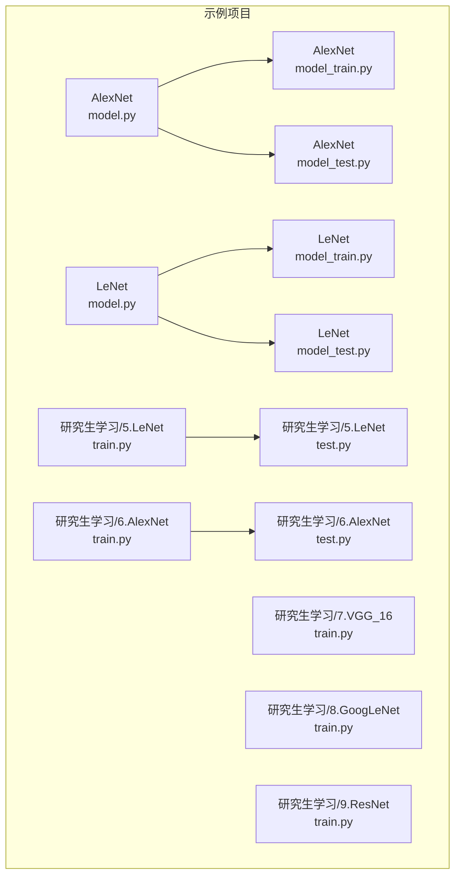
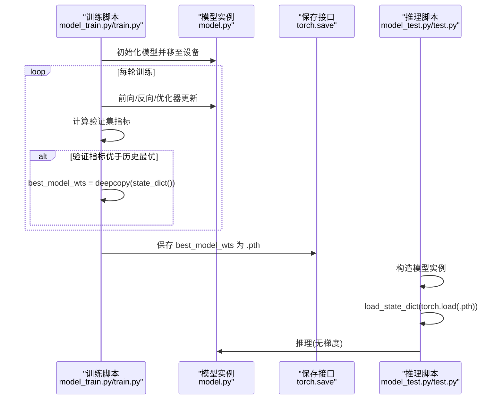
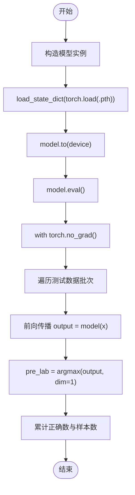
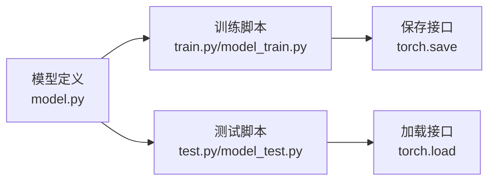

# 模型保存

<cite>
**本文引用的文件列表**
- [AlexNet/model.py](file://study/上传课件、源码/源码/AlexNet/model.py)
- [AlexNet/model_train.py](file://study/上传课件、源码/源码/AlexNet/model_train.py)
- [AlexNet/model_test.py](file://study/上传课件、源码/源码/AlexNet/model_test.py)
- [LeNet/model.py](file://study/上传课件、源码/源码/LeNet/model.py)
- [LeNet/model_train.py](file://study/上传课件、源码/源码/LeNet/model_train.py)
- [LeNet/model_test.py](file://study/上传课件、源码/源码/LeNet/model_test.py)
- [研究生学习/5.LeNet/train.py](file://study/研究生学习/5.LeNet/train.py)
- [研究生学习/5.LeNet/test.py](file://study/研究生学习/5.LeNet/test.py)
- [研究生学习/6.AlexNet/train.py](file://study/研究生学习/6.AlexNet/train.py)
- [研究生学习/6.AlexNet/test.py](file://study/研究生学习/6.AlexNet/test.py)
- [研究生学习/7.VGG_16/train.py](file://study/研究生学习/7.VGG_16/train.py)
- [研究生学习/8.GoogLeNet/train.py](file://study/研究生学习/8.GoogLeNet/train.py)
- [研究生学习/9.ResNet/train.py](file://study/研究生学习/9.ResNet/train.py)
</cite>

## 目录
1. [简介](#简介)
2. [项目结构](#项目结构)
3. [核心组件](#核心组件)
4. [架构总览](#架构总览)
5. [详细组件分析](#详细组件分析)
6. [依赖关系分析](#依赖关系分析)
7. [性能与存储特性](#性能与存储特性)
8. [故障排查指南](#故障排查指南)
9. [结论](#结论)
10. [附录：最佳实践清单](#附录最佳实践清单)

## 简介
本技术文档聚焦于仓库中的“模型保存”模块，围绕以下目标展开：
- 深入解释最佳模型权重保存机制，包括使用 copy.deepcopy() 的原因以及 state_dict() 的序列化格式。
- 详细说明模型文件保存路径配置与文件格式（.pth）。
- 记录模型加载与推理的实现方法，包括设备匹配与权重恢复。
- 提供模型版本管理与实验追踪的最佳实践。
- 包含模型压缩、量化与部署相关的技术要点。

## 项目结构
仓库中多个网络（LeNet、AlexNet、VGG16、GoogLeNet、ResNet）均实现了统一的训练-验证-保存-测试流程。每个子项目通常包含：
- model.py：定义网络结构（继承 nn.Module），并提供前向传播逻辑。
- train.py / model_train.py：训练循环、验证指标统计、最优权重选择与保存。
- test.py / model_test.py：加载已保存权重并执行推理或评估。

图表来源
- [AlexNet/model.py:1-52](file://study/上传课件、源码/源码/AlexNet/model.py#L1-L52)
- [AlexNet/model_train.py:1-193](file://study/上传课件、源码/源码/AlexNet/model_train.py#L1-L193)
- [AlexNet/model_test.py:1-90](file://study/上传课件、源码/源码/AlexNet/model_test.py#L1-L90)
- [LeNet/model.py:1-37](file://study/上传课件、源码/源码/LeNet/model.py#L1-L37)
- [LeNet/model_train.py:1-191](file://study/上传课件、源码/源码/LeNet/model_train.py#L1-L191)
- [LeNet/model_test.py:1-65](file://study/上传课件、源码/源码/LeNet/model_test.py#L1-L65)
- [研究生学习/5.LeNet/train.py:1-202](file://study/研究生学习/5.LeNet/train.py#L1-L202)
- [研究生学习/5.LeNet/test.py:1-85](file://study/研究生学习/5.LeNet/test.py#L1-L85)
- [研究生学习/6.AlexNet/train.py:1-218](file://study/研究生学习/6.AlexNet/train.py#L1-L218)
- [研究生学习/6.AlexNet/test.py:1-99](file://study/研究生学习/6.AlexNet/test.py#L1-L99)
- [研究生学习/7.VGG_16/train.py:1-195](file://study/研究生学习/7.VGG_16/train.py#L1-L195)
- [研究生学习/8.GoogLeNet/train.py:1-206](file://study/研究生学习/8.GoogLeNet/train.py#L1-L206)
- [研究生学习/9.ResNet/train.py:1-206](file://study/研究生学习/9.ResNet/train.py#L1-L206)

章节来源
- [AlexNet/model.py:1-52](file://study/上传课件、源码/源码/AlexNet/model.py#L1-L52)
- [AlexNet/model_train.py:1-193](file://study/上传课件、源码/源码/AlexNet/model_train.py#L1-L193)
- [AlexNet/model_test.py:1-90](file://study/上传课件、源码/源码/AlexNet/model_test.py#L1-L90)
- [LeNet/model.py:1-37](file://study/上传课件、源码/源码/LeNet/model.py#L1-L37)
- [LeNet/model_train.py:1-191](file://study/上传课件、源码/源码/LeNet/model_train.py#L1-L191)
- [LeNet/model_test.py:1-65](file://study/上传课件、源码/源码/LeNet/model_test.py#L1-L65)
- [研究生学习/5.LeNet/train.py:1-202](file://study/研究生学习/5.LeNet/train.py#L1-L202)
- [研究生学习/5.LeNet/test.py:1-85](file://study/研究生学习/5.LeNet/test.py#L1-L85)
- [研究生学习/6.AlexNet/train.py:1-218](file://study/研究生学习/6.AlexNet/train.py#L1-L218)
- [研究生学习/6.AlexNet/test.py:1-99](file://study/研究生学习/6.AlexNet/test.py#L1-L99)
- [研究生学习/7.VGG_16/train.py:1-195](file://study/研究生学习/7.VGG_16/train.py#L1-L195)
- [研究生学习/8.GoogLeNet/train.py:1-206](file://study/研究生学习/8.GoogLeNet/train.py#L1-L206)
- [研究生学习/9.ResNet/train.py:1-206](file://study/研究生学习/9.ResNet/train.py#L1-L206)

## 核心组件
- 模型定义（nn.Module）：各网络在 model.py 中实现，仅包含参数与前向计算，不包含训练/保存逻辑，便于复用与独立测试。
- 训练与保存：在 train.py / model_train.py 中完成数据加载、优化器更新、验证指标统计、最优权重选择与持久化。
- 测试与推理：在 test.py / model_test.py 中加载 .pth 权重，进行无梯度推理与准确率统计。

关键实现要点（以 AlexNet 为例）：
- 使用 copy.deepcopy(model.state_dict()) 保存当前最优权重快照，避免后续训练覆盖。
- 使用 torch.save(best_model_wts, path) 将字典序列化为 .pth 文件。
- 推理时通过 model.load_state_dict(torch.load(path)) 恢复权重，并将模型移动到目标设备。

章节来源
- [AlexNet/model.py:1-52](file://study/上传课件、源码/源码/AlexNet/model.py#L1-L52)
- [AlexNet/model_train.py:44-157](file://study/上传课件、源码/源码/AlexNet/model_train.py#L44-L157)
- [AlexNet/model_test.py:56-68](file://study/上传课件、源码/源码/AlexNet/model_test.py#L56-L68)

## 架构总览
下图展示了从训练到保存再到推理的整体流程，映射到具体代码位置。

图表来源
- [AlexNet/model_train.py:44-157](file://study/上传课件、源码/源码/AlexNet/model_train.py#L44-L157)
- [AlexNet/model_test.py:56-68](file://study/上传课件、源码/源码/AlexNet/model_test.py#L56-L68)
- [研究生学习/5.LeNet/train.py:59-170](file://study/研究生学习/5.LeNet/train.py#L59-L170)
- [研究生学习/5.LeNet/test.py:51-74](file://study/研究生学习/5.LeNet/test.py#L51-L74)

## 详细组件分析

### 最佳权重保存机制
- 为什么使用 copy.deepcopy()
  - state_dict() 返回的是对当前模型参数的引用视图集合；若直接赋值给变量，后续训练会改变该变量的内容。使用 deepcopy 可创建独立的副本，确保“历史最优权重”不被覆盖。
  - 参考实现：在多个训练脚本中，当验证指标提升时，执行 best_model_wts = copy.deepcopy(model.state_dict())。
- state_dict() 的序列化格式
  - 保存内容为 Python 字典，键为层名（如卷积核权重、偏置等），值为对应张量。
  - 使用 torch.save() 将字典写入 .pth 文件，便于跨进程/跨机器加载。
- 保存时机与策略
  - 基于验证集准确率最高或验证损失最低的策略进行保存。不同项目采用不同指标（准确率或损失），但逻辑一致。
- 保存后恢复
  - 训练结束后，部分脚本会先调用 model.load_state_dict(best_model_wts) 将内存中的模型恢复到最优权重，再保存，保证磁盘与内存一致。

章节来源
- [AlexNet/model_train.py:44-157](file://study/上传课件、源码/源码/AlexNet/model_train.py#L44-L157)
- [LeNet/model_train.py:44-155](file://study/上传课件、源码/源码/LeNet/model_train.py#L44-L155)
- [研究生学习/5.LeNet/train.py:59-170](file://study/研究生学习/5.LeNet/train.py#L59-L170)
- [研究生学习/6.AlexNet/train.py:69-181](file://study/研究生学习/6.AlexNet/train.py#L69-L181)
- [研究生学习/7.VGG_16/train.py:44-159](file://study/研究生学习/7.VGG_16/train.py#L44-L159)
- [研究生学习/8.GoogLeNet/train.py:44-160](file://study/研究生学习/8.GoogLeNet/train.py#L44-L160)
- [研究生学习/9.ResNet/train.py:44-160](file://study/研究生学习/9.ResNet/train.py#L44-L160)

### 模型文件保存路径配置与文件格式
- 路径配置方式
  - 硬编码绝对路径：例如 Windows 桌面路径，不利于跨平台迁移。
  - 相对路径与 Path 对象：使用 pathlib.Path 拼接 BASE_DIR 与文件名，提高可移植性。
  - os.path 拼接：在一些项目中通过 os.path.dirname(os.path.abspath(__file__)) 获取脚本所在目录，再拼接文件名。
- 文件格式
  - 统一使用 .pth 后缀，表示 PyTorch 序列化文件。
  - 常见命名：best_model.pth，用于存放最优权重。
- 推荐做法
  - 使用 Path 对象集中管理路径常量，避免硬编码。
  - 在训练开始前检查并创建输出目录，避免 IO 错误。

章节来源
- [AlexNet/model_train.py:153-157](file://study/上传课件、源码/源码/AlexNet/model_train.py#L153-L157)
- [LeNet/model_train.py:153-155](file://study/上传课件、源码/源码/LeNet/model_train.py#L153-L155)
- [研究生学习/5.LeNet/train.py:20-22](file://study/研究生学习/5.LeNet/train.py#L20-L22)
- [研究生学习/5.LeNet/test.py:12-14](file://study/研究生学习/5.LeNet/test.py#L12-L14)
- [研究生学习/6.AlexNet/train.py:16-18](file://study/研究生学习/6.AlexNet/train.py#L16-L18)
- [研究生学习/6.AlexNet/test.py:10-12](file://study/研究生学习/6.AlexNet/test.py#L10-L12)
- [研究生学习/7.VGG_16/train.py:156-158](file://study/研究生学习/7.VGG_16/train.py#L156-L158)
- [研究生学习/8.GoogLeNet/train.py:157-159](file://study/研究生学习/8.GoogLeNet/train.py#L157-L159)
- [研究生学习/9.ResNet/train.py:157-159](file://study/研究生学习/9.ResNet/train.py#L157-L159)

### 模型加载与推理实现（设备匹配与权重恢复）
- 加载权重
  - 使用 torch.load(path) 读取 .pth 文件，得到 state_dict 字典。
  - 通过 model.load_state_dict(...) 将权重恢复到模型实例。
- 设备匹配
  - 推理前需将模型移动到目标设备（CPU/GPU），并使用 with torch.no_grad(): 禁用梯度计算以提升效率。
  - 部分脚本在加载权重后再移动至设备，顺序不影响结果，但建议保持一致。
- 推理流程
  - 设置 model.eval()，关闭 Dropout/BatchNorm 的训练模式行为。
  - 遍历 DataLoader，逐批前向计算，取 argmax 作为预测类别，统计准确率。

图表来源
- [AlexNet/model_test.py:56-68](file://study/上传课件、源码/源码/AlexNet/model_test.py#L56-L68)
- [LeNet/model_test.py:58-65](file://study/上传课件、源码/源码/LeNet/model_test.py#L58-L65)
- [研究生学习/5.LeNet/test.py:51-74](file://study/研究生学习/5.LeNet/test.py#L51-L74)
- [研究生学习/6.AlexNet/test.py:62-89](file://study/研究生学习/6.AlexNet/test.py#L62-L89)

章节来源
- [AlexNet/model_test.py:56-68](file://study/上传课件、源码/源码/AlexNet/model_test.py#L56-L68)
- [LeNet/model_test.py:58-65](file://study/上传课件、源码/源码/LeNet/model_test.py#L58-L65)
- [研究生学习/5.LeNet/test.py:51-74](file://study/研究生学习/5.LeNet/test.py#L51-L74)
- [研究生学习/6.AlexNet/test.py:62-89](file://study/研究生学习/6.AlexNet/test.py#L62-L89)

### 模型版本管理与实验追踪
- 版本管理
  - 使用 epoch 编号或时间戳命名权重文件，如 best_model_epoch_05.pth，便于回溯。
  - 保留多份 checkpoint（如 top-k 最佳权重），避免单点失败导致丢失。
- 实验追踪
  - 将训练过程指标（loss/acc）保存为 CSV/JSON，并与权重文件关联。
  - 记录超参、随机种子、数据预处理配置，确保可复现实验。
- 断点续训
  - 在训练入口检测是否存在 best_model.pth，存在则加载权重继续训练，否则从头训练。
  - 参考 GoogLeNet 与 ResNet 的训练脚本，在启动时判断文件存在并加载。

章节来源
- [研究生学习/8.GoogLeNet/train.py:194-199](file://study/研究生学习/8.GoogLeNet/train.py#L194-L199)
- [研究生学习/9.ResNet/train.py:194-199](file://study/研究生学习/9.ResNet/train.py#L194-L199)

### 模型压缩、量化与部署相关要点
- 模型压缩
  - 稀疏化：结合训练过程中的稀疏正则或后训练稀疏化，减少非零权重数量。
  - 剪枝：移除不重要的通道/滤波器，配合微调恢复精度。
- 量化
  - 训练后量化（PTQ）：对权重与激活进行 int8 量化，减小体积并加速推理。
  - 量化感知训练（QAT）：在训练中模拟量化误差，获得更优精度。
- 部署
  - 导出为 TorchScript：使用 torch.jit.script 或 torch.jit.trace 生成跨平台可执行脚本。
  - ONNX 导出：便于在多框架环境中部署（TensorRT、OpenVINO 等）。
  - 注意：量化与导出需在推理模式下进行，并确保输入形状与预处理一致。

[本节为通用指导，不直接分析具体文件]

## 依赖关系分析
- 模块内耦合
  - 训练脚本依赖模型定义（model.py），并通过 copy.deepcopy 与 torch.save 完成保存。
  - 测试脚本依赖训练产出的 .pth 文件，通过 torch.load 与 load_state_dict 恢复权重。
- 外部依赖
  - torchvision.datasets.FashionMNIST：数据集加载。
  - torch.optim、torch.nn：优化器与损失函数。
  - pandas/matplotlib：训练曲线可视化与记录。
- 潜在问题
  - 路径不一致：训练与测试脚本的路径常量需保持一致。
  - 设备不匹配：训练在 GPU 上保存的权重，在 CPU 环境加载时需 map_location 指定。

图表来源
- [AlexNet/model_train.py:153-157](file://study/上传课件、源码/源码/AlexNet/model_train.py#L153-L157)
- [AlexNet/model_test.py:56-68](file://study/上传课件、源码/源码/AlexNet/model_test.py#L56-L68)
- [研究生学习/5.LeNet/train.py:168-170](file://study/研究生学习/5.LeNet/train.py#L168-L170)
- [研究生学习/5.LeNet/test.py:51-74](file://study/研究生学习/5.LeNet/test.py#L51-L74)

章节来源
- [AlexNet/model_train.py:153-157](file://study/上传课件、源码/源码/AlexNet/model_train.py#L153-L157)
- [AlexNet/model_test.py:56-68](file://study/上传课件、源码/源码/AlexNet/model_test.py#L56-L68)
- [研究生学习/5.LeNet/train.py:168-170](file://study/研究生学习/5.LeNet/train.py#L168-L170)
- [研究生学习/5.LeNet/test.py:51-74](file://study/研究生学习/5.LeNet/test.py#L51-L74)

## 性能与存储特性
- 保存频率
  - 仅在验证指标提升时保存，降低 IO 开销与磁盘占用。
- 内存占用
  - 维护 best_model_wts 副本会增加内存峰值，但可接受；对于超大模型可考虑定期清理中间状态。
- 磁盘空间
  - .pth 文件只包含权重，不含图结构与优化器状态，体积较小；如需完整 checkpoint（含优化器状态、epoch 等），应扩展保存内容。
- 并行与持久化
  - DataLoader 的 num_workers 与 pin_memory 可提升数据吞吐，但与保存无关。

[本节为通用指导，不直接分析具体文件]

## 故障排查指南
- 常见错误
  - 路径不存在或权限不足：检查保存路径是否有效，必要时创建目录。
  - 设备不匹配：在 CPU 环境加载 GPU 权重时，使用 map_location='cpu'。
  - 模型结构变更：修改模型定义后，旧权重无法加载，需重新训练或使用兼容的权重。
- 定位方法
  - 打印保存路径与文件大小，确认文件存在且非空。
  - 在加载前后打印模型参数形状，确保一致性。
  - 查看训练日志中的最佳指标与 epoch，辅助定位问题。

章节来源
- [研究生学习/8.GoogLeNet/train.py:194-199](file://study/研究生学习/8.GoogLeNet/train.py#L194-L199)
- [研究生学习/9.ResNet/train.py:194-199](file://study/研究生学习/9.ResNet/train.py#L194-L199)

## 结论
本项目在各网络中实现了统一的模型保存与加载流程：
- 使用 copy.deepcopy(model.state_dict()) 安全保存最优权重。
- 通过 torch.save()/torch.load() 与 .pth 格式实现跨环境权重持久化。
- 在推理阶段严格进行设备匹配与 no_grad 推理，确保稳定高效。
- 建议在工程实践中引入更完善的版本管理与实验追踪，并结合压缩、量化与导出工具链，提升部署效率与可维护性。

[本节为总结，不直接分析具体文件]

## 附录：最佳实践清单
- 保存策略
  - 基于验证集指标（准确率或损失）保存最优权重。
  - 支持多 checkpoint 保留（top-k），防止意外丢失。
- 路径与命名
  - 使用 Path 对象统一管理路径，避免硬编码。
  - 文件名包含 epoch 或时间戳，便于追溯。
- 设备与环境
  - 训练与推理明确设备，加载权重时处理 map_location。
  - 推理前设置 model.eval() 与 no_grad。
- 实验追踪
  - 记录超参、随机种子、数据预处理配置。
  - 保存训练曲线与元数据（CSV/JSON）。
- 部署准备
  - 导出 TorchScript 或 ONNX，并进行端到端验证。
  - 根据目标平台选择合适的量化方案（PTQ/QAT）。

[本节为通用指导，不直接分析具体文件]