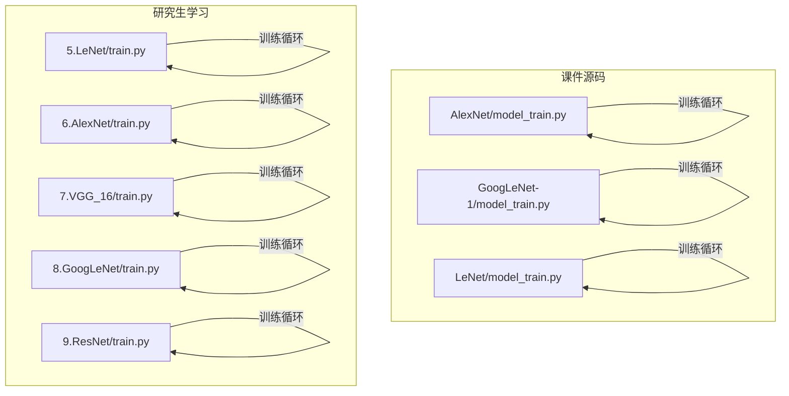
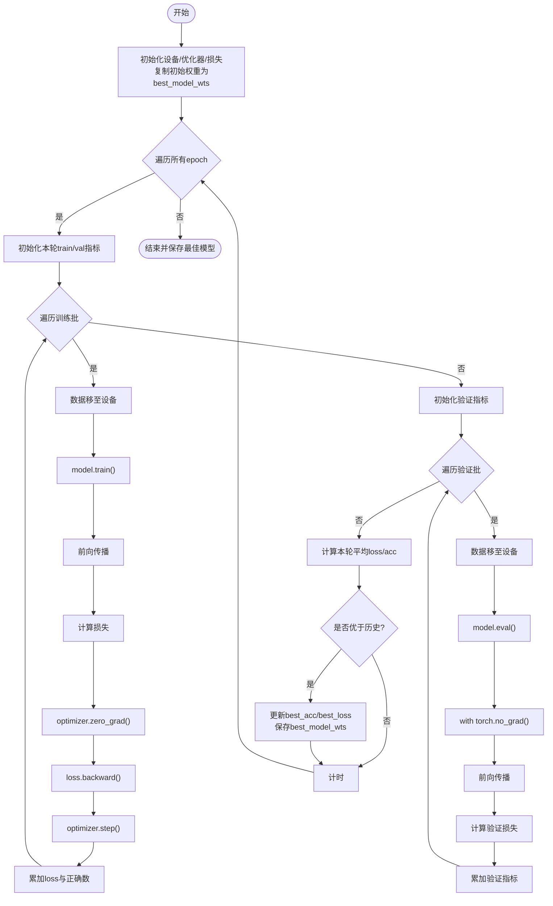
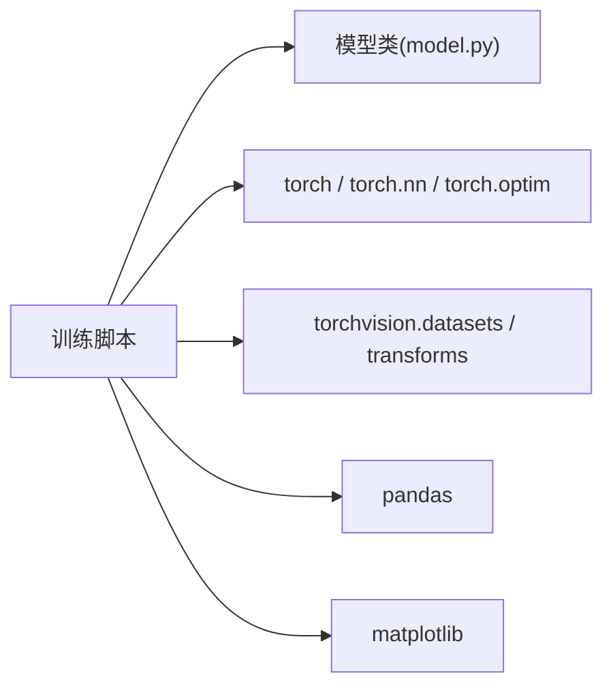

# 训练循环

<cite>
**本文引用的文件**   
- [AlexNet/model_train.py](file://study/上传课件、源码/源码/AlexNet/model_train.py)
- [GoogLeNet-1/model_train.py](file://study/上传课件、源码/源码/GoogLeNet-1/model_train.py)
- [LeNet/model_train.py](file://study/上传课件、源码/源码/LeNet/model_train.py)
- [5.LeNet/train.py](file://study/研究生学习/5.LeNet/train.py)
- [6.AlexNet/train.py](file://study/研究生学习/6.AlexNet/train.py)
- [7.VGG_16/train.py](file://study/研究生学习/7.VGG_16/train.py)
- [8.GoogLeNet/train.py](file://study/研究生学习/8.GoogLeNet/train.py)
- [9.ResNet/train.py](file://study/研究生学习/9.ResNet/train.py)
</cite>

## 目录
1. [简介](#简介)
2. [项目结构](#项目结构)
3. [核心组件](#核心组件)
4. [架构总览](#架构总览)
5. [详细组件分析](#详细组件分析)
6. [依赖关系分析](#依赖关系分析)
7. [性能考虑](#性能考虑)
8. [故障排查指南](#故障排查指南)
9. [结论](#结论)
10. [附录](#附录)

## 简介
本技术文档聚焦于仓库中多个模型（LeNet、AlexNet、VGG16、GoogLeNet、ResNet）的训练循环实现，系统性梳理从数据加载、设备与优化器配置、前向传播、反向传播、验证评估到最佳模型保存的完整流程。同时提供超参数调优建议与常见问题的排障指引，帮助读者快速理解并扩展训练脚本。

## 项目结构
仓库包含两套训练实现：
- 课件源码版：位于 study/上传课件、源码/源码 下，各模型目录内包含 model_train.py，统一采用“训练+验证”双阶段循环，并在每轮结束后根据验证指标保存最优权重。
- 研究生学习版：位于 study/研究生学习 下，每个模型目录内包含 train.py，在数据预处理、DataLoader 配置、no_grad 使用、路径管理等方面更为完善。



图表来源
- [AlexNet/model_train.py:1-193](file://study/上传课件、源码/源码/AlexNet/model_train.py#L1-L193)
- [GoogLeNet-1/model_train.py:1-197](file://study/上传课件、源码/源码/GoogLeNet-1/model_train.py#L1-L197)
- [LeNet/model_train.py:1-191](file://study/上传课件、源码/源码/LeNet/model_train.py#L1-L191)
- [5.LeNet/train.py:1-202](file://study/研究生学习/5.LeNet/train.py#L1-L202)
- [6.AlexNet/train.py:1-218](file://study/研究生学习/6.AlexNet/train.py#L1-L218)
- [7.VGG_16/train.py:1-195](file://study/研究生学习/7.VGG_16/train.py#L1-L195)
- [8.GoogLeNet/train.py:1-206](file://study/研究生学习/8.GoogLeNet/train.py#L1-L206)
- [9.ResNet/train.py:1-206](file://study/研究生学习/9.ResNet/train.py#L1-L206)

章节来源
- [AlexNet/model_train.py:1-193](file://study/上传课件、源码/源码/AlexNet/model_train.py#L1-L193)
- [GoogLeNet-1/model_train.py:1-197](file://study/上传课件、源码/源码/GoogLeNet-1/model_train.py#L1-L197)
- [LeNet/model_train.py:1-191](file://study/上传课件、源码/源码/LeNet/model_train.py#L1-L191)
- [5.LeNet/train.py:1-202](file://study/研究生学习/5.LeNet/train.py#L1-L202)
- [6.AlexNet/train.py:1-218](file://study/研究生学习/6.AlexNet/train.py#L1-L218)
- [7.VGG_16/train.py:1-195](file://study/研究生学习/7.VGG_16/train.py#L1-L195)
- [8.GoogLeNet/train.py:1-206](file://study/研究生学习/8.GoogLeNet/train.py#L1-L206)
- [9.ResNet/train.py:1-206](file://study/研究生学习/9.ResNet/train.py#L1-L206)

## 核心组件
- 数据准备与加载
  - 数据集：FashionMNIST 或自定义 ImageFolder（GoogLeNet-1）。
  - 预处理：Resize、ToTensor、Normalize（部分示例）、随机增强（如翻转、旋转、仿射变换）。
  - DataLoader：batch_size、shuffle、num_workers、pin_memory、persistent_workers 等配置在不同版本中有所差异。
- 设备与模型部署
  - 自动选择 CUDA/CPU；将模型和数据移动到同一设备。
- 优化器与损失函数
  - 优化器：Adam（默认 lr=0.001），部分示例加入 weight_decay。
  - 损失函数：交叉熵 CrossEntropyLoss；GoogLeNet 训练时融合辅助分支损失。
- 训练循环
  - 逐 epoch 迭代，内部包含训练阶段与验证阶段。
  - 训练阶段：model.train()、前向、计算 loss、zero_grad、backward、step。
  - 验证阶段：model.eval()，部分版本使用 torch.no_grad() 上下文。
- 指标统计与可视化
  - 累计 batch 级 loss 和正确数，按样本数求平均；记录每轮 train/val 的 loss 与 acc。
  - 使用 matplotlib 绘制曲线。
- 最佳模型保存
  - 基于验证准确率或验证损失进行早停式保存；训练结束恢复最优权重并持久化。

章节来源
- [AlexNet/model_train.py:15-165](file://study/上传课件、源码/源码/AlexNet/model_train.py#L15-L165)
- [GoogLeNet-1/model_train.py:14-169](file://study/上传课件、源码/源码/GoogLeNet-1/model_train.py#L14-L169)
- [LeNet/model_train.py:15-162](file://study/上传课件、源码/源码/LeNet/model_train.py#L15-L162)
- [5.LeNet/train.py:24-178](file://study/研究生学习/5.LeNet/train.py#L24-L178)
- [6.AlexNet/train.py:21-189](file://study/研究生学习/6.AlexNet/train.py#L21-L189)
- [7.VGG_16/train.py:16-167](file://study/研究生学习/7.VGG_16/train.py#L16-L167)
- [8.GoogLeNet/train.py:16-168](file://study/研究生学习/8.GoogLeNet/train.py#L16-L168)
- [9.ResNet/train.py:16-168](file://study/研究生学习/9.ResNet/train.py#L16-L168)

## 架构总览
下图展示一个典型训练循环的数据与控制流，涵盖数据加载、设备转移、训练与验证两个阶段、指标累积与最佳模型保存。

```mermaid
sequenceDiagram
participant Main as "主程序"
participant Data as "DataLoader"
participant Model as "PyTorch模型"
participant Opt as "优化器"
participant Loss as "损失函数"
participant Save as "模型保存"
Main->>Data : 获取(batch_x, batch_y)
Main->>Model : 将输入移至设备
Main->>Model : 设置训练模式
Main->>Model : 前向传播得到输出
Main->>Loss : 计算损失
Main->>Opt : zero_grad()
Main->>Model : backward()
Main->>Opt : step()
Main->>Main : 累加loss与正确数
Main->>Data : 进入验证阶段
Main->>Model : 设置评估模式
Main->>Model : 前向传播(可选no_grad)
Main->>Loss : 计算验证损失
Main->>Main : 计算本轮平均loss/acc
Main->>Save : 若优于历史则保存最优权重
```

图表来源
- [5.LeNet/train.py:50-178](file://study/研究生学习/5.LeNet/train.py#L50-L178)
- [6.AlexNet/train.py:60-189](file://study/研究生学习/6.AlexNet/train.py#L60-L189)
- [7.VGG_16/train.py:36-167](file://study/研究生学习/7.VGG_16/train.py#L36-L167)
- [8.GoogLeNet/train.py:36-168](file://study/研究生学习/8.GoogLeNet/train.py#L36-L168)
- [9.ResNet/train.py:36-168](file://study/研究生学习/9.ResNet/train.py#L36-L168)

## 详细组件分析

### 数据加载与预处理
- 数据集划分
  - 多数示例使用 random_split 将训练集划分为训练/验证子集（约 80/20）。
  - AlexNet 研究生学习版通过 Subset + 固定随机种子划分，便于复现实验。
- 数据增强
  - 基础：Resize + ToTensor。
  - 增强：RandomHorizontalFlip、RandomRotation、RandomAffine（用于提升泛化能力）。
- DataLoader 配置
  - batch_size 在各示例中不同（32/64/128/256），需结合显存与任务复杂度调整。
  - num_workers 可加速 I/O；pin_memory 与 persistent_workers 在 GPU 环境下可进一步提升吞吐。

章节来源
- [AlexNet/model_train.py:15-32](file://study/上传课件、源码/源码/AlexNet/model_train.py#L15-L32)
- [GoogLeNet-1/model_train.py:14-35](file://study/上传课件、源码/源码/GoogLeNet-1/model_train.py#L14-L35)
- [LeNet/model_train.py:15-32](file://study/上传课件、源码/源码/LeNet/model_train.py#L15-L32)
- [5.LeNet/train.py:24-48](file://study/研究生学习/5.LeNet/train.py#L24-L48)
- [6.AlexNet/train.py:21-57](file://study/研究生学习/6.AlexNet/train.py#L21-L57)
- [7.VGG_16/train.py:16-33](file://study/研究生学习/7.VGG_16/train.py#L16-L33)
- [8.GoogLeNet/train.py:16-33](file://study/研究生学习/8.GoogLeNet/train.py#L16-L33)
- [9.ResNet/train.py:16-33](file://study/研究生学习/9.ResNet/train.py#L16-L33)

### 模型初始化、设备与优化器配置
- 设备选择
  - 自动检测 CUDA 可用性，并将模型与数据迁移至目标设备。
- 优化器
  - Adam 为默认选择，学习率多为 0.001；AlexNet 研究生学习版引入 weight_decay 以缓解过拟合。
- 损失函数
  - 分类任务统一使用 CrossEntropyLoss；GoogLeNet 训练时融合辅助分支损失以提升中间层表征质量。

章节来源
- [AlexNet/model_train.py:35-46](file://study/上传课件、源码/源码/AlexNet/model_train.py#L35-L46)
- [GoogLeNet-1/model_train.py:39-49](file://study/上传课件、源码/源码/GoogLeNet-1/model_train.py#L39-L49)
- [LeNet/model_train.py:35-45](file://study/上传课件、源码/源码/LeNet/model_train.py#L35-L45)
- [5.LeNet/train.py:50-60](file://study/研究生学习/5.LeNet/train.py#L50-L60)
- [6.AlexNet/train.py:60-70](file://study/研究生学习/6.AlexNet/train.py#L60-L70)
- [7.VGG_16/train.py:36-46](file://study/研究生学习/7.VGG_16/train.py#L36-L46)
- [8.GoogLeNet/train.py:36-46](file://study/研究生学习/8.GoogLeNet/train.py#L36-L46)
- [9.ResNet/train.py:36-46](file://study/研究生学习/9.ResNet/train.py#L36-L46)

### 前向传播过程
- 数据设备转移
  - 每个 mini-batch 将特征与标签移动到当前设备，确保与模型同处一设备。
- 训练模式设置
  - 调用 model.train() 启用 Dropout/BatchNorm 等训练期行为。
- 输出计算
  - 前向得到 logits，使用 argmax 取预测类别；随后计算损失。

章节来源
- [AlexNet/model_train.py:80-93](file://study/上传课件、源码/源码/AlexNet/model_train.py#L80-L93)
- [GoogLeNet-1/model_train.py:84-97](file://study/上传课件、源码/源码/GoogLeNet-1/model_train.py#L84-L97)
- [LeNet/model_train.py:80-93](file://study/上传课件、源码/源码/LeNet/model_train.py#L80-L93)
- [5.LeNet/train.py:94-107](file://study/研究生学习/5.LeNet/train.py#L94-L107)
- [6.AlexNet/train.py:105-118](file://study/研究生学习/6.AlexNet/train.py#L105-L118)
- [7.VGG_16/train.py:81-94](file://study/研究生学习/7.VGG_16/train.py#L81-L94)
- [8.GoogLeNet/train.py:81-94](file://study/研究生学习/8.GoogLeNet/train.py#L81-L94)
- [9.ResNet/train.py:81-94](file://study/研究生学习/9.ResNet/train.py#L81-L94)

### 反向传播机制
- 梯度清零
  - 每次更新前执行 optimizer.zero_grad()，避免梯度累积。
- 损失计算与反向传播
  - 计算 loss 后调用 loss.backward() 构建计算图并回传梯度。
- 参数更新
  - 调用 optimizer.step() 依据梯度更新模型参数。

章节来源
- [AlexNet/model_train.py:95-100](file://study/上传课件、源码/源码/AlexNet/model_train.py#L95-L100)
- [GoogLeNet-1/model_train.py:99-104](file://study/上传课件、源码/源码/GoogLeNet-1/model_train.py#L99-L104)
- [LeNet/model_train.py:95-100](file://study/上传课件、源码/源码/LeNet/model_train.py#L95-L100)
- [5.LeNet/train.py:109-114](file://study/研究生学习/5.LeNet/train.py#L109-L114)
- [6.AlexNet/train.py:120-125](file://study/研究生学习/6.AlexNet/train.py#L120-L125)
- [7.VGG_16/train.py:96-101](file://study/研究生学习/7.VGG_16/train.py#L96-L101)
- [8.GoogLeNet/train.py:96-101](file://study/研究生学习/8.GoogLeNet/train.py#L96-L101)
- [9.ResNet/train.py:96-101](file://study/研究生学习/9.ResNet/train.py#L96-L101)

### 验证阶段实现逻辑
- 评估模式设置
  - 调用 model.eval() 关闭 Dropout、固定 BatchNorm 统计量等。
- no_grad 上下文管理
  - 研究生学习版多处使用 with torch.no_grad(): 禁用梯度计算，降低内存占用与加速推理。
- 指标统计
  - 与训练阶段相同地计算 loss 与正确数，并按样本数归一化得到平均指标。

章节来源
- [5.LeNet/train.py:129-153](file://study/研究生学习/5.LeNet/train.py#L129-L153)
- [6.AlexNet/train.py:132-152](file://study/研究生学习/6.AlexNet/train.py#L132-L152)
- [7.VGG_16/train.py:108-128](file://study/研究生学习/7.VGG_16/train.py#L108-L128)
- [8.GoogLeNet/train.py:108-129](file://study/研究生学习/8.GoogLeNet/train.py#L108-L129)
- [9.ResNet/train.py:108-129](file://study/研究生学习/9.ResNet/train.py#L108-L129)

### 最佳模型保存与早停策略
- 保存策略
  - 多数示例基于验证准确率最高保存权重；AlexNet 研究生学习版基于验证损失最低保存。
  - 训练结束时恢复最优权重并持久化为 .pth 文件。
- 早停策略
  - 现有代码未实现“连续若干轮不提升即停止”的早停逻辑，但可通过监控验证指标并设定耐心阈值来扩展。

章节来源
- [AlexNet/model_train.py:143-156](file://study/上传课件、源码/源码/AlexNet/model_train.py#L143-L156)
- [GoogLeNet-1/model_train.py:147-160](file://study/上传课件、源码/源码/GoogLeNet-1/model_train.py#L147-L160)
- [LeNet/model_train.py:143-154](file://study/上传课件、源码/源码/LeNet/model_train.py#L143-L154)
- [5.LeNet/train.py:159-170](file://study/研究生学习/5.LeNet/train.py#L159-L170)
- [6.AlexNet/train.py:168-180](file://study/研究生学习/6.AlexNet/train.py#L168-L180)
- [7.VGG_16/train.py:144-158](file://study/研究生学习/7.VGG_16/train.py#L144-L158)
- [8.GoogLeNet/train.py:145-159](file://study/研究生学习/8.GoogLeNet/train.py#L145-L159)
- [9.ResNet/train.py:145-159](file://study/研究生学习/9.ResNet/train.py#L145-L159)

### GoogLeNet 特殊处理（辅助分支损失）
- 训练阶段
  - 模型返回主输出与两个辅助分支输出，最终损失为三者加权组合，有助于稳定深层网络训练。
- 验证阶段
  - 仅使用主输出计算验证损失，符合常规评估规范。

章节来源
- [8.GoogLeNet/train.py:90-94](file://study/研究生学习/8.GoogLeNet/train.py#L90-L94)
- [8.GoogLeNet/train.py:117-121](file://study/研究生学习/8.GoogLeNet/train.py#L117-L121)

### 训练流程图（通用）


图表来源
- [5.LeNet/train.py:50-178](file://study/研究生学习/5.LeNet/train.py#L50-L178)
- [6.AlexNet/train.py:60-189](file://study/研究生学习/6.AlexNet/train.py#L60-L189)
- [7.VGG_16/train.py:36-167](file://study/研究生学习/7.VGG_16/train.py#L36-L167)
- [8.GoogLeNet/train.py:36-168](file://study/研究生学习/8.GoogLeNet/train.py#L36-L168)
- [9.ResNet/train.py:36-168](file://study/研究生学习/9.ResNet/train.py#L36-L168)

## 依赖关系分析
- 外部库
  - PyTorch：张量运算、自动微分、优化器、nn.CrossEntropyLoss。
  - torchvision：数据集与图像变换。
  - pandas/matplotlib：训练过程记录与可视化。
- 模块耦合
  - 训练脚本与模型定义解耦，通过导入各自 model.py 中的类实例化模型。
  - 训练循环对模型接口要求简单：支持 __call__ 前向、.to(device)、.train()/.eval()、state_dict()/load_state_dict()。



图表来源
- [5.LeNet/train.py:1-20](file://study/研究生学习/5.LeNet/train.py#L1-L20)
- [6.AlexNet/train.py:1-20](file://study/研究生学习/6.AlexNet/train.py#L1-L20)
- [7.VGG_16/train.py:1-20](file://study/研究生学习/7.VGG_16/train.py#L1-L20)
- [8.GoogLeNet/train.py:1-20](file://study/研究生学习/8.GoogLeNet/train.py#L1-L20)
- [9.ResNet/train.py:1-20](file://study/研究生学习/9.ResNet/train.py#L1-L20)

章节来源
- [5.LeNet/train.py:1-20](file://study/研究生学习/5.LeNet/train.py#L1-L20)
- [6.AlexNet/train.py:1-20](file://study/研究生学习/6.AlexNet/train.py#L1-L20)
- [7.VGG_16/train.py:1-20](file://study/研究生学习/7.VGG_16/train.py#L1-L20)
- [8.GoogLeNet/train.py:1-20](file://study/研究生学习/8.GoogLeNet/train.py#L1-L20)
- [9.ResNet/train.py:1-20](file://study/研究生学习/9.ResNet/train.py#L1-L20)

## 性能考虑
- 数据加载
  - 合理设置 num_workers 与 pin_memory，GPU 场景下可显著减少 CPU 瓶颈。
  - 使用 persistent_workers 可减少多进程重建开销（研究生学习版已体现）。
- 批大小与学习率
  - 增大 batch_size 通常可提升稳定性与吞吐，但受显存限制；学习率可按比例缩放或配合调度器调整。
- 正则化与过拟合
  - 引入 weight_decay、数据增强、Dropout、BatchNorm 等；监控 train/val 差距判断过拟合。
- 数值稳定性
  - 交叉熵损失对 logits 直接操作，无需额外 softmax；注意标签格式与类别数匹配。

[本节为通用指导，不涉及具体文件分析]

## 故障排查指南
- 维度不匹配错误
  - 检查输入尺寸与模型期望一致（如 Resize 尺寸），以及类别数与输出通道数一致。
- 内存不足（OOM）
  - 减小 batch_size、降低图片分辨率、减少 num_workers 或关闭不必要的日志。
- 验证速度缓慢
  - 确认验证阶段使用 model.eval() 与 torch.no_grad()，避免构建计算图。
- 无法继续训练
  - 检查 best_model.pth 是否存在与路径是否正确；GoogLeNet/ResNet 示例中包含断点续训逻辑。
- 指标异常
  - 确认 loss 与正确数的累加方式与样本数归一化位置正确，避免除以零或重复累加。

章节来源
- [8.GoogLeNet/train.py:194-199](file://study/研究生学习/8.GoogLeNet/train.py#L194-L199)
- [9.ResNet/train.py:194-199](file://study/研究生学习/9.ResNet/train.py#L194-L199)

## 结论
仓库中的训练循环实现了标准的深度学习训练范式：数据加载与预处理、设备与优化器配置、前向/反向传播、验证评估、指标统计与最佳模型保存。不同示例在数据增强、Dataloader 配置、no_grad 使用、路径管理与续训方面各有侧重，可作为进一步扩展（如学习率调度、早停、混合精度、分布式训练）的良好基线。

[本节为总结性内容，不涉及具体文件分析]

## 附录

### 训练超参数调优指南
- 学习率
  - 起始值可从 1e-3 起步，观察收敛速度与稳定性；必要时引入余弦退火或阶梯衰减。
- 批量大小
  - 在显存允许范围内尽量增大，以提高吞吐与稳定性；配合学习率按比例调整。
- 训练轮数
  - 以验证指标为准，结合早停策略确定有效轮数；初期可设较大上限以便观察趋势。
- 正则化
  - 权重衰减、数据增强、Dropout、Label Smoothing 等可根据任务特性组合使用。
- 早停策略（建议实现）
  - 监控验证损失或准确率，当连续 N 轮无改善时提前终止，并恢复对应最佳权重。

[本节为通用指导，不涉及具体文件分析]