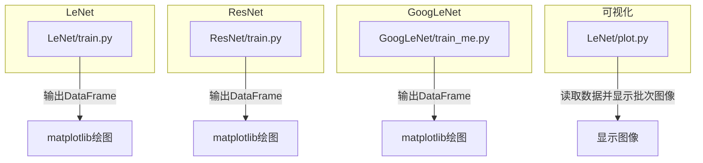
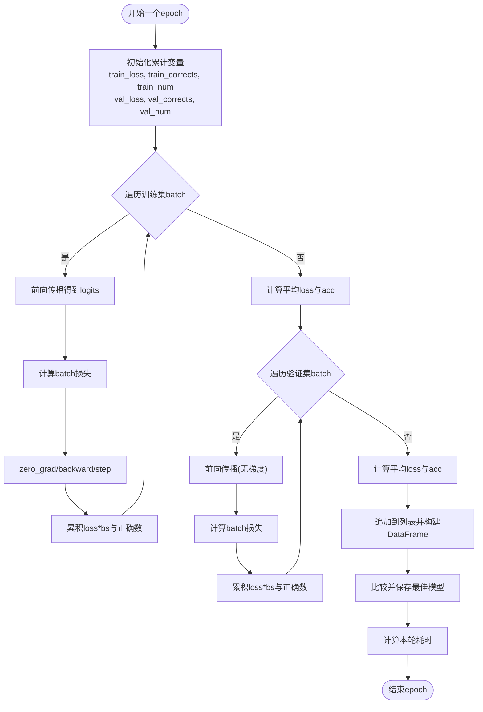
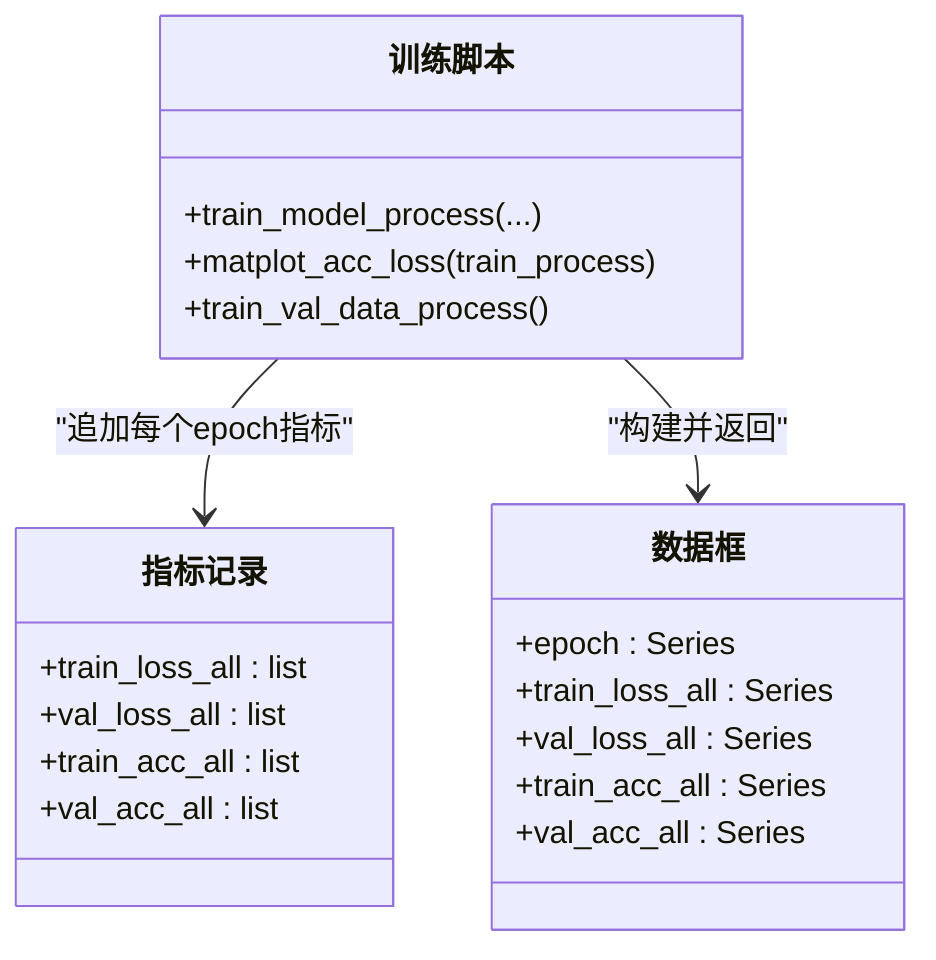
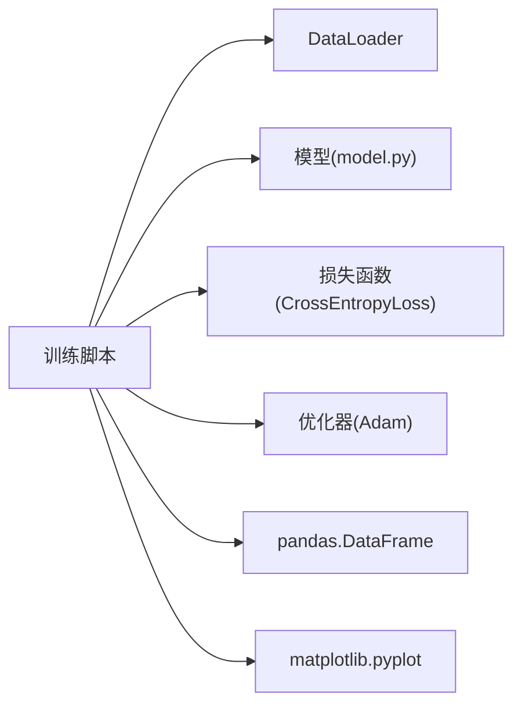
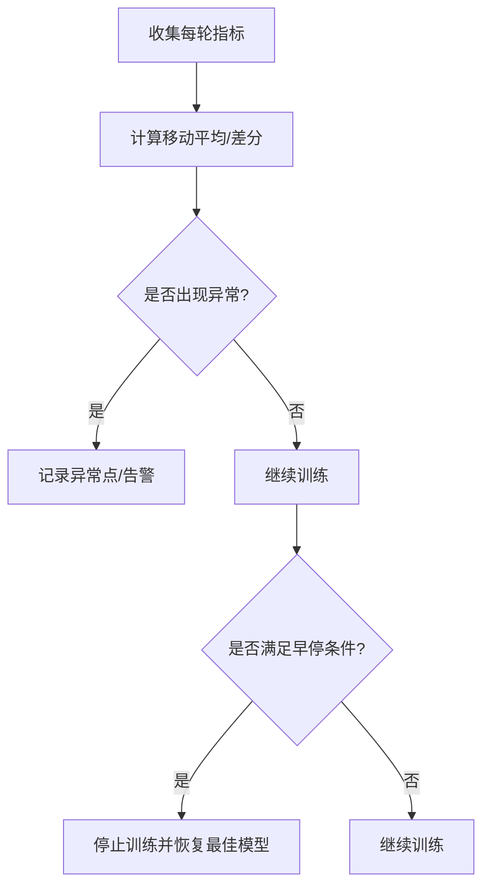

# 训练指标

<cite>
**本文引用的文件**   
- [train.py](file://study/研究生学习/5.LeNet/train.py)
- [train.py](file://study/研究生学习/9.ResNet/train.py)
- [train_me.py](file://study/研究生学习/8.GoogLeNet/train_me.py)
- [plot.py](file://study/上传课件、源码/源码/LeNet/plot.py)
</cite>

## 目录
1. [引言](#引言)
2. [项目结构](#项目结构)
3. [核心组件](#核心组件)
4. [架构总览](#架构总览)
5. [详细组件分析](#详细组件分析)
6. [依赖关系分析](#依赖关系分析)
7. [性能与时间统计](#性能与时间统计)
8. [可视化与报告生成](#可视化与报告生成)
9. [异常检测与收敛性分析](#异常检测与收敛性分析)
10. [结论](#结论)

## 引言
本技术文档聚焦于训练指标模块，系统性梳理损失值与准确率的计算、统计与平均方法；说明训练集与验证集指标的分离记录与对比分析方法；记录时间统计与性能监控的实现细节（每轮训练耗时）；并提供基于matplotlib的图表绘制与pandas数据处理方案；最后给出异常检测与收敛性分析的实用工具建议。

## 项目结构
仓库中涉及训练指标的核心代码位于多个模型示例的训练脚本中，主要包含：
- LeNet训练脚本：实现标准分类任务的训练循环、指标累计与保存、绘图函数
- ResNet训练脚本：类似流程，附带模型权重持久化与加载逻辑
- GoogLeNet训练脚本：在训练阶段引入辅助分类器损失加权，验证阶段仅使用主分支
- 数据可视化脚本：展示如何从DataLoader取批并可视化图像



图示来源
- [train.py:1-202](file://study/研究生学习/5.LeNet/train.py#L1-L202)
- [train.py:1-206](file://study/研究生学习/9.ResNet/train.py#L1-L206)
- [train_me.py:1-218](file://study/研究生学习/8.GoogLeNet/train_me.py#L1-L218)
- [plot.py:1-38](file://study/上传课件、源码/源码/LeLen/plot.py#L1-L38)

章节来源
- [train.py:1-202](file://study/研究生学习/5.LeNet/train.py#L1-L202)
- [train.py:1-206](file://study/研究生学习/9.ResNet/train.py#L1-L206)
- [train_me.py:1-218](file://study/研究生学习/8.GoogLeNet/train_me.py#L1-L218)
- [plot.py:1-38](file://study/上传课件、源码/源码/LeLen/plot.py#L1-L38)

## 核心组件
- 训练循环与指标累计
  - 在每个epoch内，分别遍历训练集和验证集的DataLoader，逐batch累加损失与正确数，并以样本数为分母计算平均损失与准确率
  - 训练阶段开启梯度更新，验证阶段关闭梯度并切换为评估模式
- 指标存储与导出
  - 将每个epoch的训练/验证损失与准确率追加到列表，最终封装为pandas.DataFrame返回
- 最佳模型选择与保存
  - 以验证集最高准确率为依据保存模型权重
- 时间统计
  - 使用系统时间戳计算每轮训练耗时，并在日志中打印
- 可视化
  - 提供绘图函数，按epoch绘制训练/验证的损失与准确率曲线

章节来源
- [train.py:63-178](file://study/研究生学习/5.LeNet/train.py#L63-L178)
- [train.py:48-168](file://study/研究生学习/9.ResNet/train.py#L48-L168)
- [train_me.py:60-180](file://study/研究生学习/8.GoogLeNet/train_me.py#L60-L180)

## 架构总览
下图展示了训练指标模块的整体数据流与控制流：从数据加载、前向/反向传播、指标累计、最佳模型保存、时间统计，到最终的DataFrame输出与可视化。

```mermaid
sequenceDiagram
participant DL as "DataLoader"
participant TR as "训练循环(LeNet/ResNet/GoogLeNet)"
participant MOD as "模型"
participant CR as "损失函数"
participant OPT as "优化器"
participant DF as "pandas DataFrame"
participant PL as "matplotlib绘图"
TR->>DL : 获取训练batch
TR->>MOD : 前向传播
MOD-->>TR : logits
TR->>CR : 计算损失
TR->>OPT : 反向传播+参数更新
TR->>TR : 累计loss与正确数
TR->>DL : 获取验证batch
TR->>MOD : 前向传播(无梯度)
MOD-->>TR : logits
TR->>CR : 计算损失
TR->>TR : 累计loss与正确数
TR->>TR : 计算平均loss与acc
TR->>DF : 追加epoch指标
TR->>TR : 比较并保存最佳模型
TR->>TR : 计算本轮耗时
TR-->>PL : 传入DataFrame进行绘图
```

图示来源
- [train.py:78-178](file://study/研究生学习/5.LeNet/train.py#L78-L178)
- [train.py:62-168](file://study/研究生学习/9.ResNet/train.py#L62-L168)
- [train_me.py:74-180](file://study/研究生学习/8.GoogLeNet/train_me.py#L74-L180)

## 详细组件分析

### 指标计算方法与统计
- 损失值统计
  - 训练阶段：对每个batch计算损失后，乘以当前batch大小并累加，得到总损失；epoch末除以总样本数得到平均损失
  - 验证阶段：同理，但处于no_grad上下文，不更新参数
- 准确率统计
  - 通过argmax获取预测类别，与真实标签比较求和得到正确数；epoch末除以总样本数得到准确率
- 多分支损失（GoogLeNet）
  - 训练阶段将主分支与辅助分支损失加权求和；验证阶段仅使用主分支损失



图示来源
- [train.py:83-178](file://study/研究生学习/5.LeNet/train.py#L83-L178)
- [train.py:66-168](file://study/研究生学习/9.ResNet/train.py#L66-L168)
- [train_me.py:78-180](file://study/研究生学习/8.GoogLeNet/train_me.py#L78-L180)

章节来源
- [train.py:116-157](file://study/研究生学习/5.LeNet/train.py#L116-L157)
- [train.py:102-143](file://study/研究生学习/9.ResNet/train.py#L102-L143)
- [train_me.py:114-155](file://study/研究生学习/8.GoogLeNet/train_me.py#L114-L155)

### 训练集与验证集指标的分离记录与对比分析
- 分离记录
  - 训练集与验证集各自维护独立的累计变量与列表，避免相互污染
  - 验证阶段使用model.eval()与torch.no_grad()确保统计一致性
- 对比分析
  - 通过DataFrame统一存放四个序列：训练/验证损失与准确率，便于后续对比与可视化
  - 典型诊断：若训练损失下降而验证损失上升，提示过拟合；若两者均高，可能欠拟合或学习率不当

章节来源
- [train.py:129-157](file://study/研究生学习/5.LeNet/train.py#L129-L157)
- [train.py:108-143](file://study/研究生学习/9.ResNet/train.py#L108-L143)
- [train_me.py:120-155](file://study/研究生学习/8.GoogLeNet/train_me.py#L120-L155)

### 时间统计与性能监控
- 每轮耗时
  - 使用time.time()在epoch开始时记录起点，结束时计算差值，并按分钟/秒格式化输出
- 性能关注点
  - DataLoader的num_workers、pin_memory等参数会影响吞吐
  - GPU可用时优先使用CUDA设备，减少CPU-GPU拷贝开销

章节来源
- [train.py:74-76](file://study/研究生学习/5.LeNet/train.py#L74-L76)
- [train.py:164-166](file://study/研究生学习/5.LeNet/train.py#L164-L166)
- [train.py:59-60](file://study/研究生学习/9.ResNet/train.py#L59-L60)
- [train.py:151-153](file://study/研究生学习/9.ResNet/train.py#L151-L153)
- [train_me.py:71-72](file://study/研究生学习/8.GoogLeNet/train_me.py#L71-L72)
- [train_me.py:163-165](file://study/研究生学习/8.GoogLeNet/train_me.py#L163-L165)

### 可视化与报告生成
- matplotlib绘图
  - 提供绘图函数，按epoch绘制训练/验证损失与准确率两条曲线，便于直观对比
- pandas数据处理
  - 将各指标序列组织为DataFrame，列名包括epoch、train_loss_all、val_loss_all、train_acc_all、val_acc_all
- 数据可视化示例
  - 另有脚本演示从DataLoader取批并可视化图像，帮助理解数据形状与预处理效果



图示来源
- [train.py:171-191](file://study/研究生学习/5.LeNet/train.py#L171-L191)
- [train.py:162-186](file://study/研究生学习/9.ResNet/train.py#L162-L186)
- [train_me.py:174-198](file://study/研究生学习/8.GoogLeNet/train_me.py#L174-L198)

章节来源
- [train.py:171-191](file://study/研究生学习/5.LeNet/train.py#L171-L191)
- [train.py:171-186](file://study/研究生学习/9.ResNet/train.py#L171-L186)
- [train_me.py:183-198](file://study/研究生学习/8.GoogLeNet/train_me.py#L183-L198)
- [plot.py:20-38](file://study/上传课件、源码/源码/LeLen/plot.py#L20-L38)

## 依赖关系分析
- 外部库
  - torch/torchvision：模型、优化器、数据集与DataLoader
  - numpy：数值计算
  - pandas：指标汇总与表格化
  - matplotlib：训练过程可视化
- 内部依赖
  - 各训练脚本依赖对应模型的model.py定义（如LeNet、ResNet、GoogLeNet），但在指标模块层面仅关心输入输出与损失计算接口



图示来源
- [train.py:1-20](file://study/研究生学习/5.LeNet/train.py#L1-L20)
- [train.py:1-14](file://study/研究生学习/9.ResNet/train.py#L1-L14)
- [train_me.py:1-14](file://study/研究生学习/8.GoogLeNet/train_me.py#L1-L14)

章节来源
- [train.py:1-20](file://study/研究生学习/5.LeNet/train.py#L1-L20)
- [train.py:1-14](file://study/研究生学习/9.ResNet/train.py#L1-L14)
- [train_me.py:1-14](file://study/研究生学习/8.GoogLeNet/train_me.py#L1-L14)

## 性能与时间统计
- 每轮耗时计算
  - 在epoch开始前记录时间戳，结束后计算差值，并以“分:秒”格式输出
- 影响吞吐的关键因素
  - batch_size、num_workers、pin_memory、是否使用GPU
- 监控建议
  - 可在每步或每N步记录更细粒度的耗时，结合指标曲线观察瓶颈

章节来源
- [train.py:74-76](file://study/研究生学习/5.LeNet/train.py#L74-L76)
- [train.py:164-166](file://study/研究生学习/5.LeNet/train.py#L164-L166)
- [train.py:59-60](file://study/研究生学习/9.ResNet/train.py#L59-L60)
- [train.py:151-153](file://study/研究生学习/9.ResNet/train.py#L151-L153)
- [train_me.py:71-72](file://study/研究生学习/8.GoogLeNet/train_me.py#L71-L72)
- [train_me.py:163-165](file://study/研究生学习/8.GoogLeNet/train_me.py#L163-L165)

## 可视化与报告生成
- 图表绘制
  - 使用matplotlib在同一图中绘制训练/验证损失与准确率曲线，便于对比
- 数据处理
  - 使用pandas.DataFrame集中管理指标，支持后续统计分析、导出CSV等
- 数据检查
  - 通过可视化单个batch的图像，确认数据预处理与加载是否正确

章节来源
- [train.py:180-191](file://study/研究生学习/5.LeNet/train.py#L180-L191)
- [train.py:171-186](file://study/研究生学习/9.ResNet/train.py#L171-L186)
- [train_me.py:183-198](file://study/研究生学习/8.GoogLeNet/train_me.py#L183-L198)
- [plot.py:20-38](file://study/上传课件、源码/源码/LeLen/plot.py#L20-L38)

## 异常检测与收敛性分析
以下工具与方法可用于训练过程的稳定性与收敛性判断，可集成到现有训练脚本中：
- 早停（Early Stopping）
  - 基于验证集指标（如准确率或损失）连续若干轮未提升则提前终止训练，防止过拟合
- 平滑与趋势分析
  - 对损失/准确率序列应用移动平均，降低噪声，识别长期趋势
- 异常点检测
  - 使用滚动窗口统计均值与方差，超出阈值视为异常；或采用简单的差分阈值法检测突变
- 收敛判定
  - 当验证集指标在窗口内变化小于阈值，或损失低于目标阈值，可判定收敛
- 学习率调度与梯度裁剪
  - 配合StepLR/CosineAnnealing等调度策略与梯度裁剪，提升训练稳定性



[此图为概念性流程图，无需图示来源]

## 结论
该训练指标模块在各模型示例中实现了统一的指标计算、记录与可视化流程：
- 损失与准确率按样本数加权平均，保证跨batch统计的一致性
- 训练集与验证集指标分离记录，便于对比分析与过拟合诊断
- 每轮耗时统计有助于性能调优
- 借助pandas与matplotlib，形成完整的指标报告与可视化能力
- 可扩展早停、平滑、异常检测与收敛判定等工具，进一步提升训练鲁棒性与效率