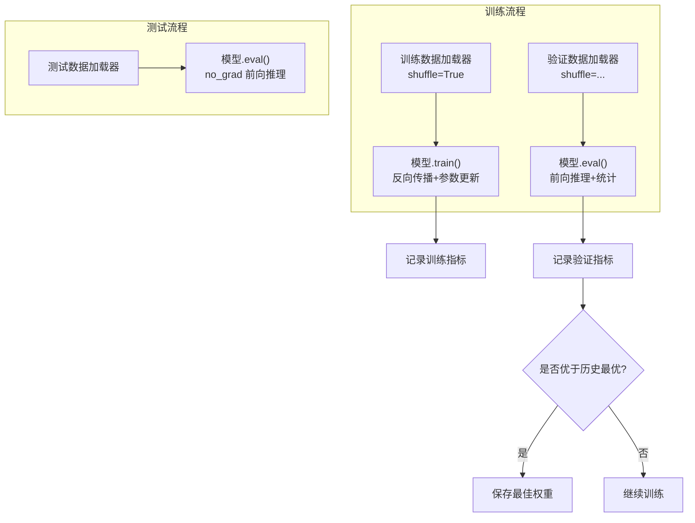
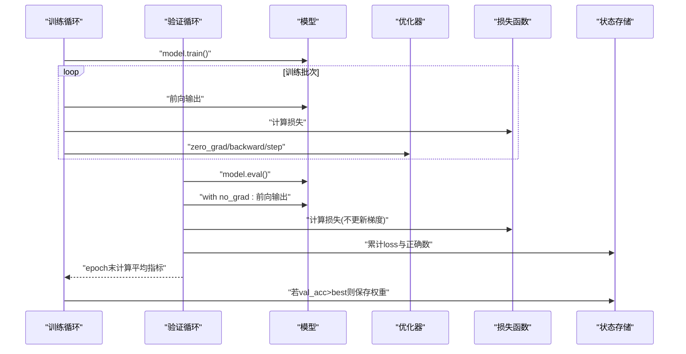
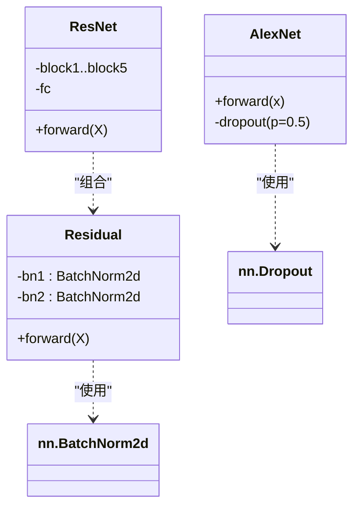
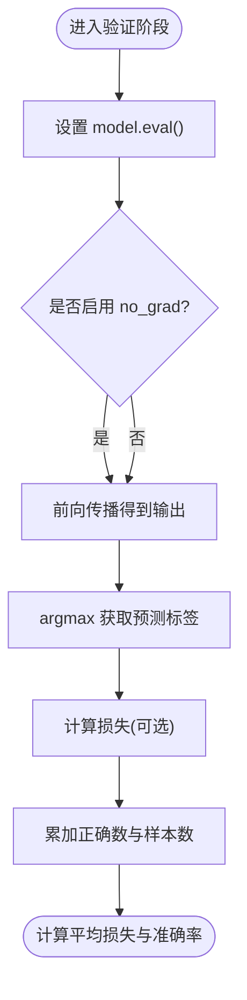
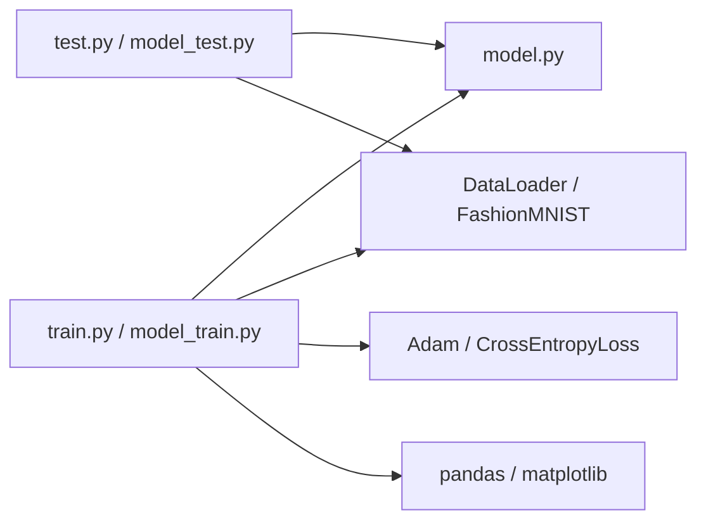

# 验证机制

<cite>
**本文引用的文件**
- [AlexNet/model_train.py](file://study/上传课件、源码/源码/AlexNet/model_train.py)
- [AlexNet/model_test.py](file://study/上传课件、源码/源码/AlexNet/model_test.py)
- [LeNet/model_train.py](file://study/上传课件、源码/源码/LeNet/model_train.py)
- [LeNet/model_test.py](file://study/上传课件、源码/源码/LeNet/model_test.py)
- [VGG_16/train.py](file://study/研究生学习/7.VGG_16/train.py)
- [VGG_16/test.py](file://study/研究生学习/7.VGG_16/test.py)
- [ResNet/train.py](file://study/研究生学习/9.ResNet/train.py)
- [ResNet/test.py](file://study/研究生学习/9.ResNet/test.py)
- [AlexNet/model.py](file://study/上传课件、源码/源码/AlexNet/model.py)
- [ResNet/model.py](file://study/研究生学习/9.ResNet/model.py)
</cite>

## 目录
1. [简介](#简介)
2. [项目结构](#项目结构)
3. [核心组件](#核心组件)
4. [架构总览](#架构总览)
5. [详细组件分析](#详细组件分析)
6. [依赖关系分析](#依赖关系分析)
7. [性能考量](#性能考量)
8. [故障排查指南](#故障排查指南)
9. [结论](#结论)
10. [附录](#附录)

## 简介
本技术文档聚焦于“验证机制”模块，围绕以下目标展开：
- 解释模型评估模式 model.eval() 的设置与作用，并对比 Dropout 与 Batch Normalization 在训练与验证阶段的行为差异。
- 梳理验证阶段的实现逻辑：no_grad 上下文管理、预测标签计算、准确率统计等。
- 记录验证集数据加载器的配置特点（如 shuffle 与 persistent_workers 的使用现状与建议）。
- 提供过拟合检测方法与早停策略的实现方案。
- 给出验证指标的计算公式与性能评估标准。

## 项目结构
仓库包含多个经典网络的训练与测试脚本，验证机制在各项目中高度一致，主要涉及：
- 训练循环中交替执行训练与验证两个阶段
- 验证阶段使用 model.eval() 与 no_grad 上下文
- 基于交叉熵损失与 argmax 的准确率统计
- 保存最佳验证准确率的模型权重

图表来源
- [AlexNet/model_train.py:80-156](file://study/上传课件、源码/源码/AlexNet/model_train.py#L80-L156)
- [ResNet/train.py:80-168](file://study/研究生学习/9.ResNet/train.py#L80-L168)
- [VGG_16/train.py:80-167](file://study/研究生学习/7.VGG_16/train.py#L80-L167)
- [LeNet/model_train.py:80-162](file://study/上传课件、源码/源码/LeNet/model_train.py#L80-L162)

章节来源
- [AlexNet/model_train.py:15-193](file://study/上传课件、源码/源码/AlexNet/model_train.py#L15-L193)
- [ResNet/train.py:16-206](file://study/研究生学习/9.ResNet/train.py#L16-L206)
- [VGG_16/train.py:16-195](file://study/研究生学习/7.VGG_16/train.py#L16-L195)
- [LeNet/model_train.py:15-191](file://study/上传课件、源码/源码/LeNet/model_train.py#L15-L191)

## 核心组件
- 训练/验证循环：每个 epoch 内先遍历训练集进行梯度更新，再遍历验证集进行前向推理与指标统计。
- 模型模式切换：训练阶段调用 model.train()；验证阶段调用 model.eval()。
- 梯度控制：测试阶段普遍使用 with torch.no_grad():；部分验证阶段也显式包裹 no_grad。
- 指标统计：累计 loss 与正确样本数，按样本总数求平均得到平均损失与准确率。
- 最佳模型保存：当验证准确率超过历史最高时，保存当前模型权重。

章节来源
- [AlexNet/model_train.py:80-156](file://study/上传课件、源码/源码/AlexNet/model_train.py#L80-L156)
- [ResNet/train.py:108-168](file://study/研究生学习/9.ResNet/train.py#L108-L168)
- [VGG_16/train.py:108-167](file://study/研究生学习/7.VGG_16/train.py#L108-L167)
- [LeNet/model_train.py:107-162](file://study/上传课件、源码/源码/LeNet/model_train.py#L107-L162)

## 架构总览
下图展示了典型训练-验证-保存的最佳实践流程，映射到具体代码位置。

图表来源
- [AlexNet/model_train.py:80-156](file://study/上传课件、源码/源码/AlexNet/model_train.py#L80-L156)
- [ResNet/train.py:80-168](file://study/研究生学习/9.ResNet/train.py#L80-L168)
- [VGG_16/train.py:80-167](file://study/研究生学习/7.VGG_16/train.py#L80-L167)
- [LeNet/model_train.py:80-162](file://study/上传课件、源码/源码/LeNet/model_train.py#L80-L162)

## 详细组件分析

### 模型评估模式 model.eval() 的作用与行为差异
- 作用
  - 将模型切换到评估模式，影响具有不同训练/评估行为的层（如 Dropout、Batch Normalization）。
- 行为差异
  - Dropout：训练模式下随机失活神经元；评估模式下关闭随机失活，所有神经元参与推理。
  - Batch Normalization：训练模式下使用当前批次的均值和方差并更新运行统计量；评估模式下固定使用训练期间累积的运行均值与方差，不进行批统计更新。
- 代码体现
  - 训练阶段：在每个训练批次前设置 model.train()。
  - 验证阶段：在每个验证批次前设置 model.eval()。
  - 测试阶段：同样设置 model.eval()，并在 no_grad 下进行推理。

章节来源
- [AlexNet/model_train.py:86-114](file://study/上传课件、源码/源码/AlexNet/model_train.py#L86-L114)
- [ResNet/train.py:86-115](file://study/研究生学习/9.ResNet/train.py#L86-L115)
- [VGG_16/train.py:86-114](file://study/研究生学习/7.VGG_16/train.py#L86-L114)
- [LeNet/model_train.py:85-113](file://study/上传课件、源码/源码/LeNet/model_train.py#L85-L113)
- [AlexNet/model_test.py:40-46](file://study/上传课件、源码/源码/AlexNet/model_test.py#L40-L46)
- [ResNet/test.py:44-46](file://study/研究生学习/9.ResNet/test.py#L44-L46)
- [VGG_16/test.py:44-46](file://study/研究生学习/7.VGG_16/test.py#L44-L46)
- [LeNet/model_test.py:40-42](file://study/上传课件、源码/源码/LeNet/model_test.py#L40-L42)

#### 类图：Dropout 与 BatchNorm 的使用位置

图表来源
- [AlexNet/model.py:37-39](file://study/上传课件、源码/源码/AlexNet/model.py#L37-L39)
- [ResNet/model.py:11-12](file://study/研究生学习/9.ResNet/model.py#L11-L12)
- [ResNet/model.py:26-63](file://study/研究生学习/9.ResNet/model.py#L26-L63)

章节来源
- [AlexNet/model.py:37-39](file://study/上传课件、源码/源码/AlexNet/model.py#L37-L39)
- [ResNet/model.py:11-12](file://study/研究生学习/9.ResNet/model.py#L11-L12)

### 验证阶段实现逻辑
- 无梯度上下文
  - 测试阶段统一使用 with torch.no_grad(): 避免构建计算图，节省内存与加速推理。
  - 部分验证阶段也显式包裹 no_grad（例如 ResNet 的训练脚本中的验证循环），进一步减少内存占用。
- 预测标签计算
  - 对模型输出的 logits 沿类别维度取 argmax，得到预测类别。
- 准确率统计
  - 逐批次累加正确样本数与样本总数，最终用 double().item() 转换为 Python 标量后除以总数得到准确率。
- 损失统计
  - 使用交叉熵损失计算每批损失，乘以批次大小后累加，最后除以总样本数得到平均损失。

图表来源
- [AlexNet/model_test.py:34-53](file://study/上传课件、源码/源码/AlexNet/model_test.py#L34-L53)
- [ResNet/train.py:114-129](file://study/研究生学习/9.ResNet/train.py#L114-L129)
- [VGG_16/test.py:38-58](file://study/研究生学习/7.VGG_16/test.py#L38-L58)
- [LeNet/model_test.py:34-53](file://study/上传课件、源码/源码/LeNet/model_test.py#L34-L53)

章节来源
- [AlexNet/model_test.py:34-53](file://study/上传课件、源码/源码/AlexNet/model_test.py#L34-L53)
- [ResNet/train.py:114-129](file://study/研究生学习/9.ResNet/train.py#L114-L129)
- [VGG_16/test.py:38-58](file://study/研究生学习/7.VGG_16/test.py#L38-L58)
- [LeNet/model_test.py:34-53](file://study/上传课件、源码/源码/LeNet/model_test.py#L34-L53)

### 验证集数据加载器配置特点
- 常见配置
  - batch_size：根据模型与硬件调整（如 32、64、128）。
  - num_workers：多进程数据加载，提升吞吐（如 2、8）。
  - shuffle：训练集通常设为 True；验证集在本仓库中多处仍为 True，但验证阶段不需要打乱顺序。
- 建议
  - 验证集 DataLoader 应设置 shuffle=False，以保证结果可复现且便于调试。
  - 对于大数据集或复杂预处理，可考虑设置 persistent_workers=True 以减少子进程重建开销（当前仓库未使用该参数，可按需添加）。

章节来源
- [AlexNet/model_train.py:27-31](file://study/上传课件、源码/源码/AlexNet/model_train.py#L27-L31)
- [LeNet/model_train.py:27-31](file://study/上传课件、源码/源码/LeNet/model_train.py#L27-L31)
- [VGG_16/train.py:28-32](file://study/研究生学习/7.VGG_16/train.py#L28-L32)
- [ResNet/train.py:28-32](file://study/研究生学习/9.ResNet/train.py#L28-L32)

### 过拟合检测方法与早停策略
- 过拟合检测方法
  - 观察训练损失持续下降而验证损失上升，同时训练准确率高于验证准确率且差距扩大。
  - 可视化训练/验证曲线（仓库已提供绘图函数）辅助判断。
- 早停策略（建议实现）
  - 维护一个 patience 计数器：当验证指标连续 N 个 epoch 未提升时停止训练。
  - 以验证损失或验证准确率为监控指标，保存最佳权重。
  - 结合学习率衰减（如 ReduceLROnPlateau）进一步提升收敛稳定性。
- 仓库现状
  - 当前实现仅保存历史最高验证准确率对应的权重，并未内置早停逻辑。可在训练循环中加入耐心计数与提前终止条件。

章节来源
- [AlexNet/model_train.py:143-156](file://study/上传课件、源码/源码/AlexNet/model_train.py#L143-L156)
- [ResNet/train.py:145-159](file://study/研究生学习/9.ResNet/train.py#L145-L159)
- [VGG_16/train.py:144-158](file://study/研究生学习/7.VGG_16/train.py#L144-L158)
- [LeNet/model_train.py:143-154](file://study/上传课件、源码/源码/LeNet/model_train.py#L143-L154)

### 验证指标计算公式与评估标准
- 平均损失
  - 定义：L_val = (1/N) * Σ_i l(y_i, ŷ_i)，其中 N 为验证集样本总数，l 为单样本损失（交叉熵）。
- 准确率
  - 定义：Acc_val = (1/N) * Σ_i I(ŷ_i == y_i)，I 为指示函数。
- 评估标准
  - 以验证准确率为主要指标选择最佳模型；同时参考验证损失变化趋势判断过拟合。
  - 建议在报告中绘制训练/验证损失与准确率曲线，直观展示泛化能力。

章节来源
- [AlexNet/model_train.py:131-141](file://study/上传课件、源码/源码/AlexNet/model_train.py#L131-L141)
- [ResNet/train.py:132-143](file://study/研究生学习/9.ResNet/train.py#L132-L143)
- [VGG_16/train.py:131-142](file://study/研究生学习/7.VGG_16/train.py#L131-L142)
- [LeNet/model_train.py:130-141](file://study/上传课件、源码/源码/LeNet/model_train.py#L130-L141)

## 依赖关系分析
- 训练脚本依赖
  - 数据集与变换：FashionMNIST 与 transforms.Compose。
  - 数据加载：torch.utils.data.DataLoader。
  - 模型：各网络定义文件（如 AlexNet、ResNet）。
  - 优化器与损失：Adam、CrossEntropyLoss。
  - 工具：copy、time、pandas、matplotlib。
- 关键耦合点
  - 训练/验证循环与模型模式切换强耦合。
  - 指标统计与最佳权重保存逻辑集中在训练脚本中。

图表来源
- [AlexNet/model_train.py:1-15](file://study/上传课件、源码/源码/AlexNet/model_train.py#L1-L15)
- [ResNet/train.py:1-14](file://study/研究生学习/9.ResNet/train.py#L1-L14)
- [VGG_16/train.py:1-14](file://study/研究生学习/7.VGG_16/train.py#L1-L14)
- [LeNet/model_train.py:1-14](file://study/上传课件、源码/源码/LeNet/model_train.py#L1-L14)

章节来源
- [AlexNet/model_train.py:1-15](file://study/上传课件、源码/源码/AlexNet/model_train.py#L1-L15)
- [ResNet/train.py:1-14](file://study/研究生学习/9.ResNet/train.py#L1-L14)
- [VGG_16/train.py:1-14](file://study/研究生学习/7.VGG_16/train.py#L1-L14)
- [LeNet/model_train.py:1-14](file://study/上传课件、源码/源码/LeNet/model_train.py#L1-L14)

## 性能考量
- 内存与速度
  - 验证/测试阶段务必使用 no_grad，避免构建计算图，显著降低显存占用并提升速度。
  - 合理设置 batch_size 与 num_workers，平衡吞吐与内存。
- 数值稳定
  - 使用 double().item() 转换后再做除法，避免整型除法的精度问题。
- 并行数据加载
  - 对于大数据集，建议开启 num_workers > 0，必要时启用 persistent_workers 以降低子进程重建成本。

[本节为通用指导，无需特定文件引用]

## 故障排查指南
- 现象：验证准确率异常波动或不升反降
  - 检查是否在验证阶段误用了 model.train()。
  - 确认验证集 DataLoader 的 shuffle 设置为 False，避免结果不可复现。
- 现象：显存不足或推理缓慢
  - 确认验证/测试阶段使用了 no_grad。
  - 适当减小 batch_size 或关闭不必要的日志打印。
- 现象：最佳模型未保存
  - 检查 val_acc_all[-1] > best_acc 的条件分支是否正确执行。
  - 确保保存路径存在且可写。

章节来源
- [AlexNet/model_train.py:112-156](file://study/上传课件、源码/源码/AlexNet/model_train.py#L112-L156)
- [ResNet/train.py:113-159](file://study/研究生学习/9.ResNet/train.py#L113-L159)
- [VGG_16/train.py:113-158](file://study/研究生学习/7.VGG_16/train.py#L113-L158)
- [LeNet/model_train.py:112-154](file://study/上传课件、源码/源码/LeNet/model_train.py#L112-L154)

## 结论
- 验证机制的核心在于正确的模型模式切换与无梯度推理，确保统计指标反映真实泛化能力。
- 仓库实现了标准的训练-验证-保存最佳权重的流程，具备清晰的指标记录与可视化能力。
- 建议改进点：
  - 验证集 DataLoader 设置 shuffle=False。
  - 引入早停策略与学习率自适应调整。
  - 在验证阶段统一使用 no_grad，进一步优化内存与速度。

[本节为总结性内容，无需特定文件引用]

## 附录
- 相关函数与流程定位
  - 训练/验证主循环：见各项目的 train_model_process 函数。
  - 测试流程：见各项目的 test_model_process 函数。
  - 绘图函数：matplot_acc_loss 用于绘制训练/验证曲线。

章节来源
- [AlexNet/model_train.py:35-165](file://study/上传课件、源码/源码/AlexNet/model_train.py#L35-L165)
- [ResNet/train.py:36-168](file://study/研究生学习/9.ResNet/train.py#L36-L168)
- [VGG_16/train.py:36-167](file://study/研究生学习/7.VGG_16/train.py#L36-L167)
- [LeNet/model_train.py:35-162](file://study/上传课件、源码/源码/LeNet/model_train.py#L35-L162)
- [AlexNet/model_test.py:22-53](file://study/上传课件、源码/源码/AlexNet/model_test.py#L22-L53)
- [ResNet/test.py:26-58](file://study/研究生学习/9.ResNet/test.py#L26-L58)
- [VGG_16/test.py:26-58](file://study/研究生学习/7.VGG_16/test.py#L26-L58)
- [LeNet/model_test.py:22-53](file://study/上传课件、源码/源码/LeNet/model_test.py#L22-L53)