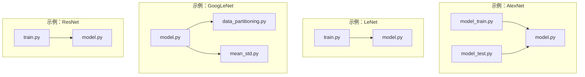
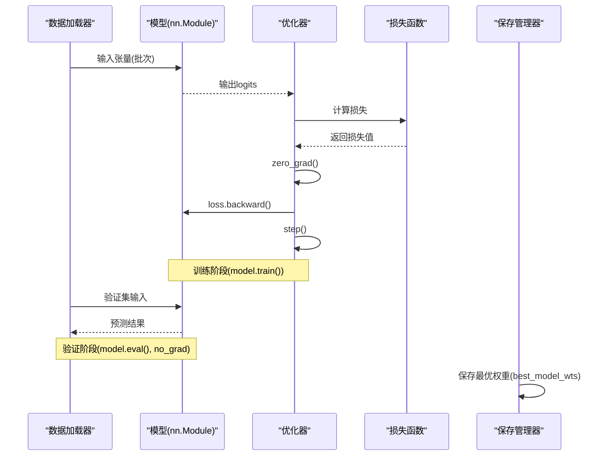
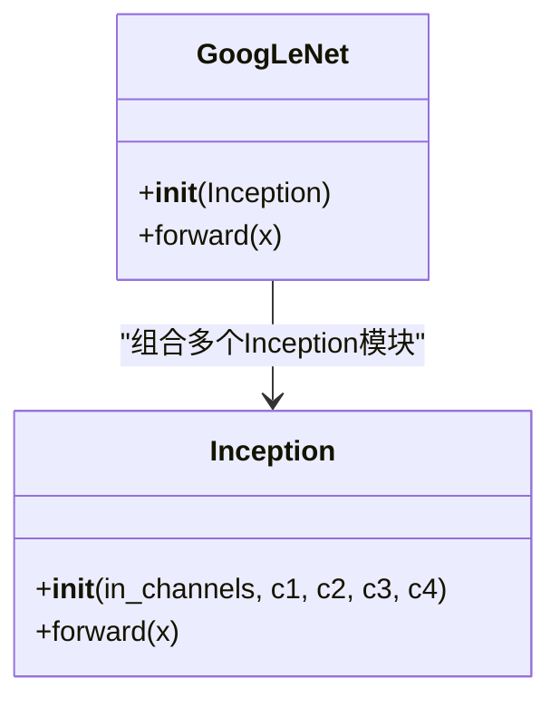
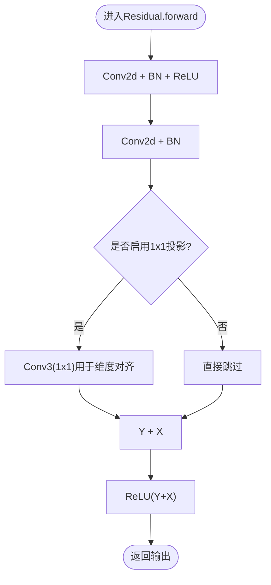
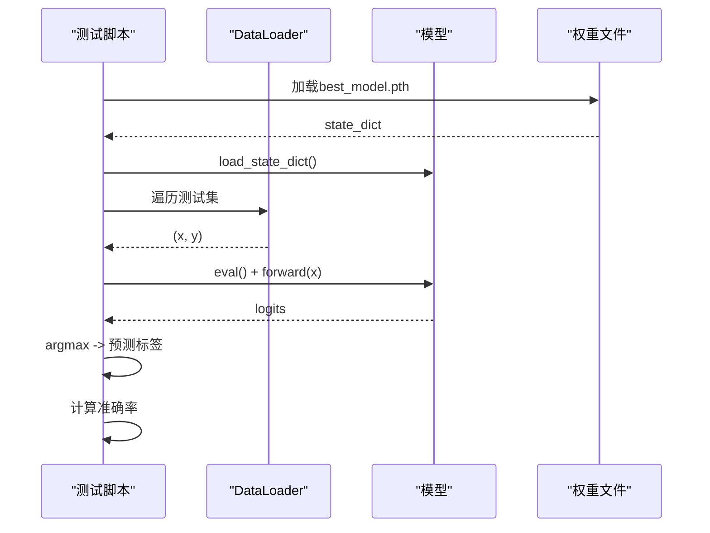
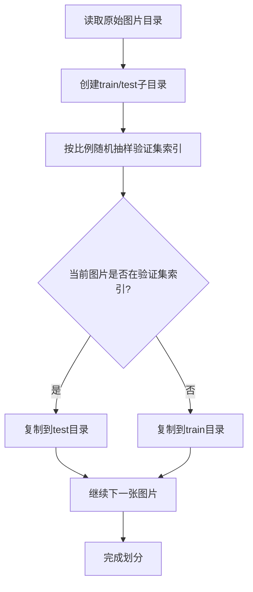
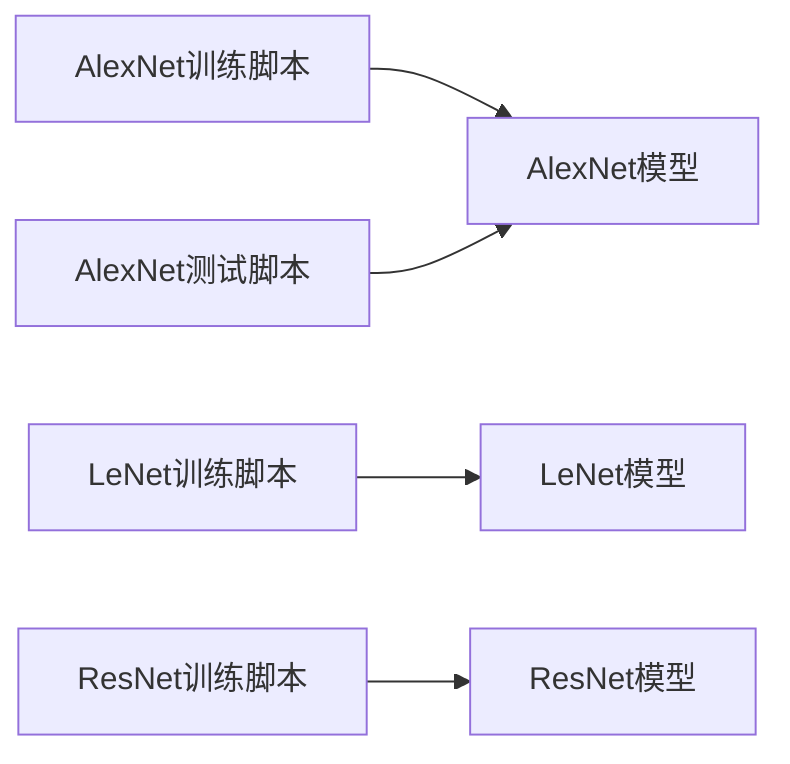

# 开发指南

<cite>
**本文引用的文件列表**
- [AlexNet模型定义](file://study/上传课件、源码/源码/AlexNet/model.py)
- [AlexNet训练脚本](file://study/上传课件、源码/源码/AlexNet/model_train.py)
- [AlexNet测试脚本](file://study/上传课件、源码/源码/AlexNet/model_test.py)
- [LeNet模型定义（源码版）](file://study/上传课件、源码/源码/LeNet/model.py)
- [GoogLeNet与Inception模块](file://study/上传课件、源码/源码/GoogLeNet-1/model.py)
- [数据集划分工具](file://study/上传课件、源码/源码/GoogLeNet-1/data_partitioning.py)
- [图像均值方差统计工具](file://study/上传课件、源码/源码/GoogLeNet-1/mean_std.py)
- [LeNet模型定义（学习版）](file://study/研究生学习/5.LeNet/model.py)
- [LeNet训练脚本（学习版）](file://study/研究生学习/5.LeNet/train.py)
- [AlexNet模型定义（学习版）](file://study/研究生学习/6.AlexNet/model.py)
- [AlexNet训练脚本（学习版）](file://study/研究生学习/6.AlexNet/train.py)
- [ResNet残差块与网络](file://study/研究生学习/9.ResNet/model.py)
- [ResNet训练脚本](file://study/研究生学习/9.ResNet/train.py)
</cite>

## 目录
1. [简介](#简介)
2. [项目结构](#项目结构)
3. [核心组件](#核心组件)
4. [架构总览](#架构总览)
5. [详细组件分析](#详细组件分析)
6. [依赖关系分析](#依赖关系分析)
7. [性能考虑](#性能考虑)
8. [故障排查指南](#故障排查指南)
9. [结论](#结论)
10. [附录：新模型添加完整流程与清单](#附录新模型添加完整流程与清单)

## 简介
本开发指南面向希望在本仓库基础上扩展和定制深度学习模型的开发者。文档基于现有代码库，系统梳理了PyTorch模型构建范式、训练与评估流程、数据预处理与可视化、以及工程化规范与最佳实践。通过阅读本指南，你将能够：
- 快速理解并复用现有模型与训练模板
- 按照标准流程新增自定义模型与组件
- 遵循统一的命名、注释与版本控制规范
- 掌握调试、性能分析与问题定位方法
- 完成从数据准备到模型保存的端到端流程

## 项目结构
仓库采用“按模型/任务分目录”的组织方式，每个模型通常包含以下文件：
- model.py：模型定义（继承nn.Module，实现__init__与forward）
- train.py / model_train.py：训练流程（数据加载、优化器、损失、循环、保存）
- test.py / model_test.py：推理与评测流程（加载权重、评估指标、可视化）
- 辅助脚本：如数据划分、统计等



图示来源
- [AlexNet模型定义:1-52](file://study/上传课件、源码/源码/AlexNet/model.py#L1-L52)
- [AlexNet训练脚本:1-193](file://study/上传课件、源码/源码/AlexNet/model_train.py#L1-L193)
- [AlexNet测试脚本:1-90](file://study/上传课件、源码/源码/AlexNet/model_test.py#L1-L90)
- [LeNet模型定义（源码版）:1-37](file://study/上传课件、源码/源码/LeNet/model.py#L1-L37)
- [GoogLeNet与Inception模块:1-102](file://study/上传课件、源码/源码/GoogLeNet-1/model.py#L1-L102)
- [数据集划分工具:1-49](file://study/上传课件、源码/源码/GoogLeNet-1/data_partitioning.py#L1-L49)
- [图像均值方差统计工具:1-58](file://study/上传课件、源码/源码/GoogLeNet-1/mean_std.py#L1-L58)
- [LeNet模型定义（学习版）:1-38](file://study/研究生学习/5.LeNet/model.py#L1-L38)
- [LeNet训练脚本（学习版）:1-202](file://study/研究生学习/5.LeNet/train.py#L1-L202)
- [AlexNet模型定义（学习版）:1-50](file://study/研究生学习/6.AlexNet/model.py#L1-L50)
- [AlexNet训练脚本（学习版）:1-218](file://study/研究生学习/6.AlexNet/train.py#L1-L218)
- [ResNet残差块与网络:1-69](file://study/研究生学习/9.ResNet/model.py#L1-L69)
- [ResNet训练脚本:1-206](file://study/研究生学习/9.ResNet/train.py#L1-L206)

章节来源
- [AlexNet模型定义:1-52](file://study/上传课件、源码/源码/AlexNet/model.py#L1-L52)
- [AlexNet训练脚本:1-193](file://study/上传课件、源码/源码/AlexNet/model_train.py#L1-L193)
- [AlexNet测试脚本:1-90](file://study/上传课件、源码/源码/AlexNet/model_test.py#L1-L90)
- [LeNet模型定义（源码版）:1-37](file://study/上传课件、源码/源码/LeNet/model.py#L1-L37)
- [GoogLeNet与Inception模块:1-102](file://study/上传课件、源码/源码/GoogLeNet-1/model.py#L1-L102)
- [数据集划分工具:1-49](file://study/上传课件、源码/源码/GoogLeNet-1/data_partitioning.py#L1-L49)
- [图像均值方差统计工具:1-58](file://study/上传课件、源码/源码/GoogLeNet-1/mean_std.py#L1-L58)
- [LeNet模型定义（学习版）:1-38](file://study/研究生学习/5.LeNet/model.py#L1-L38)
- [LeNet训练脚本（学习版）:1-202](file://study/研究生学习/5.LeNet/train.py#L1-L202)
- [AlexNet模型定义（学习版）:1-50](file://study/研究生学习/6.AlexNet/model.py#L1-L50)
- [AlexNet训练脚本（学习版）:1-218](file://study/研究生学习/6.AlexNet/train.py#L1-L218)
- [ResNet残差块与网络:1-69](file://study/研究生学习/9.ResNet/model.py#L1-L69)
- [ResNet训练脚本:1-206](file://study/研究生学习/9.ResNet/train.py#L1-L206)

## 核心组件
- 模型基类与标准接口
  - 所有模型均继承自torch.nn.Module，并在__init__中声明子层，在forward中定义前向计算图。
  - 典型层包括卷积、池化、激活、全连接、归一化、Dropout、Flatten/AdaptiveAvgPool等。
- 训练主循环
  - 设备选择（CPU/GPU）、优化器与损失函数配置、模型.to(device)、best_model_wts保存策略。
  - 训练阶段：model.train()、optimizer.zero_grad()、loss.backward()、optimizer.step()。
  - 验证阶段：model.eval()、torch.no_grad()上下文、累计损失与准确率。
- 数据管道
  - 使用torchvision.datasets与transforms.Compose进行数据加载与增强。
  - DataLoader参数：batch_size、shuffle、num_workers、pin_memory、persistent_workers等。
- 评估与可视化
  - 测试模式：torch.no_grad()、argmax获取预测类别、计算准确率。
  - 记录每轮指标并绘制Loss/Acc曲线。

章节来源
- [AlexNet模型定义:1-52](file://study/上传课件、源码/源码/AlexNet/model.py#L1-L52)
- [AlexNet训练脚本:1-193](file://study/上传课件、源码/源码/AlexNet/model_train.py#L1-L193)
- [AlexNet测试脚本:1-90](file://study/上传课件、源码/源码/AlexNet/model_test.py#L1-L90)
- [LeNet训练脚本（学习版）:1-202](file://study/研究生学习/5.LeNet/train.py#L1-L202)
- [AlexNet训练脚本（学习版）:1-218](file://study/研究生学习/6.AlexNet/train.py#L1-L218)
- [ResNet训练脚本:1-206](file://study/研究生学习/9.ResNet/train.py#L1-L206)

## 架构总览
下图展示了典型模型训练与测试的整体流程，涵盖数据加载、模型前向/反向传播、优化更新、验证与保存。



图示来源
- [AlexNet训练脚本:35-165](file://study/上传课件、源码/源码/AlexNet/model_train.py#L35-L165)
- [LeNet训练脚本（学习版）:50-178](file://study/研究生学习/5.LeNet/train.py#L50-L178)
- [AlexNet训练脚本（学习版）:60-189](file://study/研究生学习/6.AlexNet/train.py#L60-L189)
- [ResNet训练脚本:36-168](file://study/研究生学习/9.ResNet/train.py#L36-L168)

## 详细组件分析

### 模型类设计模式（面向对象）
以GoogLeNet与Inception为例，展示模块化组合与初始化策略。



图示来源
- [GoogLeNet与Inception模块:7-91](file://study/上传课件、源码/源码/GoogLeNet-1/model.py#L7-L91)

章节来源
- [GoogLeNet与Inception模块:1-102](file://study/上传课件、源码/源码/GoogLeNet-1/model.py#L1-L102)

### ResNet残差块与前向流程（流程图）
展示Residual块的内部结构与残差连接逻辑。



图示来源
- [ResNet残差块与网络:5-23](file://study/研究生学习/9.ResNet/model.py#L5-L23)

章节来源
- [ResNet残差块与网络:1-69](file://study/研究生学习/9.ResNet/model.py#L1-L69)

### 训练主循环（序列图）
以AlexNet训练脚本为例，展示训练与验证阶段的调用链。

```mermaid
sequenceDiagram
participant Main as "主程序"
participant Data as "DataLoader"
participant Model as "AlexNet"
participant Opt as "Adam"
participant Loss as "CrossEntropyLoss"
Main->>Data : 获取(batch_x, batch_y)
Main->>Model : forward(batch_x)
Model-->>Main : logits
Main->>Loss : compute(logits, labels)
Loss-->>Main : loss
Main->>Opt : zero_grad()
Main->>Model : loss.backward()
Main->>Opt : step()
Main->>Main : 累计loss与acc
Main->>Main : 验证阶段(eval/no_grad)
Main->>Main : 保存最优权重
```

图示来源
- [AlexNet训练脚本:35-165](file://study/上传课件、源码/源码/AlexNet/model_train.py#L35-L165)

章节来源
- [AlexNet训练脚本:1-193](file://study/上传课件、源码/源码/AlexNet/model_train.py#L1-L193)

### 测试与推理流程（序列图）
展示加载权重、设置eval模式、无梯度推理与指标计算。



图示来源
- [AlexNet测试脚本:22-53](file://study/上传课件、源码/源码/AlexNet/model_test.py#L22-L53)

章节来源
- [AlexNet测试脚本:1-90](file://study/上传课件、源码/源码/AlexNet/model_test.py#L1-L90)

### 数据预处理与统计（流程图）
展示自定义数据集划分与图像统计的流程。



图示来源
- [数据集划分工具:6-47](file://study/上传课件、源码/源码/GoogLeNet-1/data_partitioning.py#L6-L47)

章节来源
- [数据集划分工具:1-49](file://study/上传课件、源码/源码/GoogLeNet-1/data_partitioning.py#L1-L49)

## 依赖关系分析
- 模型与训练脚本耦合点
  - 训练脚本导入对应model.py中的模型类，实例化后传入训练循环。
  - 测试脚本同样依赖模型定义与保存的权重文件路径。
- 外部依赖
  - torch、torchvision、torchsummary、pandas、matplotlib等。
- 潜在循环依赖
  - 当前各模型目录相对独立，未见循环导入；若引入公共utils需确保单向依赖。



图示来源
- [AlexNet训练脚本:1-193](file://study/上传课件、源码/源码/AlexNet/model_train.py#L1-L193)
- [AlexNet测试脚本:1-90](file://study/上传课件、源码/源码/AlexNet/model_test.py#L1-L90)
- [LeNet训练脚本（学习版）:1-202](file://study/研究生学习/5.LeNet/train.py#L1-L202)
- [ResNet训练脚本:1-206](file://study/研究生学习/9.ResNet/train.py#L1-L206)

章节来源
- [AlexNet训练脚本:1-193](file://study/上传课件、源码/源码/AlexNet/model_train.py#L1-L193)
- [AlexNet测试脚本:1-90](file://study/上传课件、源码/源码/AlexNet/model_test.py#L1-L90)
- [LeNet训练脚本（学习版）:1-202](file://study/研究生学习/5.LeNet/train.py#L1-L202)
- [ResNet训练脚本:1-206](file://study/研究生学习/9.ResNet/train.py#L1-L206)

## 性能考虑
- 数据加载
  - 合理设置num_workers与pin_memory以提升I/O吞吐（尤其在GPU环境下）。
  - 使用persistent_workers减少多进程开销。
- 训练效率
  - 使用torch.no_grad()在验证阶段避免不必要的梯度计算。
  - 适当调整batch_size与学习率，结合权重衰减缓解过拟合。
- 内存管理
  - 大模型或大数据集下注意显存占用，必要时减小batch_size或使用混合精度（本仓库未直接使用，可后续扩展）。
- 可视化与监控
  - 记录每轮指标并绘图，便于观察收敛与过拟合趋势。

[本节为通用指导，不直接分析具体文件]

## 故障排查指南
- 常见错误与定位
  - 形状不匹配：检查卷积/池化后的特征图尺寸与全连接输入维度是否一致。
  - 设备不一致：确保输入张量与模型在同一设备上（to(device)）。
  - 梯度爆炸/消失：检查激活函数、初始化策略与学习率。
  - 验证阶段未关闭梯度：确认使用model.eval()与torch.no_grad()。
- 调试技巧
  - 打印中间张量形状与数值范围，定位异常层。
  - 逐步简化模型（如仅保留单层）复现问题。
  - 使用小批量数据快速验证流程正确性。
- 日志与保存
  - 保存best_model_wts而非整个模型对象，便于跨环境加载。
  - 记录训练时间与epoch进度，便于定位耗时瓶颈。

章节来源
- [AlexNet训练脚本:35-165](file://study/上传课件、源码/源码/AlexNet/model_train.py#L35-L165)
- [AlexNet测试脚本:22-53](file://study/上传课件、源码/源码/AlexNet/model_test.py#L22-L53)
- [LeNet训练脚本（学习版）:50-178](file://study/研究生学习/5.LeNet/train.py#L50-L178)
- [AlexNet训练脚本（学习版）:60-189](file://study/研究生学习/6.AlexNet/train.py#L60-L189)
- [ResNet训练脚本:36-168](file://study/研究生学习/9.ResNet/train.py#L36-L168)

## 结论
本指南基于仓库现有实现，总结了PyTorch模型构建、训练与评估的标准流程，提供了可扩展的模块化设计与工程化规范。遵循本文档的实践，开发者可以高效地新增模型、集成自定义组件，并保持代码质量与可维护性。

[本节为总结性内容，不直接分析具体文件]

## 附录：新模型添加完整流程与清单

### 标准流程
- 新建模型目录与文件
  - 在合适目录下创建model.py，定义继承nn.Module的模型类，实现__init__与forward。
  - 参考现有模型（如AlexNet、LeNet、ResNet）的结构与命名约定。
- 实现forward方法
  - 明确输入输出形状，确保层间维度匹配。
  - 合理使用激活、归一化、Dropout等正则化手段。
- 编写训练脚本
  - 数据加载与预处理：使用torchvision.transforms.Compose与DataLoader。
  - 优化器与损失函数：常用Adam与CrossEntropyLoss。
  - 训练循环：model.train()、zero_grad、backward、step；验证循环：model.eval()、no_grad。
  - 保存最优权重：根据验证集指标保存best_model_wts。
- 编写测试脚本
  - 加载权重：load_state_dict(torch.load(...))。
  - 设置eval模式与no_grad，计算准确率并可视化。
- 可选：数据预处理与统计
  - 使用数据划分工具生成train/test目录结构。
  - 计算数据集均值与方差，用于标准化。

章节来源
- [AlexNet模型定义:1-52](file://study/上传课件、源码/源码/AlexNet/model.py#L1-L52)
- [AlexNet训练脚本:1-193](file://study/上传课件、源码/源码/AlexNet/model_train.py#L1-L193)
- [AlexNet测试脚本:1-90](file://study/上传课件、源码/源码/AlexNet/model_test.py#L1-L90)
- [LeNet模型定义（学习版）:1-38](file://study/研究生学习/5.LeNet/model.py#L1-L38)
- [LeNet训练脚本（学习版）:1-202](file://study/研究生学习/5.LeNet/train.py#L1-L202)
- [AlexNet模型定义（学习版）:1-50](file://study/研究生学习/6.AlexNet/model.py#L1-L50)
- [AlexNet训练脚本（学习版）:1-218](file://study/研究生学习/6.AlexNet/train.py#L1-L218)
- [ResNet残差块与网络:1-69](file://study/研究生学习/9.ResNet/model.py#L1-L69)
- [ResNet训练脚本:1-206](file://study/研究生学习/9.ResNet/train.py#L1-L206)
- [数据集划分工具:1-49](file://study/上传课件、源码/源码/GoogLeNet-1/data_partitioning.py#L1-L49)
- [图像均值方差统计工具:1-58](file://study/上传课件、源码/源码/GoogLeNet-1/mean_std.py#L1-L58)

### 代码规范与命名约定
- 类与方法
  - 类名使用大驼峰（如AlexNet、ResNet），方法名使用小写加下划线（如forward、train_val_data_process）。
  - __init__中声明所有子层，forward中只包含计算逻辑。
- 变量与常量
  - 常量使用大写加下划线（如DEVICE、BATCH_SIZE、NUM_WORKERS）。
  - 局部变量使用具名且语义清晰（如train_loss、val_acc）。
- 注释规范
  - 关键步骤添加行内注释说明意图与注意事项。
  - 复杂逻辑提供简要注释，避免冗余描述。
- 文件组织
  - 每个模型目录保持model.py、train.py、test.py三件套，必要时增加辅助脚本。

章节来源
- [AlexNet训练脚本（学习版）:1-218](file://study/研究生学习/6.AlexNet/train.py#L1-L218)
- [LeNet训练脚本（学习版）:1-202](file://study/研究生学习/5.LeNet/train.py#L1-L202)
- [AlexNet模型定义（学习版）:1-50](file://study/研究生学习/6.AlexNet/model.py#L1-L50)
- [ResNet残差块与网络:1-69](file://study/研究生学习/9.ResNet/model.py#L1-L69)

### 版本控制最佳实践
- 提交粒度
  - 每次提交聚焦单一变更（如新增模型、修复bug、改进数据管道）。
- 提交信息
  - 使用简洁明确的中文或英文描述变更内容与动机。
- 分支策略
  - 主分支保持稳定，功能开发在独立分支进行，合并前进行代码审查与测试。
- 权重与数据
  - 不将大权重文件纳入版本控制，使用外部存储或忽略规则管理。

[本节为通用指导，不直接分析具体文件]

### 自定义组件开发与扩展点
- 自定义层
  - 继承nn.Module，实现__init__与forward，确保形状与广播规则正确。
- 自定义模块组合
  - 使用nn.Sequential或手动组合，参考Inception与Residual的设计模式。
- 训练回调与钩子
  - 可在训练循环中插入自定义逻辑（如早停、动态学习率调整）。
- 数据增强与预处理
  - 在transforms.Compose中扩展自定义变换，保证与模型输入要求一致。

章节来源
- [GoogLeNet与Inception模块:1-102](file://study/上传课件、源码/源码/GoogLeNet-1/model.py#L1-L102)
- [ResNet残差块与网络:1-69](file://study/研究生学习/9.ResNet/model.py#L1-L69)
- [AlexNet训练脚本（学习版）:21-57](file://study/研究生学习/6.AlexNet/train.py#L21-L57)

### 项目结构设计原则与模块化方法
- 分层与解耦
  - 模型定义与训练流程分离，便于替换与复用。
- 配置集中化
  - 将超参数与路径集中管理，提升可维护性与可移植性。
- 代码复用
  - 抽取通用训练/验证循环与数据管道，减少重复代码。

章节来源
- [AlexNet训练脚本:1-193](file://study/上传课件、源码/源码/AlexNet/model_train.py#L1-L193)
- [LeNet训练脚本（学习版）:1-202](file://study/研究生学习/5.LeNet/train.py#L1-L202)
- [AlexNet训练脚本（学习版）:1-218](file://study/研究生学习/6.AlexNet/train.py#L1-L218)
- [ResNet训练脚本:1-206](file://study/研究生学习/9.ResNet/train.py#L1-L206)

### 调试技巧与性能分析方法
- 调试
  - 打印中间张量形状与数值范围，定位异常层。
  - 使用小批量数据快速验证流程正确性。
- 性能分析
  - 记录每轮训练时间，识别I/O与计算瓶颈。
  - 调整num_workers与batch_size，观察吞吐变化。
- 问题排查
  - 检查设备一致性、梯度累积与优化器更新顺序。
  - 验证阶段务必使用eval与no_grad。

章节来源
- [AlexNet训练脚本:35-165](file://study/上传课件、源码/源码/AlexNet/model_train.py#L35-L165)
- [AlexNet测试脚本:22-53](file://study/上传课件、源码/源码/AlexNet/model_test.py#L22-L53)
- [LeNet训练脚本（学习版）:50-178](file://study/研究生学习/5.LeNet/train.py#L50-L178)
- [AlexNet训练脚本（学习版）:60-189](file://study/研究生学习/6.AlexNet/train.py#L60-L189)
- [ResNet训练脚本:36-168](file://study/研究生学习/9.ResNet/train.py#L36-L168)

### 实际的新模型开发示例（步骤指引）
- 步骤1：在目标目录下创建model.py，定义模型类（参考AlexNet/LeNet/ResNet）。
- 步骤2：实现forward方法，确保输入输出形状正确。
- 步骤3：编写train.py，配置数据加载、优化器、损失函数与训练循环。
- 步骤4：编写test.py，加载权重并进行推理与评估。
- 步骤5：如需自定义数据，使用data_partitioning.py与mean_std.py进行划分与统计。
- 步骤6：运行训练脚本，观察Loss/Acc曲线，保存最优权重。
- 步骤7：运行测试脚本，验证模型效果与稳定性。

章节来源
- [AlexNet模型定义:1-52](file://study/上传课件、源码/源码/AlexNet/model.py#L1-L52)
- [AlexNet训练脚本:1-193](file://study/上传课件、源码/源码/AlexNet/model_train.py#L1-L193)
- [AlexNet测试脚本:1-90](file://study/上传课件、源码/源码/AlexNet/model_test.py#L1-L90)
- [数据集划分工具:1-49](file://study/上传课件、源码/源码/GoogLeNet-1/data_partitioning.py#L1-L49)
- [图像均值方差统计工具:1-58](file://study/上传课件、源码/源码/GoogLeNet-1/mean_std.py#L1-L58)

### 代码审查清单
- 模型定义
  - 是否继承nn.Module？__init__与forward是否清晰分离？
  - 层间维度是否匹配？是否存在未使用的层或冗余计算？
- 训练脚本
  - 是否正确设置device、optimizer、criterion？
  - 训练与验证阶段是否分别使用train()/eval()与no_grad()？
  - 是否保存best_model_wts并记录每轮指标？
- 测试脚本
  - 是否正确加载权重与设置eval模式？
  - 是否使用no_grad进行推理与指标计算？
- 数据管道
  - transforms是否与模型输入要求一致？
  - DataLoader参数是否合理（batch_size、num_workers、pin_memory）？
- 规范与可维护性
  - 命名是否符合约定？注释是否清晰？
  - 是否避免硬编码路径与超参数？

章节来源
- [AlexNet模型定义:1-52](file://study/上传课件、源码/源码/AlexNet/model.py#L1-L52)
- [AlexNet训练脚本:1-193](file://study/上传课件、源码/源码/AlexNet/model_train.py#L1-L193)
- [AlexNet测试脚本:1-90](file://study/上传课件、源码/源码/AlexNet/model_test.py#L1-L90)
- [LeNet训练脚本（学习版）:1-202](file://study/研究生学习/5.LeNet/train.py#L1-L202)
- [AlexNet训练脚本（学习版）:1-218](file://study/研究生学习/6.AlexNet/train.py#L1-L218)
- [ResNet训练脚本:1-206](file://study/研究生学习/9.ResNet/train.py#L1-L206)