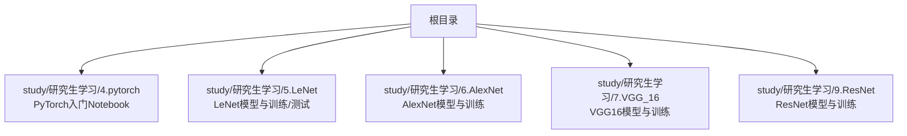
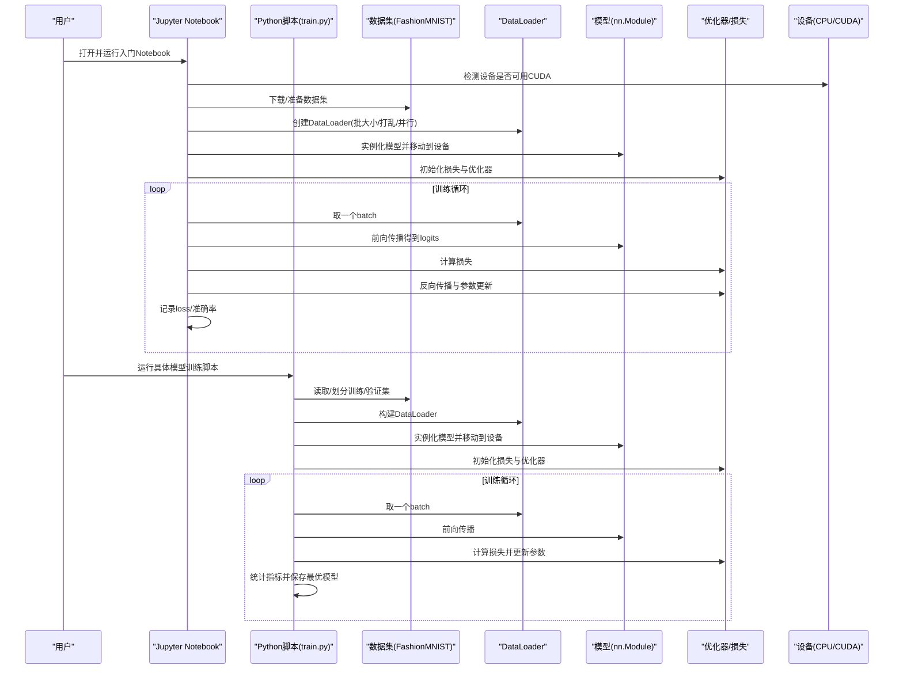
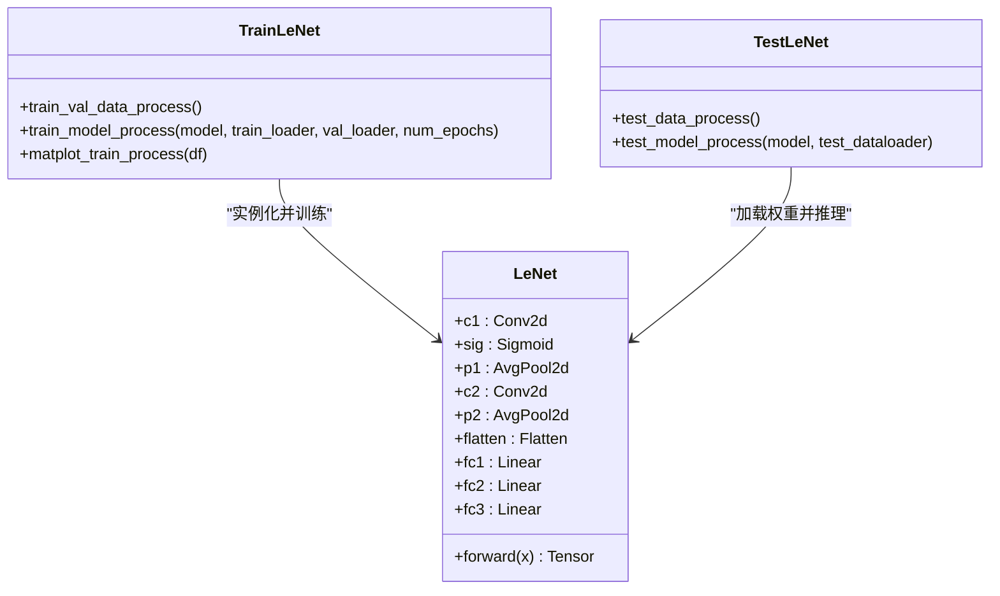
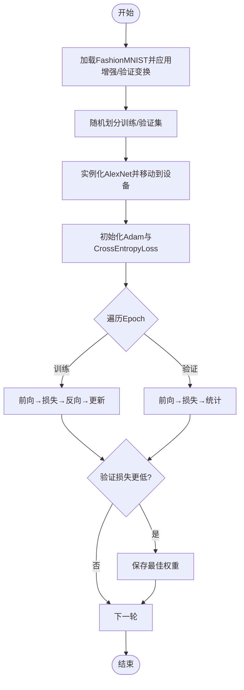
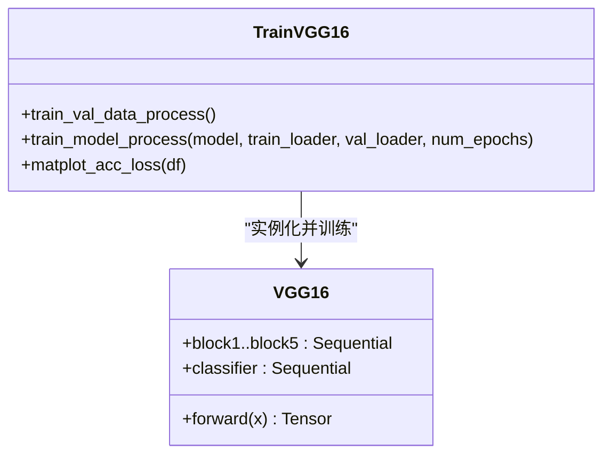
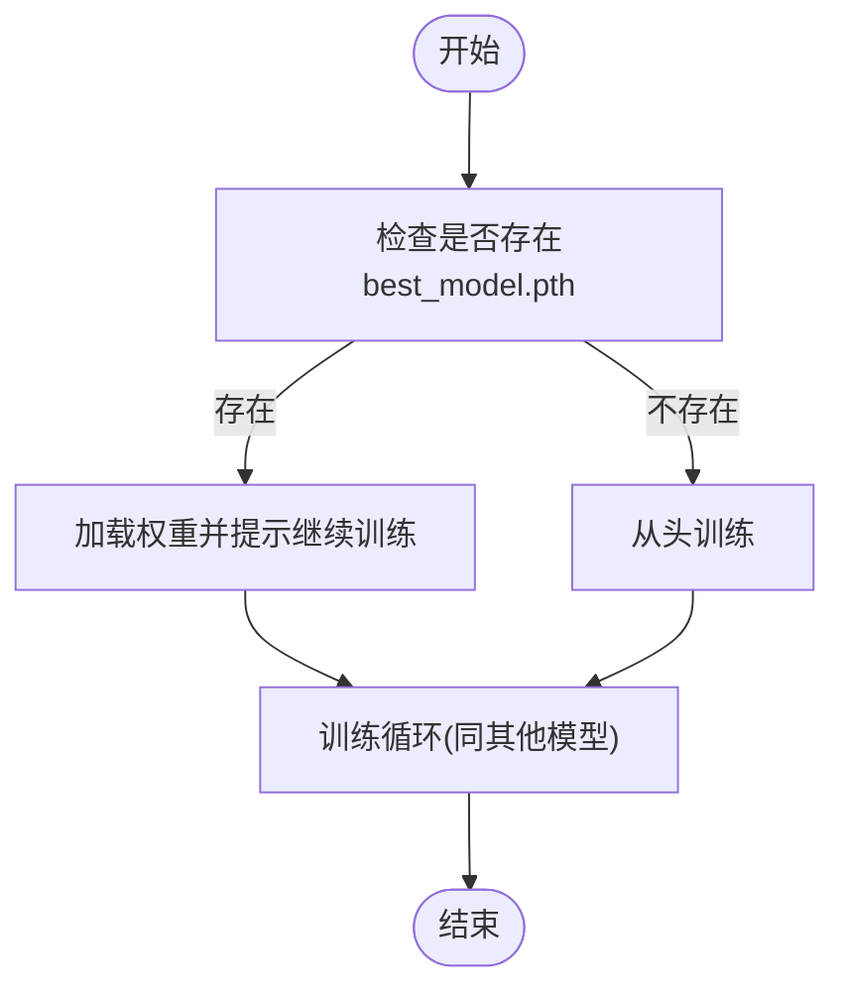
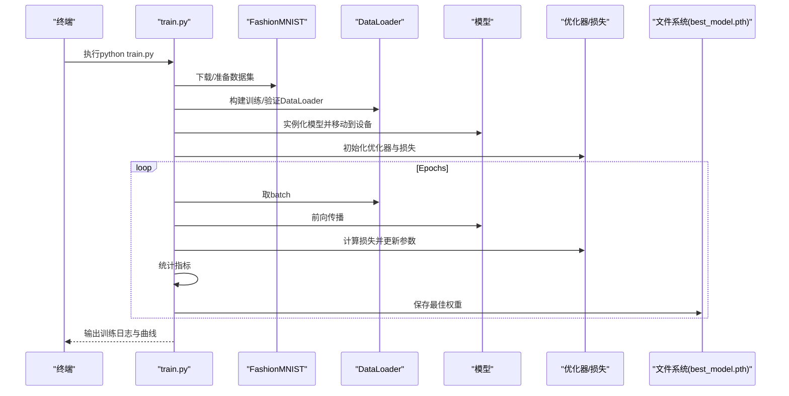

# 快速开始

<cite>
**本文引用的文件**   
- [4.pytorch.ipynb](file://study/研究生学习/4.pytorch/4.pytorch.ipynb)
- [train.py（LeNet）](file://study/研究生学习/5.LeNet/train.py)
- [model.py（LeNet）](file://study/研究生学习/5.LeNet/model.py)
- [test.py（LeNet）](file://study/研究生学习/5.LeNet/test.py)
- [train.py（AlexNet）](file://study/研究生学习/6.AlexNet/train.py)
- [model.py（AlexNet）](file://study/研究生学习/6.AlexNet/model.py)
- [train.py（VGG_16）](file://study/研究生学习/7.VGG_16/train.py)
- [model.py（VGG_16）](file://study/研究生学习/7.VGG_16/model.py)
- [train.py（ResNet）](file://study/研究生学习/9.ResNet/train.py)
</cite>

## 目录
1. [简介](#简介)
2. [项目结构](#项目结构)
3. [核心组件](#核心组件)
4. [架构总览](#架构总览)
5. [详细组件分析](#详细组件分析)
6. [依赖与安装](#依赖与安装)
7. [环境搭建与GPU配置](#环境搭建与gpu配置)
8. [第一个Jupyter Notebook运行示例](#第一个jupyter-notebook运行示例)
9. [基础模型训练入门教程](#基础模型训练入门教程)
10. [常见问题排查](#常见问题排查)
11. [性能与优化建议](#性能与优化建议)
12. [结论](#结论)

## 简介
本指南面向初学者，目标是在30分钟内完成环境搭建、依赖安装、GPU配置与开发工具设置，并成功运行第一个深度学习模型。仓库提供了多个经典网络（LeNet、AlexNet、VGG16、ResNet）的训练脚本与配套模型定义，以及一个PyTorch入门的Jupyter Notebook，适合从零开始快速上手。

## 项目结构
本项目采用“按模型/主题分目录”的组织方式：每个经典网络拥有独立的目录，包含模型定义、训练脚本、测试脚本等；同时提供系统化的PyTorch入门Notebook，涵盖张量、数据加载、模型构建、损失与优化器、训练循环、推理等完整流程。

**图表来源** 
- [4.pytorch.ipynb](file://study/研究生学习/4.pytorch/4.pytorch.ipynb)
- [train.py（LeNet）](file://study/研究生学习/5.LeNet/train.py)
- [model.py（LeNet）](file://study/研究生学习/5.LeNet/model.py)
- [train.py（AlexNet）](file://study/研究生学习/6.AlexNet/train.py)
- [model.py（AlexNet）](file://study/研究生学习/6.AlexNet/model.py)
- [train.py（VGG_16）](file://study/研究生学习/7.VGG_16/train.py)
- [model.py（VGG_16）](file://study/研究生学习/7.VGG_16/model.py)
- [train.py（ResNet）](file://study/研究生学习/9.ResNet/train.py)

**章节来源**
- [4.pytorch.ipynb](file://study/研究生学习/4.pytorch/4.pytorch.ipynb)
- [train.py（LeNet）](file://study/研究生学习/5.LeNet/train.py)
- [model.py（LeNet）](file://study/研究生学习/5.LeNet/model.py)
- [train.py（AlexNet）](file://study/研究生学习/6.AlexNet/train.py)
- [model.py（AlexNet）](file://study/研究生学习/6.AlexNet/model.py)
- [train.py（VGG_16）](file://study/研究生学习/7.VGG_16/train.py)
- [model.py（VGG_16）](file://study/研究生学习/7.VGG_16/model.py)
- [train.py（ResNet）](file://study/研究生学习/9.ResNet/train.py)

## 核心组件
- PyTorch入门Notebook：覆盖Conda环境管理、设备检测、Tensor操作、Dataset/DataLoader、nn.Module、损失函数与优化器、标准训练循环、推理与概率输出等。
- 经典网络实现：LeNet、AlexNet、VGG16、ResNet的模型定义与训练脚本，统一使用FashionMNIST数据集进行演示。
- 训练流程模板：各模型的train.py均包含数据预处理、训练/验证循环、指标统计、最佳模型保存与可视化。

**章节来源**
- [4.pytorch.ipynb](file://study/研究生学习/4.pytorch/4.pytorch.ipynb)
- [train.py（LeNet）](file://study/研究生学习/5.LeNet/train.py)
- [model.py（LeNet）](file://study/研究生学习/5.LeNet/model.py)
- [train.py（AlexNet）](file://study/研究生学习/6.AlexNet/train.py)
- [model.py（AlexNet）](file://study/研究生学习/6.AlexNet/model.py)
- [train.py（VGG_16）](file://study/研究生学习/7.VGG_16/train.py)
- [model.py（VGG_16）](file://study/研究生学习/7.VGG_16/model.py)
- [train.py（ResNet）](file://study/研究生学习/9.ResNet/train.py)

## 架构总览
下图展示了从环境到训练的整体流程：用户通过命令行或Notebook执行，自动选择CPU/GPU设备，加载数据集，构建模型，进入训练循环，并在验证集上评估与保存最优模型。

**图表来源** 
- [4.pytorch.ipynb](file://study/研究生学习/4.pytorch/4.pytorch.ipynb)
- [train.py（LeNet）](file://study/研究生学习/5.LeNet/train.py)
- [train.py（AlexNet）](file://study/研究生学习/6.AlexNet/train.py)
- [train.py（VGG_16）](file://study/研究生学习/7.VGG_16/train.py)
- [train.py（ResNet）](file://study/研究生学习/9.ResNet/train.py)

## 详细组件分析

### LeNet 组件分析
- 模型结构：卷积层+池化层+全连接层，输入为单通道灰度图，输出为10类分类得分。
- 训练流程：FashionMNIST数据预处理、随机划分训练/验证集、Adam优化器、交叉熵损失、每轮保存验证集最高准确率的权重。
- 测试流程：加载测试集、加载已保存的最佳权重、在测试集上评估准确率并进行推理展示。

**图表来源** 
- [model.py（LeNet）](file://study/研究生学习/5.LeNet/model.py)
- [train.py（LeNet）](file://study/研究生学习/5.LeNet/train.py)
- [test.py（LeNet）](file://study/研究生学习/5.LeNet/test.py)

**章节来源**
- [model.py（LeNet）](file://study/研究生学习/5.LeNet/model.py)
- [train.py（LeNet）](file://study/研究生学习/5.LeNet/train.py)
- [test.py（LeNet）](file://study/研究生学习/5.LeNet/test.py)

### AlexNet 组件分析
- 模型结构：多段卷积+最大池化+Dropout+全连接层，适配227x227输入。
- 训练流程：包含随机水平翻转、旋转、仿射变换等数据增强；以验证集最低损失为基准保存模型。

**图表来源** 
- [model.py（AlexNet）](file://study/研究生学习/6.AlexNet/model.py)
- [train.py（AlexNet）](file://study/研究生学习/6.AlexNet/train.py)

**章节来源**
- [model.py（AlexNet）](file://study/研究生学习/6.AlexNet/model.py)
- [train.py（AlexNet）](file://study/研究生学习/6.AlexNet/train.py)

### VGG16 组件分析
- 模型结构：5个卷积块+分类头，使用Kaiming正态初始化卷积权重，线性层使用高斯初始化。
- 训练流程：固定尺寸Resize+ToTensor，随机划分训练/验证集，Adam优化器，保存验证集最高准确率权重。

**图表来源** 
- [model.py（VGG_16）](file://study/研究生学习/7.VGG_16/model.py)
- [train.py（VGG_16）](file://study/研究生学习/7.VGG_16/train.py)

**章节来源**
- [model.py（VGG_16）](file://study/研究生学习/7.VGG_16/model.py)
- [train.py（VGG_16）](file://study/研究生学习/7.VGG_16/train.py)

### ResNet 组件分析
- 训练流程：支持断点续训（若存在best_model.pth则加载继续），使用FashionMNIST，批量大小与并行数可按需调整。

**图表来源** 
- [train.py（ResNet）](file://study/研究生学习/9.ResNet/train.py)

**章节来源**
- [train.py（ResNet）](file://study/研究生学习/9.ResNet/train.py)

## 依赖与安装
- Python版本：建议使用3.10~3.12（参考Notebook中的环境创建命令）。
- 核心依赖：
  - torch（含CUDA版本，若使用GPU）
  - torchvision（用于数据集与图像变换）
  - matplotlib（训练曲线可视化）
  - pandas（训练过程记录）
  - numpy（数值计算）
  - torchsummary（可选，查看模型结构与参数量）
- 推荐包管理器：conda（便于隔离环境与CUDA版本匹配）

**章节来源**
- [4.pytorch.ipynb](file://study/研究生学习/4.pytorch/4.pytorch.ipynb)
- [train.py（LeNet）](file://study/研究生学习/5.LeNet/train.py)
- [train.py（AlexNet）](file://study/研究生学习/6.AlexNet/train.py)
- [train.py（VGG_16）](file://study/研究生学习/7.VGG_16/train.py)
- [train.py（ResNet）](file://study/研究生学习/9.ResNet/train.py)

## 环境搭建与GPU配置
- 使用conda创建并激活环境（参考Notebook中的环境指令）。
- 安装PyTorch与torchvision：
  - 优先通过官方安装向导选择对应CUDA版本的wheel或conda包。
  - 若仅CPU训练，可安装CPU版torch与torchvision。
- 验证CUDA可用性：
  - 在Notebook中执行设备检测代码，确认torch.cuda.is_available()返回True，并打印GPU名称。
- 开发工具：
  - Jupyter Notebook：直接运行入门Notebook。
  - VS Code / PyCharm：配置conda环境后，将解释器指向dl环境。

**章节来源**
- [4.pytorch.ipynb](file://study/研究生学习/4.pytorch/4.pytorch.ipynb)

## 第一个Jupyter Notebook运行示例
- 打开并运行PyTorch入门Notebook，逐步执行以下关键步骤：
  - Conda环境管理与激活
  - 设备检测与GPU名称打印
  - 张量创建与形状/类型/设备转换
  - Dataset/DataLoader的使用与自定义Dataset
  - nn.Module构建MLP模型
  - 损失函数、优化器与学习率调度器
  - 标准训练循环与验证
  - 推理与概率输出
- 预期结果：
  - 控制台输出当前PyTorch版本、CUDA可用性、设备信息、GPU名称。
  - 训练循环打印每轮的train_loss、train_acc、val_loss、val_acc。
  - 推理阶段能正确输出预测类别与概率。

**章节来源**
- [4.pytorch.ipynb](file://study/研究生学习/4.pytorch/4.pytorch.ipynb)

## 基础模型训练入门教程
- 选择任意一个模型目录（例如LeNet），在终端进入该目录并运行训练脚本。
- 训练脚本会：
  - 自动下载并准备FashionMNIST数据集
  - 构建DataLoader（批大小、shuffle、num_workers、pin_memory等）
  - 实例化模型并移动到设备（CPU/CUDA）
  - 初始化优化器与损失函数
  - 执行训练与验证循环，统计指标并保存最佳模型权重
  - 绘制训练/验证损失与准确率曲线
- 训练完成后，可在测试脚本中加载最佳权重进行推理与准确率评估。

**图表来源** 
- [train.py（LeNet）](file://study/研究生学习/5.LeNet/train.py)
- [train.py（AlexNet）](file://study/研究生学习/6.AlexNet/train.py)
- [train.py（VGG_16）](file://study/研究生学习/7.VGG_16/train.py)
- [train.py（ResNet）](file://study/研究生学习/9.ResNet/train.py)

**章节来源**
- [train.py（LeNet）](file://study/研究生学习/5.LeNet/train.py)
- [train.py（AlexNet）](file://study/研究生学习/6.AlexNet/train.py)
- [train.py（VGG_16）](file://study/研究生学习/7.VGG_16/train.py)
- [train.py（ResNet）](file://study/研究生学习/9.ResNet/train.py)

## 常见问题排查
- CUDA不可用或驱动不匹配：
  - 检查torch.cuda.is_available()是否为True；如为False，确认NVIDIA驱动与CUDA版本是否与安装的torch CUDA版本一致。
  - 在Notebook中打印GPU名称，确保设备识别正常。
- 内存不足（显存OOM）：
  - 减小batch_size或降低输入分辨率（如将224改为更小的尺寸）。
  - 关闭不必要的并行进程（num_workers=0），减少内存占用。
  - 避免在训练过程中累积中间变量，必要时使用梯度裁剪与更高效的优化器。
- Windows/Jupyter下多进程问题：
  - DataLoader的num_workers设为0以避免子进程启动问题。
- 路径与数据下载失败：
  - 确认data目录存在且可写；首次运行会自动下载数据集，如遇网络问题可手动下载并放置到指定路径。
- 模型权重加载错误：
  - 确保加载的权重与当前模型结构一致；不同模型或修改后的结构会导致state_dict键名不匹配。

**章节来源**
- [4.pytorch.ipynb](file://study/研究生学习/4.pytorch/4.pytorch.ipynb)
- [train.py（LeNet）](file://study/研究生学习/5.LeNet/train.py)
- [train.py（AlexNet）](file://study/研究生学习/6.AlexNet/train.py)
- [train.py（VGG_16）](file://study/研究生学习/7.VGG_16/train.py)
- [train.py（ResNet）](file://study/研究生学习/9.ResNet/train.py)

## 性能与优化建议
- 数据加载：
  - 合理设置num_workers与pin_memory（CUDA环境下开启可加速CPU到GPU拷贝）。
  - 对Windows/Jupyter环境，优先使用num_workers=0避免多进程问题。
- 模型与训练：
  - 使用合适的优化器（Adam/AdamW）与学习率调度器（StepLR/CosineAnnealingLR）。
  - 加入Dropout、BatchNorm等正则化手段缓解过拟合。
  - 使用梯度裁剪防止梯度爆炸。
- 可视化与监控：
  - 记录并绘制训练/验证损失与准确率，及时诊断过拟合或欠拟合。
  - 保存最佳模型权重，基于验证集指标进行选择。

[本节为通用指导，无需特定文件引用]

## 结论
通过本指南，你可以在30分钟内完成环境搭建、依赖安装、GPU配置与开发工具设置，并成功运行第一个深度学习模型。仓库提供的PyTorch入门Notebook与多个经典网络的训练脚本，覆盖了从基础概念到实战训练的完整链路，适合初学者快速入门与进阶实践。