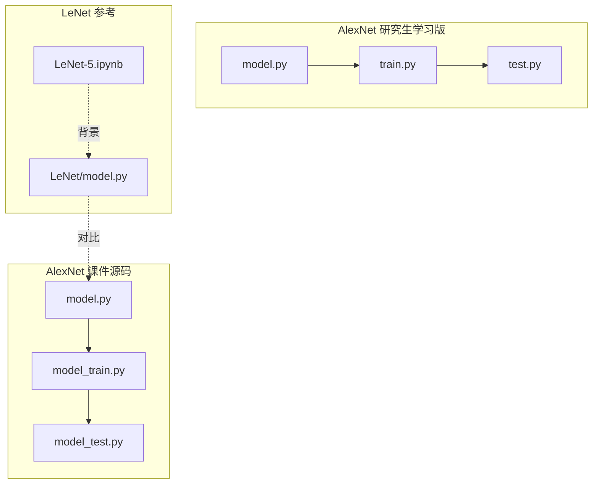
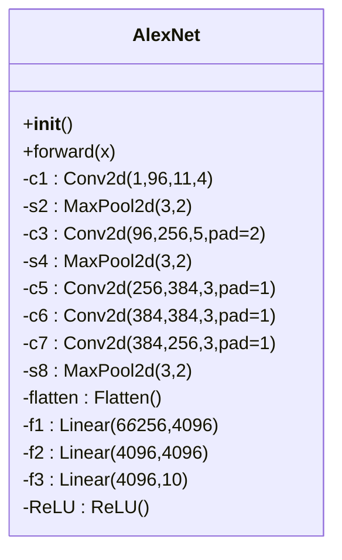
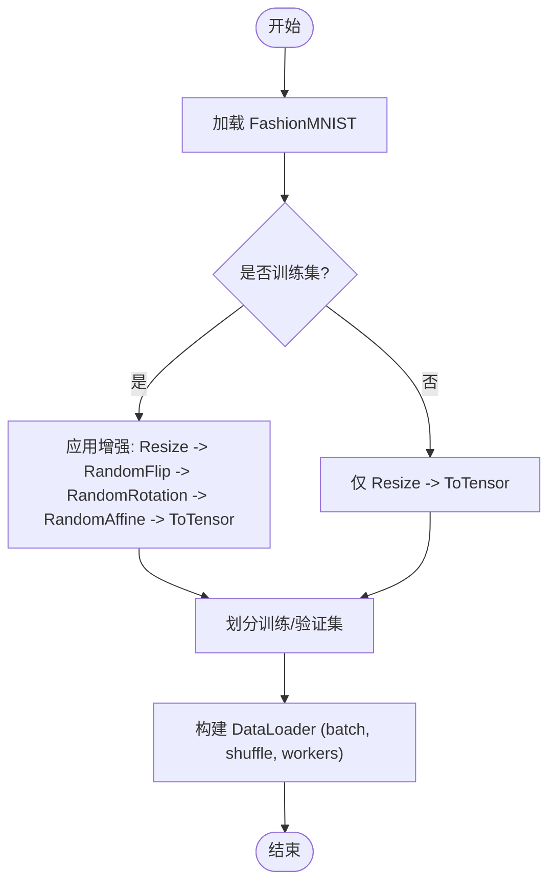
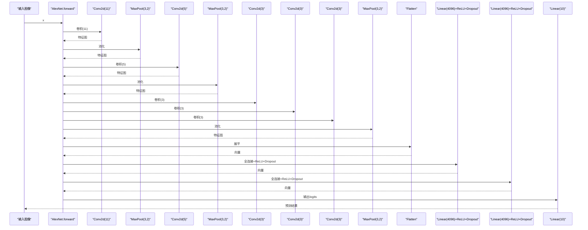
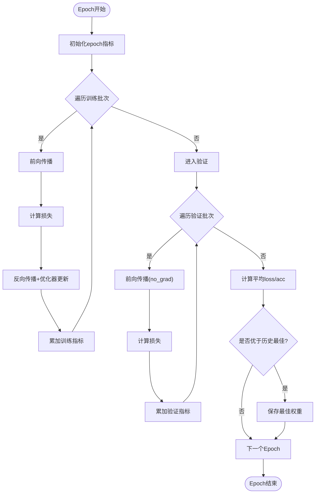
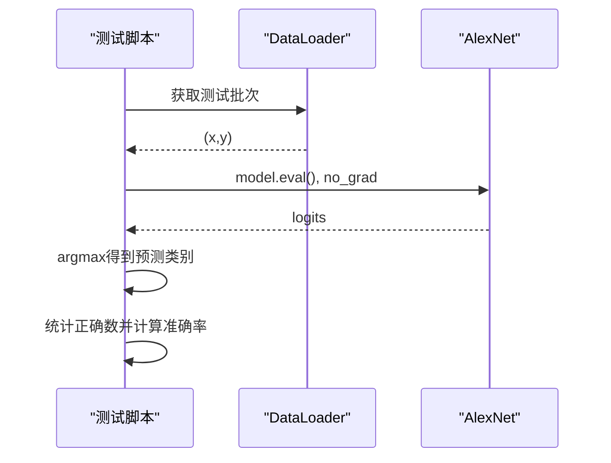
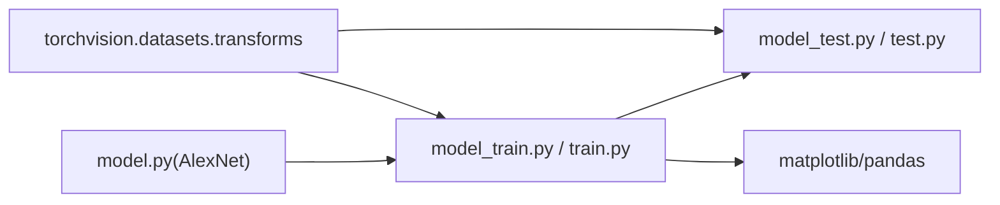
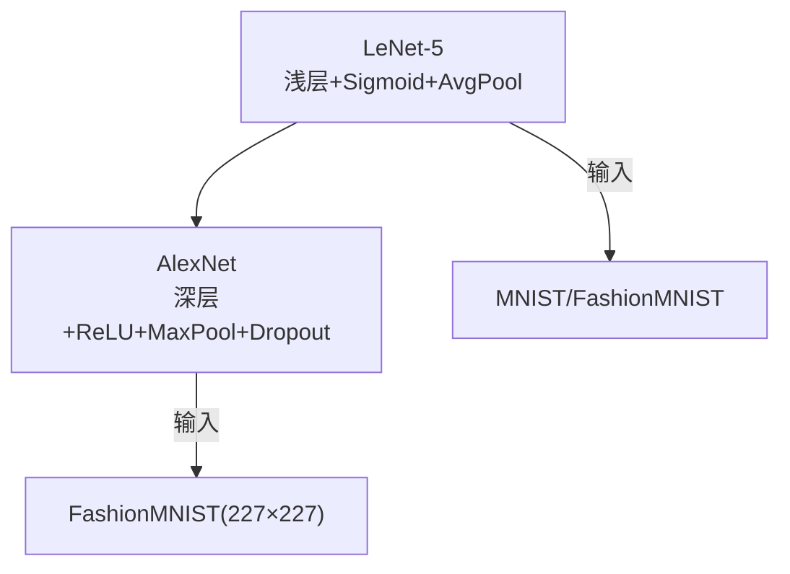

# AlexNet实现

<cite>
**本文引用的文件**   
- [model.py](file://study/上传课件、源码/源码/AlexNet/model.py)
- [model_train.py](file://study/上传课件、源码/源码/AlexNet/model_train.py)
- [model_test.py](file://study/上传课件、源码/源码/AlexNet/model_test.py)
- [model.py（研究生学习版）](file://study/研究生学习/6.AlexNet/model.py)
- [train.py（研究生学习版）](file://study/研究生学习/6.AlexNet/train.py)
- [test.py（研究生学习版）](file://study/研究生学习/6.AlexNet/test.py)
- [LeNet模型实现](file://study/上传课件、源码/源码/LeNet/model.py)
- [LeNet-5 学习笔记](file://study/研究生学习/5.LeNet/LeNet-5.ipynb)
</cite>

## 目录
1. [引言](#引言)
2. [项目结构](#项目结构)
3. [核心组件](#核心组件)
4. [架构总览](#架构总览)
5. [详细组件分析](#详细组件分析)
6. [依赖关系分析](#依赖关系分析)
7. [性能与训练技巧](#性能与训练技巧)
8. [故障排查指南](#故障排查指南)
9. [结论](#结论)
10. [附录：与LeNet-5的对比](#附录与lenet-5的对比)

## 引言
本文件围绕仓库中的AlexNet实现，系统梳理其作为深度学习里程碑的创新点与突破，包括8层深度网络设计、大卷积核策略、ReLU激活函数优势、Dropout正则化机制、GPU加速训练细节与分布式训练思路。文档同时提供完整代码解析（数据预处理、模型构建、训练循环、性能监控），并对比LeNet-5的技术改进与性能提升，最后给出训练技巧、超参数调优建议与常见问题解决方案。

## 项目结构
仓库包含两套AlexNet实现：
- 课件源码版本：位于 study/上传课件、源码/源码/AlexNet/
- 研究生学习版本：位于 study/研究生学习/6.AlexNet/

此外还包含LeNet-5参考实现与笔记，便于对比。

图表来源
- [model.py:1-52](file://study/上传课件、源码/源码/AlexNet/model.py#L1-L52)
- [model_train.py:1-193](file://study/上传课件、源码/源码/AlexNet/model_train.py#L1-L193)
- [model_test.py:1-90](file://study/上传课件、源码/源码/AlexNet/model_test.py#L1-L90)
- [model.py（研究生学习版）:1-50](file://study/研究生学习/6.AlexNet/model.py#L1-L50)
- [train.py（研究生学习版）:1-218](file://study/研究生学习/6.AlexNet/train.py#L1-L218)
- [test.py（研究生学习版）:1-99](file://study/研究生学习/6.AlexNet/test.py#L1-L99)
- [LeNet模型实现:1-37](file://study/上传课件、源码/源码/LeNet/model.py#L1-L37)
- [LeNet-5 学习笔记:1-301](file://study/研究生学习/5.LeNet/LeNet-5.ipynb#L1-L301)

章节来源
- [model.py:1-52](file://study/上传课件、源码/源码/AlexNet/model.py#L1-L52)
- [model_train.py:1-193](file://study/上传课件、源码/源码/AlexNet/model_train.py#L1-L193)
- [model_test.py:1-90](file://study/上传课件、源码/源码/AlexNet/model_test.py#L1-L90)
- [model.py（研究生学习版）:1-50](file://study/研究生学习/6.AlexNet/model.py#L1-L50)
- [train.py（研究生学习版）:1-218](file://study/研究生学习/6.AlexNet/train.py#L1-L218)
- [test.py（研究生学习版）:1-99](file://study/研究生学习/6.AlexNet/test.py#L1-L99)
- [LeNet模型实现:1-37](file://study/上传课件、源码/源码/LeNet/model.py#L1-L37)
- [LeNet-5 学习笔记:1-301](file://study/研究生学习/5.LeNet/LeNet-5.ipynb#L1-L301)

## 核心组件
- 模型定义：基于PyTorch的nn.Module，包含卷积块、池化、全连接与Dropout。
- 数据管道：使用torchvision.datasets.FashionMNIST与transforms进行预处理；DataLoader按批读取。
- 训练流程：Adam优化器、交叉熵损失、早停保存最佳权重、记录并可视化loss与准确率。
- 测试流程：加载最优权重，关闭梯度计算，统计准确率并打印样例预测。

章节来源
- [model.py:1-52](file://study/上传课件、源码/源码/AlexNet/model.py#L1-L52)
- [model_train.py:1-193](file://study/上传课件、源码/源码/AlexNet/model_train.py#L1-L193)
- [model_test.py:1-90](file://study/上传课件、源码/源码/AlexNet/model_test.py#L1-L90)
- [model.py（研究生学习版）:1-50](file://study/研究生学习/6.AlexNet/model.py#L1-L50)
- [train.py（研究生学习版）:1-218](file://study/研究生学习/6.AlexNet/train.py#L1-L218)
- [test.py（研究生学习版）:1-99](file://study/研究生学习/6.AlexNet/test.py#L1-L99)

## 架构总览
AlexNet在仓库中实现了8层深度网络（含卷积与全连接层），典型结构如下：
- 卷积阶段：大感受野卷积（如11×11）+最大池化，随后多层小卷积核（5×5、3×3）堆叠，逐步扩大通道数。
- 全连接阶段：两层大容量全连接层（4096单元），中间穿插Dropout防止过拟合。
- 输出层：10类分类头（适配FashionMNIST）。

图表来源
- [model.py:7-41](file://study/上传课件、源码/源码/AlexNet/model.py#L7-L41)

章节来源
- [model.py:7-41](file://study/上传课件、源码/源码/AlexNet/model.py#L7-L41)

## 详细组件分析

### 数据预处理与数据管道
- 数据集：FashionMNIST，灰度图，输入尺寸统一为227×227以匹配AlexNet首层步幅与池化后的特征图尺寸。
- 训练增强（研究生学习版）：随机水平翻转、随机旋转、随机仿射平移等，有助于泛化。
- DataLoader：设置batch_size、shuffle、num_workers以提升I/O吞吐。

图表来源
- [model_train.py:15-32](file://study/上传课件、源码/源码/AlexNet/model_train.py#L15-L32)
- [train.py（研究生学习版）:21-57](file://study/研究生学习/6.AlexNet/train.py#L21-L57)

章节来源
- [model_train.py:15-32](file://study/上传课件、源码/源码/AlexNet/model_train.py#L15-L32)
- [train.py（研究生学习版）:21-57](file://study/研究生学习/6.AlexNet/train.py#L21-L57)

### 模型构建与前向传播
- 卷积块：首层使用11×11大卷积核配合较大步幅，快速降低空间分辨率并捕获大范围上下文；后续5×5与3×3卷积逐步加深特征表达。
- 池化：最大池化用于进一步降维与平移不变性。
- 全连接：两层4096单元，中间插入Dropout（p=0.5）抑制共适应。
- 输出：10类线性层，配合交叉熵损失。

图表来源
- [model.py:25-41](file://study/上传课件、源码/源码/AlexNet/model.py#L25-L41)

章节来源
- [model.py:7-41](file://study/上传课件、源码/源码/AlexNet/model.py#L7-L41)

### 训练循环与监控
- 设备选择：自动检测CUDA，优先GPU。
- 优化器与损失：Adam（可加权重衰减）、交叉熵。
- 训练模式：每个mini-batch执行零梯度、反向传播、参数更新。
- 验证模式：no_grad下评估，累计loss与正确数，计算平均指标。
- 模型保存：保存验证集表现最佳的权重。
- 可视化：绘制训练/验证loss与准确率曲线。

图表来源
- [model_train.py:35-165](file://study/上传课件、源码/源码/AlexNet/model_train.py#L35-L165)
- [train.py（研究生学习版）:60-189](file://study/研究生学习/6.AlexNet/train.py#L60-L189)

章节来源
- [model_train.py:35-165](file://study/上传课件、源码/源码/AlexNet/model_train.py#L35-L165)
- [train.py（研究生学习版）:60-189](file://study/研究生学习/6.AlexNet/train.py#L60-L189)

### 测试流程
- 加载最佳权重，切换到eval模式。
- no_grad下前向推理，统计准确率并打印部分样本预测。

图表来源
- [model_test.py:22-53](file://study/上传课件、源码/源码/AlexNet/model_test.py#L22-L53)
- [test.py（研究生学习版）:28-59](file://study/研究生学习/6.AlexNet/test.py#L28-L59)

章节来源
- [model_test.py:22-53](file://study/上传课件、源码/源码/AlexNet/model_test.py#L22-L53)
- [test.py（研究生学习版）:28-59](file://study/研究生学习/6.AlexNet/test.py#L28-L59)

## 依赖关系分析
- 模块耦合：
  - 训练脚本依赖模型定义与数据管道。
  - 测试脚本依赖训练产出的最佳权重。
- 外部依赖：
  - PyTorch核心与torchvision数据集/变换。
  - matplotlib/pandas用于可视化与记录。

图表来源
- [model.py:1-52](file://study/上传课件、源码/源码/AlexNet/model.py#L1-L52)
- [model_train.py:1-193](file://study/上传课件、源码/源码/AlexNet/model_train.py#L1-L193)
- [model_test.py:1-90](file://study/上传课件、源码/源码/AlexNet/model_test.py#L1-L90)
- [model.py（研究生学习版）:1-50](file://study/研究生学习/6.AlexNet/model.py#L1-L50)
- [train.py（研究生学习版）:1-218](file://study/研究生学习/6.AlexNet/train.py#L1-L218)
- [test.py（研究生学习版）:1-99](file://study/研究生学习/6.AlexNet/test.py#L1-L99)

章节来源
- [model.py:1-52](file://study/上传课件、源码/源码/AlexNet/model.py#L1-L52)
- [model_train.py:1-193](file://study/上传课件、源码/源码/AlexNet/model_train.py#L1-L193)
- [model_test.py:1-90](file://study/上传课件、源码/源码/AlexNet/model_test.py#L1-L90)
- [model.py（研究生学习版）:1-50](file://study/研究生学习/6.AlexNet/model.py#L1-L50)
- [train.py（研究生学习版）:1-218](file://study/研究生学习/6.AlexNet/train.py#L1-L218)
- [test.py（研究生学习版）:1-99](file://study/研究生学习/6.AlexNet/test.py#L1-L99)

## 性能与训练技巧
- GPU加速：
  - 自动设备选择与to(device)迁移，充分利用CUDA并行能力。
  - DataLoader的num_workers开启多进程数据加载，减少I/O瓶颈。
- 正则化与稳定性：
  - Dropout（p=0.5）在全连接层后显著抑制过拟合。
  - 训练增强（随机翻转、旋转、仿射）提升泛化能力。
  - 权重衰减（weight_decay）辅助控制模型复杂度。
- 训练技巧：
  - 使用Adam优化器，初始学习率0.001；可结合学习率调度（如余弦退火或StepLR）稳定收敛。
  - 早停策略：以验证集最低loss或最高acc保存最佳权重。
  - 混合精度训练（可选）：通过AMP进一步提升吞吐。
- 分布式训练策略（扩展建议）：
  - 多卡数据并行：使用torch.nn.parallel.DistributedDataParallel，结合torch.distributed.launch或torchrun启动。
  - 梯度同步与通信：确保所有进程同步梯度，合理设置world_size与rank。
  - I/O优化：共享存储或预取缓存，避免多进程重复下载。
  - 检查点与恢复：跨进程安全保存/加载权重与优化器状态。

[本节为通用指导，不直接分析具体文件]

## 故障排查指南
- 内存不足（OOM）：
  - 减小batch_size或输入尺寸；确认显存占用与num_workers配置。
- 训练不收敛或震荡：
  - 调整学习率与权重衰减；检查数据归一化与标签分布。
- 过拟合：
  - 增大Dropout比例或增加数据增强；引入权重衰减或早停。
- 验证指标异常：
  - 确认验证阶段使用model.eval()与no_grad；检查数据管道一致性。
- 路径与权重加载错误：
  - 核对best_model.pth路径与设备一致；避免在不同设备上混用权重。

章节来源
- [model_train.py:143-157](file://study/上传课件、源码/源码/AlexNet/model_train.py#L143-L157)
- [train.py（研究生学习版）:168-180](file://study/研究生学习/6.AlexNet/train.py#L168-L180)
- [model_test.py:56-62](file://study/上传课件、源码/源码/AlexNet/model_test.py#L56-L62)
- [test.py（研究生学习版）:62-68](file://study/研究生学习/6.AlexNet/test.py#L62-L68)

## 结论
仓库中的AlexNet实现遵循经典8层深度网络设计，采用大卷积核与ReLU激活、最大池化与Dropout正则化，结合现代训练工程实践（GPU加速、数据增强、权重衰减、早停保存），在FashionMNIST上具备良好可复现性与可扩展性。相较LeNet-5，AlexNet在深度、非线性与正则化方面均有显著提升，更适合复杂视觉任务。

[本节为总结性内容，不直接分析具体文件]

## 附录：与LeNet-5的对比
- 网络深度与非线性：
  - LeNet-5：浅层网络，Sigmoid激活，平均池化。
  - AlexNet：更深网络，ReLU激活，最大池化，显著提升收敛速度与表达能力。
- 卷积核与感受野：
  - LeNet-5：5×5卷积为主。
  - AlexNet：首层11×11大核扩大感受野，后续5×5与3×3堆叠深化特征。
- 正则化与容量：
  - LeNet-5：无Dropout，全连接层较小。
  - AlexNet：两层4096全连接+Dropout，更强表征力但需更强正则化。
- 数据与任务：
  - LeNet-5：手写数字识别（MNIST/FashionMNIST）。
  - AlexNet：面向更复杂图像分类，仓库中使用FashionMNIST作为演示。

图表来源
- [LeNet模型实现:6-29](file://study/上传课件、源码/源码/LeNet/model.py#L6-L29)
- [LeNet-5 学习笔记:17-111](file://study/研究生学习/5.LeNet/LeNet-5.ipynb#L17-L111)
- [model.py:7-41](file://study/上传课件、源码/源码/AlexNet/model.py#L7-L41)

章节来源
- [LeNet模型实现:6-29](file://study/上传课件、源码/源码/LeNet/model.py#L6-L29)
- [LeNet-5 学习笔记:17-111](file://study/研究生学习/5.LeNet/LeNet-5.ipynb#L17-L111)
- [model.py:7-41](file://study/上传课件、源码/源码/AlexNet/model.py#L7-L41)