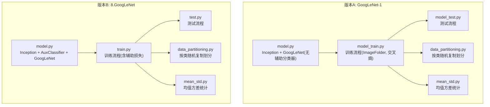
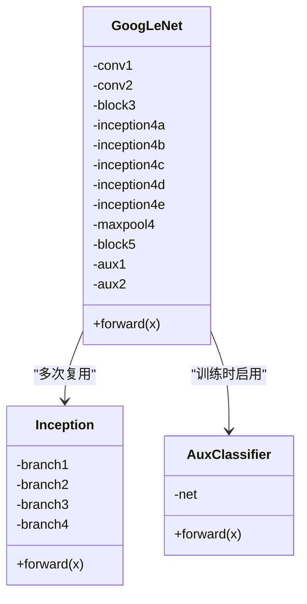
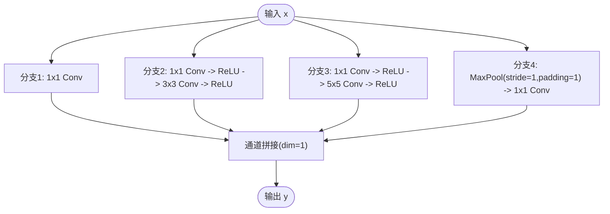
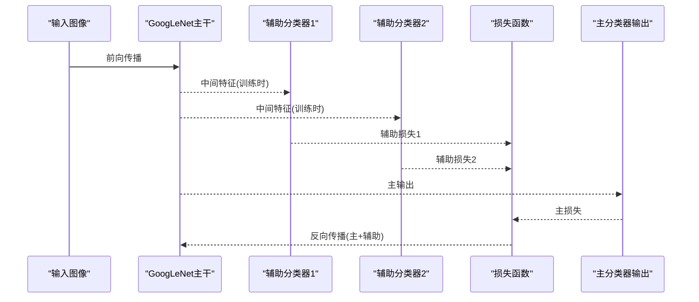
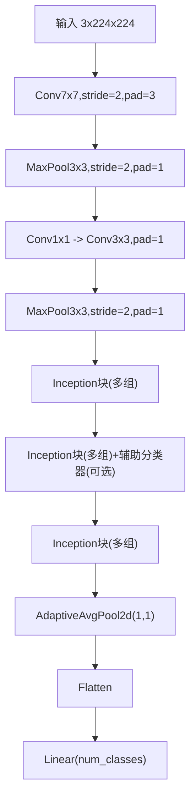
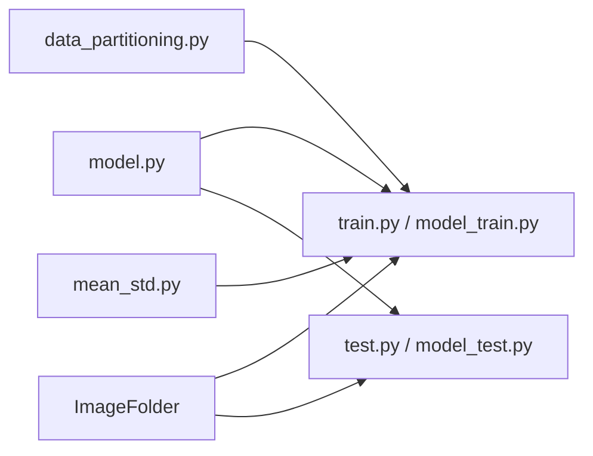
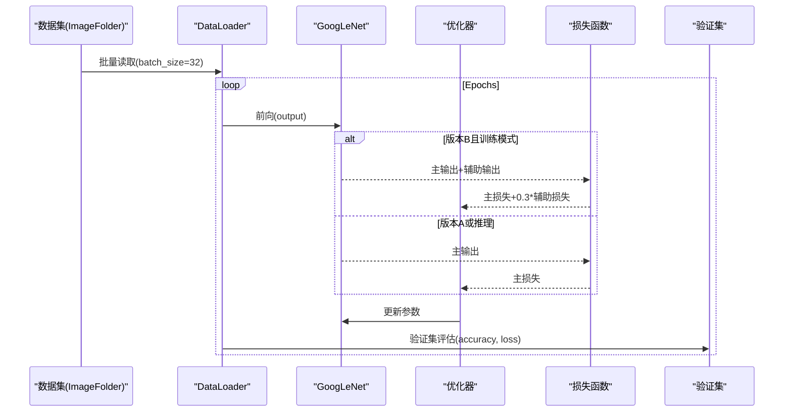

# GoogLeNet实现

<cite>
**本文引用的文件列表**
- [GoogLeNet-1/model.py](file://study/上传课件、源码/源码/GoogLeNet-1/model.py)
- [GoogLeNet-1/model_train.py](file://study/上传课件、源码/源码/GoogLeNet-1/model_train.py)
- [GoogLeNet-1/model_test.py](file://study/上传课件、源码/源码/GoogLeNet-1/model_test.py)
- [GoogLeNet-1/data_partitioning.py](file://study/上传课件、源码/源码/GoogLeNet-1/data_partitioning.py)
- [GoogLeNet-1/mean_std.py](file://study/上传课件、源码/源码/GoogLeNet-1/mean_std.py)
- [8.GoogLeNet/model.py](file://study/研究生学习/8.GoogLeNet/model.py)
- [8.GoogLeNet/train.py](file://study/研究生学习/8.GoogLeNet/train.py)
- [8.GoogLeNet/test.py](file://study/研究生学习/8.GoogLeNet/test.py)
- [8.GoogLeNet/data_partitioning.py](file://study/研究生学习/8.GoogLeNet/data_partitioning.py)
- [8.GoogLeNet/mean_std.py](file://study/研究生学习/8.GoogLeNet/mean_std.py)
</cite>

## 目录
1. [简介](#简介)
2. [项目结构](#项目结构)
3. [核心组件](#核心组件)
4. [架构总览](#架构总览)
5. [详细组件分析](#详细组件分析)
6. [依赖关系分析](#依赖关系分析)
7. [性能与复杂度分析](#性能与复杂度分析)
8. [实验设置与训练流程](#实验设置与训练流程)
9. [故障排查指南](#故障排查指南)
10. [结论](#结论)
11. [附录：数据预处理与统计信息计算](#附录数据预处理与统计信息计算)

## 简介
本文件围绕仓库中的两套GoogLeNet实现进行系统化文档化，重点解释Inception模块的多尺度特征提取思想与计算效率优化策略，深入剖析辅助分类器的作用与梯度流改善机制，说明多分支并行卷积核（1×1、3×3、5×5）的组合优势与维度压缩技术。同时，结合猫狗分类数据集的数据处理流程与ImageFolder的使用方式，提供完整的代码级解析，包括Inception模块构建、数据划分策略与统计信息计算，并对比传统CNN在计算复杂度与参数量控制方面的优势，最后给出实验设置、性能对比分析与实际应用指导。

## 项目结构
仓库包含两个版本的GoogLeNet实现：
- 版本A（GoogLeNet-1）：基础版，仅主分类器输出，未包含辅助分类器；使用猫狗数据集，基于ImageFolder加载并进行归一化。
- 版本B（8.GoogLeNet）：增强版，包含AuxClassifier辅助分类器，支持训练时多路损失融合；配套更完善的统计信息计算脚本与数据划分脚本。

图表来源
- [GoogLeNet-1/model.py:1-102](file://study/上传课件、源码/源码/GoogLeNet-1/model.py#L1-L102)
- [GoogLeNet-1/model_train.py:1-197](file://study/上传课件、源码/源码/GoogLeNet-1/model_train.py#L1-L197)
- [GoogLeNet-1/model_test.py:1-105](file://study/上传课件、源码/源码/GoogLeNet-1/model_test.py#L1-L105)
- [GoogLeNet-1/data_partitioning.py:1-49](file://study/上传课件、源码/源码/GoogLeNet-1/data_partitioning.py#L1-L49)
- [GoogLeNet-1/mean_std.py:1-58](file://study/上传课件、源码/源码/GoogLeNet-1/mean_std.py#L1-L58)
- [8.GoogLeNet/model.py:1-144](file://study/研究生学习/8.GoogLeNet/model.py#L1-L144)
- [8.GoogLeNet/train.py:1-206](file://study/研究生学习/8.GoogLeNet/train.py#L1-L206)
- [8.GoogLeNet/test.py:1-96](file://study/研究生学习/8.GoogLeNet/test.py#L1-L96)
- [8.GoogLeNet/data_partitioning.py:1-51](file://study/研究生学习/8.GoogLeNet/data_partitioning.py#L1-L51)
- [8.GoogLeNet/mean_std.py:1-56](file://study/研究生学习/8.GoogLeNet/mean_std.py#L1-L56)

章节来源
- [GoogLeNet-1/model.py:1-102](file://study/上传课件、源码/源码/GoogLeNet-1/model.py#L1-L102)
- [8.GoogLeNet/model.py:1-144](file://study/研究生学习/8.GoogLeNet/model.py#L1-L144)

## 核心组件
- Inception模块：四条并行分支（1×1卷积；1×1→3×3；1×1→5×5；3×3池化→1×1），在通道维度拼接，实现多尺度特征提取与跨通道组合。
- GoogLeNet主干：Stem部分（大卷积+池化）、多个Inception块、全局平均池化与分类头。
- 辅助分类器（版本B）：在中间层插入小型分类器，训练时参与损失计算，推理时可关闭。
- 数据处理：ImageFolder加载、Resize到224×224、ToTensor、Normalize（基于数据集统计的均值与标准差）。
- 训练流程：Adam优化器、交叉熵损失、早停保存最佳权重、训练/验证指标记录与可视化。
- 测试流程：模型加载、前向推理、准确率统计与单图预测示例。

章节来源
- [GoogLeNet-1/model.py:7-34](file://study/上传课件、源码/源码/GoogLeNet-1/model.py#L7-L34)
- [8.GoogLeNet/model.py:5-51](file://study/研究生学习/8.GoogLeNet/model.py#L5-L51)
- [8.GoogLeNet/model.py:54-69](file://study/研究生学习/8.GoogLeNet/model.py#L54-L69)
- [GoogLeNet-1/model_train.py:14-35](file://study/上传课件、源码/源码/GoogLeNet-1/model_train.py#L14-L35)
- [8.GoogLeNet/train.py:16-33](file://study/研究生学习/8.GoogLeNet/train.py#L16-L33)

## 架构总览
GoogLeNet通过Inception模块将不同感受野的特征并行提取并在通道维度拼接，配合1×1瓶颈层降低计算量与参数量，最终采用全局平均池化替代大规模全连接层，显著减少参数。版本B引入辅助分类器，在训练阶段为深层网络提供更直接的梯度信号，缓解梯度消失问题。

图表来源
- [8.GoogLeNet/model.py:5-51](file://study/研究生学习/8.GoogLeNet/model.py#L5-L51)
- [8.GoogLeNet/model.py:54-69](file://study/研究生学习/8.GoogLeNet/model.py#L54-L69)
- [8.GoogLeNet/model.py:71-137](file://study/研究生学习/8.GoogLeNet/model.py#L71-L137)

## 详细组件分析

### Inception模块：多尺度特征与维度压缩
- 多尺度并行：四个分支分别关注通道组合、局部小邻域、较大上下文与最强响应，拼接后让后续层自适应选择有用特征。
- 维度压缩：在3×3与5×5分支前使用1×1卷积降维，形成“瓶颈层”，大幅降低计算量与参数量，同时增加非线性变换。
- 空间尺寸一致性：3×3使用padding=1，5×5使用padding=2，最大池化使用stride=1、padding=1，确保四分支输出H×W一致，便于通道拼接。

图表来源
- [GoogLeNet-1/model.py:7-34](file://study/上传课件、源码/源码/GoogLeNet-1/model.py#L7-L34)
- [8.GoogLeNet/model.py:5-51](file://study/研究生学习/8.GoogLeNet/model.py#L5-L51)

章节来源
- [GoogLeNet-1/model.py:7-34](file://study/上传课件、源码/源码/GoogLeNet-1/model.py#L7-L34)
- [8.GoogLeNet/model.py:5-51](file://study/研究生学习/8.GoogLeNet/model.py#L5-L51)

### 辅助分类器：梯度流改善与正则化
- 位置与作用：在主干网络的中间层（如Inception 4a与4d之后）插入辅助分类器，训练时输出额外预测，并与主分类器输出共同计算损失。
- 梯度流改善：为深层特征提供更直接的监督信号，缓解梯度消失，提升训练稳定性。
- 正则化效果：辅助分支相当于对中间层的正则约束，有助于泛化。
- 推理行为：推理时通常只使用主分类器输出，辅助分支可关闭或忽略。

图表来源
- [8.GoogLeNet/model.py:54-69](file://study/研究生学习/8.GoogLeNet/model.py#L54-L69)
- [8.GoogLeNet/model.py:119-137](file://study/研究生学习/8.GoogLeNet/model.py#L119-L137)
- [8.GoogLeNet/train.py:90-94](file://study/研究生学习/8.GoogLeNet/train.py#L90-L94)

章节来源
- [8.GoogLeNet/model.py:54-69](file://study/研究生学习/8.GoogLeNet/model.py#L54-L69)
- [8.GoogLeNet/train.py:90-94](file://study/研究生学习/8.GoogLeNet/train.py#L90-L94)

### 主干网络与分类头
- Stem部分：7×7卷积+ReLU+最大池化，随后1×1+3×3+池化，逐步下采样至28×28。
- Inception块：多组Inception串联，通道数随深度递增，空间尺寸逐步减小。
- 全局平均池化：将特征图压缩为1×1向量，显著减少参数量，避免过拟合。
- 分类头：线性层输出类别数（猫狗二分类为2）。

图表来源
- [GoogLeNet-1/model.py:39-91](file://study/上传课件、源码/源码/GoogLeNet-1/model.py#L39-L91)
- [8.GoogLeNet/model.py:71-137](file://study/研究生学习/8.GoogLeNet/model.py#L71-L137)

章节来源
- [GoogLeNet-1/model.py:39-91](file://study/上传课件、源码/源码/GoogLeNet-1/model.py#L39-L91)
- [8.GoogLeNet/model.py:71-137](file://study/研究生学习/8.GoogLeNet/model.py#L71-L137)

## 依赖关系分析
- 模型定义与训练/测试脚本解耦：model.py仅负责网络结构，train.py与test.py负责数据、优化与评估。
- 数据加载：ImageFolder自动根据子文件夹名打标签，适合猫狗分类等自然图像任务。
- 统计信息：mean_std.py遍历数据集计算每通道均值与标准差，用于Normalize。
- 数据划分：data_partitioning.py按类别随机抽取一定比例作为测试集，其余为训练集。

图表来源
- [GoogLeNet-1/model.py:1-102](file://study/上传课件、源码/源码/GoogLeNet-1/model.py#L1-L102)
- [GoogLeNet-1/model_train.py:1-197](file://study/上传课件、源码/源码/GoogLeNet-1/model_train.py#L1-L197)
- [GoogLeNet-1/model_test.py:1-105](file://study/上传课件、源码/源码/GoogLeNet-1/model_test.py#L1-L105)
- [8.GoogLeNet/model.py:1-144](file://study/研究生学习/8.GoogLeNet/model.py#L1-L144)
- [8.GoogLeNet/train.py:1-206](file://study/研究生学习/8.GoogLeNet/train.py#L1-L206)
- [8.GoogLeNet/test.py:1-96](file://study/研究生学习/8.GoogLeNet/test.py#L1-L96)

章节来源
- [GoogLeNet-1/model_train.py:14-35](file://study/上传课件、源码/源码/GoogLeNet-1/model_train.py#L14-L35)
- [8.GoogLeNet/train.py:16-33](file://study/研究生学习/8.GoogLeNet/train.py#L16-L33)

## 性能与复杂度分析
- 多尺度并行带来的表达能力提升：不同感受野的分支能捕获从细节到上下文的多种特征，提高分类鲁棒性。
- 1×1瓶颈层降低计算量：在3×3与5×5分支前降维，显著减少乘加运算与参数量，使网络更深更宽仍可训练。
- 全局平均池化替代大型全连接层：减少大量参数，降低过拟合风险，提升泛化能力。
- 与传统CNN对比：相比VGG等堆叠大卷积核与大型全连接层的方案，GoogLeNet在保持深度的同时有效控制参数量与计算复杂度，更适合资源受限场景。

[本节为通用性能讨论，不直接分析具体文件]

## 实验设置与训练流程
- 数据集与预处理：
  - 路径：data_cat_dog（原始数据），经data_partitioning.py划分为data/train与data/test（或data_me/train与data_me/test）。
  - 加载：ImageFolder自动识别子文件夹为类别标签。
  - 变换：Resize(224,224)、ToTensor、Normalize（基于mean_std.py计算的均值与标准差）。
- 训练配置：
  - 优化器：Adam，学习率0.001。
  - 损失：交叉熵；版本B训练时融合主损失与辅助损失（常见权重0.3）。
  - 设备：优先GPU，否则CPU。
  - 保存：验证集准确率最高时的模型权重。
- 评估与可视化：
  - 每个epoch记录训练/验证损失与准确率，绘制曲线。
  - 测试阶段仅前向推理，统计准确率并打印逐样本预测结果。

图表来源
- [GoogLeNet-1/model_train.py:39-169](file://study/上传课件、源码/源码/GoogLeNet-1/model_train.py#L39-L169)
- [8.GoogLeNet/train.py:36-168](file://study/研究生学习/8.GoogLeNet/train.py#L36-L168)
- [8.GoogLeNet/model.py:119-137](file://study/研究生学习/8.GoogLeNet/model.py#L119-L137)

章节来源
- [GoogLeNet-1/model_train.py:14-35](file://study/上传课件、源码/源码/GoogLeNet-1/model_train.py#L14-L35)
- [8.GoogLeNet/train.py:16-33](file://study/研究生学习/8.GoogLeNet/train.py#L16-L33)
- [8.GoogLeNet/train.py:90-94](file://study/研究生学习/8.GoogLeNet/train.py#L90-L94)

## 故障排查指南
- 数据路径错误：确认data_cat_dog、data/train、data/test（或data_me/train、data_me/test）存在且包含正确的类别子文件夹。
- Normalize参数不一致：确保训练与测试使用的均值与标准差一致，来源于同一数据集统计。
- 分支尺寸不一致：检查3×3与5×5卷积的padding以及最大池化的stride与padding，保证四分支输出H×W一致。
- 辅助分类器开关：推理时确保aux_logits关闭或仅取主输出，避免返回元组导致下游逻辑异常。
- DataLoader参数：num_workers与batch_size需适配硬件，避免内存不足或I/O瓶颈。

章节来源
- [GoogLeNet-1/model.py:7-34](file://study/上传课件、源码/源码/GoogLeNet-1/model.py#L7-L34)
- [8.GoogLeNet/model.py:5-51](file://study/研究生学习/8.GoogLeNet/model.py#L5-L51)
- [GoogLeNet-1/model_train.py:14-35](file://study/上传课件、源码/源码/GoogLeNet-1/model_train.py#L14-L35)
- [8.GoogLeNet/train.py:16-33](file://study/研究生学习/8.GoogLeNet/train.py#L16-L33)

## 结论
GoogLeNet通过Inception模块的多尺度并行与1×1瓶颈层有效提升了表达能力并控制了计算复杂度，辅以全局平均池化进一步减少参数。版本B引入的辅助分类器在训练阶段改善了梯度流，有助于稳定训练与提升性能。结合ImageFolder与自定义统计信息的标准化流程，该实现适用于猫狗分类等实际任务，具备良好的可扩展性与工程落地价值。

[本节为总结性内容，不直接分析具体文件]

## 附录：数据预处理与统计信息计算
- 数据划分：
  - data_partitioning.py遍历data_cat_dog下的类别文件夹，按比例随机抽取图像复制到data/test，其余放入data/train（或data_me/train与data_me/test）。
- 统计信息计算：
  - mean_std.py遍历训练集图片，计算每通道的均值与标准差，供Normalize使用。
- ImageFolder使用：
  - train_val_data_process与test_data_process中通过ImageFolder加载数据，统一Resize到224×224，转换为张量并应用Normalize。

章节来源
- [GoogLeNet-1/data_partitioning.py:1-49](file://study/上传课件、源码/源码/GoogLeNet-1/data_partitioning.py#L1-L49)
- [8.GoogLeNet/data_partitioning.py:1-51](file://study/研究生学习/8.GoogLeNet/data_partitioning.py#L1-L51)
- [GoogLeNet-1/mean_std.py:1-58](file://study/上传课件、源码/源码/GoogLeNet-1/mean_std.py#L1-L58)
- [8.GoogLeNet/mean_std.py:1-56](file://study/研究生学习/8.GoogLeNet/mean_std.py#L1-L56)
- [GoogLeNet-1/model_train.py:14-35](file://study/上传课件、源码/源码/GoogLeNet-1/model_train.py#L14-L35)
- [8.GoogLeNet/train.py:16-33](file://study/研究生学习/8.GoogLeNet/train.py#L16-L33)