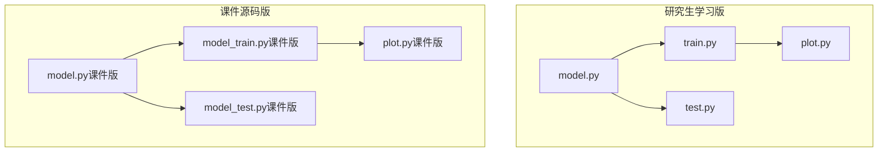
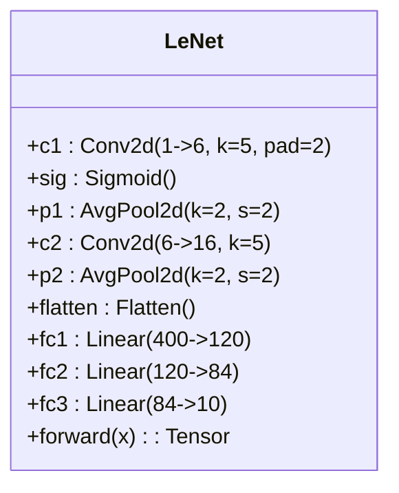
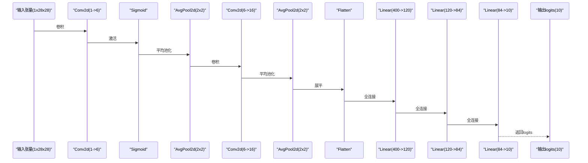
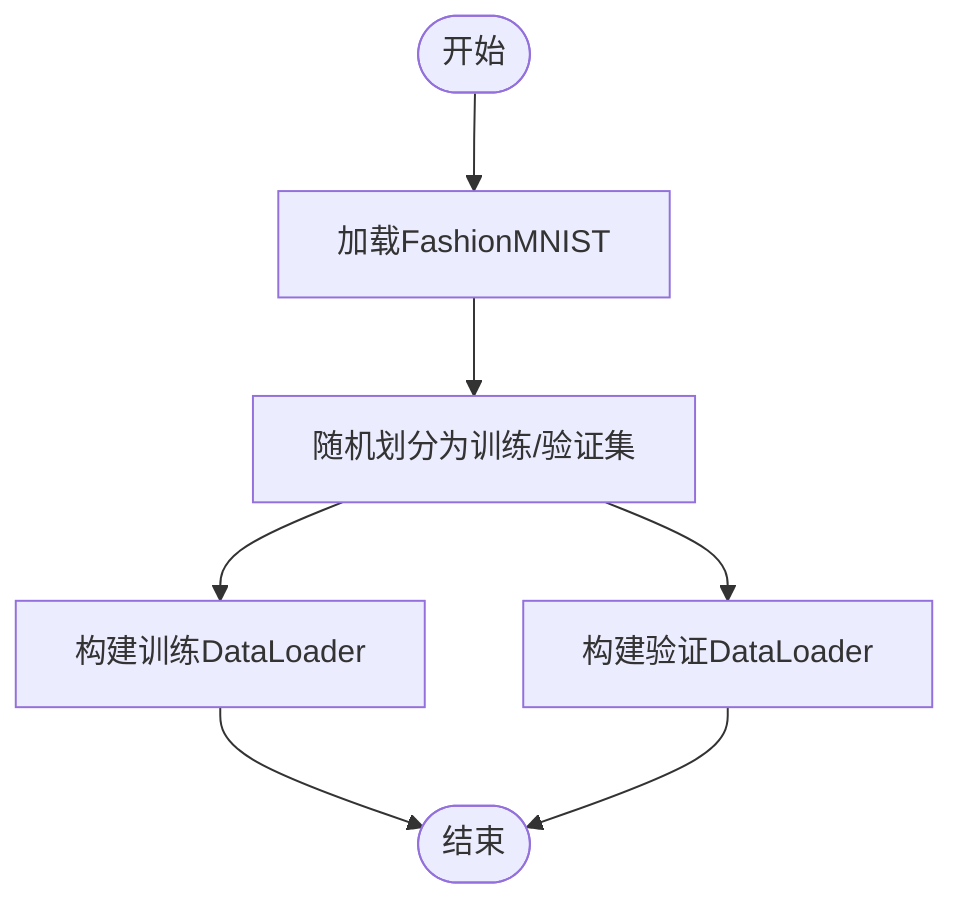
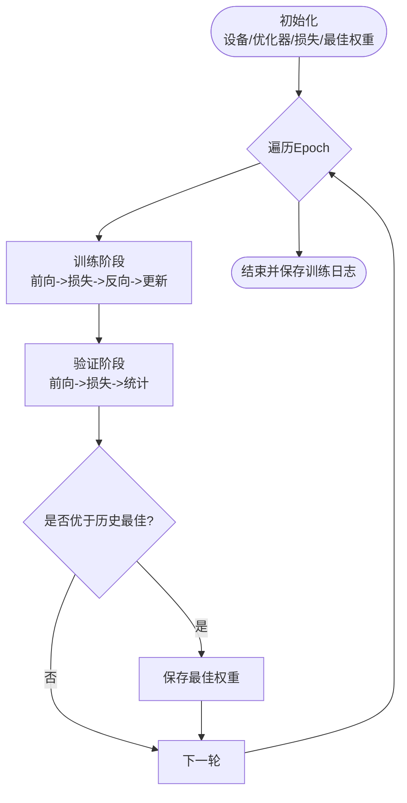
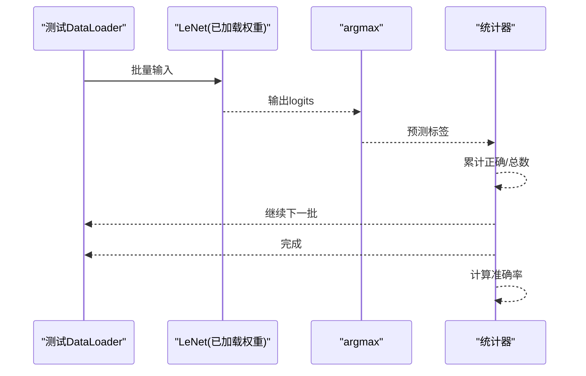
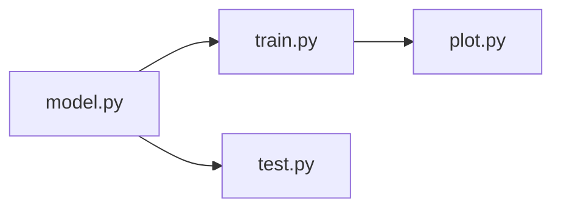

# LeNet-5实现

<cite>
**本文引用的文件**   
- [model.py](file://study/研究生学习/5.LeNet/model.py)
- [train.py](file://study/研究生学习/5.LeNet/train.py)
- [test.py](file://study/研究生学习/5.LeNet/test.py)
- [plot.py](file://study/研究生学习/5.LeNet/plot.py)
- [model.py（课件版）](file://study/上传课件、源码/源码/LeNet/model.py)
- [model_train.py（课件版）](file://study/上传课件、源码/源码/LeNet/model_train.py)
- [model_test.py（课件版）](file://study/上传课件、源码/源码/LeNet/model_test.py)
- [plot.py（课件版）](file://study/上传课件、源码/源码/LeNet/plot.py)
</cite>

## 目录
1. [引言](#引言)
2. [项目结构](#项目结构)
3. [核心组件](#核心组件)
4. [架构总览](#架构总览)
5. [详细组件分析](#详细组件分析)
6. [依赖关系分析](#依赖关系分析)
7. [性能与训练效果](#性能与训练效果)
8. [故障排查指南](#故障排查指南)
9. [结论](#结论)
10. [附录：常见问题与概念澄清](#附录：常见问题与概念澄清)

## 引言
本文件围绕仓库中的LeNet-5实现，系统梳理其历史意义、网络结构与关键设计思想，并结合FashionMNIST数据集的训练流程、损失函数选择与优化策略进行深度解析。文档同时提供代码级的前向传播路径、参数初始化方式、模型保存与加载机制说明，以及可视化与评估方法，帮助初学者建立对卷积神经网络（CNN）的直观理解。

## 项目结构
本项目包含两套LeNet-5实现：
- 研究生学习版：位于 study/研究生学习/5.LeNet/
- 课件源码版：位于 study/上传课件、源码/源码/LeNet/

两者在模型定义、训练与测试流程上基本一致，差异主要体现在数据预处理细节、批大小、工作进程数、保存路径等工程化配置。

图示来源
- [model.py:1-38](file://study/研究生学习/5.LeNet/model.py#L1-L38)
- [train.py:1-202](file://study/研究生学习/5.LeNet/train.py#L1-L202)
- [test.py:1-85](file://study/研究生学习/5.LeNet/test.py#L1-L85)
- [plot.py:1-42](file://study/研究生学习/5.LeNet/plot.py#L1-L42)
- [model.py（课件版）:1-37](file://study/上传课件、源码/源码/LeNet/model.py#L1-L37)
- [model_train.py（课件版）:1-191](file://study/上传课件、源码/源码/LeNet/model_train.py#L1-L191)
- [model_test.py（课件版）:1-65](file://study/上传课件、源码/源码/LeNet/model_test.py#L1-L65)
- [plot.py（课件版）:1-38](file://study/上传课件、源码/源码/LeNet/plot.py#L1-L38)

章节来源
- [model.py:1-38](file://study/研究生学习/5.LeNet/model.py#L1-L38)
- [train.py:1-202](file://study/研究生学习/5.LeNet/train.py#L1-L202)
- [test.py:1-85](file://study/研究生学习/5.LeNet/test.py#L1-L85)
- [plot.py:1-42](file://study/研究生学习/5.LeNet/plot.py#L1-L42)
- [model.py（课件版）:1-37](file://study/上传课件、源码/源码/LeNet/model.py#L1-L37)
- [model_train.py（课件版）:1-191](file://study/上传课件、源码/源码/LeNet/model_train.py#L1-L191)
- [model_test.py（课件版）:1-65](file://study/上传课件、源码/源码/LeNet/model_test.py#L1-L65)
- [plot.py（课件版）:1-38](file://study/上传课件、源码/源码/LeNet/plot.py#L1-L38)

## 核心组件
- 模型定义：LeNet类，包含两个卷积层、两个平均池化层、一个展平层和三个全连接层。激活函数使用Sigmoid；分类输出未加Softmax，由交叉熵损失内部处理。
- 训练流程：FashionMNIST数据集划分训练/验证集，Adam优化器，交叉熵损失，按轮次记录并保存最佳验证准确率对应的模型权重。
- 测试流程：加载已保存的最佳权重，在测试集上进行前向推理并统计准确率。
- 可视化：绘制训练/验证损失与准确率曲线；展示部分批次图像以确认数据预处理正确性。

章节来源
- [model.py:5-33](file://study/研究生学习/5.LeNet/model.py#L5-L33)
- [train.py:24-178](file://study/研究生学习/5.LeNet/train.py#L24-L178)
- [test.py:17-48](file://study/研究生学习/5.LeNet/test.py#L17-L48)
- [plot.py:9-41](file://study/研究生学习/5.LeNet/plot.py#L9-L41)
- [model.py（课件版）:6-29](file://study/上传课件、源码/源码/LeNet/model.py#L6-L29)
- [model_train.py（课件版）:15-162](file://study/上传课件、源码/源码/LeNet/model_train.py#L15-L162)
- [model_test.py（课件版）:9-53](file://study/上传课件、源码/源码/LeNet/model_test.py#L9-L53)
- [plot.py（课件版）:9-38](file://study/上传课件、源码/源码/LeNet/plot.py#L9-L38)

## 架构总览
LeNet-5作为首个成功应用的卷积神经网络，奠定了“卷积-池化-全连接”的经典范式。本实现遵循以下要点：
- 输入尺寸：单通道28×28灰度图（FashionMNIST）。
- 卷积层C1/C2：分别提取局部特征并增加通道数，配合Sigmoid非线性。
- 平均池化层：下采样降低空间分辨率，增强平移不变性。
- 全连接层FC1/FC2/FC3：将二维特征图展平后进行高层语义建模与分类。
- 输出：10维 logits，由交叉熵损失直接计算。

图示来源
- [model.py:5-33](file://study/研究生学习/5.LeNet/model.py#L5-L33)
- [model.py（课件版）:6-29](file://study/上传课件、源码/源码/LeNet/model.py#L6-L29)

## 详细组件分析

### 模型定义与前向传播
- 卷积层C1：输入通道1，输出通道6，核大小5，padding=2保持空间尺寸不变。
- 激活Sigmoid：引入非线性，但现代实践中更常用ReLU；此处为复现经典LeNet风格。
- 平均池化P1：核2步长2，将特征图尺寸减半。
- 卷积层C2：输入通道6，输出通道16，核大小5无padding，进一步降维。
- 平均池化P2：再次减半。
- 展平Flatten：将二维特征图拉直为一维向量，维度为400。
- 全连接层FC1/FC2/FC3：依次映射到120、84、10维，最终输出logits。

图示来源
- [model.py:22-33](file://study/研究生学习/5.LeNet/model.py#L22-L33)
- [model.py（课件版）:20-29](file://study/上传课件、源码/源码/LeNet/model.py#L20-L29)

章节来源
- [model.py:5-33](file://study/研究生学习/5.LeNet/model.py#L5-L33)
- [model.py（课件版）:6-29](file://study/上传课件、源码/源码/LeNet/model.py#L6-L29)

### 数据加载与预处理
- 数据集：FashionMNIST，训练集按8:2随机切分为训练/验证集。
- 预处理：Resize(28)、ToTensor()，将像素归一化至[0,1]范围。
- DataLoader：设置batch_size、shuffle、num_workers、pin_memory等以提升I/O效率。

图示来源
- [train.py:24-48](file://study/研究生学习/5.LeNet/train.py#L24-L48)
- [model_train.py（课件版）:15-32](file://study/上传课件、源码/源码/LeNet/model_train.py#L15-L32)

章节来源
- [train.py:24-48](file://study/研究生学习/5.LeNet/train.py#L24-L48)
- [model_train.py（课件版）:15-32](file://study/上传课件、源码/源码/LeNet/model_train.py#L15-L32)

### 训练流程与优化策略
- 设备：自动检测CUDA，优先GPU。
- 优化器：Adam，学习率0.001。
- 损失函数：交叉熵损失（CrossEntropyLoss），内部包含LogSoftmax与NLLLoss，无需手动添加Softmax。
- 训练循环：每轮遍历训练集，执行前向、计算损失、清零梯度、反向传播、参数更新；随后在验证集上评估并记录指标。
- 模型保存：保存验证准确率最高的模型权重。

图示来源
- [train.py:50-178](file://study/研究生学习/5.LeNet/train.py#L50-L178)
- [model_train.py（课件版）:35-162](file://study/上传课件、源码/源码/LeNet/model_train.py#L35-L162)

章节来源
- [train.py:50-178](file://study/研究生学习/5.LeNet/train.py#L50-L178)
- [model_train.py（课件版）:35-162](file://study/上传课件、源码/源码/LeNet/model_train.py#L35-L162)

### 测试与推理
- 加载测试集：FashionMNIST测试集，Resize(28)、ToTensor()。
- 推理模式：关闭梯度计算，模型设为eval，逐批前向得到预测标签。
- 准确率统计：累计正确样本数与总样本数，计算整体准确率。
- 示例推理：打印真实类别与预测类别，便于直观检查。

图示来源
- [test.py:17-48](file://study/研究生学习/5.LeNet/test.py#L17-L48)
- [model_test.py（课件版）:22-53](file://study/上传课件、源码/源码/LeNet/model_test.py#L22-L53)

章节来源
- [test.py:17-48](file://study/研究生学习/5.LeNet/test.py#L17-L48)
- [model_test.py（课件版）:22-53](file://study/上传课件、源码/源码/LeNet/model_test.py#L22-L53)

### 可视化与结果记录
- 训练过程可视化：绘制训练/验证损失与准确率曲线，辅助诊断过拟合或欠拟合。
- 数据可视化：展示一个批次的数据图像与对应类别，确保预处理与标签对齐正确。

章节来源
- [train.py:180-191](file://study/研究生学习/5.LeNet/train.py#L180-L191)
- [plot.py:9-41](file://study/研究生学习/5.LeNet/plot.py#L9-L41)
- [model_train.py（课件版）:165-181](file://study/上传课件、源码/源码/LeNet/model_train.py#L165-L181)
- [plot.py（课件版）:9-38](file://study/上传课件、源码/源码/LeNet/plot.py#L9-L38)

## 依赖关系分析
- 模块耦合：
  - train.py/test.py 依赖 model.py 定义的LeNet类。
  - plot.py 独立用于数据可视化。
- 外部依赖：
  - torch、torchvision、matplotlib、pandas、numpy。
- 可能的循环依赖：无。各脚本通过相对导入组织，职责清晰。

图示来源
- [model.py:1-38](file://study/研究生学习/5.LeNet/model.py#L1-L38)
- [train.py:1-202](file://study/研究生学习/5.LeNet/train.py#L1-L202)
- [test.py:1-85](file://study/研究生学习/5.LeNet/test.py#L1-L85)
- [plot.py:1-42](file://study/研究生学习/5.LeNet/plot.py#L1-L42)

章节来源
- [model.py:1-38](file://study/研究生学习/5.LeNet/model.py#L1-L38)
- [train.py:1-202](file://study/研究生学习/5.LeNet/train.py#L1-L202)
- [test.py:1-85](file://study/研究生学习/5.LeNet/test.py#L1-L85)
- [plot.py:1-42](file://study/研究生学习/5.LeNet/plot.py#L1-L42)

## 性能与训练效果
- 典型表现：在FashionMNIST上，LeNet-5通常可达到约90%以上的验证准确率。具体数值取决于超参（如batch size、学习率、epoch数）与硬件环境。
- 收敛趋势：训练损失下降、验证损失先降后升可能提示过拟合；验证准确率趋于稳定或小幅波动属正常现象。
- 调参建议：
  - 若欠拟合：适当增加epoch、微调学习率、考虑替换Sigmoid为ReLU以提升表达能力。
  - 若过拟合：减少模型容量、增加正则化（如Dropout）、增大数据增强或提前停止。
- 运行效率：启用GPU与多进程数据加载可显著缩短训练时间；pin_memory在CUDA环境下有助于加速数据传输。

章节来源
- [train.py:50-178](file://study/研究生学习/5.LeNet/train.py#L50-L178)
- [model_train.py（课件版）:35-162](file://study/上传课件、源码/源码/LeNet/model_train.py#L35-L162)

## 故障排查指南
- 维度不匹配错误：
  - 症状：全连接层输入维度报错。
  - 原因：卷积+池化后的特征图尺寸变化导致展平后维度非400。
  - 排查：核对输入尺寸、卷积核大小与padding、池化步幅。
  - 参考位置：[model.py:9-18](file://study/研究生学习/5.LeNet/model.py#L9-L18)
- 内存不足（OOM）：
  - 症状：CUDA OOM或CPU内存溢出。
  - 解决：减小batch size、关闭多进程、禁用pin_memory或切换到CPU。
  - 参考位置：[train.py:16-21](file://study/研究生学习/5.LeNet/train.py#L16-L21)
- 精度异常低：
  - 症状：准确率远低于预期。
  - 排查：确认数据预处理（Resize/ToTensor）顺序与目标尺寸；检查是否误用Softmax后再接交叉熵。
  - 参考位置：[train.py:24-48](file://study/研究生学习/5.LeNet/train.py#L24-L48), [model.py:22-33](file://study/研究生学习/5.LeNet/model.py#L22-L33)
- 无法加载模型权重：
  - 症状：load_state_dict失败。
  - 原因：路径错误或权重文件损坏。
  - 解决：确认保存路径与加载路径一致，确保文件存在且格式正确。
  - 参考位置：[test.py:54-55](file://study/研究生学习/5.LeNet/test.py#L54-L55)

章节来源
- [model.py:9-18](file://study/研究生学习/5.LeNet/model.py#L9-L18)
- [train.py:16-21](file://study/研究生学习/5.LeNet/train.py#L16-L21)
- [test.py:54-55](file://study/研究生学习/5.LeNet/test.py#L54-L55)

## 结论
本实现完整复现了LeNet-5的核心思想与工程流程：从卷积特征提取、池化降维到全连接分类，结合FashionMNIST数据集完成了训练、验证、保存与测试的全链路。尽管使用了Sigmoid激活与现代框架API，但其结构与训练范式仍忠实于LeNet-5的历史贡献。对于初学者而言，该实现提供了理解CNN基础概念与PyTorch实践的良好起点。

## 附录：常见问题与概念澄清
- 为什么输出层不加Softmax？
  - CrossEntropyLoss内部已包含LogSoftmax与负对数似然，额外Softmax会导致双重softmax，影响训练稳定性。
  - 参考位置：[train.py](file://study/研究生学习/5.LeNet/train.py#L56)
- Sigmoid vs ReLU：
  - Sigmoid易饱和导致梯度消失，ReLU在现代网络中更常用；本实现保留Sigmoid以贴近原始LeNet风格。
  - 参考位置：[model.py](file://study/研究生学习/5.LeNet/model.py#L10)
- 平均池化的作用：
  - 降低空间分辨率、扩大感受野、提升平移不变性，有助于后续全连接层的泛化能力。
  - 参考位置：[model.py:11-13](file://study/研究生学习/5.LeNet/model.py#L11-L13)
- FashionMNIST类别含义：
  - 10个类别包括上衣、裤子、套头衫、连衣裙、外套、凉鞋、衬衫、运动鞋、包、短靴等。
  - 参考位置：[plot.py:31-38](file://study/研究生学习/5.LeNet/plot.py#L31-L38)