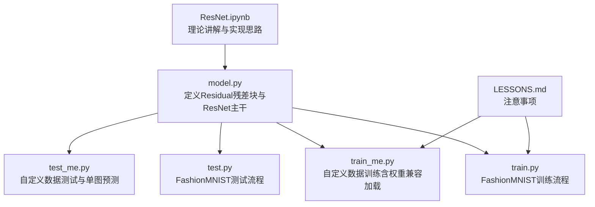
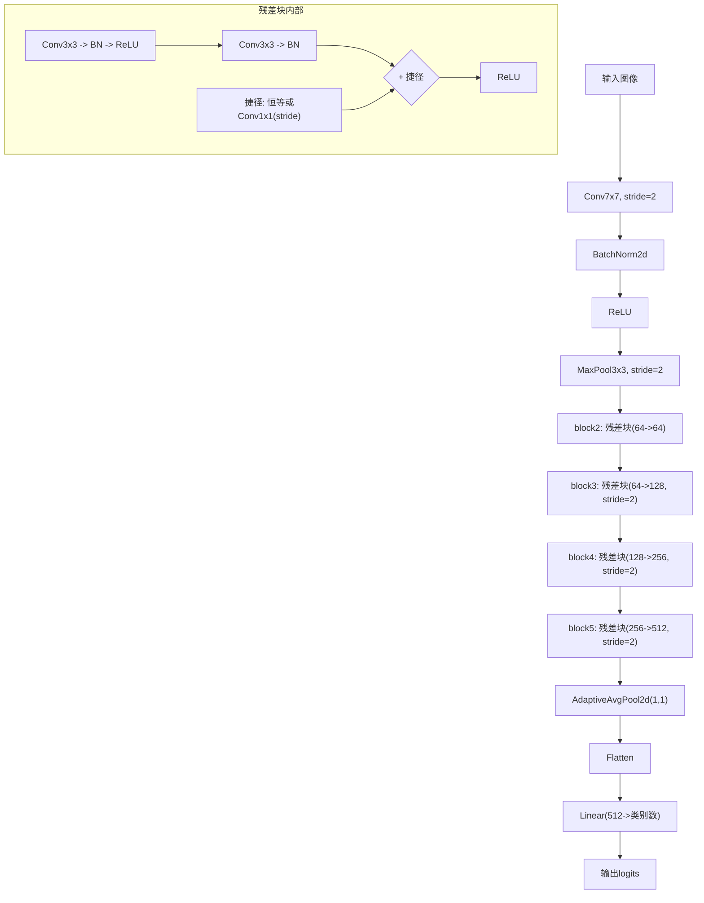
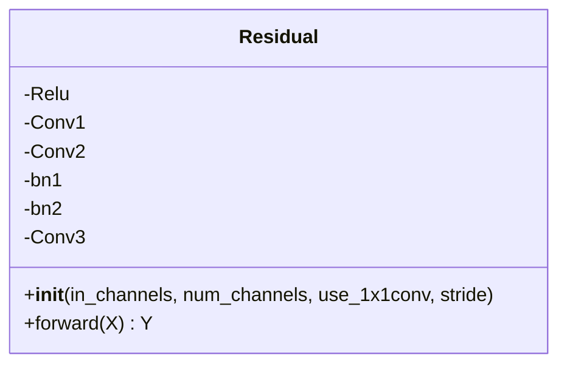
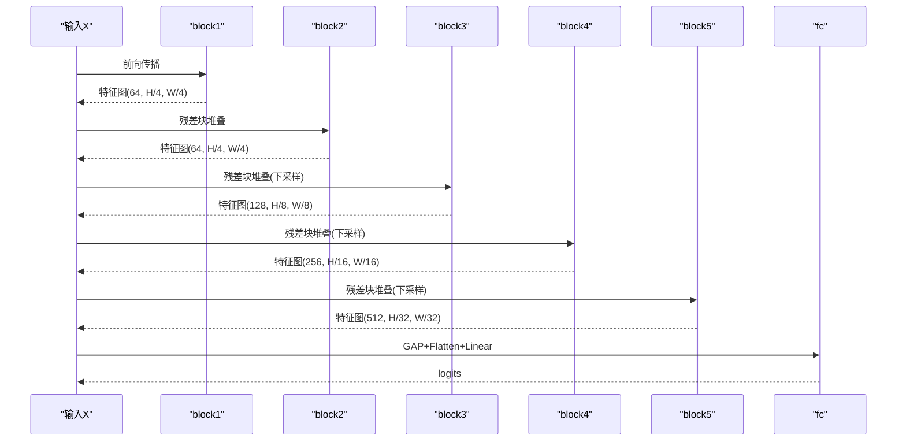
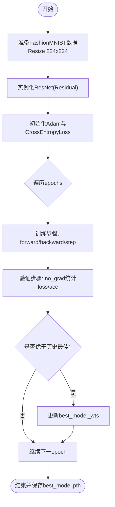
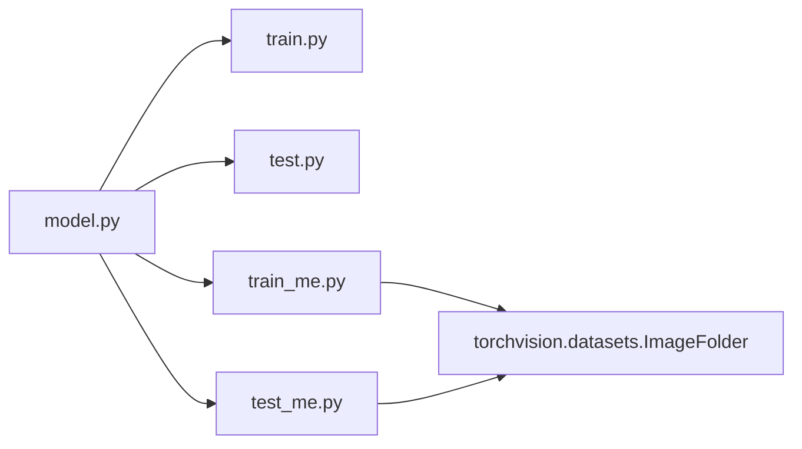

# ResNet实现

<cite>
**本文引用的文件**   
- [model.py](file://study\研究生学习\9.ResNet\model.py)
- [train.py](file://study\研究生学习\9.ResNet\train.py)
- [test.py](file://study\研究生学习\9.ResNet\test.py)
- [train_me.py](file://study\研究生学习\9.ResNet\train_me.py)
- [test_me.py](file://study\研究生学习\9.ResNet\test_me.py)
- [ResNet.ipynb](file://study\研究生学习\9.ResNet\ResNet.ipynb)
- [LESSONS.md](file://study\研究生学习\9.ResNet\LESSONS.md)
</cite>

## 目录
1. [简介](#简介)
2. [项目结构](#项目结构)
3. [核心组件](#核心组件)
4. [架构总览](#架构总览)
5. [详细组件分析](#详细组件分析)
6. [依赖关系分析](#依赖关系分析)
7. [性能与训练技巧](#性能与训练技巧)
8. [故障排查指南](#故障排查指南)
9. [结论](#结论)
10. [附录：不同深度变体对比](#附录不同深度变体对比)

## 简介
本仓库包含一个基于PyTorch的ResNet实现，涵盖模型定义、训练流程、测试脚本以及针对小数据集（FashionMNIST）和自定义图像分类任务的迁移学习示例。代码重点展示了残差块的结构设计、跳跃连接在深层网络中的作用、批量归一化对训练稳定性的贡献，以及从浅层到深层ResNet变体的差异与扩展方式。

## 项目结构
该目录围绕“模型定义 + 训练/测试”组织，提供两套使用场景：
- 基础版：基于FashionMNIST的数据集加载、训练与评估
- 进阶版：基于ImageFolder的自定义二分类任务，支持权重兼容加载与单图预测



图表来源
- [model.py:1-69](file://study\研究生学习\9.ResNet\model.py#L1-L69)
- [train.py:1-206](file://study\研究生学习\9.ResNet\train.py#L1-L206)
- [test.py:1-96](file://study\研究生学习\9.ResNet\test.py#L1-L96)
- [train_me.py:1-253](file://study\研究生学习\9.ResNet\train_me.py#L1-L253)
- [test_me.py:1-120](file://study\研究生学习\9.ResNet\test_me.py#L1-L120)
- [ResNet.ipynb:1-647](file://study\研究生学习\9.ResNet\ResNet.ipynb#L1-L647)
- [LESSONS.md:1-4](file://study\研究生学习\9.ResNet\LESSONS.md#L1-L4)

章节来源
- [model.py:1-69](file://study\研究生学习\9.ResNet\model.py#L1-L69)
- [train.py:1-206](file://study\研究生学习\9.ResNet\train.py#L1-L206)
- [test.py:1-96](file://study\研究生学习\9.ResNet\test.py#L1-L96)
- [train_me.py:1-253](file://study\研究生学习\9.ResNet\train_me.py#L1-L253)
- [test_me.py:1-120](file://study\研究生学习\9.ResNet\test_me.py#L1-L120)
- [ResNet.ipynb:1-647](file://study\研究生学习\9.ResNet\ResNet.ipynb#L1-L647)
- [LESSONS.md:1-4](file://study\研究生学习\9.ResNet\LESSONS.md#L1-L4)

## 核心组件
- 残差块（Residual）
  - 主路径：两层3x3卷积，每层后接BatchNorm与ReLU；当需要下采样或通道变化时，捷径分支通过可选的1x1卷积进行投影对齐。
  - 捷径连接：恒等映射或1x1卷积投影，确保与主路径输出形状一致后再相加，最后统一ReLU激活。
- ResNet主干
  - 首层：7x7卷积+BN+ReLU+最大池化，完成初步降采样与特征提取。
  - 四个阶段（block2~block5）：由多个残差块堆叠，逐步增加通道数并在阶段起始处进行空间下采样。
  - 分类头：全局平均池化+展平+全连接层，输出类别logits。

章节来源
- [model.py:5-24](file://study\研究生学习\9.ResNet\model.py#L5-L24)
- [model.py:26-63](file://study\研究生学习\9.ResNet\model.py#L26-L63)

## 架构总览
下图展示ResNet整体前向流程与关键模块关系，包括残差块的主路径与捷径融合、各阶段下采样位置以及分类头结构。



图表来源
- [model.py:26-63](file://study\研究生学习\9.ResNet\model.py#L26-L63)
- [model.py:5-24](file://study\研究生学习\9.ResNet\model.py#L5-L24)

## 详细组件分析

### 残差块（Residual）
- 主路径
  - 第一层：3x3卷积，步幅可配置用于下采样；随后BN与ReLU。
  - 第二层：3x3卷积；随后BN（不立即ReLU）。
- 捷径连接
  - 若use_1x1conv为真且stride!=1或通道变化，则使用1x1卷积进行投影并匹配步幅；否则为恒等映射。
- 融合与激活
  - 将主路径输出与捷径分支相加，再应用ReLU。



图表来源
- [model.py:5-24](file://study\研究生学习\9.ResNet\model.py#L5-L24)

章节来源
- [model.py:5-24](file://study\研究生学习\9.ResNet\model.py#L5-L24)

### ResNet主干
- 首段（block1）
  - 7x7卷积（stride=2）+ BN + ReLU + 3x3最大池化（stride=2），将输入尺寸减半。
- 阶段（block2~block5）
  - 每个阶段由若干残差块组成；阶段起始块通常设置stride=2以进行空间下采样，并使用use_1x1conv=True进行通道投影。
- 分类头（fc）
  - 自适应全局平均池化至(1,1)，展平后接入线性层输出类别logits。



图表来源
- [model.py:26-63](file://study\研究生学习\9.ResNet\model.py#L26-L63)

章节来源
- [model.py:26-63](file://study\研究生学习\9.ResNet\model.py#L26-L63)

### 训练流程（FashionMNIST）
- 数据预处理
  - Resize到224x224，转Tensor，按批次构建DataLoader。
- 训练循环
  - Adam优化器，交叉熵损失；每个epoch内遍历训练集与验证集，记录loss与准确率。
  - 保存验证集最佳模型权重。
- 可视化
  - 绘制训练/验证loss与准确率曲线。



图表来源
- [train.py:16-168](file://study\研究生学习\9.ResNet\train.py#L16-L168)
- [train.py:189-206](file://study\研究生学习\9.ResNet\train.py#L189-L206)

章节来源
- [train.py:16-168](file://study\研究生学习\9.ResNet\train.py#L16-L168)
- [train.py:189-206](file://study\研究生学习\9.ResNet\train.py#L189-L206)

### 测试流程（FashionMNIST）
- 加载已保存的最佳权重
- 构建测试DataLoader（batch_size=1）
- 仅前向推理，统计准确率

章节来源
- [test.py:13-58](file://study\研究生学习\9.ResNet\test.py#L13-L58)
- [test.py:61-96](file://study\研究生学习\9.ResNet\test.py#L61-L96)

### 迁移学习与自定义数据（train_me.py / test_me.py）
- 模型适配
  - 根据目标类别数替换最后一层全连接层。
- 权重兼容加载
  - 仅加载形状匹配的预训练参数，跳过不匹配键，避免维度不一致错误。
- 数据预处理
  - Resize到224x224，ToTensor，并按数据集统计均值与标准差进行标准化。
- 训练与测试
  - 训练流程与FashionMNIST类似；测试流程支持批量评估与单张图像预测。

```mermaid
sequenceDiagram
participant U as "用户"
participant TM as "train_me.py"
participant M as "ResNet(Residual)"
participant DS as "ImageFolder数据"
participant OPT as "优化器/损失"
U->>TM : 启动训练
TM->>M : build_model()替换分类头
TM->>DS : 加载训练/验证集
TM->>OPT : 初始化Adam/CrossEntropyLoss
loop epochs
TM->>M : 前向计算
M-->>TM : logits
TM->>OPT : 计算损失并反向传播
OPT-->>TM : 参数更新
TM->>M : 验证集评估(no_grad)
end
TM-->>U : 保存best_model.pth
```

图表来源
- [train_me.py:20-52](file://study\研究生学习\9.ResNet\train_me.py#L20-L52)
- [train_me.py:65-90](file://study\研究生学习\9.ResNet\train_me.py#L65-L90)
- [train_me.py:92-222](file://study\研究生学习\9.ResNet\train_me.py#L92-L222)
- [train_me.py:243-253](file://study\研究生学习\9.ResNet\train_me.py#L243-L253)

章节来源
- [train_me.py:20-52](file://study\研究生学习\9.ResNet\train_me.py#L20-L52)
- [train_me.py:65-90](file://study\研究生学习\9.ResNet\train_me.py#L65-L90)
- [train_me.py:92-222](file://study\研究生学习\9.ResNet\train_me.py#L92-L222)
- [train_me.py:243-253](file://study\研究生学习\9.ResNet\train_me.py#L243-L253)
- [test_me.py:20-46](file://study\研究生学习\9.ResNet\test_me.py#L20-L46)
- [test_me.py:48-82](file://study\研究生学习\9.ResNet\test_me.py#L48-L82)
- [test_me.py:85-120](file://study\研究生学习\9.ResNet\test_me.py#L85-L120)

## 依赖关系分析
- 模块耦合
  - train.py/test.py/train_me.py/test_me.py均依赖model.py中的ResNet与Residual类。
  - train_me.py与test_me.py额外依赖torchvision的ImageFolder与transforms。
- 外部库
  - torch、torch.nn、torch.utils.data、torchvision.transforms、torchvision.datasets、matplotlib、pandas等。



图表来源
- [model.py:1-69](file://study\研究生学习\9.ResNet\model.py#L1-L69)
- [train.py:1-206](file://study\研究生学习\9.ResNet\train.py#L1-L206)
- [test.py:1-96](file://study\研究生学习\9.ResNet\test.py#L1-L96)
- [train_me.py:1-253](file://study\研究生学习\9.ResNet\train_me.py#L1-L253)
- [test_me.py:1-120](file://study\研究生学习\9.ResNet\test_me.py#L1-L120)

章节来源
- [model.py:1-69](file://study\研究生学习\9.ResNet\model.py#L1-L69)
- [train.py:1-206](file://study\研究生学习\9.ResNet\train.py#L1-L206)
- [test.py:1-96](file://study\研究生学习\9.ResNet\test.py#L1-L96)
- [train_me.py:1-253](file://study\研究生学习\9.ResNet\train_me.py#L1-L253)
- [test_me.py:1-120](file://study\研究生学习\9.ResNet\test_me.py#L1-L120)

## 性能与训练技巧
- 批量归一化的作用
  - 加速收敛、稳定训练分布，减少内部协变量偏移；在残差块中位于卷积之后、ReLU之前，有助于梯度更顺畅地传播。
- 跳跃连接的设计原理
  - 允许网络学习恒等映射，缓解深层网络的退化问题；当通道或尺寸变化时使用1x1卷积投影，保证相加操作合法。
- 不同深度的变体差异
  - ResNet-18/34使用BasicBlock（两个3x3卷积），适合较浅网络；ResNet-50及以上使用Bottleneck（1x1-3x3-1x1），控制参数量与计算量。
- 迁移学习实践
  - 替换最后一层全连接以适应新类别数；优先加载兼容权重，冻结部分层进行微调，再解冻全部层细调。
- 高级技巧
  - 学习率调度（余弦退火）、标签平滑、混合精度训练、数据增强（随机裁剪、翻转、色彩抖动）、早停策略。
- 实际应用场景
  - 图像分类、特征提取作为下游任务骨干（如检测、分割），结合全局平均池化与轻量分类头快速适配。

[本节为通用指导，不直接分析具体文件]

## 故障排查指南
- 形状不匹配
  - 残差相加前需确保主路径与捷径分支的batch、通道、高宽一致；下采样时需同步调整shortcut分支（1x1卷积+stride）。
- 类别数不一致
  - 训练与测试脚本必须保持相同的类别映射与输出维度；若权重来自其他任务，需检查fc层输出维度。
- 权重加载失败
  - 使用兼容加载逻辑，仅加载形状匹配的键；必要时打印跳过的键名以便定位。
- 数据预处理不一致
  - 训练与测试的Resize、Normalize参数需保持一致；注意灰度图与RGB图的通道差异。
- 日志与可视化
  - 保存每个epoch的训练/验证loss与准确率，便于观察过拟合与欠拟合趋势。

章节来源
- [LESSONS.md:1-4](file://study\研究生学习\9.ResNet\LESSONS.md#L1-L4)
- [train_me.py:26-52](file://study\研究生学习\9.ResNet\train_me.py#L26-L52)
- [test_me.py:37-46](file://study\研究生学习\9.ResNet\test_me.py#L37-L46)

## 结论
本实现以简洁清晰的模块化设计展示了ResNet的核心思想：通过残差连接与跳跃连接解决深层网络退化问题，借助批量归一化提升训练稳定性，并通过不同阶段的下采样与通道扩展构建多尺度特征表示。在此基础上，提供了从基础训练到迁移学习的完整流程，便于在小数据集上快速复现与应用。

[本节为总结性内容，不直接分析具体文件]

## 附录：不同深度变体对比
- BasicBlock vs Bottleneck
  - BasicBlock：结构简单，适合ResNet-18/34；两个3x3卷积，expansion=1。
  - Bottleneck：三个卷积（1x1-3x3-1x1），expansion=4，适合更深网络（ResNet-50/101/152）。
- 阶段结构与通道增长
  - 常见通道序列：64→128→256→512（BasicBlock）或256→512→1024→2048（Bottleneck）。
  - 每个阶段第一个block负责下采样，后续block保持尺寸不变。
- 输入与输出
  - 输入通常为224x224 RGB；输出为类别logits，无需手动Softmax。

章节来源
- [ResNet.ipynb:116-170](file://study\研究生学习\9.ResNet\ResNet.ipynb#L116-L170)
- [ResNet.ipynb:204-233](file://study\研究生学习\9.ResNet\ResNet.ipynb#L204-L233)
- [ResNet.ipynb:274-311](file://study\研究生学习\9.ResNet\ResNet.ipynb#L274-L311)
- [ResNet.ipynb:355-406](file://study\研究生学习\9.ResNet\ResNet.ipynb#L355-L406)
- [ResNet.ipynb:420-538](file://study\研究生学习\9.ResNet\ResNet.ipynb#L420-L538)
- [ResNet.ipynb:553-605](file://study\研究生学习\9.ResNet\ResNet.ipynb#L553-L605)
- [ResNet.ipynb:620-629](file://study\研究生学习\9.ResNet\ResNet.ipynb#L620-L629)