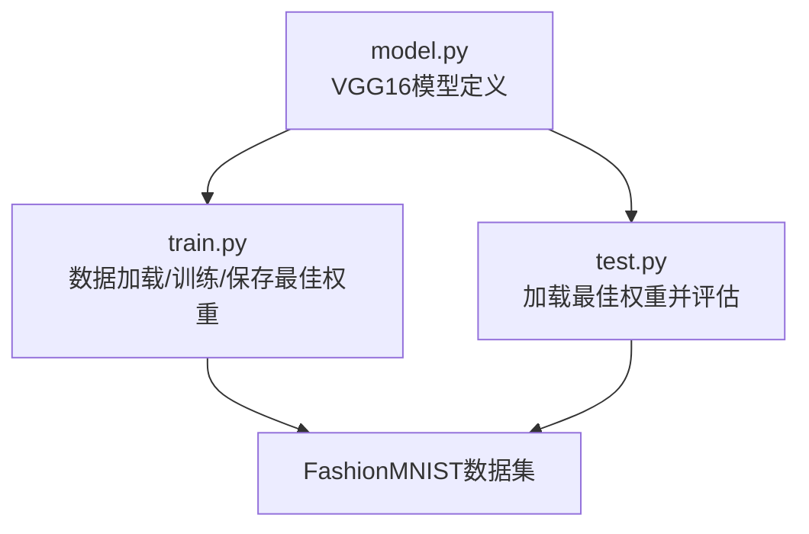
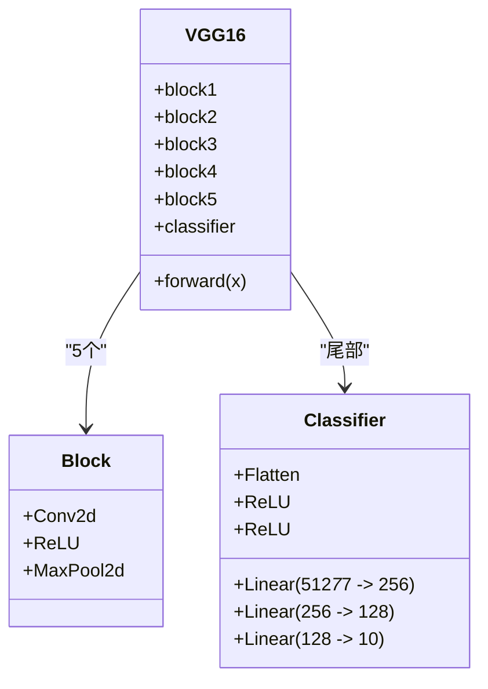
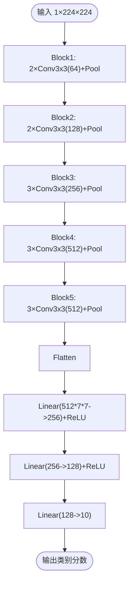
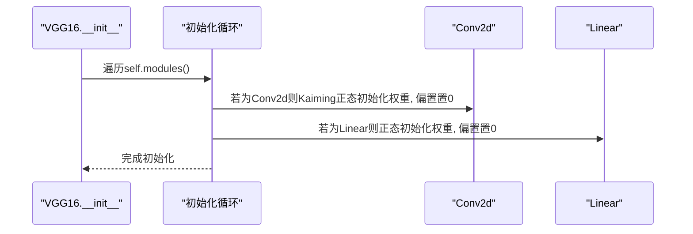
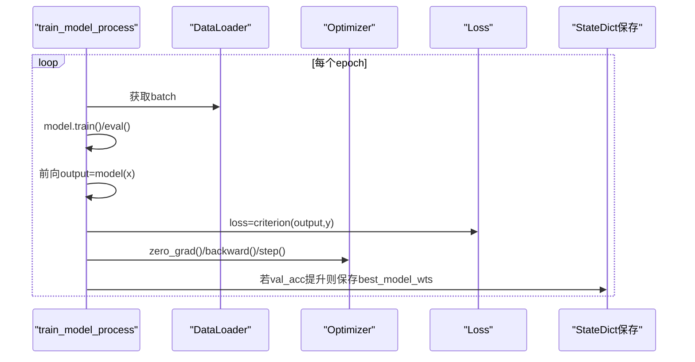
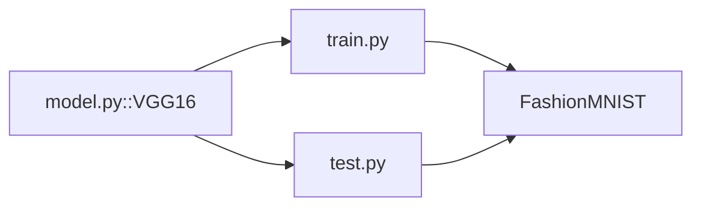

# VGG16实现

<cite>
**本文引用的文件**   
- [model.py](file://study/研究生学习/7.VGG_16/model.py)
- [train.py](file://study/研究生学习/7.VGG_16/train.py)
- [test.py](file://study/研究生学习/7.VGG_16/test.py)
</cite>

## 目录
1. [引言](#引言)
2. [项目结构](#项目结构)
3. [核心组件](#核心组件)
4. [架构总览](#架构总览)
5. [详细组件分析](#详细组件分析)
6. [依赖关系分析](#依赖关系分析)
7. [性能与复杂度分析](#性能与复杂度分析)
8. [训练稳定性优化](#训练稳定性优化)
9. [内存使用优化](#内存使用优化)
10. [部署考虑](#部署考虑)
11. [故障排查指南](#故障排查指南)
12. [结论](#结论)

## 引言
本文件围绕仓库中的VGG16实现，系统阐述统一小卷积核（3×3）设计的核心思想、模块化架构优势、16层网络层次结构（5个卷积块+3个全连接层）、感受野计算、Kaiming初始化对深层网络训练的改善作用，并提供完整的代码级解析。同时对比不同深度网络的权衡与计算复杂度，给出训练稳定性、内存优化与部署建议。

## 项目结构
本项目包含三个主要脚本：模型定义、训练流程与测试流程。整体组织清晰，便于学习与扩展。

图表来源
- [model.py:1-85](file://study/研究生学习/7.VGG_16/model.py#L1-L85)
- [train.py:1-195](file://study/研究生学习/7.VGG_16/train.py#L1-L195)
- [test.py:1-96](file://study/研究生学习/7.VGG_16/test.py#L1-L96)

章节来源
- [model.py:1-85](file://study/研究生学习/7.VGG_16/model.py#L1-L85)
- [train.py:1-195](file://study/研究生学习/7.VGG_16/train.py#L1-L195)
- [test.py:1-96](file://study/研究生学习/7.VGG_16/test.py#L1-L96)

## 核心组件
- 模型类VGG16：基于PyTorch的nn.Module，采用5个卷积块串联，随后接分类器（展平+3个全连接层）。
- 训练流程：数据预处理、Adam优化器、交叉熵损失、早停式权重保存、指标记录与可视化。
- 测试流程：加载最佳权重、关闭梯度、前向推理、统计准确率。

章节来源
- [model.py:5-76](file://study/研究生学习/7.VGG_16/model.py#L5-L76)
- [train.py:16-167](file://study/研究生学习/7.VGG_16/train.py#L16-L167)
- [test.py:13-58](file://study/研究生学习/7.VGG_16/test.py#L13-L58)

## 架构总览
VGG16由“特征提取器”和“分类器”两部分组成：
- 特征提取器：5个卷积块，逐块增加通道数并在末尾进行池化降采样。
- 分类器：展平后接3个全连接层，输出类别分数。

图表来源
- [model.py:9-57](file://study/研究生学习/7.VGG_16/model.py#L9-L57)

章节来源
- [model.py:5-76](file://study/研究生学习/7.VGG_16/model.py#L5-L76)

## 详细组件分析

### 1. 统一小卷积核设计（3×3）的核心思想
- 等效感受野：两个堆叠的3×3卷积等价于一个5×5的感受野；三个堆叠的3×3卷积等价于一个7×7的感受野。这样可以在保持相同感受野的前提下减少参数量与提升非线性表达能力。
- 参数效率：3×3卷积相比大核在参数量上更节省，且每层引入一次ReLU，增强非线性。
- 正则化效果：更多层带来更强的隐式正则化，有助于泛化。

本节为概念性说明，不直接分析具体文件。

### 2. 16层网络的层次结构与模块划分
- 卷积块1：2个3×3卷积，通道64，末尾池化。
- 卷积块2：2个3×3卷积，通道128，末尾池化。
- 卷积块3：3个3×3卷积，通道256，末尾池化。
- 卷积块4：3个3×3卷积，通道512，末尾池化。
- 卷积块5：3个3×3卷积，通道512，末尾池化。
- 分类器：展平后接3个全连接层（512×7×7→256→128→10）。

图表来源
- [model.py:9-57](file://study/研究生学习/7.VGG_16/model.py#L9-L57)

章节来源
- [model.py:9-57](file://study/研究生学习/7.VGG_16/model.py#L9-L57)

### 3. 感受野计算与理论依据
- 单卷积核感受野等于其尺寸；堆叠时按步长累积。
- 以本实现为例：每个块末使用2×2步长为2的池化，空间分辨率逐步减半。
- 第k个块的单个3×3卷积的感受野近似为：R_k = 1 + Σ_{i=1}^{k} (kernel_i - 1) × Π_{j=1}^{i-1} stride_j。对于本实现，stride多为1（卷积），池化stride为2，可据此估算各层感受野增长。
- 三个3×3卷积堆叠的理论感受野为7×7，等价于单次7×7卷积但参数更少、非线性更强。

本节为概念性说明，不直接分析具体文件。

### 4. Kaiming初始化对深层网络训练的改善
- 针对ReLU激活，Kaiming正态初始化能保持前向传播方差稳定，缓解梯度消失/爆炸问题。
- 本实现遍历所有模块，对Conv2d使用Kaiming正态初始化，并对偏置初始化为0；对Linear层使用正态初始化，偏置初始化为0。

图表来源
- [model.py:59-67](file://study/研究生学习/7.VGG_16/model.py#L59-L67)

章节来源
- [model.py:59-67](file://study/研究生学习/7.VGG_16/model.py#L59-L67)

### 5. 完整代码实现解析
- 模块化卷积块：使用nn.Sequential将卷积、激活、池化组合成块，便于复用与扩展。
- 批量归一化（BN）：当前实现未使用BN。可在每个卷积后插入BatchNorm2d以提升训练稳定性与收敛速度。
- 模型权重管理：训练过程保存验证集最优权重的state_dict，测试阶段加载该权重进行推理。

图表来源
- [train.py:36-167](file://study/研究生学习/7.VGG_16/train.py#L36-L167)

章节来源
- [train.py:36-167](file://study/研究生学习/7.VGG_16/train.py#L36-L167)
- [test.py:61-67](file://study/研究生学习/7.VGG_16/test.py#L61-L67)

### 6. 数据与训练配置要点
- 数据：FashionMNIST，Resize到224×224，ToTensor归一化。
- 优化器：Adam，学习率0.001。
- 损失：CrossEntropyLoss。
- 设备：自动选择CUDA或CPU。
- 批大小：64；验证集按比例切分。

章节来源
- [train.py:16-44](file://study/研究生学习/7.VGG_16/train.py#L16-L44)
- [train.py:80-128](file://study/研究生学习/7.VGG_16/train.py#L80-L128)

## 依赖关系分析
- 模型与训练/测试脚本通过导入VGG16类耦合。
- 训练脚本依赖torch.optim、torch.nn、torchvision.datasets等。
- 测试脚本依赖模型与保存的最佳权重路径。

图表来源
- [model.py:1-85](file://study/研究生学习/7.VGG_16/model.py#L1-L85)
- [train.py:1-195](file://study/研究生学习/7.VGG_16/train.py#L1-L195)
- [test.py:1-96](file://study/研究生学习/7.VGG_16/test.py#L1-L96)

章节来源
- [model.py:1-85](file://study/研究生学习/7.VGG_16/model.py#L1-L85)
- [train.py:1-195](file://study/研究生学习/7.VGG_16/train.py#L1-L195)
- [test.py:1-96](file://study/研究生学习/7.VGG_16/test.py#L1-L96)

## 性能与复杂度分析
- 参数量与计算量：VGG16的主要开销来自卷积层与全连接层。由于使用大量3×3卷积与较大的通道数（最高512），参数量与FLOPs较高。
- 感受野与精度：更深网络具备更大感受野，有利于捕捉全局语义，但也更容易过拟合与训练不稳定。
- 与AlexNet对比：VGG用统一小卷积核替代大核，提升了表达力与参数效率，但总体仍较昂贵。
- 与GoogLeNet对比：后者通过Inception模块与1×1卷积控制通道，显著降低参数量与计算量，适合资源受限场景。

本节为概念性说明，不直接分析具体文件。

## 训练稳定性优化
- 添加批量归一化（BatchNorm2d）：在每个卷积后加入BN，配合Kaiming初始化可显著提升深层网络训练稳定性与收敛速度。
- 学习率调度：引入余弦退火或阶梯衰减，避免后期震荡。
- 梯度裁剪：防止梯度爆炸，尤其在全连接层较大时。
- 数据增强：随机裁剪、翻转、色彩抖动等，提高泛化能力。
- 正则化：Dropout（例如在全连接层间）或权重衰减（L2正则）。

本节为概念性说明，不直接分析具体文件。

## 内存使用优化
- 减小输入分辨率：如从224×224降至112×112，可显著降低显存占用与计算量。
- 混合精度训练：使用AMP（torch.cuda.amp）降低显存并加速。
- 梯度累积：在小批下模拟大batch效果。
- 及时释放中间变量：确保不使用不必要的with torch.no_grad()之外的张量持有引用。
- 使用更高效的数据加载：num_workers>0，预取缓存。

本节为概念性说明，不直接分析具体文件。

## 部署考虑
- 导出格式：将训练好的state_dict转换为ONNX/TensorRT/NCNN等目标格式，便于跨平台部署。
- 量化：INT8量化可显著减小模型体积与延迟，需进行校准。
- 服务化：封装为REST/gRPC接口，结合批处理与异步推理提升吞吐。
- 监控与回滚：记录推理延迟、错误率与资源占用，建立版本管理与灰度发布策略。

本节为概念性说明，不直接分析具体文件。

## 故障排查指南
- 维度不匹配：检查输入尺寸与分类器首层线性层的in_features是否一致（应为512×7×7）。
- 设备不一致：确保模型与数据在同一设备上（cuda/cpu）。
- 权重加载失败：确认保存路径与加载路径一致，且权重文件存在。
- 训练不收敛：检查学习率、是否开启BN、数据是否标准化、是否存在标签错位。
- 显存不足：降低batch size或输入分辨率，启用混合精度。

章节来源
- [train.py:36-167](file://study/研究生学习/7.VGG_16/train.py#L36-L167)
- [test.py:61-67](file://study/研究生学习/7.VGG_16/test.py#L61-L67)

## 结论
本实现以清晰的模块化方式呈现了VGG16的核心结构：统一3×3卷积核堆叠与5个卷积块+3个全连接层的分层组织。Kaiming初始化有效支撑了深层网络的稳定训练。尽管VGG16参数量与计算量较大，但其结构简单、易于理解与扩展。通过引入BN、学习率调度、数据增强与量化/导出等手段，可在保证精度的前提下进一步提升训练稳定性与部署效率。