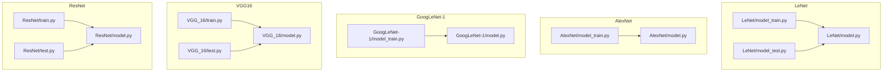
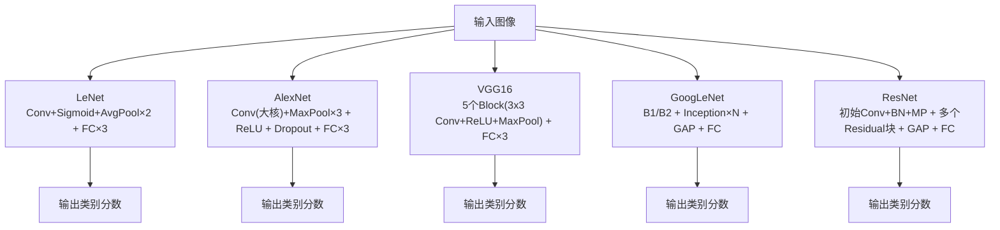
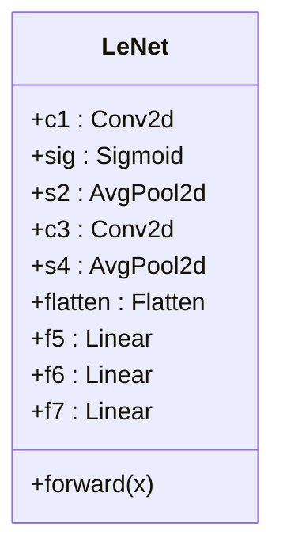
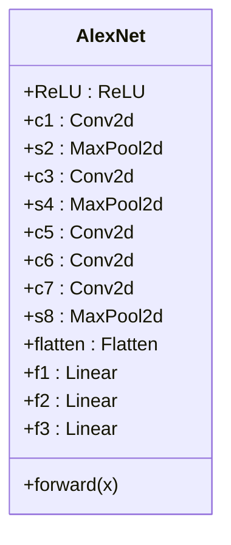
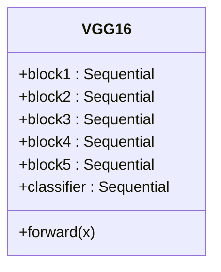
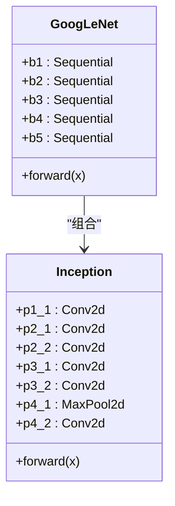
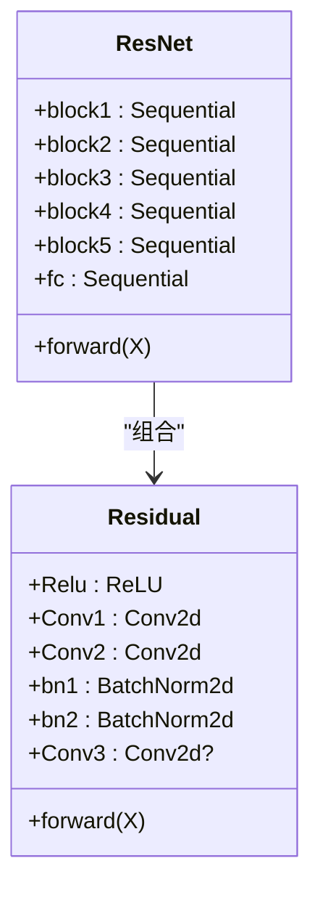
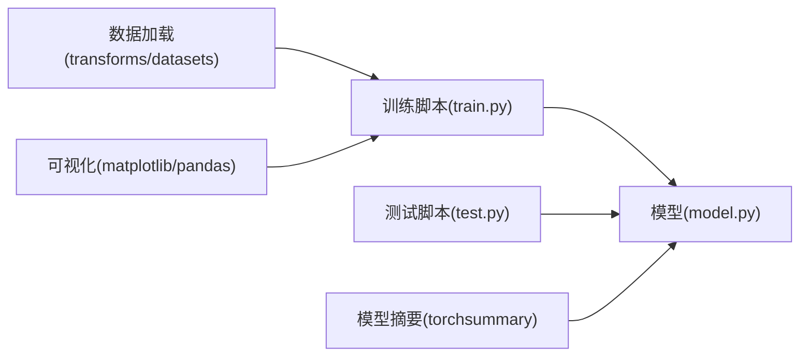
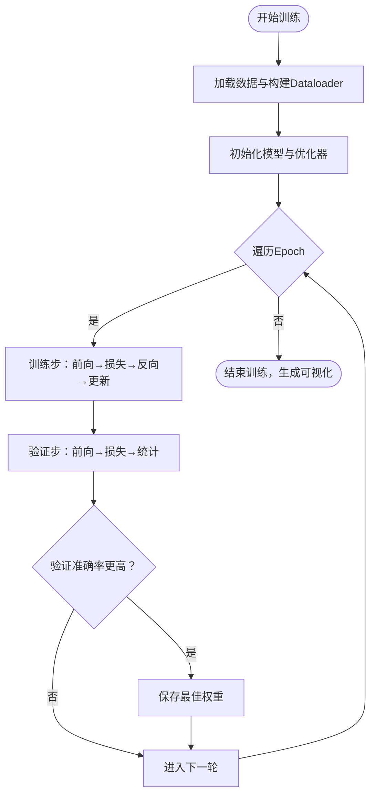

# 经典模型实现

<cite>
**本文引用的文件**   
- [LeNet/model.py](file://study/上传课件、源码/源码/LeNet/model.py)
- [LeNet/model_train.py](file://study/上传课件、源码/源码/LeNet/model_train.py)
- [LeNet/model_test.py](file://study/上传课件、源码/源码/LeNet/model_test.py)
- [AlexNet/model.py](file://study/上传课件、源码/源码/AlexNet/model.py)
- [AlexNet/model_train.py](file://study/上传课件、源码/源码/AlexNet/model_train.py)
- [GoogLeNet-1/model.py](file://study/上传课件、源码/源码/GoogLeNet-1/model.py)
- [GoogLeNet-1/model_train.py](file://study/上传课件、源码/源码/GoogLeNet-1/model_train.py)
- [VGG_16/model.py](file://study/研究生学习/7.VGG_16/model.py)
- [VGG_16/train.py](file://study/研究生学习/7.VGG_16/train.py)
- [VGG_16/test.py](file://study/研究生学习/7.VGG_16/test.py)
- [ResNet/model.py](file://study/研究生学习/9.ResNet/model.py)
- [ResNet/train.py](file://study/研究生学习/9.ResNet/train.py)
- [ResNet/test.py](file://study/研究生学习/9.ResNet/test.py)
</cite>

## 目录
1. [引言](#引言)
2. [项目结构](#项目结构)
3. [核心组件](#核心组件)
4. [架构总览](#架构总览)
5. [详细组件分析](#详细组件分析)
6. [依赖关系分析](#依赖关系分析)
7. [性能与训练要点](#性能与训练要点)
8. [故障排查指南](#故障排查指南)
9. [结论](#结论)
10. [附录：可视化与结果记录](#附录可视化与结果记录)

## 引言
本仓库围绕五类经典卷积神经网络（LeNet-5、AlexNet、VGG16、GoogLeNet、ResNet）的PyTorch实现，提供了从网络定义、数据加载、训练循环、验证评估到测试推理的完整流程。文档将系统梳理各模型的架构设计、创新点与改进之处，深入解析前向传播路径、损失函数与优化策略，并给出参数初始化、正则化与训练技巧的实践建议。同时，结合代码中的实际配置，总结演进脉络与技术突破，并提供可视化与结果记录方法，帮助读者快速复现实验并理解关键细节。

## 项目结构
仓库按“模型+训练脚本”的方式组织，每个模型包含独立的model.py与训练/测试脚本；部分模型还包含数据预处理或绘图辅助脚本。整体结构清晰，便于对比不同网络的实现差异与训练流程。

图表来源
- [LeNet/model.py:1-37](file://study/上传课件、源码/源码/LeNet/model.py#L1-L37)
- [LeNet/model_train.py:1-191](file://study/上传课件、源码/源码/LeNet/model_train.py#L1-L191)
- [LeNet/model_test.py:1-65](file://study/上传课件、源码/源码/LeNet/model_test.py#L1-L65)
- [AlexNet/model.py:1-52](file://study/上传课件、源码/源码/AlexNet/model.py#L1-L52)
- [AlexNet/model_train.py:1-193](file://study/上传课件、源码/源码/AlexNet/model_train.py#L1-L193)
- [GoogLeNet-1/model.py:1-102](file://study/上传课件、源码/源码/GoogLeNet-1/model.py#L1-L102)
- [GoogLeNet-1/model_train.py:1-197](file://study/上传课件、源码/源码/GoogLeNet-1/model_train.py#L1-L197)
- [VGG_16/model.py:1-85](file://study/研究生学习/7.VGG_16/model.py#L1-L85)
- [VGG_16/train.py:1-195](file://study/研究生学习/7.VGG_16/train.py#L1-L195)
- [VGG_16/test.py:1-96](file://study/研究生学习/7.VGG_16/test.py#L1-L96)
- [ResNet/model.py:1-69](file://study/研究生学习/9.ResNet/model.py#L1-L69)
- [ResNet/train.py:1-206](file://study/研究生学习/9.ResNet/train.py#L1-L206)
- [ResNet/test.py:1-96](file://study/研究生学习/9.ResNet/test.py#L1-L96)

章节来源
- [LeNet/model.py:1-37](file://study/上传课件、源码/源码/LeNet/model.py#L1-L37)
- [AlexNet/model.py:1-52](file://study/上传课件、源码/源码/AlexNet/model.py#L1-L52)
- [GoogLeNet-1/model.py:1-102](file://study/上传课件、源码/源码/GoogLeNet-1/model.py#L1-L102)
- [VGG_16/model.py:1-85](file://study/研究生学习/7.VGG_16/model.py#L1-L85)
- [ResNet/model.py:1-69](file://study/研究生学习/9.ResNet/model.py#L1-L69)

## 核心组件
- LeNet-5：早期CNN代表，使用Sigmoid激活与平均池化，结构简单，适合小图像分类任务。
- AlexNet：引入ReLU、最大池化与Dropout，显著加深网络并提升非线性表达能力。
- VGG16：采用堆叠的小卷积核（3x3）与固定通道增长模式，结构规整、易于扩展。
- GoogLeNet：Inception模块并行多尺度特征提取，配合全局平均池化降低参数量。
- ResNet：残差连接解决深层网络退化问题，结合批归一化稳定训练。

章节来源
- [LeNet/model.py:6-29](file://study/上传课件、源码/源码/LeNet/model.py#L6-L29)
- [AlexNet/model.py:7-41](file://study/上传课件、源码/源码/AlexNet/model.py#L7-L41)
- [VGG_16/model.py:5-76](file://study/研究生学习/7.VGG_16/model.py#L5-L76)
- [GoogLeNet-1/model.py:7-91](file://study/上传课件、源码/源码/GoogLeNet-1/model.py#L7-L91)
- [ResNet/model.py:5-63](file://study/研究生学习/9.ResNet/model.py#L5-L63)

## 架构总览
下图展示五个模型的整体结构与关键层序列，体现从浅层到深层、从简单到复杂的演进趋势。

图表来源
- [LeNet/model.py:6-29](file://study/上传课件、源码/源码/LeNet/model.py#L6-L29)
- [AlexNet/model.py:7-41](file://study/上传课件、源码/源码/AlexNet/model.py#L7-L41)
- [VGG_16/model.py:5-76](file://study/研究生学习/7.VGG_16/model.py#L5-L76)
- [GoogLeNet-1/model.py:39-91](file://study/上传课件、源码/源码/GoogLeNet-1/model.py#L39-L91)
- [ResNet/model.py:26-63](file://study/研究生学习/9.ResNet/model.py#L26-L63)

## 详细组件分析

### LeNet-5 分析与实现
- 架构要点
  - 两个卷积层后接平均池化，随后三个全连接层完成分类。
  - 激活函数为Sigmoid，池化为平均池化，结构简洁。
- 前向传播
  - 输入→卷积→Sigmoid→平均池化→卷积→Sigmoid→平均池化→展平→全连接×3→输出。
- 损失与优化
  - 交叉熵损失，Adam优化器，学习率0.001。
- 参数初始化
  - 未显式初始化权重，默认PyTorch初始化。
- 训练技巧
  - FashionMNIST数据集，Resize至28×28，batch_size=32，随机划分训练/验证集。
- 可视化
  - 训练/验证损失与准确率曲线绘制。

图表来源
- [LeNet/model.py:6-29](file://study/上传课件、源码/源码/LeNet/model.py#L6-L29)

章节来源
- [LeNet/model.py:6-29](file://study/上传课件、源码/源码/LeNet/model.py#L6-L29)
- [LeNet/model_train.py:35-162](file://study/上传课件、源码/源码/LeNet/model_train.py#L35-L162)
- [LeNet/model_test.py:22-57](file://study/上传课件、源码/源码/LeNet/model_test.py#L22-L57)

### AlexNet 分析与实现
- 架构要点
  - 首层大卷积核（11x11）降采样，后续多层3x3卷积，配合最大池化与ReLU。
  - 全连接层间加入Dropout（0.5），增强正则化能力。
- 前向传播
  - 输入→Conv1+ReLU+MaxPool→Conv3+ReLU+MaxPool→Conv5/6/7+ReLU+MaxPool→展平→FC1+ReLU+Dropout→FC2+ReLU+Dropout→FC3→输出。
- 损失与优化
  - 交叉熵损失，Adam优化器，学习率0.001。
- 参数初始化
  - 未显式初始化权重。
- 训练技巧
  - FashionMNIST Resize至227×227，batch_size=32，随机划分训练/验证集。
- 可视化
  - 训练/验证损失与准确率曲线绘制。

图表来源
- [AlexNet/model.py:7-41](file://study/上传课件、源码/源码/AlexNet/model.py#L7-L41)

章节来源
- [AlexNet/model.py:7-41](file://study/上传课件、源码/源码/AlexNet/model.py#L7-L41)
- [AlexNet/model_train.py:35-165](file://study/上传课件、源码/源码/AlexNet/model_train.py#L35-L165)

### VGG16 分析与实现
- 架构要点
  - 5个Block，每块由若干3x3卷积+ReLU+最大池化组成，通道数逐步增加。
  - 分类头为Flatten+三层全连接（含ReLU）。
- 前向传播
  - 输入→Block1~Block5→Flatten→FC1+ReLU→FC2+ReLU→FC3→输出。
- 损失与优化
  - 交叉熵损失，Adam优化器，学习率0.001。
- 参数初始化
  - Conv2d使用Kaiming正态初始化，Linear使用正态初始化，偏置初始化为0。
- 训练技巧
  - FashionMNIST Resize至224×224，batch_size=64，num_workers=8加速数据加载。
- 可视化
  - 训练/验证损失与准确率曲线绘制。

图表来源
- [VGG_16/model.py:5-76](file://study/研究生学习/7.VGG_16/model.py#L5-L76)

章节来源
- [VGG_16/model.py:5-76](file://study/研究生学习/7.VGG_16/model.py#L5-L76)
- [VGG_16/train.py:36-167](file://study/研究生学习/7.VGG_16/train.py#L36-L167)
- [VGG_16/test.py:26-58](file://study/研究生学习/7.VGG_16/test.py#L26-L58)

### GoogLeNet 分析与实现
- 架构要点
  - Inception模块并行四条分支：1x1卷积、1x1+3x3、1x1+5x5、3x3池化+1x1，拼接输出。
  - 主体由b1/b2基础层与b3/b4/b5的Inception堆叠构成，末尾AdaptiveAvgPool+Flatten+FC。
- 前向传播
  - 输入→b1→b2→b3(Inception×2+MP)→b4(Inception×5+MP)→b5(Inception×2+GAP+Flatten+FC)→输出。
- 损失与优化
  - 交叉熵损失，Adam优化器，学习率0.001。
- 参数初始化
  - Conv2d使用Kaiming正态初始化，Linear使用正态初始化，偏置初始化为0。
- 训练技巧
  - ImageFolder自定义数据集，Resize至224×224，标准化处理，batch_size=32。
- 可视化
  - 训练/验证损失与准确率曲线绘制。

图表来源
- [GoogLeNet-1/model.py:7-91](file://study/上传课件、源码/源码/GoogLeNet-1/model.py#L7-L91)

章节来源
- [GoogLeNet-1/model.py:7-91](file://study/上传课件、源码/源码/GoogLeNet-1/model.py#L7-L91)
- [GoogLeNet-1/model_train.py:39-169](file://study/上传课件、源码/源码/GoogLeNet-1/model_train.py#L39-L169)

### ResNet 分析与实现
- 架构要点
  - 残差块Residual：两路3x3卷积+BN+ReLU，可选1x1卷积用于维度对齐，最后加恒等映射再经ReLU。
  - 主体由初始Conv+BN+MP与多个Residual块组成，末尾GAP+Flatten+FC。
- 前向传播
  - 输入→block1→block2~block5(Residual堆叠)→GAP+Flatten→FC→输出。
- 损失与优化
  - 交叉熵损失，Adam优化器，学习率0.001。
- 参数初始化
  - 未显式初始化权重。
- 训练技巧
  - FashionMNIST Resize至224×224，batch_size=128，支持断点续训（加载best_model.pth）。
- 可视化
  - 训练/验证损失与准确率曲线绘制。

图表来源
- [ResNet/model.py:5-63](file://study/研究生学习/9.ResNet/model.py#L5-L63)

章节来源
- [ResNet/model.py:5-63](file://study/研究生学习/9.ResNet/model.py#L5-L63)
- [ResNet/train.py:36-168](file://study/研究生学习/9.ResNet/train.py#L36-L168)
- [ResNet/test.py:26-58](file://study/研究生学习/9.ResNet/test.py#L26-L58)

## 依赖关系分析
- 模型与训练脚本耦合方式
  - 每个模型的model.py提供nn.Module子类，train.py通过from model import Xxx导入并使用。
  - test.py加载保存的权重进行推理评估。
- 外部依赖
  - PyTorch核心库（torch、torch.nn、torch.optim、torch.utils.data）。
  - torchvision.datasets（FashionMNIST、ImageFolder）、transforms。
  - matplotlib/pandas用于训练过程可视化与记录。
  - torchsummary用于打印模型结构摘要。

图表来源
- [VGG_16/train.py:1-195](file://study/研究生学习/7.VGG_16/train.py#L1-L195)
- [VGG_16/model.py:1-85](file://study/研究生学习/7.VGG_16/model.py#L1-L85)
- [ResNet/train.py:1-206](file://study/研究生学习/9.ResNet/train.py#L1-L206)
- [ResNet/model.py:1-69](file://study/研究生学习/9.ResNet/model.py#L1-L69)
- [LeNet/model_train.py:1-191](file://study/上传课件、源码/源码/LeNet/model_train.py#L1-L191)
- [LeNet/model.py:1-37](file://study/上传课件、源码/源码/LeNet/model.py#L1-L37)

章节来源
- [VGG_16/train.py:1-195](file://study/研究生学习/7.VGG_16/train.py#L1-L195)
- [ResNet/train.py:1-206](file://study/研究生学习/9.ResNet/train.py#L1-L206)
- [LeNet/model_train.py:1-191](file://study/上传课件、源码/源码/LeNet/model_train.py#L1-L191)

## 性能与训练要点
- 激活函数演进
  - LeNet使用Sigmoid，易饱和导致梯度消失；AlexNet/VGG/GoogLeNet/ResNet普遍采用ReLU，缓解梯度消失。
- 池化策略
  - LeNet使用平均池化，AlexNet/VGG/GoogLeNet/ResNet使用最大池化，保留更强响应特征。
- 正则化手段
  - AlexNet在FC层使用Dropout（0.5）；VGG/GoogLeNet/ResNet通过结构设计与BN抑制过拟合。
- 参数初始化
  - VGG与GoogLeNet对Conv使用Kaiming正态初始化，Linear使用正态初始化，有助于稳定训练。
- 数据预处理
  - 统一Resize尺寸（28/227/224），部分模型使用标准化（GoogLeNet使用均值/方差归一化）。
- 优化器与学习率
  - 统一使用Adam，学习率0.001；可根据任务调整学习率调度与权重衰减。
- 批量大小与数据加载
  - 根据模型复杂度调整batch_size与num_workers，平衡吞吐与内存占用。
- 早停与最佳模型保存
  - 基于验证集准确率保存最优权重，避免过拟合。

章节来源
- [AlexNet/model.py:7-41](file://study/上传课件、源码/源码/AlexNet/model.py#L7-L41)
- [VGG_16/model.py:59-67](file://study/研究生学习/7.VGG_16/model.py#L59-L67)
- [GoogLeNet-1/model.py:74-83](file://study/上传课件、源码/源码/GoogLeNet-1/model.py#L74-L83)
- [GoogLeNet-1/model_train.py:14-35](file://study/上传课件、源码/源码/GoogLeNet-1/model_train.py#L14-L35)
- [VGG_16/train.py:36-167](file://study/研究生学习/7.VGG_16/train.py#L36-L167)
- [ResNet/train.py:36-168](file://study/研究生学习/9.ResNet/train.py#L36-L168)

## 故障排查指南
- 常见错误与定位
  - 设备不一致：确保模型与数据均移动到同一设备（cuda/cpu）。
  - 维度不匹配：检查输入尺寸与模型期望尺寸是否一致（如28/227/224）。
  - 权重加载失败：确认权重文件路径与模型结构一致，必要时指定map_location。
- 训练不稳定
  - 学习率过大导致Loss震荡：适当降低学习率或使用学习率衰减。
  - 梯度爆炸/消失：检查激活函数与初始化策略，必要时添加梯度裁剪。
- 过拟合
  - 增加正则化（Dropout、权重衰减）、数据增强、早停策略。
- 数据加载瓶颈
  - 调整num_workers与batch_size，确保磁盘IO与GPU利用率平衡。
- 内存不足
  - 减小batch_size、关闭不必要的梯度计算（验证阶段使用no_grad）。

章节来源
- [LeNet/model_train.py:35-162](file://study/上传课件、源码/源码/LeNet/model_train.py#L35-L162)
- [AlexNet/model_train.py:35-165](file://study/上传课件、源码/源码/AlexNet/model_train.py#L35-L165)
- [VGG_16/train.py:36-167](file://study/研究生学习/7.VGG_16/train.py#L36-L167)
- [ResNet/train.py:36-168](file://study/研究生学习/9.ResNet/train.py#L36-L168)
- [ResNet/test.py:26-58](file://study/研究生学习/9.ResNet/test.py#L26-L58)

## 结论
本仓库以清晰的模块化结构实现了五类经典卷积神经网络，覆盖了从浅层到深层、从简单到复杂的设计思路与实践要点。通过统一的训练框架与可视化记录，读者可直观对比不同模型在相同数据与设置下的表现，理解技术演进的关键节点（ReLU、Dropout、Inception、BatchNorm、残差连接）。建议在真实任务中结合数据增强、学习率调度与更丰富的正则化策略，以获得更稳健的性能。

## 附录：可视化与结果记录
- 训练曲线
  - 使用matplotlib绘制训练/验证损失与准确率曲线，便于观察收敛情况与过拟合迹象。
- 结果记录
  - 使用pandas将每轮指标写入DataFrame，便于导出与分析。
- 最佳模型保存
  - 基于验证集准确率保存权重，测试时加载对应权重进行评估。

图表来源
- [VGG_16/train.py:36-167](file://study/研究生学习/7.VGG_16/train.py#L36-L167)
- [ResNet/train.py:36-168](file://study/研究生学习/9.ResNet/train.py#L36-L168)
- [LeNet/model_train.py:35-162](file://study/上传课件、源码/源码/LeNet/model_train.py#L35-L162)