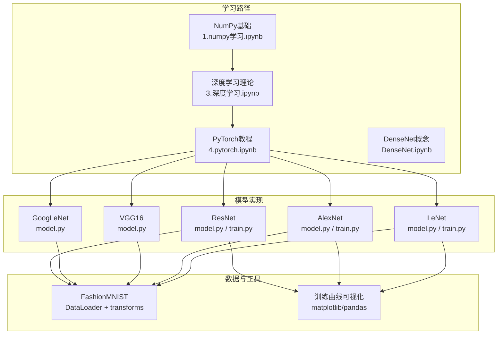
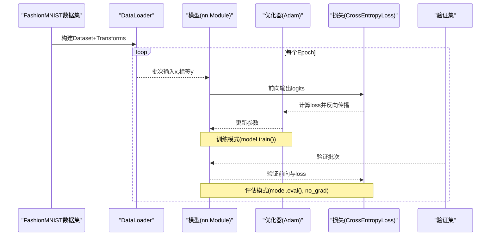
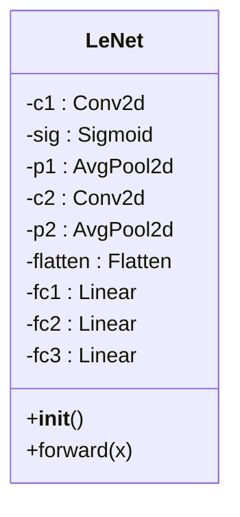
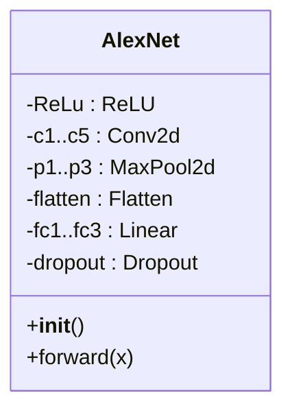
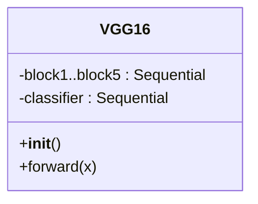
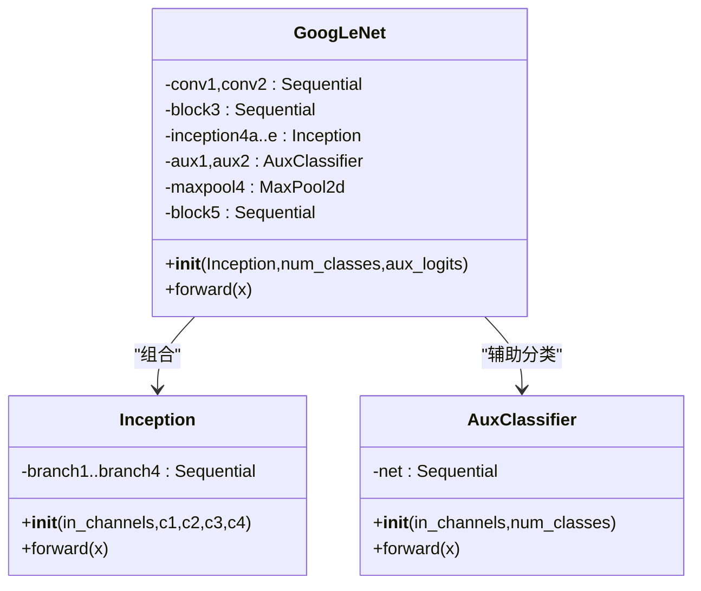
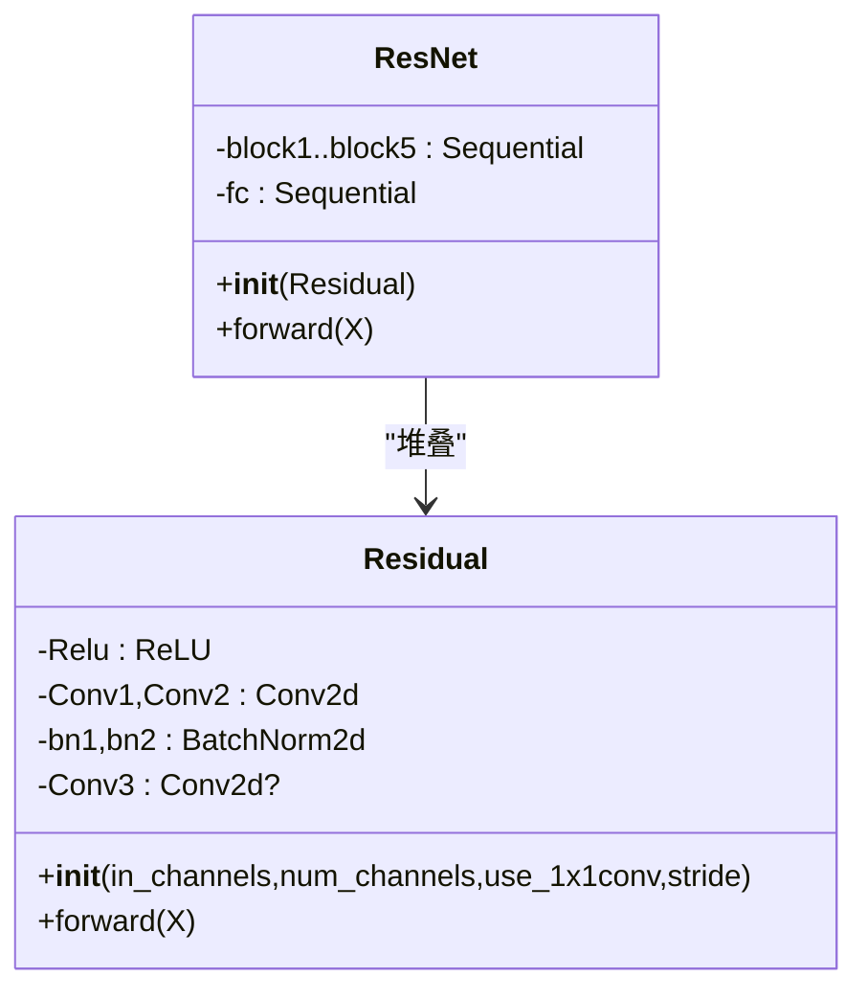
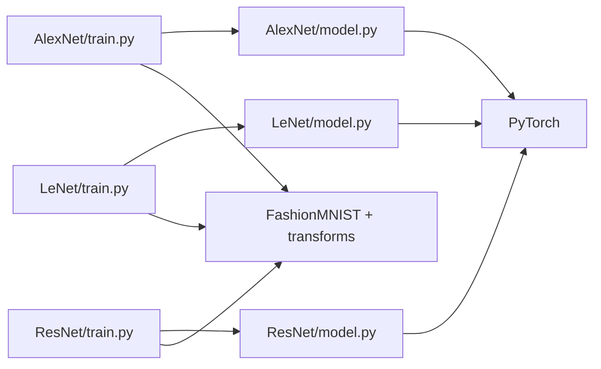

# 项目概述

<cite>
**本文引用的文件**   
- [1.numpy学习.ipynb](file://study/研究生学习/1.numpy学习/1.numpy学习.ipynb)
- [3.深度学习.ipynb](file://study/研究生学习/3.深度学习/3.深度学习.ipynb)
- [4.pytorch.ipynb](file://study/研究生学习/4.pytorch/4.pytorch.ipynb)
- [LeNet/model.py](file://study/研究生学习/5.LeNet/model.py)
- [LeNet/train.py](file://study/研究生学习/5.LeNet/train.py)
- [AlexNet/model.py](file://study/研究生学习/6.AlexNet/model.py)
- [AlexNet/train.py](file://study/研究生学习/6.AlexNet/train.py)
- [VGG_16/model.py](file://study/研究生学习/7.VGG_16/model.py)
- [GoogLeNet/model.py](file://study/研究生学习/8.GoogLeNet/model.py)
- [ResNet/model.py](file://study/研究生学习/9.ResNet/model.py)
- [ResNet/train.py](file://study/研究生学习/9.ResNet/train.py)
- [DenseNet.ipynb](file://study/研究生学习/10.DenseNet/DenseNet.ipynb)
</cite>

## 目录
1. [引言](#引言)
2. [项目结构](#项目结构)
3. [核心组件](#核心组件)
4. [架构总览](#架构总览)
5. [详细组件分析](#详细组件分析)
6. [依赖关系分析](#依赖关系分析)
7. [性能与训练要点](#性能与训练要点)
8. [故障排查指南](#故障排查指南)
9. [结论](#结论)
10. [附录：从NumPy到经典CNN的学习路径](#附录从numpy到经典cnn的学习路径)

## 引言
本项目是一个面向深度学习入门与进阶的卷积神经网络（CNN）学习仓库，覆盖从NumPy基础、机器学习与深度学习概念、PyTorch框架使用，到经典CNN模型（LeNet、AlexNet、VGG16、GoogLeNet、ResNet、DenseNet）的实现与实验。项目以FashionMNIST为统一数据集，提供完整的训练流程、可视化与模型保存机制，适合初学者循序渐进地掌握CNN的核心思想与实践方法，也为有经验的开发者提供了可复用的训练模板与模块化网络实现。

学习目标
- 建立对深度学习与CNN的系统认知，理解前向传播、损失函数、反向传播与优化器的工作方式。
- 掌握PyTorch张量、数据加载、模型定义、训练循环与评估推理的标准流程。
- 通过多阶段实践，逐步实现并对比不同经典CNN在FashionMNIST上的表现。
- 形成从数据预处理、模型设计、训练策略到结果可视化的完整工程化能力。

技术架构概览
- 知识层：NumPy基础、机器学习与深度学习理论、PyTorch框架教程。
- 模型层：LeNet/AlexNet/VGG16/GoogLeNet/ResNet/DenseNet等经典CNN模块。
- 训练层：统一的训练/验证循环、指标统计、模型权重保存与训练曲线可视化。
- 数据层：基于torchvision的FashionMNIST数据集与transforms预处理流水线。

## 项目结构
仓库按“学习路径 + 模型实现”组织，主要包含：
- 学习路径笔记：NumPy、机器学习、深度学习、PyTorch、各模型专题。
- 模型实现：每个模型一个目录，包含model.py（网络定义）、train.py（训练脚本）、可选test.py或notebook。
- 课件与源码：上传课件与源码中也有部分示例，便于对照学习。

图表来源
- [1.numpy学习.ipynb:1-200](file://study/研究生学习/1.numpy学习/1.numpy学习.ipynb#L1-L200)
- [3.深度学习.ipynb:1-200](file://study/研究生学习/3.深度学习/3.深度学习.ipynb#L1-L200)
- [4.pytorch.ipynb:1-200](file://study/研究生学习/4.pytorch/4.pytorch.ipynb#L1-L200)
- [LeNet/train.py:1-60](file://study/研究生学习/5.LeNet/train.py#L1-L60)
- [AlexNet/train.py:1-60](file://study/研究生学习/6.AlexNet/train.py#L1-L60)
- [ResNet/train.py:1-60](file://study/研究生学习/9.ResNet/train.py#L1-L60)

章节来源
- [1.numpy学习.ipynb:1-200](file://study/研究生学习/1.numpy学习/1.numpy学习.ipynb#L1-L200)
- [3.深度学习.ipynb:1-200](file://study/研究生学习/3.深度学习/3.深度学习.ipynb#L1-L200)
- [4.pytorch.ipynb:1-200](file://study/研究生学习/4.pytorch/4.pytorch.ipynb#L1-L200)

## 核心组件
- 数据与预处理
  - FashionMNIST灰度图像，通道数1；常用Resize至28或更大尺寸（如224），ToTensor归一化到[0,1]，必要时Normalize。
  - DataLoader负责分批、打乱、并行加载；训练集shuffle=True，验证集False。
- 模型定义
  - 所有模型均继承nn.Module，forward定义前向计算图；常见层包括Conv2d、MaxPool2d、AvgPool2d、Flatten、Linear、Dropout、BatchNorm2d等。
- 训练与评估
  - 标准训练循环：optimizer.zero_grad -> model(x) -> loss.backward() -> optimizer.step()。
  - 评估模式：model.eval() + torch.no_grad()，仅前向计算。
  - 指标：平均损失与准确率；保存最佳模型权重（按验证准确率或损失）。
- 可视化与记录
  - 使用pandas记录每轮指标，matplotlib绘制训练/验证损失与准确率曲线。

章节来源
- [LeNet/train.py:24-48](file://study/研究生学习/5.LeNet/train.py#L24-L48)
- [AlexNet/train.py:21-57](file://study/研究生学习/6.AlexNet/train.py#L21-L57)
- [ResNet/train.py:16-33](file://study/研究生学习/9.ResNet/train.py#L16-L33)
- [4.pytorch.ipynb:210-266](file://study/研究生学习/4.pytorch/4.pytorch.ipynb#L210-L266)

## 架构总览
下图展示从数据到模型的端到端流程，以及训练/验证阶段的控制流。

图表来源
- [LeNet/train.py:50-178](file://study/研究生学习/5.LeNet/train.py#L50-L178)
- [AlexNet/train.py:60-189](file://study/研究生学习/6.AlexNet/train.py#L60-L189)
- [ResNet/train.py:36-168](file://study/研究生学习/9.ResNet/train.py#L36-L168)

## 详细组件分析

### LeNet
- 结构要点
  - 两个卷积块（Conv+Sigmoid+池化），随后Flatten接三个全连接层，输出10类得分。
  - 输入尺寸适配FashionMNIST（28×28），也可扩展至更大尺寸。
- 关键接口
  - 类：LeNet(nn.Module)
  - forward：返回未softmax的类别得分（logits），供CrossEntropyLoss直接使用。
- 训练配置
  - 优化器：Adam(lr=0.001)
  - 损失：CrossEntropyLoss
  - 数据：Resize(28)+ToTensor；随机划分训练/验证集；保存最高验证准确率的权重。
- 适用场景
  - 快速验证CNN基本流程与FashionMNIST任务可行性。

图表来源
- [LeNet/model.py:5-33](file://study/研究生学习/5.LeNet/model.py#L5-L33)

章节来源
- [LeNet/model.py:1-38](file://study/研究生学习/5.LeNet/model.py#L1-L38)
- [LeNet/train.py:1-202](file://study/研究生学习/5.LeNet/train.py#L1-L202)

### AlexNet
- 结构要点
  - 大卷积核与步长进行下采样，多个卷积块后接Flatten与三层全连接，含Dropout正则化。
  - 输入尺寸通常227×227（本仓库将FashionMNIST Resize至227）。
- 关键接口
  - 类：AlexNet(nn.Module)
  - forward：返回logits。
- 训练配置
  - 优化器：Adam(lr=0.001, weight_decay=1e-4)
  - 数据增强：随机水平翻转、旋转、仿射变换（训练集）；验证集仅Resize+ToTensor。
  - 保存策略：按最低验证损失保存权重。
- 适用场景
  - 体验更深网络与数据增强的效果，观察过拟合与正则化。

图表来源
- [AlexNet/model.py:6-41](file://study/研究生学习/6.AlexNet/model.py#L6-L41)

章节来源
- [AlexNet/model.py:1-50](file://study/研究生学习/6.AlexNet/model.py#L1-L50)
- [AlexNet/train.py:1-218](file://study/研究生学习/6.AlexNet/train.py#L1-L218)

### VGG16
- 结构要点
  - 五组卷积块，每组由若干3×3卷积+ReLU+最大池化构成，通道数逐块增加。
  - 分类头为Flatten+多层全连接，输出10类得分。
  - 权重初始化：Conv采用Kaiming正态，Linear采用小方差正态，偏置初始化为0。
- 关键接口
  - 类：VGG16(nn.Module)
  - forward：返回logits。
- 适用场景
  - 理解“小卷积核堆叠”的设计哲学与参数量增长。

图表来源
- [VGG_16/model.py:5-76](file://study/研究生学习/7.VGG_16/model.py#L5-L76)

章节来源
- [VGG_16/model.py:1-85](file://study/研究生学习/7.VGG_16/model.py#L1-L85)

### GoogLeNet
- 结构要点
  - Inception模块：四条分支并行（1×1、1×1→3×3、1×1→5×5、3×3池化→1×1），在通道维度拼接。
  - 辅助分类器：在中间层插入AuxClassifier，训练时参与损失计算，推理时关闭。
  - 全局自适应池化+全连接输出类别。
- 关键接口
  - 类：Inception、AuxClassifier、GoogLeNet(nn.Module)
  - forward：训练且开启aux_logits时返回主输出与两个辅助输出；否则仅返回主输出。
- 适用场景
  - 理解多尺度特征融合与辅助监督的思想。

图表来源
- [GoogLeNet/model.py:5-137](file://study/研究生学习/8.GoogLeNet/model.py#L5-L137)

章节来源
- [GoogLeNet/model.py:1-144](file://study/研究生学习/8.GoogLeNet/model.py#L1-L144)

### ResNet
- 结构要点
  - 残差块：两层3×3卷积+BN+ReLU，支持1×1卷积用于通道对齐与下采样。
  - 五个阶段，通道数递增，最后AdaptiveAvgPool2d+Flatten+Linear输出类别。
- 关键接口
  - 类：Residual、ResNet(nn.Module)
  - forward：返回logits。
- 适用场景
  - 理解残差连接缓解梯度消失与退化问题。

图表来源
- [ResNet/model.py:5-63](file://study/研究生学习/9.ResNet/model.py#L5-L63)

章节来源
- [ResNet/model.py:1-69](file://study/研究生学习/9.ResNet/model.py#L1-L69)
- [ResNet/train.py:1-206](file://study/研究生学习/9.ResNet/train.py#L1-L206)

### DenseNet（概念与要点）
- 稠密连接：同一dense block内，第l层接收前面所有层的特征图拼接作为输入。
- growth rate k：每层新增的特征图数量，控制通道增长速率。
- 优势：特征复用、梯度短路径、减少重复学习。
- 注意：concat导致通道数线性增长，需配合bottleneck与transition layer控制复杂度。

章节来源
- [DenseNet.ipynb:1-200](file://study/研究生学习/10.DenseNet/DenseNet.ipynb#L1-L200)

## 依赖关系分析
- 模型与训练脚本
  - 每个模型的train.py导入对应model.py中的类，实例化后进入训练循环。
  - 训练脚本依赖torchvision.datasets.FashionMNIST与transforms进行数据准备。
- 公共训练流程
  - 训练/验证循环、指标统计、模型保存与可视化在各模型中保持一致，便于迁移与对比。
- 外部库
  - torch、torch.nn、torch.optim、torch.utils.data、torchvision.transforms、matplotlib、pandas。

图表来源
- [AlexNet/train.py:1-20](file://study/研究生学习/6.AlexNet/train.py#L1-L20)
- [LeNet/train.py:1-20](file://study/研究生学习/5.LeNet/train.py#L1-L20)
- [ResNet/train.py:1-20](file://study/研究生学习/9.ResNet/train.py#L1-L20)

章节来源
- [AlexNet/train.py:1-218](file://study/研究生学习/6.AlexNet/train.py#L1-L218)
- [LeNet/train.py:1-202](file://study/研究生学习/5.LeNet/train.py#L1-L202)
- [ResNet/train.py:1-206](file://study/研究生学习/9.ResNet/train.py#L1-L206)

## 性能与训练要点
- 设备与内存
  - 自动检测CUDA，优先使用GPU；CPU回退保证可运行性。
  - 大模型（如AlexNet、VGG16）在较小batch下仍可能占用较多显存，建议根据硬件调整batch_size与num_workers。
- 数据预处理
  - FashionMNIST为灰度图，通道数为1；Resize尺寸需与模型输入一致（如28、227、224）。
  - ToTensor将像素范围映射到[0,1]；如需进一步标准化，可使用Normalize(mean,std)。
- 优化器与正则化
  - Adam默认收敛较快；AlexNet示例引入weight_decay抑制过拟合。
  - Dropout与数据增强有助于提升泛化。
- 训练稳定性
  - 梯度裁剪（参考PyTorch教程）可在复杂模型中避免梯度爆炸。
  - 学习率调度（StepLR/CosineAnnealing）有助于后期稳定收敛。
- 指标与保存
  - 建议同时监控训练与验证损失/准确率；按验证指标选择最佳权重保存。

章节来源
- [4.pytorch.ipynb:529-578](file://study/研究生学习/4.pytorch/4.pytorch.ipynb#L529-L578)
- [AlexNet/train.py:60-189](file://study/研究生学习/6.AlexNet/train.py#L60-L189)
- [LeNet/train.py:50-178](file://study/研究生学习/5.LeNet/train.py#L50-L178)
- [ResNet/train.py:36-168](file://study/研究生学习/9.ResNet/train.py#L36-L168)

## 故障排查指南
- 形状不匹配
  - 检查输入尺寸与模型第一层卷积/全连接输入是否一致（如28 vs 227 vs 224）。
  - 确认通道数：FashionMNIST为单通道，若模型期望三通道需调整输入或模型。
- 设备不一致
  - 确保模型与数据在同一设备上（.to(device)），避免device mismatch错误。
- 数据类型错误
  - CrossEntropyLoss要求标签为long类型，输入为float类型。
- 内存不足
  - 降低batch_size、减少模型深度或通道数、关闭不必要的并行加载（num_workers=0）。
- 训练不收敛
  - 检查学习率是否过大/过小；尝试引入权重衰减、Dropout、数据增强或学习率调度。
- 验证集指标异常
  - 确认验证集未shuffle；检查是否误用训练模式（Dropout/BatchNorm行为差异）。

章节来源
- [4.pytorch.ipynb:142-155](file://study/研究生学习/4.pytorch/4.pytorch.ipynb#L142-L155)
- [LeNet/train.py:129-178](file://study/研究生学习/5.LeNet/train.py#L129-L178)
- [AlexNet/train.py:132-189](file://study/研究生学习/6.AlexNet/train.py#L132-L189)
- [ResNet/train.py:108-168](file://study/研究生学习/9.ResNet/train.py#L108-L168)

## 结论
本项目以清晰的学习路径与可复用的代码模板，帮助读者系统掌握CNN的核心概念与PyTorch工程实践。从LeNet的基础流程，到AlexNet的数据增强与正则化，再到VGG16的小卷积核堆叠、GoogLeNet的多尺度融合与辅助监督、ResNet的残差连接，最终延伸到DenseNet的稠密连接思想，形成一条从基础到前沿的完整学习路线。结合FashionMNIST的统一实验平台，读者可以便捷地进行对比实验与调参探索，逐步建立起对深度学习系统的整体认知与实战能力。

## 附录：从NumPy到经典CNN的学习路径
- NumPy基础
  - ndarray特性、属性、创建、索引切片、广播、特殊矩阵与随机数组生成。
  - 用途：理解张量运算与数值计算基础，为后续深度学习打下根基。
- 机器学习与深度学习理论
  - 神经元与层、前向/反向传播、损失函数、优化器、CNN原理（卷积、池化、感受野、压缩）。
- PyTorch框架
  - 张量与设备、数据集与DataLoader、nn.Module搭建网络、损失与优化器、标准训练循环、推理与概率输出。
- 经典CNN实现
  - LeNet：最小可行CNN，熟悉训练全流程。
  - AlexNet：加深网络、数据增强与正则化。
  - VGG16：小卷积核堆叠与参数量增长。
  - GoogLeNet：Inception模块与辅助分类器。
  - ResNet：残差连接解决退化问题。
  - DenseNet：稠密连接与特征复用。

章节来源
- [1.numpy学习.ipynb:1-200](file://study/研究生学习/1.numpy学习/1.numpy学习.ipynb#L1-L200)
- [3.深度学习.ipynb:1-200](file://study/研究生学习/3.深度学习/3.深度学习.ipynb#L1-L200)
- [4.pytorch.ipynb:1-200](file://study/研究生学习/4.pytorch/4.pytorch.ipynb#L1-L200)
- [DenseNet.ipynb:1-200](file://study/研究生学习/10.DenseNet/DenseNet.ipynb#L1-L200)