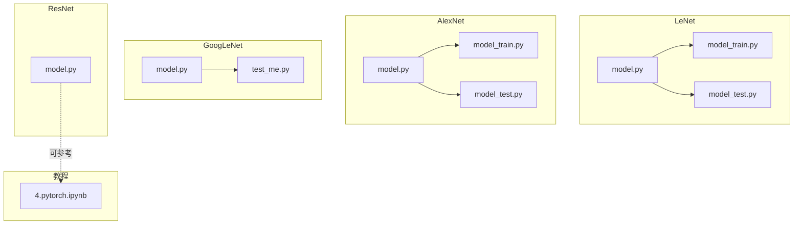
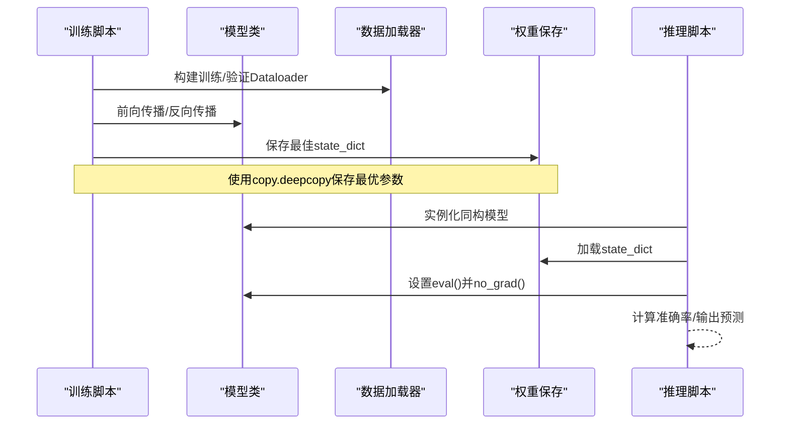
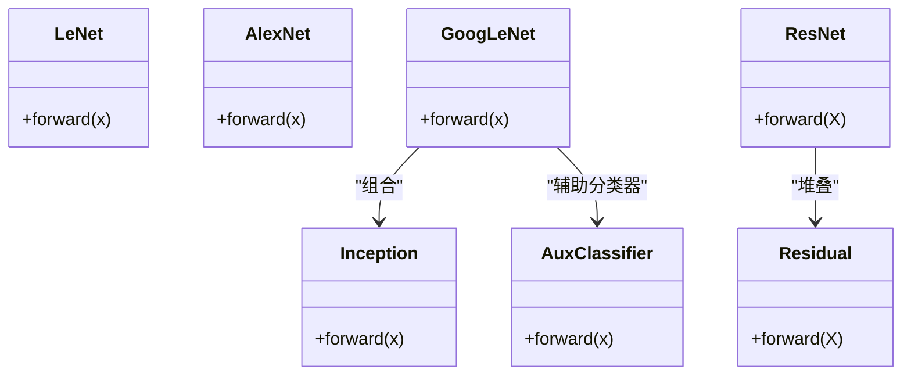
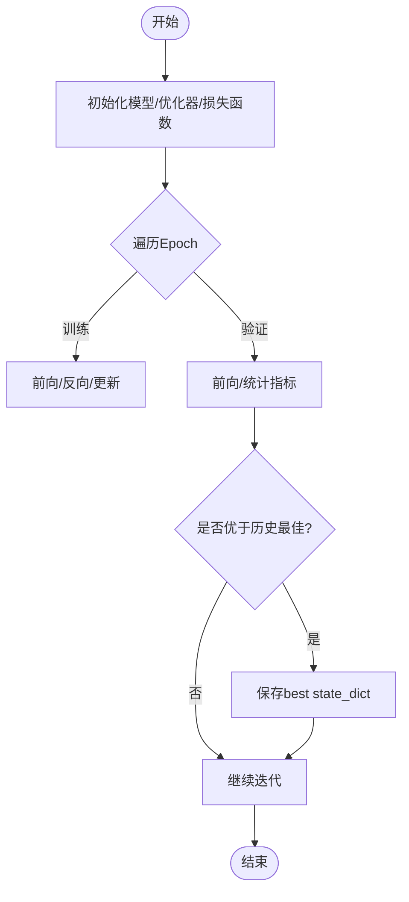
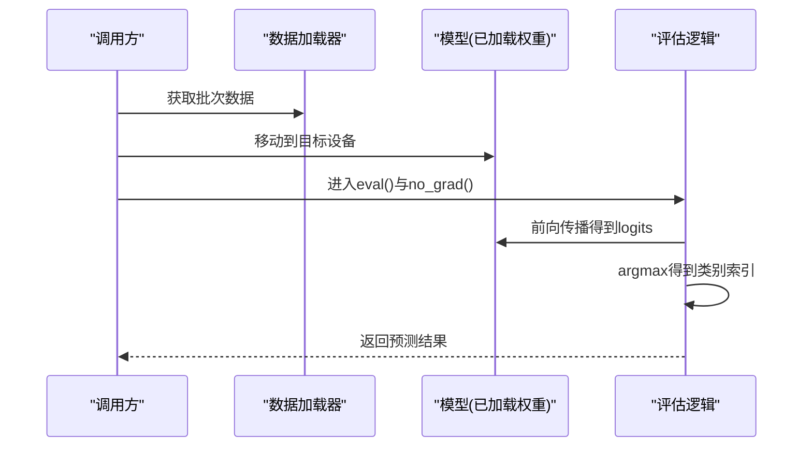
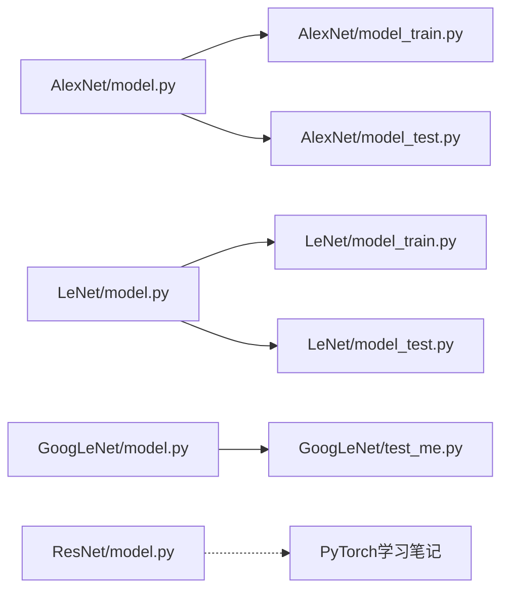

# 推理与部署

<cite>
**本文引用的文件列表**
- [AlexNet模型定义](file://study/上传课件、源码/源码/AlexNet/model.py)
- [AlexNet训练脚本](file://study/上传课件、源码/源码/AlexNet/model_train.py)
- [AlexNet测试脚本](file://study/上传课件、源码/源码/AlexNet/model_test.py)
- [LeNet模型定义](file://study/上传课件、源码/源码/LeNet/model.py)
- [LeNet训练脚本](file://study/上传课件、源码/源码/LeNet/model_train.py)
- [LeNet测试脚本](file://study/上传课件、源码/源码/LeNet/model_test.py)
- [GoogLeNet模型定义](file://study/研究生学习/8.GoogLeNet/model.py)
- [GoogLeNet测试（自定义数据集）](file://study/研究生学习/8.GoogLeNet/test_me.py)
- [ResNet模型定义](file://study/研究生学习/9.ResNet/model.py)
- [PyTorch学习笔记（保存加载/模式/常用函数）](file://study/研究生学习/4.pytorch/4.pytorch.ipynb)
</cite>

## 目录
1. [引言](#引言)
2. [项目结构](#项目结构)
3. [核心组件](#核心组件)
4. [架构总览](#架构总览)
5. [详细组件分析](#详细组件分析)
6. [依赖关系分析](#依赖关系分析)
7. [性能考虑](#性能考虑)
8. [故障排查指南](#故障排查指南)
9. [结论](#结论)
10. [附录：端到端流程与API规范](#附录端到端流程与api规范)

## 引言
本技术文档围绕“推理与部署”主题，基于仓库中已有的分类模型实现（LeNet、AlexNet、GoogLeNet、ResNet），系统梳理从训练到推理的完整链路，重点覆盖以下方面：
- 模型序列化：state_dict保存与加载、完整模型序列化的适用场景与注意事项
- ONNX格式转换：导出静态图、输入输出约定、常见约束与验证方法
- 推理预测接口：单张图片预测、批量推理、实时流式处理的设计与实现要点
- 部署方案：本地部署、Web服务封装、移动端部署路径
- 推理加速：量化、图优化、TensorRT集成思路
- 工程化实践：错误处理、日志记录、性能监控
- API接口规范与客户端集成示例
- 常见问题与性能瓶颈优化建议

## 项目结构
仓库包含多个经典CNN模型的实现与训练/测试脚本，以及一份PyTorch学习笔记。整体组织以“模型+训练+测试”为单元，便于独立运行与复用。

图表来源
- [LeNet模型定义:1-37](file://study/上传课件、源码/源码/LeNet/model.py#L1-L37)
- [LeNet训练脚本:1-191](file://study/上传课件、源码/源码/LeNet/model_train.py#L1-L191)
- [LeNet测试脚本:1-65](file://study/上传课件、源码/源码/LeNet/model_test.py#L1-L65)
- [AlexNet模型定义:1-52](file://study/上传课件、源码/源码/AlexNet/model.py#L1-L52)
- [AlexNet训练脚本:1-193](file://study/上传课件、源码/源码/AlexNet/model_train.py#L1-L193)
- [AlexNet测试脚本:1-90](file://study/上传课件、源码/源码/AlexNet/model_test.py#L1-L90)
- [GoogLeNet模型定义:1-144](file://study/研究生学习/8.GoogLeNet/model.py#L1-L144)
- [GoogLeNet测试（自定义数据集）:1-91](file://study/研究生学习/8.GoogLeNet/test_me.py#L1-L91)
- [ResNet模型定义:1-69](file://study/研究生学习/9.ResNet/model.py#L1-L69)
- [PyTorch学习笔记（保存加载/模式/常用函数）:836-870](file://study/研究生学习/4.pytorch/4.pytorch.ipynb#L836-L870)

章节来源
- [LeNet模型定义:1-37](file://study/上传课件、源码/源码/LeNet/model.py#L1-L37)
- [AlexNet模型定义:1-52](file://study/上传课件、源码/源码/AlexNet/model.py#L1-L52)
- [GoogLeNet模型定义:1-144](file://study/研究生学习/8.GoogLeNet/model.py#L1-L144)
- [ResNet模型定义:1-69](file://study/研究生学习/9.ResNet/model.py#L1-L69)
- [PyTorch学习笔记（保存加载/模式/常用函数）:836-870](file://study/研究生学习/4.pytorch/4.pytorch.ipynb#L836-L870)

## 核心组件
- 模型类
  - LeNet：轻量卷积网络，适合小图像分类任务
  - AlexNet：较深的卷积网络，含Dropout正则化
  - GoogLeNet：Inception模块组合，含辅助分类器
  - ResNet：残差连接，支持更深层网络
- 训练流程
  - 数据加载与预处理（Resize、ToTensor、Normalize等）
  - 损失函数与优化器配置
  - 训练/验证循环、指标统计、最佳权重保存
- 推理流程
  - 评估模式设置、关闭梯度计算
  - 设备选择（CPU/GPU）、张量维度对齐
  - 类别映射与结果解析

章节来源
- [AlexNet模型定义:1-52](file://study/上传课件、源码/源码/AlexNet/model.py#L1-L52)
- [AlexNet训练脚本:35-165](file://study/上传课件、源码/源码/AlexNet/model_train.py#L35-L165)
- [AlexNet测试脚本:22-53](file://study/上传课件、源码/源码/AlexNet/model_test.py#L22-L53)
- [LeNet模型定义:1-37](file://study/上传课件、源码/源码/LeNet/model.py#L1-L37)
- [LeNet训练脚本:35-162](file://study/上传课件、源码/源码/LeNet/model_train.py#L35-L162)
- [LeNet测试脚本:22-53](file://study/上传课件、源码/源码/LeNet/model_test.py#L22-L53)
- [GoogLeNet模型定义:71-137](file://study/研究生学习/8.GoogLeNet/model.py#L71-L137)
- [GoogLeNet测试（自定义数据集）:18-71](file://study/研究生学习/8.GoogLeNet/test_me.py#L18-L71)
- [ResNet模型定义:26-63](file://study/研究生学习/9.ResNet/model.py#L26-L63)

## 架构总览
下图展示从训练到推理的典型数据与控制流，涵盖模型定义、训练保存、推理加载与评估模式切换。

图表来源
- [AlexNet训练脚本:35-165](file://study/上传课件、源码/源码/AlexNet/model_train.py#L35-L165)
- [AlexNet测试脚本:56-62](file://study/上传课件、源码/源码/AlexNet/model_test.py#L56-L62)
- [LeNet训练脚本:35-162](file://study/上传课件、源码/源码/LeNet/model_train.py#L35-L162)
- [LeNet测试脚本:58-65](file://study/上传课件、源码/源码/LeNet/model_test.py#L58-L65)

## 详细组件分析

### 模型类与继承关系

图表来源
- [LeNet模型定义:6-29](file://study/上传课件、源码/源码/LeNet/model.py#L6-L29)
- [AlexNet模型定义:7-41](file://study/上传课件、源码/源码/AlexNet/model.py#L7-L41)
- [GoogLeNet模型定义:5-137](file://study/研究生学习/8.GoogLeNet/model.py#L5-L137)
- [ResNet模型定义:5-63](file://study/研究生学习/9.ResNet/model.py#L5-L63)

章节来源
- [LeNet模型定义:1-37](file://study/上传课件、源码/源码/LeNet/model.py#L1-L37)
- [AlexNet模型定义:1-52](file://study/上传课件、源码/源码/AlexNet/model.py#L1-L52)
- [GoogLeNet模型定义:1-144](file://study/研究生学习/8.GoogLeNet/model.py#L1-L144)
- [ResNet模型定义:1-69](file://study/研究生学习/9.ResNet/model.py#L1-L69)

### 训练与保存流程（state_dict）
- 训练循环
  - 训练阶段：开启梯度、计算loss、反向传播、更新参数
  - 验证阶段：关闭梯度、计算loss与准确率
- 最佳权重保存
  - 使用copy.deepcopy保存当前最优state_dict
  - 训练结束后load_state_dict恢复最优权重并持久化
- 关键注意点
  - 保存的是参数字典而非整个模型对象，便于跨环境加载
  - 加载前需确保模型结构与保存时一致
  - 推理前必须调用eval()并在no_grad()上下文执行

图表来源
- [AlexNet训练脚本:35-165](file://study/上传课件、源码/源码/AlexNet/model_train.py#L35-L165)
- [LeNet训练脚本:35-162](file://study/上传课件、源码/源码/LeNet/model_train.py#L35-L162)

章节来源
- [AlexNet训练脚本:35-165](file://study/上传课件、源码/源码/AlexNet/model_train.py#L35-L165)
- [LeNet训练脚本:35-162](file://study/上传课件、源码/源码/LeNet/model_train.py#L35-L162)
- [PyTorch学习笔记（保存加载/模式/常用函数）:836-870](file://study/研究生学习/4.pytorch/4.pytorch.ipynb#L836-L870)

### 推理与评估流程
- 评估模式与无梯度推理
  - model.eval()
  - with torch.no_grad():
- 设备与张量形状
  - 统一将模型与输入移动到同一设备
  - 注意通道顺序与尺寸（如灰度1通道、RGB三通道）
- 类别映射与结果解析
  - 对logits取argmax得到类别索引
  - 通过类别字典或列表映射到标签名

图表来源
- [AlexNet测试脚本:22-53](file://study/上传课件、源码/源码/AlexNet/model_test.py#L22-L53)
- [LeNet测试脚本:22-53](file://study/上传课件、源码/源码/LeNet/model_test.py#L22-L53)
- [GoogLeNet测试（自定义数据集）:37-71](file://study/研究生学习/8.GoogLeNet/test_me.py#L37-L71)

章节来源
- [AlexNet测试脚本:22-53](file://study/上传课件、源码/源码/AlexNet/model_test.py#L22-L53)
- [LeNet测试脚本:22-53](file://study/上传课件、源码/源码/LeNet/model_test.py#L22-L53)
- [GoogLeNet测试（自定义数据集）:37-71](file://study/研究生学习/8.GoogLeNet/test_me.py#L37-L71)

### 模型序列化与ONNX导出（概念与实践指引）
- state_dict保存与加载
  - 保存：仅保存模型参数字典，体积小、兼容性强
  - 加载：先构造同构模型，再load_state_dict；必要时指定map_location
- 完整模型序列化
  - 直接保存模型对象便于快速恢复，但存在版本耦合风险
  - 适用于内部工具链且环境稳定的场景
- ONNX导出
  - 使用torch.onnx.export导出静态图，固定输入形状与dtype
  - 导出后使用onnxruntime进行跨平台推理验证
  - 注意：动态维度、复杂控制流可能受限，需简化或改写
- 验证与调试
  - 对比PyTorch与ONNX运行时输出一致性
  - 检查算子支持情况，必要时替换为等价算子

章节来源
- [PyTorch学习笔记（保存加载/模式/常用函数）:836-870](file://study/研究生学习/4.pytorch/4.pytorch.ipynb#L836-L870)

### 推理预测接口设计
- 单张图片预测
  - 输入：原始图像文件路径或字节流
  - 预处理：Resize、ToTensor、Normalize（与训练一致）
  - 推理：unsqueeze添加批次维度，eval/no_grad，argmax
- 批量推理
  - 输入：批次数组或DataLoader
  - 优化：num_workers、pin_memory、预分配缓冲区
- 实时流式处理
  - 视频帧逐帧推理，结合线程池与队列缓冲
  - 控制帧率与分辨率，避免阻塞主循环
  - 可选：多进程解码+多线程推理+异步输出

章节来源
- [GoogLeNet测试（自定义数据集）:73-91](file://study/研究生学习/8.GoogLeNet/test_me.py#L73-L91)
- [AlexNet测试脚本:69-81](file://study/上传课件、源码/源码/AlexNet/model_test.py#L69-L81)

### 部署方案
- 本地部署
  - 使用Python脚本或Jupyter Notebook进行离线推理
  - 推荐导出ONNX并使用onnxruntime提升跨平台兼容性
- Web服务封装
  - 使用Flask/FastAPI提供REST接口
  - 请求体包含图像数据（base64或multipart/form-data）
  - 响应包含类别、置信度、耗时等元信息
- 移动端部署
  - 导出ONNX后转换为TFLite/CoreML/MNN等目标格式
  - 在移动端SDK中加载模型进行推理
  - 注意内存占用与功耗，合理设置batch与精度

[本节为通用指导，不直接分析具体代码文件]

### 推理加速技术
- 模型量化
  - 训练后量化（PTQ）：降低精度至INT8，减少体积与延迟
  - 量化感知训练（QAT）：在训练中模拟量化误差，提高精度
- 图优化
  - 常量折叠、算子融合、死代码消除
  - 使用onnx-simplifier或后端特定优化工具
- TensorRT集成
  - 将ONNX模型转换为TensorRT引擎
  - 针对GPU硬件进行内核级优化，显著提升吞吐
  - 需要匹配驱动与CUDA/TensorRT版本

[本节为通用指导，不直接分析具体代码文件]

## 依赖关系分析
- 模型与训练/测试脚本的耦合
  - 训练/测试脚本导入对应model.py中的模型类
  - 数据预处理与模型输入形状强相关
- 外部库依赖
  - torchvision.transforms用于数据增强与标准化
  - torch.utils.data.DataLoader用于高效数据加载
  - matplotlib/pandas用于训练过程可视化与记录（部分脚本）

图表来源
- [AlexNet模型定义:1-52](file://study/上传课件、源码/源码/AlexNet/model.py#L1-L52)
- [AlexNet训练脚本:1-193](file://study/上传课件、源码/源码/AlexNet/model_train.py#L1-L193)
- [AlexNet测试脚本:1-90](file://study/上传课件、源码/源码/AlexNet/model_test.py#L1-L90)
- [LeNet模型定义:1-37](file://study/上传课件、源码/源码/LeNet/model.py#L1-L37)
- [LeNet训练脚本:1-191](file://study/上传课件、源码/源码/LeNet/model_train.py#L1-L191)
- [LeNet测试脚本:1-65](file://study/上传课件、源码/源码/LeNet/model_test.py#L1-L65)
- [GoogLeNet模型定义:1-144](file://study/研究生学习/8.GoogLeNet/model.py#L1-L144)
- [GoogLeNet测试（自定义数据集）:1-91](file://study/研究生学习/8.GoogLeNet/test_me.py#L1-L91)
- [ResNet模型定义:1-69](file://study/研究生学习/9.ResNet/model.py#L1-L69)
- [PyTorch学习笔记（保存加载/模式/常用函数）:836-870](file://study/研究生学习/4.pytorch/4.pytorch.ipynb#L836-L870)

章节来源
- [AlexNet模型定义:1-52](file://study/上传课件、源码/源码/AlexNet/model.py#L1-L52)
- [AlexNet训练脚本:1-193](file://study/上传课件、源码/源码/AlexNet/model_train.py#L1-L193)
- [AlexNet测试脚本:1-90](file://study/上传课件、源码/源码/AlexNet/model_test.py#L1-L90)
- [LeNet模型定义:1-37](file://study/上传课件、源码/源码/LeNet/model.py#L1-L37)
- [LeNet训练脚本:1-191](file://study/上传课件、源码/源码/LeNet/model_train.py#L1-L191)
- [LeNet测试脚本:1-65](file://study/上传课件、源码/源码/LeNet/model_test.py#L1-L65)
- [GoogLeNet模型定义:1-144](file://study/研究生学习/8.GoogLeNet/model.py#L1-L144)
- [GoogLeNet测试（自定义数据集）:1-91](file://study/研究生学习/8.GoogLeNet/test_me.py#L1-L91)
- [ResNet模型定义:1-69](file://study/研究生学习/9.ResNet/model.py#L1-L69)
- [PyTorch学习笔记（保存加载/模式/常用函数）:836-870](file://study/研究生学习/4.pytorch/4.pytorch.ipynb#L836-L870)

## 性能考虑
- 数据加载
  - 合理设置num_workers与pin_memory，提升I/O吞吐
  - 使用缓存与预取策略，减少磁盘访问开销
- 推理优化
  - 固定输入形状，启用图优化与算子融合
  - 使用半精度（FP16）或INT8量化，权衡精度与速度
- 资源管理
  - 及时释放中间变量，避免显存泄漏
  - 控制并发请求数，防止过载

[本节为通用指导，不直接分析具体代码文件]

## 故障排查指南
- 模型加载失败
  - 检查模型结构与保存时一致
  - 确认map_location与设备类型匹配
- 推理结果异常
  - 确认预处理与训练一致（尺寸、归一化）
  - 检查通道顺序与批次维度是否正确
- 性能问题
  - 定位瓶颈：I/O、预处理、推理、后处理
  - 使用profiler分析热点路径，针对性优化

章节来源
- [AlexNet测试脚本:56-62](file://study/上传课件、源码/源码/AlexNet/model_test.py#L56-L62)
- [LeNet测试脚本:58-65](file://study/上传课件、源码/源码/LeNet/model_test.py#L58-L65)
- [GoogLeNet测试（自定义数据集）:62-71](file://study/研究生学习/8.GoogLeNet/test_me.py#L62-L71)

## 结论
本项目提供了多种经典CNN模型的训练与推理基础实现，覆盖了state_dict保存加载、评估模式与无梯度推理等关键步骤。在此基础上，可通过ONNX导出、Web服务封装与移动端适配完成生产部署，并结合量化与图优化进一步提升推理性能。建议在工程中引入完善的错误处理、日志记录与性能监控，以确保稳定性与可观测性。

[本节为总结性内容，不直接分析具体代码文件]

## 附录：端到端流程与API规范

### 端到端流程（从训练到生产部署）
- 训练阶段
  - 准备数据与预处理流水线
  - 定义模型、损失函数与优化器
  - 训练循环与验证，保存最佳state_dict
- 推理阶段
  - 加载模型与权重，设置eval/no_grad
  - 单张/批量/流式推理，输出类别与置信度
- 部署阶段
  - 导出ONNX并进行跨平台验证
  - 封装为Web服务或嵌入移动端SDK
  - 接入监控与告警，持续跟踪性能与质量

[本节为通用指导，不直接分析具体代码文件]

### API接口设计规范（REST）
- 端点
  - POST /predict
- 请求体
  - image: 二进制图像或base64字符串
  - options: 可选参数（如top_k、阈值）
- 响应体
  - classes: 类别名称列表
  - scores: 置信度分数列表
  - latency_ms: 推理耗时
  - error: 错误信息（如有）
- 状态码
  - 200: 成功
  - 400: 请求参数错误
  - 500: 服务器内部错误

[本节为通用指导，不直接分析具体代码文件]

### 客户端集成示例（概念）
- 发送HTTP请求，携带图像数据
- 解析JSON响应，提取类别与置信度
- 处理错误与重试逻辑
- 记录请求耗时与结果，用于监控与分析

[本节为通用指导，不直接分析具体代码文件]