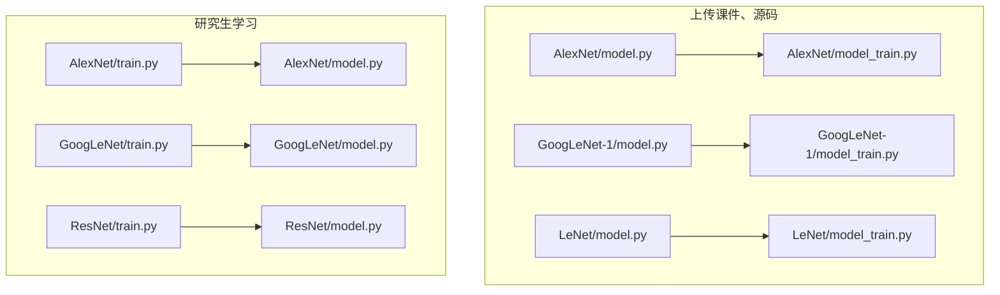
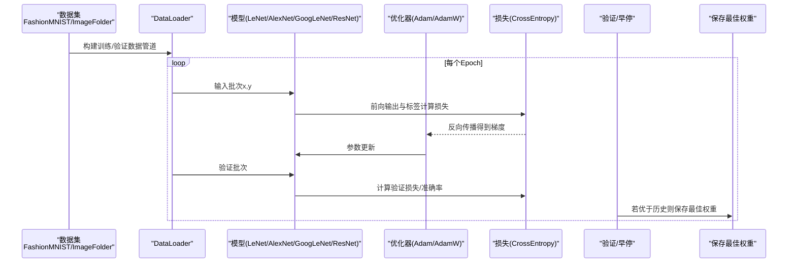
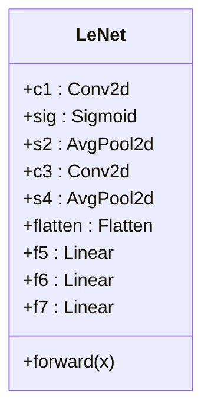
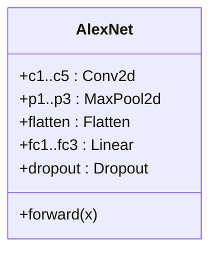
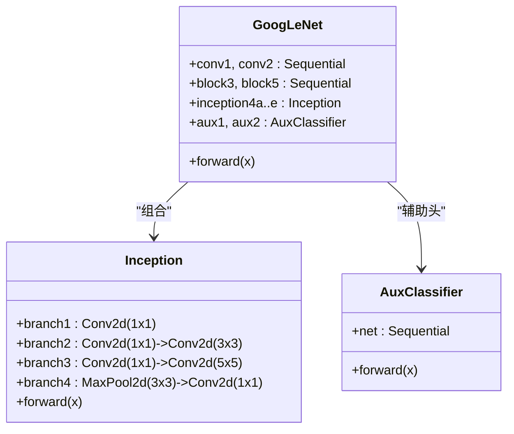
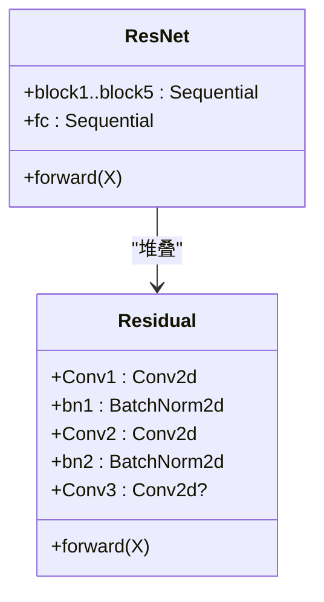
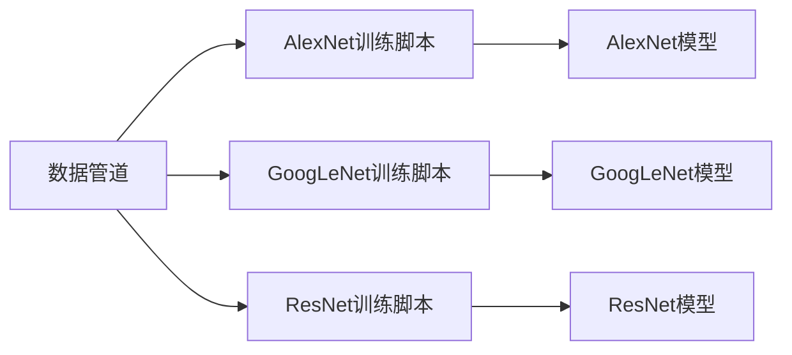

# 模型优化技术

<cite>
**本文引用的文件**   
- [AlexNet/model.py](file://study/上传课件、源码/源码/AlexNet/model.py)
- [AlexNet/model_train.py](file://study/上传课件、源码/源码/AlexNet/model_train.py)
- [GoogLeNet-1/model.py](file://study/上传课件、源码/源码/GoogLeNet-1/model.py)
- [GoogLeNet-1/model_train.py](file://study/上传课件、源码/源码/GoogLeNet-1/model_train.py)
- [LeNet/model.py](file://study/上传课件、源码/源码/LeNet/model.py)
- [LeNet/model_train.py](file://study/上传课件、源码/源码/LeNet/model_train.py)
- [ResNet/model.py](file://study/研究生学习/9.ResNet/model.py)
- [ResNet/train.py](file://study/研究生学习/9.ResNet/train.py)
- [GoogLeNet/model.py](file://study/研究生学习/8.GoogLeNet/model.py)
- [GoogLeNet/train.py](file://study/研究生学习/8.GoogLeNet/train.py)
- [AlexNet/train.py](file://study/研究生学习/6.AlexNet/train.py)
</cite>

## 目录
1. [引言](#引言)
2. [项目结构](#项目结构)
3. [核心组件](#核心组件)
4. [架构总览](#架构总览)
5. [详细组件分析](#详细组件分析)
6. [依赖关系分析](#依赖关系分析)
7. [性能与训练技巧](#性能与训练技巧)
8. [超参数调优方法](#超参数调优方法)
9. [过拟合检测与防止](#过拟合检测与防止)
10. [基准测试与经验总结](#基准测试与经验总结)
11. [故障排查指南](#故障排查指南)
12. [结论](#结论)

## 引言
本技术文档围绕深度学习模型的优化技术展开，结合仓库中多个经典网络（LeNet、AlexNet、GoogLeNet、ResNet）的训练脚本与模型定义，系统梳理以下主题：
- 超参数调优：学习率策略、批量大小选择、优化器配置、正则化技术
- 训练技巧：梯度裁剪、早停机制、学习率衰减、权重初始化
- 性能优化：GPU内存管理、数据并行处理、混合精度训练、模型剪枝
- 代码示例路径：AdamW、余弦退火调度器、Dropout等
- 过拟合检测与防止：交叉验证、数据增强、模型集成
- 性能基准与调优经验总结

## 项目结构
仓库包含两套实现风格：
- “上传课件、源码”下的简洁版实现（基础训练循环、固定学习率、简单数据加载）
- “研究生学习”下的进阶版实现（数据增强、权重衰减、辅助损失、no_grad推理、断点续训等）

图表来源
- [AlexNet/model.py:1-52](file://study/上传课件、源码/源码/AlexNet/model.py#L1-L52)
- [AlexNet/model_train.py:1-193](file://study/上传课件、源码/源码/AlexNet/model_train.py#L1-L193)
- [GoogLeNet-1/model.py:1-102](file://study/上传课件、源码/源码/GoogLeNet-1/model.py#L1-L102)
- [GoogLeNet-1/model_train.py:1-197](file://study/上传课件、源码/源码/GoogLeNet-1/model_train.py#L1-L197)
- [LeNet/model.py:1-37](file://study/上传课件、源码/源码/LeNet/model.py#L1-L37)
- [LeNet/model_train.py:1-191](file://study/上传课件、源码/源码/LeNet/model_train.py#L1-L191)
- [AlexNet/train.py:1-218](file://study/研究生学习/6.AlexNet/train.py#L1-L218)
- [AlexNet/model.py:1-50](file://study/研究生学习/6.AlexNet/model.py#L1-L50)
- [GoogLeNet/train.py:1-206](file://study/研究生学习/8.GoogLeNet/train.py#L1-L206)
- [GoogLeNet/model.py:1-144](file://study/研究生学习/8.GoogLeNet/model.py#L1-L144)
- [ResNet/train.py:1-206](file://study/研究生学习/9.ResNet/train.py#L1-L206)
- [ResNet/model.py:1-69](file://study/研究生学习/9.ResNet/model.py#L1-L69)

章节来源
- [AlexNet/model.py:1-52](file://study/上传课件、源码/源码/AlexNet/model.py#L1-L52)
- [AlexNet/model_train.py:1-193](file://study/上传课件、源码/源码/AlexNet/model_train.py#L1-L193)
- [GoogLeNet-1/model.py:1-102](file://study/上传课件、源码/源码/GoogLeNet-1/model.py#L1-L102)
- [GoogLeNet-1/model_train.py:1-197](file://study/上传课件、源码/源码/GoogLeNet-1/model_train.py#L1-L197)
- [LeNet/model.py:1-37](file://study/上传课件、源码/源码/LeNet/model.py#L1-L37)
- [LeNet/model_train.py:1-191](file://study/上传课件、源码/源码/LeNet/model_train.py#L1-L191)
- [AlexNet/train.py:1-218](file://study/研究生学习/6.AlexNet/train.py#L1-L218)
- [GoogLeNet/train.py:1-206](file://study/研究生学习/8.GoogLeNet/train.py#L1-L206)
- [ResNet/train.py:1-206](file://study/研究生学习/9.ResNet/train.py#L1-L206)

## 核心组件
- 模型定义
  - LeNet：卷积+池化+全连接，Sigmoid激活，适合手写数字基线。
  - AlexNet：多卷积层+最大池化+两个大全连接层+Dropout，具备较强表达能力。
  - GoogLeNet：Inception模块组合，含辅助分类器，支持辅助损失；提供两种实现（简洁版与带辅助损失的完整版）。
  - ResNet：残差块+批归一化，缓解退化问题，便于加深网络。
- 训练流程
  - 数据加载与划分：FashionMNIST或自定义图像文件夹，随机分割为训练/验证集。
  - 优化器与损失：普遍使用Adam与交叉熵；部分版本引入权重衰减。
  - 训练循环：前向传播→计算损失→反向传播→参数更新；验证阶段统计指标并保存最优模型。
  - 可视化：记录每轮训练/验证损失与准确率并绘图。

章节来源
- [LeNet/model.py:1-37](file://study/上传课件、源码/源码/LeNet/model.py#L1-L37)
- [AlexNet/model.py:1-52](file://study/上传课件、源码/源码/AlexNet/model.py#L1-L52)
- [GoogLeNet-1/model.py:1-102](file://study/上传课件、源码/源码/GoogLeNet-1/model.py#L1-L102)
- [ResNet/model.py:1-69](file://study/研究生学习/9.ResNet/model.py#L1-L69)
- [AlexNet/model_train.py:1-193](file://study/上传课件、源码/源码/AlexNet/model_train.py#L1-L193)
- [GoogLeNet-1/model_train.py:1-197](file://study/上传课件、源码/源码/GoogLeNet-1/model_train.py#L1-L197)
- [LeNet/model_train.py:1-191](file://study/上传课件、源码/源码/LeNet/model_train.py#L1-L191)

## 架构总览
下图展示从数据到模型再到优化的端到端流程，以及不同版本的差异点（如数据增强、权重衰减、辅助损失、no_grad推理、断点续训等）。

图表来源
- [AlexNet/model_train.py:1-193](file://study/上传课件、源码/源码/AlexNet/model_train.py#L1-L193)
- [GoogLeNet-1/model_train.py:1-197](file://study/上传课件、源码/源码/GoogLeNet-1/model_train.py#L1-L197)
- [LeNet/model_train.py:1-191](file://study/上传课件、源码/源码/LeNet/model_train.py#L1-L191)
- [AlexNet/train.py:1-218](file://study/研究生学习/6.AlexNet/train.py#L1-L218)
- [GoogLeNet/train.py:1-206](file://study/研究生学习/8.GoogLeNet/train.py#L1-L206)
- [ResNet/train.py:1-206](file://study/研究生学习/9.ResNet/train.py#L1-L206)

## 详细组件分析

### LeNet 组件分析
- 结构要点
  - 两层卷积+平均池化+Sigmoid激活，随后三个全连接层输出类别分数。
  - 无显式正则化（如Dropout），适合快速验证数据管道与训练循环。
- 训练要点
  - Adam优化器，固定学习率，交叉熵损失，标准训练/验证循环，保存最佳权重。
- 适用场景
  - 小样本、低复杂度任务（如FashionMNIST）的基线实验。

图表来源
- [LeNet/model.py:1-37](file://study/上传课件、源码/源码/LeNet/model.py#L1-L37)

章节来源
- [LeNet/model.py:1-37](file://study/上传课件、源码/源码/LeNet/model.py#L1-L37)
- [LeNet/model_train.py:1-191](file://study/上传课件、源码/源码/LeNet/model_train.py#L1-L191)

### AlexNet 组件分析
- 结构要点
  - 多层卷积+最大池化，两个大容量全连接层，配合Dropout抑制过拟合。
- 训练要点
  - 基础版：固定学习率Adam；进阶版：加入数据增强与权重衰减，采用验证损失作为早停依据。
- 关键优化点
  - Dropout正则化在两个全连接层后使用，显著降低过拟合风险。
  - 权重衰减（L2正则）通过优化器参数引入，有助于泛化。

图表来源
- [AlexNet/model.py:1-52](file://study/上传课件、源码/源码/AlexNet/model.py#L1-L52)
- [AlexNet/model.py:1-50](file://study/研究生学习/6.AlexNet/model.py#L1-L50)

章节来源
- [AlexNet/model.py:1-52](file://study/上传课件、源码/源码/AlexNet/model.py#L1-L52)
- [AlexNet/model_train.py:1-193](file://study/上传课件、源码/源码/AlexNet/model_train.py#L1-L193)
- [AlexNet/train.py:1-218](file://study/研究生学习/6.AlexNet/train.py#L1-L218)
- [AlexNet/model.py:1-50](file://study/研究生学习/6.AlexNet/model.py#L1-L50)

### GoogLeNet 组件分析
- Inception模块
  - 四条分支并行：1×1、1×1→3×3、1×1→5×5、3×3池化→1×1，通道拼接提升感受野与效率。
- 辅助分类器
  - 在中间层插入辅助分类头，训练时参与损失计算，帮助梯度回传稳定深层网络。
- 权重初始化
  - 卷积层Kaiming正态初始化，线性层高斯初始化，偏置初始化为0，利于收敛。
- 训练要点
  - 基础版：主输出损失；进阶版：主输出+两个辅助输出加权求和，提高训练稳定性。

图表来源
- [GoogLeNet-1/model.py:1-102](file://study/上传课件、源码/源码/GoogLeNet-1/model.py#L1-L102)
- [GoogLeNet/model.py:1-144](file://study/研究生学习/8.GoogLeNet/model.py#L1-L144)

章节来源
- [GoogLeNet-1/model.py:1-102](file://study/上传课件、源码/源码/GoogLeNet-1/model.py#L1-L102)
- [GoogLeNet-1/model_train.py:1-197](file://study/上传课件、源码/源码/GoogLeNet-1/model_train.py#L1-L197)
- [GoogLeNet/model.py:1-144](file://study/研究生学习/8.GoogLeNet/model.py#L1-L144)
- [GoogLeNet/train.py:1-206](file://study/研究生学习/8.GoogLeNet/train.py#L1-L206)

### ResNet 组件分析
- 残差块
  - 两路卷积+批归一化+ReLU，可选1×1卷积进行维度对齐，最终与输入相加并通过ReLU。
- 整体结构
  - 首层卷积+BN+池化，随后若干残差块堆叠，全局自适应池化+全连接输出。
- 训练要点
  - 标准训练/验证循环，支持断点续训（检查是否存在best_model.pth）。

图表来源
- [ResNet/model.py:1-69](file://study/研究生学习/9.ResNet/model.py#L1-L69)

章节来源
- [ResNet/model.py:1-69](file://study/研究生学习/9.ResNet/model.py#L1-L69)
- [ResNet/train.py:1-206](file://study/研究生学习/9.ResNet/train.py#L1-L206)

## 依赖关系分析
- 模块内聚性
  - 模型定义与训练脚本分离清晰，便于替换模型或调整训练策略。
- 直接依赖
  - 训练脚本依赖对应模型模块；数据加载依赖torchvision.transforms与datasets。
- 潜在耦合
  - 训练脚本对模型输出格式有假设（例如GoogLeNet返回主输出与辅助输出），需保持接口一致。

图表来源
- [AlexNet/model_train.py:1-193](file://study/上传课件、源码/源码/AlexNet/model_train.py#L1-L193)
- [GoogLeNet-1/model_train.py:1-197](file://study/上传课件、源码/源码/GoogLeNet-1/model_train.py#L1-L197)
- [ResNet/train.py:1-206](file://study/研究生学习/9.ResNet/train.py#L1-L206)

章节来源
- [AlexNet/model_train.py:1-193](file://study/上传课件、源码/源码/AlexNet/model_train.py#L1-L193)
- [GoogLeNet-1/model_train.py:1-197](file://study/上传课件、源码/源码/GoogLeNet-1/model_train.py#L1-L197)
- [ResNet/train.py:1-206](file://study/研究生学习/9.ResNet/train.py#L1-L206)

## 性能与训练技巧
- GPU内存管理
  - 将模型与数据移动到设备（cuda/cpu），避免不必要的张量复制。
  - 验证阶段使用no_grad上下文减少图构建开销，节省显存。
- 数据并行处理
  - DataLoader设置num_workers加速I/O；根据CPU核数与磁盘IO能力调整。
  - 增大batch_size可提升吞吐，但需监控显存占用。
- 混合精度训练
  - 可在训练循环中加入自动混合精度（AMP）以加速并降低显存占用（当前仓库未直接使用，可作为扩展）。
- 模型剪枝
  - 可通过结构化剪枝（通道/滤波器）或非结构化剪枝（稀疏权重）减小模型体积与延迟（当前仓库未直接使用，可作为扩展）。

章节来源
- [AlexNet/model_train.py:1-193](file://study/上传课件、源码/源码/AlexNet/model_train.py#L1-L193)
- [GoogLeNet-1/model_train.py:1-197](file://study/上传课件、源码/源码/GoogLeNet-1/model_train.py#L1-L197)
- [LeNet/model_train.py:1-191](file://study/上传课件、源码/源码/LeNet/model_train.py#L1-L191)
- [AlexNet/train.py:1-218](file://study/研究生学习/6.AlexNet/train.py#L1-L218)
- [GoogLeNet/train.py:1-206](file://study/研究生学习/8.GoogLeNet/train.py#L1-L206)
- [ResNet/train.py:1-206](file://study/研究生学习/9.ResNet/train.py#L1-L206)

## 超参数调优方法
- 学习率策略
  - 固定学习率：多数脚本使用固定lr=0.001的Adam。
  - 建议扩展：余弦退火或StepLR，随epoch逐步降低学习率以提升收敛质量。
- 批量大小选择
  - 常见值：32、128。较大batch可提升吞吐与稳定性，但可能影响泛化；需结合显存与数据规模权衡。
- 优化器配置
  - Adam：默认动量与自适应步长，适合大多数任务。
  - AdamW：解耦权重衰减，通常比Adam更稳健；可在现有脚本中将优化器替换为AdamW并保留weight_decay。
- 正则化技术
  - Dropout：AlexNet在全连接层后使用，有效抑制过拟合。
  - 权重衰减：在优化器中设置weight_decay，等价于L2正则，有助于泛化。
  - 数据增强：随机翻转、旋转、仿射变换等，增加样本多样性。

章节来源
- [AlexNet/model.py:1-52](file://study/上传课件、源码/源码/AlexNet/model.py#L1-L52)
- [AlexNet/train.py:1-218](file://study/研究生学习/6.AlexNet/train.py#L1-L218)
- [AlexNet/model_train.py:1-193](file://study/上传课件、源码/源码/AlexNet/model_train.py#L1-L193)

## 过拟合检测与防止
- 检测
  - 观察训练/验证损失与准确率曲线：若训练损失持续下降而验证损失上升或准确率停滞/下降，可能存在过拟合。
  - 使用早停机制：基于验证损失或准确率保存最佳权重，并在后续恢复。
- 防止
  - 数据增强：随机水平翻转、旋转、仿射变换等。
  - Dropout与权重衰减：已在AlexNet中体现。
  - 交叉验证：可将训练集进一步划分为多折，评估模型稳定性与泛化能力。
  - 模型集成：训练多个不同初始化或不同增强的模型，预测时取平均或投票。

章节来源
- [AlexNet/train.py:1-218](file://study/研究生学习/6.AlexNet/train.py#L1-L218)
- [AlexNet/model.py:1-52](file://study/上传课件、源码/源码/AlexNet/model.py#L1-L52)
- [AlexNet/model_train.py:1-193](file://study/上传课件、源码/源码/AlexNet/model_train.py#L1-L193)

## 基准测试与经验总结
- 基准建议
  - 统一数据与预处理，对比不同优化器（Adam vs AdamW）、学习率策略（固定 vs 余弦退火）、正则化强度（Dropout比例、weight_decay大小）。
  - 记录每轮训练/验证损失与准确率，绘制曲线，比较收敛速度与最终性能。
- 经验总结
  - 对于浅层网络（LeNet），固定学习率即可达到较好效果；复杂网络（AlexNet/GoogLeNet/ResNet）建议引入学习率衰减与更强的正则化。
  - 数据增强与权重衰减的组合能显著提升泛化能力。
  - 辅助损失在GoogLeNet中有助于稳定训练，但需注意训练与推理时的输出差异。

[本节为通用指导，不直接分析具体文件]

## 故障排查指南
- 常见问题
  - 显存不足：减小batch_size、关闭调试打印、使用no_grad推理、启用混合精度。
  - 训练不稳定：检查学习率是否过大、是否引入合适的正则化、是否使用合理的权重初始化。
  - 数据加载瓶颈：调整num_workers、预缓存数据或使用更快的存储介质。
- 定位方法
  - 分段打印关键指标（loss、acc、时间），确认异常发生在哪个阶段。
  - 使用较小的子集复现问题，逐步扩大范围定位根因。

[本节为通用指导，不直接分析具体文件]

## 结论
本仓库提供了从基础到进阶的多套训练实现，涵盖了经典网络的模型定义与训练流程。通过引入数据增强、权重衰减、辅助损失、no_grad推理与断点续训等技巧，可以在保证训练稳定的同时提升泛化与效率。建议在现有基础上进一步集成AdamW、余弦退火学习率调度器、混合精度训练与模型剪枝等技术，以获得更好的性能与资源利用。

[本节为总结性内容，不直接分析具体文件]