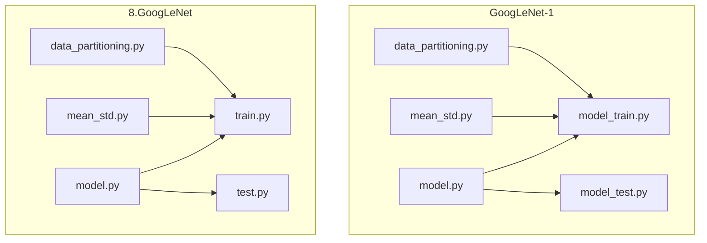
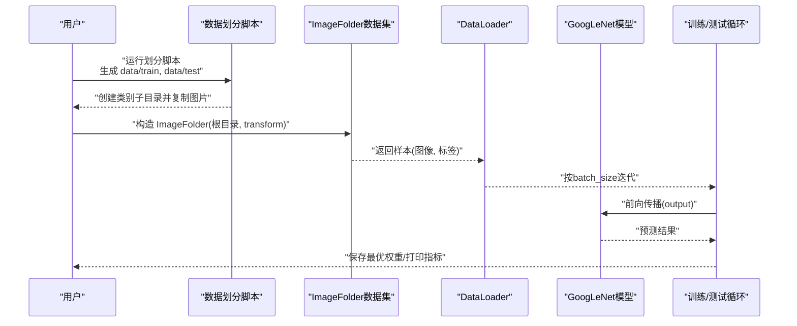
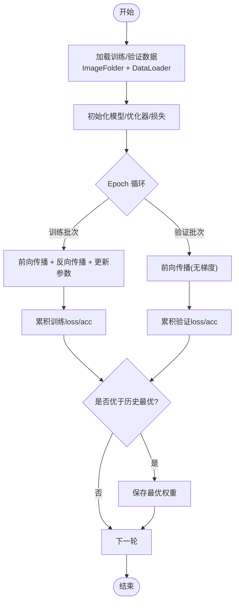
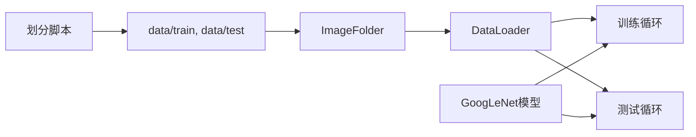

# 自定义数据集支持

<cite>
**本文引用的文件**   
- [GoogLeNet-1/data_partitioning.py](file://study/上传课件、源码/源码/GoogLeNet-1/data_partitioning.py)
- [GoogLeNet-1/mean_std.py](file://study/上传课件、源码/源码/GoogLeNet-1/mean_std.py)
- [GoogLeNet-1/model.py](file://study/上传课件、源码/源码/GoogLeNet-1/model.py)
- [GoogLeNet-1/model_train.py](file://study/上传课件、源码/源码/GoogLeNet-1/model_train.py)
- [GoogLeNet-1/model_test.py](file://study/上传课件、源码/源码/GoogLeNet-1/model_test.py)
- [8.GoogLeNet/data_partitioning.py](file://study/研究生学习/8.GoogLeNet/data_partitioning.py)
- [8.GoogLeNet/mean_std.py](file://study/研究生学习/8.GoogLeNet/mean_std.py)
- [8.GoogLeNet/train.py](file://study/研究生学习/8.GoogLeNet/train.py)
- [8.GoogLeNet/test.py](file://study/研究生学习/8.GoogLeNet/test.py)
- [8.GoogLeNet/model.py](file://study/研究生学习/8.GoogLeNet/model.py)
</cite>

## 目录
1. [简介](#简介)
2. [项目结构](#项目结构)
3. [核心组件](#核心组件)
4. [架构总览](#架构总览)
5. [详细组件分析](#详细组件分析)
6. [依赖关系分析](#依赖关系分析)
7. [性能与内存优化](#性能与内存优化)
8. [故障排查指南](#故障排查指南)
9. [结论](#结论)
10. [附录：最佳实践清单](#附录最佳实践清单)

## 简介
本技术文档围绕“自定义数据集支持”展开，重点解释 ImageFolder 的使用方式（目录结构要求、数据加载流程、预处理配置），并以猫狗分类任务为例，说明数据划分策略（训练集、验证集、测试集）、数据增强与标准化处理。同时提供构建自定义数据集类、处理不同格式图片、实现批量数据加载的完整示例路径，并给出预处理最佳实践（尺寸调整、归一化参数计算、内存优化）以及常见问题解决方案。

## 项目结构
仓库包含两套 GoogLeNet 相关实现，分别位于“上传课件、源码/源码/GoogLeNet-1”和“研究生学习/8.GoogLeNet”。前者以 ImageFolder 为主，后者提供了更完善的均值方差计算脚本与可复用的训练/测试流程。

图表来源
- [GoogLeNet-1/data_partitioning.py:1-49](file://study/上传课件、源码/源码/GoogLeNet-1/data_partitioning.py#L1-L49)
- [GoogLeNet-1/mean_std.py:1-58](file://study/上传课件、源码/源码/GoogLeNet-1/mean_std.py#L1-L58)
- [GoogLeNet-1/model.py:1-102](file://study/上传课件、源码/源码/GoogLeNet-1/model.py#L1-L102)
- [GoogLeNet-1/model_train.py:1-197](file://study/上传课件、源码/源码/GoogLeNet-1/model_train.py#L1-L197)
- [GoogLeNet-1/model_test.py:1-105](file://study/上传课件、源码/源码/GoogLeNet-1/model_test.py#L1-L105)
- [8.GoogLeNet/data_partitioning.py:1-51](file://study/研究生学习/8.GoogLeNet/data_partitioning.py#L1-L51)
- [8.GoogLeNet/mean_std.py:1-56](file://study/研究生学习/8.GoogLeNet/mean_std.py#L1-L56)
- [8.GoogLeNet/train.py:1-206](file://study/研究生学习/8.GoogLeNet/train.py#L1-L206)
- [8.GoogLeNet/test.py:1-96](file://study/研究生学习/8.GoogLeNet/test.py#L1-L96)
- [8.GoogLeNet/model.py:1-144](file://study/研究生学习/8.GoogLeNet/model.py#L1-L144)

章节来源
- [GoogLeNet-1/model_train.py:14-35](file://study/上传课件、源码/源码/GoogLeNet-1/model_train.py#L14-L35)
- [GoogLeNet-1/model_test.py:9-23](file://study/上传课件、源码/源码/GoogLeNet-1/model_test.py#L9-L23)
- [8.GoogLeNet/train.py:16-33](file://study/研究生学习/8.GoogLeNet/train.py#L16-L33)
- [8.GoogLeNet/test.py:13-23](file://study/研究生学习/8.GoogLeNet/test.py#L13-L23)

## 核心组件
- 数据划分脚本：将原始类别文件夹按固定比例复制到 train/test 子目录，形成 ImageFolder 可直接识别的目录结构。
- 均值方差计算脚本：遍历训练集图片，计算每通道像素均值与标准差，用于后续 Normalize 配置。
- 模型定义：GoogLeNet 及其 Inception 模块，输出层适配二分类任务。
- 训练流程：使用 ImageFolder + transforms.Compose + DataLoader 完成数据加载与批处理；随机划分训练/验证集；训练循环记录损失与准确率并保存最优权重。
- 测试流程：加载测试集，评估模型准确率，并对单张图像进行推理。

章节来源
- [GoogLeNet-1/data_partitioning.py:11-49](file://study/上传课件、源码/源码/GoogLeNet-1/data_partitioning.py#L11-L49)
- [GoogLeNet-1/mean_std.py:1-58](file://study/上传课件、源码/源码/GoogLeNet-1/mean_std.py#L1-L58)
- [GoogLeNet-1/model.py:39-91](file://study/上传课件、源码/源码/GoogLeNet-1/model.py#L39-L91)
- [GoogLeNet-1/model_train.py:14-169](file://study/上传课件、源码/源码/GoogLeNet-1/model_train.py#L14-L169)
- [GoogLeNet-1/model_test.py:9-105](file://study/上传课件、源码/源码/GoogLeNet-1/model_test.py#L9-L105)

## 架构总览
下图展示了从数据准备到训练、测试的整体流程，包括目录结构、数据加载、预处理、模型前向传播与评估。

图表来源
- [GoogLeNet-1/data_partitioning.py:11-49](file://study/上传课件、源码/源码/GoogLeNet-1/data_partitioning.py#L11-L49)
- [GoogLeNet-1/model_train.py:14-35](file://study/上传课件、源码/源码/GoogLeNet-1/model_train.py#L14-L35)
- [GoogLeNet-1/model.py:39-91](file://study/上传课件、源码/源码/GoogLeNet-1/model.py#L39-L91)
- [GoogLeNet-1/model_test.py:9-23](file://study/上传课件、源码/源码/GoogLeNet-1/model_test.py#L9-L23)

## 详细组件分析

### 1) ImageFolder 使用方法与目录结构要求
- 目录结构要求
  - 根目录下每个子目录为一个类别，子目录内放置对应类别的图片文件。
  - 训练集与测试集需分别置于独立根目录，例如 data/train 与 data/test。
- 数据加载流程
  - 通过 torchvision.datasets.ImageFolder 指定根目录与预处理 transform。
  - 使用 torch.utils.data.DataLoader 设置 batch_size、shuffle、num_workers 等参数进行批量加载。
- 预处理配置
  - 常见顺序：Resize -> ToTensor -> Normalize。
  - Normalize 的 mean/std 建议基于训练集统计得到，确保训练与测试一致。

章节来源
- [GoogLeNet-1/model_train.py:14-35](file://study/上传课件、源码/源码/GoogLeNet-1/model_train.py#L14-L35)
- [GoogLeNet-1/model_test.py:9-23](file://study/上传课件、源码/源码/GoogLeNet-1/model_test.py#L9-L23)

### 2) 数据划分策略（训练集、验证集、测试集）
- 训练集与测试集划分
  - 使用脚本遍历原始类别目录，按比例随机抽取图片复制到 test，其余放入 train。
  - 该过程保证每个类别在 train/test 中均有分布，避免类别不平衡导致的偏差。
- 训练集内部再划分为训练/验证
  - 在训练阶段，使用 random_split 对训练集进一步切分为 train 与 val，便于早停与超参选择。
- 注意事项
  - 若需要三折或分层抽样，可在现有脚本基础上引入 stratified sampling。
  - 保持随机种子固定以保证可复现性。

章节来源
- [GoogLeNet-1/data_partitioning.py:11-49](file://study/上传课件、源码/源码/GoogLeNet-1/data_partitioning.py#L11-L49)
- [GoogLeNet-1/model_train.py:24-35](file://study/上传课件、源码/源码/GoogLeNet-1/model_train.py#L24-L35)
- [8.GoogLeNet/data_partitioning.py:18-51](file://study/研究生学习/8.GoogLeNet/data_partitioning.py#L18-L51)

### 3) 数据增强技术与标准化处理
- 数据增强
  - 当前实现未包含显式增强（如随机裁剪、翻转、旋转）。可在训练 transform 中加入 RandomResizedCrop、RandomHorizontalFlip、ColorJitter 等。
  - 注意：测试/验证 transform 不应包含随机增强，仅做确定性变换（Resize、ToTensor、Normalize）。
- 标准化处理
  - 使用 transforms.Normalize(mean, std)，其中 mean/std 由训练集统计得到。
  - 推荐先 Resize 到模型输入尺寸，再进行 ToTensor 与 Normalize，确保数值范围一致。

章节来源
- [GoogLeNet-1/model_train.py:18-22](file://study/上传课件、源码/源码/GoogLeNet-1/model_train.py#L18-L22)
- [GoogLeNet-1/model_test.py:13-17](file://study/上传课件、源码/源码/GoogLeNet-1/model_test.py#L13-L17)

### 4) 均值与标准差计算（归一化参数）
- 计算流程
  - 遍历训练集所有图片，读取为数组后归一化至 [0,1]。
  - 累加各通道像素值与平方值，最终计算均值与标准差。
- 两种实现对比
  - 基础版：两次遍历，第一次求均值，第二次求方差。
  - 改进版：一次遍历累计像素计数、通道总和与平方和，直接推导均值与标准差，减少 IO 开销。
- 输出
  - 打印每通道的 mean 与 std，供 Normalize 使用。

章节来源
- [GoogLeNet-1/mean_std.py:1-58](file://study/上传课件、源码/源码/GoogLeNet-1/mean_std.py#L1-L58)
- [8.GoogLeNet/mean_std.py:1-56](file://study/研究生学习/8.GoogLeNet/mean_std.py#L1-L56)

### 5) 模型结构与输出适配
- Inception 模块
  - 四条并行分支：1x1卷积、1x1+3x3、1x1+5x5、池化+1x1，沿通道维度拼接。
- GoogLeNet
  - 多阶段特征提取，最后经自适应平均池化展平后接全连接层输出类别数。
  - 二分类任务时，输出层线性层输出通道数为 2。
- 辅助分类器（可选）
  - 在训练时可启用辅助损失以提升收敛稳定性（参考另一版本的 model.py）。

章节来源
- [GoogLeNet-1/model.py:7-34](file://study/上传课件、源码/源码/GoogLeNet-1/model.py#L7-L34)
- [GoogLeNet-1/model.py:39-91](file://study/上传课件、源码/源码/GoogLeNet-1/model.py#L39-L91)
- [8.GoogLeNet/model.py:5-51](file://study/研究生学习/8.GoogLeNet/model.py#L5-L51)
- [8.GoogLeNet/model.py:71-137](file://study/研究生学习/8.GoogLeNet/model.py#L71-L137)

### 6) 训练流程与评估
- 训练流程
  - 设备选择（GPU/CPU）、优化器（Adam）、损失函数（交叉熵）。
  - 训练模式与评估模式切换，记录 loss 与准确率，保存验证集最优权重。
- 验证流程
  - 关闭梯度计算，仅前向传播，统计正确率。
- 测试流程
  - 加载测试集，评估整体准确率；支持对单张图片进行推理。

图表来源
- [GoogLeNet-1/model_train.py:39-169](file://study/上传课件、源码/源码/GoogLeNet-1/model_train.py#L39-L169)
- [GoogLeNet-1/model_test.py:26-57](file://study/上传课件、源码/源码/GoogLeNet-1/model_test.py#L26-L57)

章节来源
- [GoogLeNet-1/model_train.py:39-169](file://study/上传课件、源码/源码/GoogLeNet-1/model_train.py#L39-L169)
- [GoogLeNet-1/model_test.py:26-57](file://study/上传课件、源码/源码/GoogLeNet-1/model_test.py#L26-L57)

### 7) 构建自定义数据集类与批量加载
- 何时需要自定义数据集
  - 当图片不在 ImageFolder 标准目录结构中，或需要动态标签映射、特殊预处理逻辑时。
- 基本步骤
  - 继承 torch.utils.data.Dataset，重写 __len__ 与 __getitem__。
  - 在 __getitem__ 中读取图片、执行预处理（Resize、ToTensor、Normalize），返回 (tensor, label)。
  - 使用 DataLoader 进行批量加载，设置 shuffle、num_workers、pin_memory 等。
- 参考路径
  - 训练/测试数据加载与 DataLoader 配置可参考以下文件中的实现模式。

章节来源
- [GoogLeNet-1/model_train.py:24-35](file://study/上传课件、源码/源码/GoogLeNet-1/model_train.py#L24-L35)
- [GoogLeNet-1/model_test.py:19-23](file://study/上传课件、源码/源码/GoogLeNet-1/model_test.py#L19-L23)
- [8.GoogLeNet/train.py:22-33](file://study/研究生学习/8.GoogLeNet/train.py#L22-L33)
- [8.GoogLeNet/test.py:19-23](file://study/研究生学习/8.GoogLeNet/test.py#L19-L23)

### 8) 实际项目集成示例
- 端到端流程
  - 运行数据划分脚本，生成 data/train 与 data/test。
  - 运行均值方差计算脚本，获取 mean/std 并写入训练脚本的 Normalize 参数。
  - 启动训练脚本，自动加载 ImageFolder 数据、训练并保存最优权重。
  - 运行测试脚本，加载测试集评估准确率，或对单张图片进行推理。
- 关键路径
  - 数据划分：[GoogLeNet-1/data_partitioning.py:11-49](file://study/上传课件、源码/源码/GoogLeNet-1/data_partitioning.py#L11-L49)
  - 均值方差：[GoogLeNet-1/mean_std.py:1-58](file://study/上传课件、源码/源码/GoogLeNet-1/mean_std.py#L1-58)
  - 训练入口：[GoogLeNet-1/model_train.py:14-197](file://study/上传课件、源码/源码/GoogLeNet-1/model_train.py#L14-L197)
  - 测试入口：[GoogLeNet-1/model_test.py:9-105](file://study/上传课件、源码/源码/GoogLeNet-1/model_test.py#L9-L105)

章节来源
- [GoogLeNet-1/model_train.py:190-197](file://study/上传课件、源码/源码/GoogLeNet-1/model_train.py#L190-L197)
- [GoogLeNet-1/model_test.py:60-105](file://study/上传课件、源码/源码/GoogLeNet-1/model_test.py#L60-L105)

## 依赖关系分析
- 数据流依赖
  - 划分脚本 → 生成 train/test 目录 → ImageFolder 读取 → DataLoader 批量迭代。
- 模型依赖
  - 训练/测试脚本导入模型定义，调用 forward 进行前向传播。
- 外部库
  - torchvision.transforms 负责预处理；torch.utils.data 负责数据加载；PIL/numpy 用于图像处理与数值计算。

图表来源
- [GoogLeNet-1/data_partitioning.py:11-49](file://study/上传课件、源码/源码/GoogLeNet-1/data_partitioning.py#L11-L49)
- [GoogLeNet-1/model_train.py:14-35](file://study/上传课件、源码/源码/GoogLeNet-1/model_train.py#L14-L35)
- [GoogLeNet-1/model.py:39-91](file://study/上传课件、源码/源码/GoogLeNet-1/model.py#L39-L91)

章节来源
- [GoogLeNet-1/model_train.py:14-35](file://study/上传课件、源码/源码/GoogLeNet-1/model_train.py#L14-L35)
- [GoogLeNet-1/model.py:39-91](file://study/上传课件、源码/源码/GoogLeNet-1/model.py#L39-L91)

## 性能与内存优化
- DataLoader 并行
  - 合理设置 num_workers 提升 IO 吞吐；Windows 下需注意进程启动方式。
- 内存管理
  - 测试/验证阶段使用 no_grad 上下文，避免不必要的梯度存储。
  - 及时将数据移动到目标设备（GPU/CPU），减少跨设备拷贝。
- 预处理优化
  - 优先在磁盘侧进行必要的尺寸裁剪/缩放，减少 GPU 负载。
  - 使用 pin_memory=True 加速 CPU→GPU 数据传输（配合 CUDA）。
- 归一化计算
  - 采用单次遍历累计像素总和与平方和的方法，降低重复 IO 开销。

章节来源
- [GoogLeNet-1/model_train.py:25-33](file://study/上传课件、源码/源码/GoogLeNet-1/model_train.py#L25-L33)
- [GoogLeNet-1/model_test.py:37-57](file://study/上传课件、源码/源码/GoogLeNet-1/model_test.py#L37-L57)
- [8.GoogLeNet/mean_std.py:30-56](file://study/研究生学习/8.GoogLeNet/mean_std.py#L30-L56)

## 故障排查指南
- 找不到图片文件或路径错误
  - 检查 ImageFolder 根目录是否存在，类别子目录是否正确命名。
  - 确认数据划分脚本已正确生成 train/test 目录结构。
- 预处理不一致导致精度异常
  - 训练与测试必须使用相同的 Resize、ToTensor、Normalize 顺序与参数。
  - 确保 Normalize 的 mean/std 来自训练集统计。
- 内存不足或 OOM
  - 减小 batch_size，增加 num_workers，开启 pin_memory。
  - 避免在训练循环中保留中间变量引用。
- 类别数量与输出层不匹配
  - 二分类任务需确保模型输出层通道数为 2。
- 单张图片推理失败
  - 需要对单图执行与 DataLoader 一致的预处理，并添加批次维度。

章节来源
- [GoogLeNet-1/model_train.py:14-35](file://study/上传课件、源码/源码/GoogLeNet-1/model_train.py#L14-L35)
- [GoogLeNet-1/model_test.py:85-101](file://study/上传课件、源码/源码/GoogLeNet-1/model_test.py#L85-L101)
- [GoogLeNet-1/mean_std.py:1-58](file://study/上传课件、源码/源码/GoogLeNet-1/mean_std.py#L1-L58)

## 结论
通过 ImageFolder 与 transforms 的组合，可以快速构建标准化的数据加载流水线；结合合理的划分策略与归一化参数计算，能够显著提升训练稳定性与泛化能力。建议在训练阶段加入适当的数据增强，并在测试阶段保持确定性预处理。对于大规模数据，应重视 DataLoader 并行与内存优化，以获得更高的吞吐与更低的延迟。

## 附录：最佳实践清单
- 目录结构
  - 严格遵循 ImageFolder 规范：根目录下每个子目录为一个类别。
- 数据划分
  - 使用分层抽样保证类别平衡；固定随机种子保证可复现。
- 预处理
  - 统一 Resize 尺寸；ToTensor 后再 Normalize；训练/测试保持一致。
- 归一化参数
  - 基于训练集计算 mean/std，避免数据泄露。
- 数据增强
  - 训练集使用随机增强；验证/测试禁用随机增强。
- 批量加载
  - 合理设置 batch_size、num_workers、pin_memory。
- 训练监控
  - 记录并可视化训练/验证 loss 与准确率；保存最优权重。
- 推理
  - 单图推理需与 DataLoader 预处理一致，并添加批次维度。