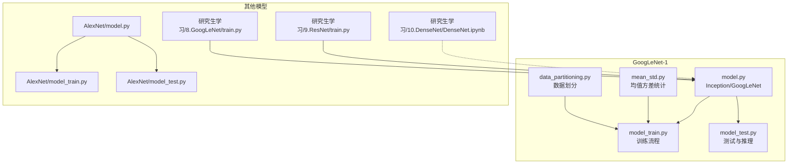
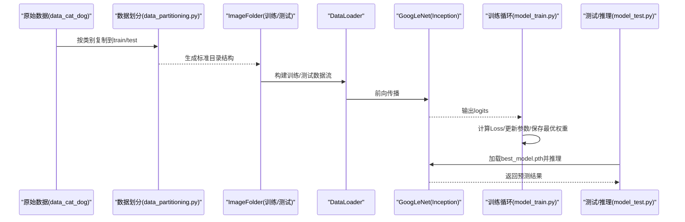
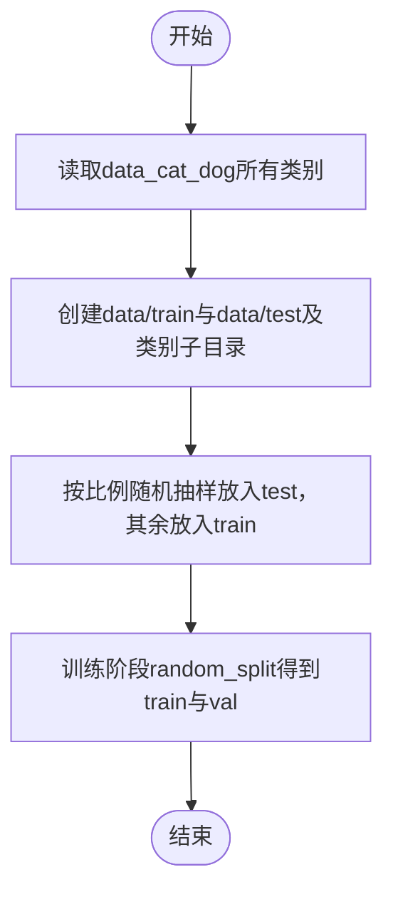
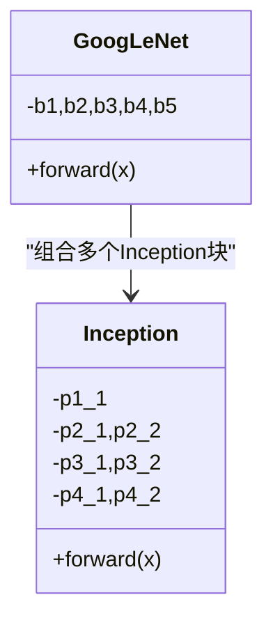
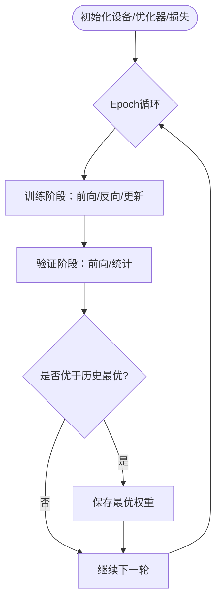
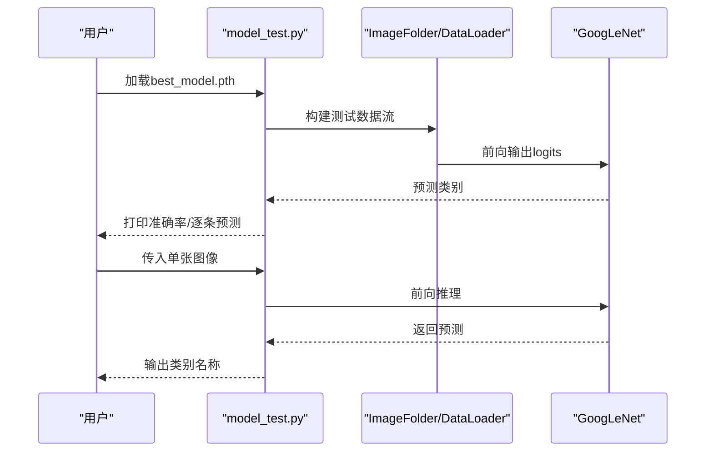
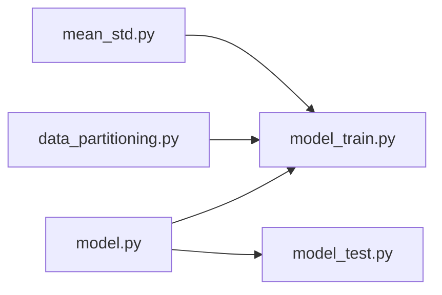

# 高级功能

<cite>
**本文引用的文件**   
- [GoogLeNet-1/model.py](file://study/上传课件、源码/源码/GoogLeNet-1/model.py)
- [GoogLeNet-1/data_partitioning.py](file://study/上传课件、源码/源码/GoogLeNet-1/data_partitioning.py)
- [GoogLeNet-1/mean_std.py](file://study/上传课件、源码/源码/GoogLeNet-1/mean_std.py)
- [GoogLeNet-1/model_train.py](file://study/上传课件、源码/源码/GoogLeNet-1/model_train.py)
- [GoogLeNet-1/model_test.py](file://study/上传课件、源码/源码/GoogLeNet-1/model_test.py)
- [AlexNet/model.py](file://study/上传课件、源码/源码/AlexNet/model.py)
- [AlexNet/model_train.py](file://study/上传课件、源码/源码/AlexNet/model_train.py)
- [AlexNet/model_test.py](file://study/上传课件、源码/源码/AlexNet/model_test.py)
- [研究生学习/6.AlexNet/train.py](file://study/研究生学习/6.AlexNet/train.py)
- [研究生学习/8.GoogLeNet/train.py](file://study/研究生学习/8.GoogLeNet/train.py)
- [研究生学习/9.ResNet/train.py](file://study/研究生学习/9.ResNet/train.py)
- [研究生学习/10.DenseNet/DenseNet.ipynb](file://study/研究生学习/10.DenseNet/DenseNet.ipynb)
</cite>

## 目录
1. [引言](#引言)
2. [项目结构](#项目结构)
3. [核心组件](#核心组件)
4. [架构总览](#架构总览)
5. [详细组件分析](#详细组件分析)
6. [依赖关系分析](#依赖关系分析)
7. [性能与优化](#性能与优化)
8. [故障排查指南](#故障排查指南)
9. [结论](#结论)
10. [附录：推理与部署最佳实践](#附录推理与部署最佳实践)

## 引言
本技术文档面向高级用户，围绕“猫狗分类任务”的自定义数据集支持、ImageFolder 使用方式、数据划分策略、模型优化与超参调优、训练技巧与性能优化、DenseNet 扩展学习材料、推理预测接口、模型序列化与权重保存加载、推理加速、项目集成示例与基准测试方法、以及复杂问题与瓶颈定位进行系统化说明。内容基于仓库中 GoogLeNet-1（猫狗分类）、AlexNet、GoogLeNet、ResNet 的训练与测试脚本，以及 DenseNet 学习笔记整理而成。

## 项目结构
仓库包含多个经典网络实现与训练流程，其中与“猫狗分类”直接相关的是 GoogLeNet-1 模块，提供：
- Inception 与 GoogLeNet 模型定义
- 数据预处理与统计量计算
- 数据划分脚本
- 训练与测试流程
- 单张图像推理示例

图表来源
- [GoogLeNet-1/model.py:1-102](file://study/上传课件、源码/源码/GoogLeNet-1/model.py#L1-L102)
- [GoogLeNet-1/data_partitioning.py:1-49](file://study/上传课件、源码/源码/GoogLeNet-1/data_partitioning.py#L1-L49)
- [GoogLeNet-1/mean_std.py:1-58](file://study/上传课件、源码/源码/GoogLeNet-1/mean_std.py#L1-L58)
- [GoogLeNet-1/model_train.py:1-197](file://study/上传课件、源码/源码/GoogLeNet-1/model_train.py#L1-L197)
- [GoogLeNet-1/model_test.py:1-105](file://study/上传课件、源码/源码/GoogLeNet-1/model_test.py#L1-L105)
- [AlexNet/model.py:1-52](file://study/上传课件、源码/源码/AlexNet/model.py#L1-L52)
- [AlexNet/model_train.py:1-193](file://study/上传课件、源码/源码/AlexNet/model_train.py#L1-L193)
- [AlexNet/model_test.py:1-90](file://study/上传课件、源码/源码/AlexNet/model_test.py#L1-L90)
- [研究生学习/8.GoogLeNet/train.py:1-206](file://study/研究生学习/8.GoogLeNet/train.py#L1-L206)
- [研究生学习/9.ResNet/train.py:1-206](file://study/研究生学习/9.ResNet/train.py#L1-L206)
- [研究生学习/10.DenseNet/DenseNet.ipynb:1-558](file://study/研究生学习/10.DenseNet/DenseNet.ipynb#L1-L558)

章节来源
- [GoogLeNet-1/model.py:1-102](file://study/上传课件、源码/源码/GoogLeNet-1/model.py#L1-L102)
- [GoogLeNet-1/data_partitioning.py:1-49](file://study/上传课件、源码/源码/GoogLeNet-1/data_partitioning.py#L1-L49)
- [GoogLeNet-1/mean_std.py:1-58](file://study/上传课件、源码/源码/GoogLeNet-1/mean_std.py#L1-L58)
- [GoogLeNet-1/model_train.py:1-197](file://study/上传课件、源码/源码/GoogLeNet-1/model_train.py#L1-L197)
- [GoogLeNet-1/model_test.py:1-105](file://study/上传课件、源码/源码/GoogLeNet-1/model_test.py#L1-L105)

## 核心组件
- 模型定义
  - Inception 模块：多分支并行卷积与池化，通道拼接融合。
  - GoogLeNet：由多个 Inception 块与下采样层组成，末端全局平均池化+全连接输出类别数。
- 数据处理
  - ImageFolder：按子目录自动标注，配合 transforms.Compose 完成 Resize、ToTensor、Normalize。
  - 数据划分：先按类名复制至 train/test，再在训练阶段用 random_split 切分验证集。
  - 统计量：遍历数据集计算像素级均值与方差，用于 Normalize。
- 训练流程
  - 设备选择、优化器、损失函数、早停式权重保存、指标记录与可视化。
- 测试与推理
  - DataLoader 加载测试集评估准确率；单图推理展示完整预处理与无梯度前向流程。

章节来源
- [GoogLeNet-1/model.py:1-102](file://study/上传课件、源码/源码/GoogLeNet-1/model.py#L1-L102)
- [GoogLeNet-1/model_train.py:1-197](file://study/上传课件、源码/源码/GoogLeNet-1/model_train.py#L1-L197)
- [GoogLeNet-1/model_test.py:1-105](file://study/上传课件、源码/源码/GoogLeNet-1/model_test.py#L1-L105)
- [GoogLeNet-1/data_partitioning.py:1-49](file://study/上传课件、源码/源码/GoogLeNet-1/data_partitioning.py#L1-L49)
- [GoogLeNet-1/mean_std.py:1-58](file://study/上传课件、源码/源码/GoogLeNet-1/mean_std.py#L1-L58)

## 架构总览
下图展示了从原始图像到训练、验证、测试与推理的整体流程，并映射到具体代码文件。

图表来源
- [GoogLeNet-1/data_partitioning.py:1-49](file://study/上传课件、源码/源码/GoogLeNet-1/data_partitioning.py#L1-L49)
- [GoogLeNet-1/model_train.py:1-197](file://study/上传课件、源码/源码/GoogLeNet-1/model_train.py#L1-L197)
- [GoogLeNet-1/model_test.py:1-105](file://study/上传课件、源码/源码/GoogLeNet-1/model_test.py#L1-L105)
- [GoogLeNet-1/model.py:1-102](file://study/上传课件、源码/源码/GoogLeNet-1/model.py#L1-L102)

## 详细组件分析

### 自定义数据集与 ImageFolder 使用
- 数据组织
  - 原始数据位于 data_cat_dog，包含 cat/dog 两个子目录。
  - 通过数据划分脚本将图片复制到 data/train 与 data/test，保持类别子目录结构，便于 ImageFolder 自动标注。
- ImageFolder 与 transforms
  - 训练/测试均使用 Resize 到固定尺寸、ToTensor、Normalize 的流水线。
  - Normalize 的均值与方差来自 mean_std.py 的计算结果。
- 数据划分策略
  - 第一步：按类别随机抽取一定比例作为 test，其余为 train。
  - 第二步：在训练阶段对 train 再次 random_split 得到 val，形成 train/val/test 三集。

图表来源
- [GoogLeNet-1/data_partitioning.py:1-49](file://study/上传课件、源码/源码/GoogLeNet-1/data_partitioning.py#L1-L49)
- [GoogLeNet-1/model_train.py:14-35](file://study/上传课件、源码/源码/GoogLeNet-1/model_train.py#L14-L35)

章节来源
- [GoogLeNet-1/data_partitioning.py:1-49](file://study/上传课件、源码/源码/GoogLeNet-1/data_partitioning.py#L1-L49)
- [GoogLeNet-1/model_train.py:14-35](file://study/上传课件、源码/源码/GoogLeNet-1/model_train.py#L14-L35)
- [GoogLeNet-1/mean_std.py:1-58](file://study/上传课件、源码/源码/GoogLeNet-1/mean_std.py#L1-L58)

### 模型定义：Inception 与 GoogLeNet
- Inception 模块
  - 四条并行路径：1x1 卷积、1x1+3x3、1x1+5x5、3x3池化+1x1，最后沿通道维度拼接。
- GoogLeNet
  - b1/b2 初始卷积与池化；b3/b4 堆叠多个 Inception；b5 末尾 Inception + AdaptiveAvgPool + Flatten + Linear(1024->2)。
  - 权重初始化：Conv 使用 Kaiming，Linear 使用正态分布初始化。

图表来源
- [GoogLeNet-1/model.py:7-91](file://study/上传课件、源码/源码/GoogLeNet-1/model.py#L7-L91)

章节来源
- [GoogLeNet-1/model.py:1-102](file://study/上传课件、源码/源码/GoogLeNet-1/model.py#L1-L102)

### 训练流程与超参数设置
- 数据加载
  - ImageFolder + Compose 变换；DataLoader 设置 batch_size、shuffle、num_workers。
- 优化与损失
  - Adam 优化器，交叉熵损失。
- 训练循环
  - model.train()/eval() 切换；no_grad 用于验证；累计 loss 与正确数；每 epoch 保存最高验证准确率的权重。
- 可视化
  - 使用 pandas 记录指标，matplotlib 绘制训练/验证 loss 与 acc 曲线。

图表来源
- [GoogLeNet-1/model_train.py:39-169](file://study/上传课件、源码/源码/GoogLeNet-1/model_train.py#L39-L169)

章节来源
- [GoogLeNet-1/model_train.py:1-197](file://study/上传课件、源码/源码/GoogLeNet-1/model_train.py#L1-L197)

### 测试与推理接口
- 批量测试
  - 加载 best_model.pth，构造测试 DataLoader，no_grad 前向统计准确率。
- 单图推理
  - 读取单张图片 -> Resize/ToTensor/Normalize -> unsqueeze(0) 增加批次维 -> no_grad 前向 -> argmax 取类别。

图表来源
- [GoogLeNet-1/model_test.py:1-105](file://study/上传课件、源码/源码/GoogLeNet-1/model_test.py#L1-L105)

章节来源
- [GoogLeNet-1/model_test.py:1-105](file://study/上传课件、源码/源码/GoogLeNet-1/model_test.py#L1-L105)

### 数据预处理与统计量计算
- 遍历数据集所有图片，归一化像素到 [0,1]，累加求均值与方差。
- 将得到的均值与方差用于 transforms.Normalize，保证训练与推理一致。

章节来源
- [GoogLeNet-1/mean_std.py:1-58](file://study/上传课件、源码/源码/GoogLeNet-1/mean_std.py#L1-L58)

### 对比参考：AlexNet/GoogLeNet/ResNet 训练范式
- AlexNet
  - 基础 CNN 结构，Dropout 正则化；训练脚本展示数据增强、权重衰减、路径管理。
- GoogLeNet（研究生学习版本）
  - 训练时结合辅助分支损失加权；支持断点续训（检查是否存在 best_model.pth）。
- ResNet（研究生学习版本）
  - 标准残差块训练流程，结构与 GoogLeNet 类似但模块不同。

章节来源
- [AlexNet/model.py:1-52](file://study/上传课件、源码/源码/AlexNet/model.py#L1-L52)
- [AlexNet/model_train.py:1-193](file://study/上传课件、源码/源码/AlexNet/model_train.py#L1-L193)
- [AlexNet/model_test.py:1-90](file://study/上传课件、源码/源码/AlexNet/model_test.py#L1-L90)
- [研究生学习/6.AlexNet/train.py:1-218](file://study/研究生学习/6.AlexNet/train.py#L1-L218)
- [研究生学习/8.GoogLeNet/train.py:1-206](file://study/研究生学习/8.GoogLeNet/train.py#L1-L206)
- [研究生学习/9.ResNet/train.py:1-206](file://study/研究生学习/9.ResNet/train.py#L1-L206)

### DenseNet 扩展学习材料与分析
- 稠密连接思想
  - 同一 dense block 内每一层接收前面所有层的特征拼接，提升特征复用与梯度传播效率。
- 关键概念
  - growth rate k：每层新增通道数，控制通道增长速率。
  - bottleneck：1x1 卷积压缩输入通道，降低计算量。
  - compression：transition layer 中减少通道数，避免无限增长。
- 变体
  - DenseNet-B/C/BC：分别引入 bottleneck、compression 或两者同时使用。
- 适用场景
  - 小样本或中等规模数据集上，DenseNet 常以较少参数取得较好效果；需注意 concat 带来的显存占用。

章节来源
- [研究生学习/10.DenseNet/DenseNet.ipynb:1-558](file://study/研究生学习/10.DenseNet/DenseNet.ipynb#L1-L558)

## 依赖关系分析
- 模块耦合
  - model_train.py 依赖 model.py 中的 GoogLeNet/Inception。
  - model_test.py 依赖 model.py 与保存的权重文件。
  - data_partitioning.py 与 mean_std.py 为数据准备阶段工具，被训练流程间接使用。
- 外部依赖
  - torchvision.datasets.ImageFolder、torchvision.transforms、torch.utils.data.DataLoader、torch.optim、torch.nn、matplotlib、pandas。

图表来源
- [GoogLeNet-1/model.py:1-102](file://study/上传课件、源码/源码/GoogLeNet-1/model.py#L1-L102)
- [GoogLeNet-1/model_train.py:1-197](file://study/上传课件、源码/源码/GoogLeNet-1/model_train.py#L1-L197)
- [GoogLeNet-1/model_test.py:1-105](file://study/上传课件、源码/源码/GoogLeNet-1/model_test.py#L1-L105)
- [GoogLeNet-1/data_partitioning.py:1-49](file://study/上传课件、源码/源码/GoogLeNet-1/data_partitioning.py#L1-L49)
- [GoogLeNet-1/mean_std.py:1-58](file://study/上传课件、源码/源码/GoogLeNet-1/mean_std.py#L1-L58)

章节来源
- [GoogLeNet-1/model.py:1-102](file://study/上传课件、源码/源码/GoogLeNet-1/model.py#L1-L102)
- [GoogLeNet-1/model_train.py:1-197](file://study/上传课件、源码/源码/GoogLeNet-1/model_train.py#L1-L197)
- [GoogLeNet-1/model_test.py:1-105](file://study/上传课件、源码/源码/GoogLeNet-1/model_test.py#L1-L105)

## 性能与优化
- 数据层面
  - 合理的数据增强（如随机翻转、旋转、仿射变换）可显著提升泛化能力。
  - 使用 num_workers > 0 并行加载数据，避免 I/O 成为瓶颈。
- 模型层面
  - 选择合适的输入分辨率（如 224），平衡精度与速度。
  - 对于更深的网络（如 DenseNet），注意显存占用，适当减小 batch size 或使用梯度累积。
- 训练层面
  - 优化器与学习率：Adam 常用 lr=1e-3；可尝试余弦退火或 StepLR 调度。
  - 正则化：Dropout、权重衰减（weight_decay）缓解过拟合。
  - 早停策略：基于验证集准确率或损失保存最优权重，防止过拟合。
- 推理层面
  - 使用 torch.no_grad 关闭梯度计算，减少内存与时间开销。
  - 固定输入尺寸与批处理，提高吞吐。
  - 如需更高性能，可考虑导出 TorchScript 或 ONNX 并在生产环境部署。

[本节为通用指导，不直接分析具体文件]

## 故障排查指南
- 数据路径错误
  - 现象：ImageFolder 找不到数据或类别为空。
  - 排查：确认 data/train 与 data/test 目录结构是否正确，类别子目录存在且包含图片。
- 归一化不一致
  - 现象：训练与推理表现差异大。
  - 排查：确保训练与推理使用相同的 Normalize 参数（来自 mean_std.py 计算结果）。
- 设备不匹配
  - 现象：CUDA 可用但模型未移动到 GPU，或加载权重时报错。
  - 排查：统一 device 选择逻辑，加载权重时使用 map_location='cpu' 或对应设备。
- 内存不足
  - 现象：OOM 报错。
  - 排查：减小 batch size、降低输入分辨率、减少 num_workers、使用梯度累积或混合精度。
- 过拟合
  - 现象：训练准确率远高于验证准确率。
  - 排查：增加数据增强、引入 Dropout/权重衰减、调整学习率与早停阈值。

章节来源
- [GoogLeNet-1/model_train.py:39-169](file://study/上传课件、源码/源码/GoogLeNet-1/model_train.py#L39-L169)
- [GoogLeNet-1/model_test.py:1-105](file://study/上传课件、源码/源码/GoogLeNet-1/model_test.py#L1-L105)
- [GoogLeNet-1/mean_std.py:1-58](file://study/上传课件、源码/源码/GoogLeNet-1/mean_std.py#L1-L58)

## 结论
本项目提供了完整的猫狗分类工作流：从数据准备、模型定义、训练到测试与推理。GoogLeNet 的多分支 Inception 设计提升了特征提取能力；ImageFolder 与 transforms 的组合简化了数据管线；训练脚本实现了标准的优化、监控与权重保存机制。针对更复杂的任务，DenseNet 的学习材料提供了特征复用与参数效率方面的深入理解。建议在实际工程中结合数据增强、学习率调度与早停策略，并根据硬件条件优化批大小与并行度，以获得稳定高效的训练与推理体验。

[本节为总结性内容，不直接分析具体文件]

## 附录：推理与部署最佳实践
- 推理接口封装
  - 将预处理（Resize/ToTensor/Normalize）、模型加载、前向推理与后处理（argmax、类别映射）封装为统一 API。
- 模型序列化
  - 保存与加载 state_dict，确保训练与推理环境一致（类别顺序、输入尺寸、归一化参数）。
- 推理加速
  - 使用 torch.no_grad、固定输入尺寸、批处理；必要时导出 TorchScript/ONNX 并在服务端部署。
- 应用集成示例
  - Web 服务：接收上传图像 -> 预处理 -> 调用推理 API -> 返回 JSON 结果。
  - 移动端/边缘端：转换为轻量格式（如 TFLite/ONNX Runtime）并进行量化。
- 性能基准测试
  - 指标：吞吐（样本/秒）、延迟（ms/样本）、GPU 利用率、显存占用。
  - 方法：在不同 batch size 与输入尺寸下测量端到端耗时，绘制性能曲线，定位瓶颈（I/O、CPU 预处理、GPU 计算）。

[本节为通用指导，不直接分析具体文件]