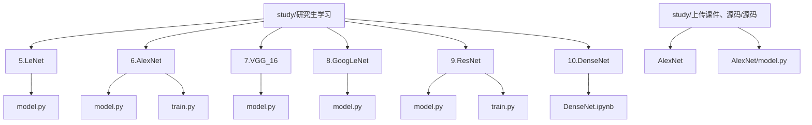
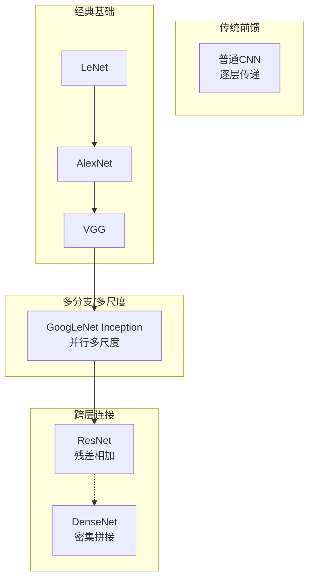
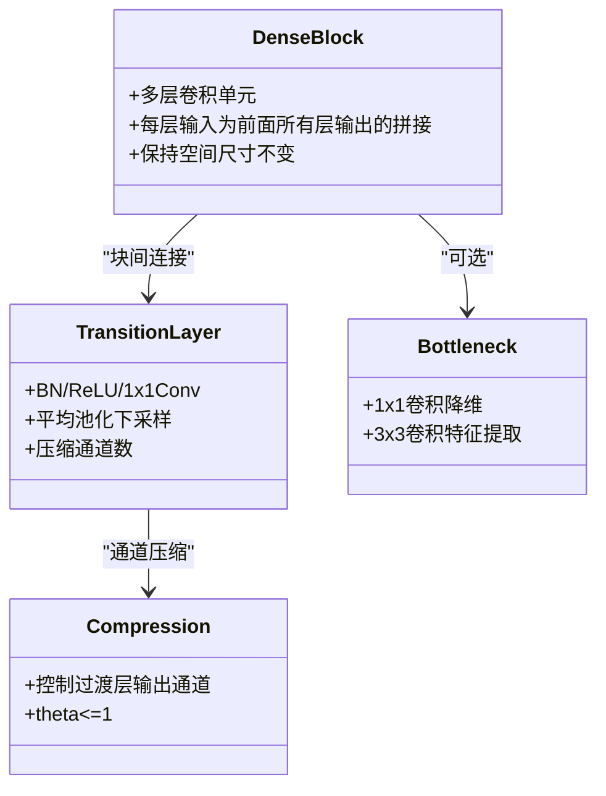
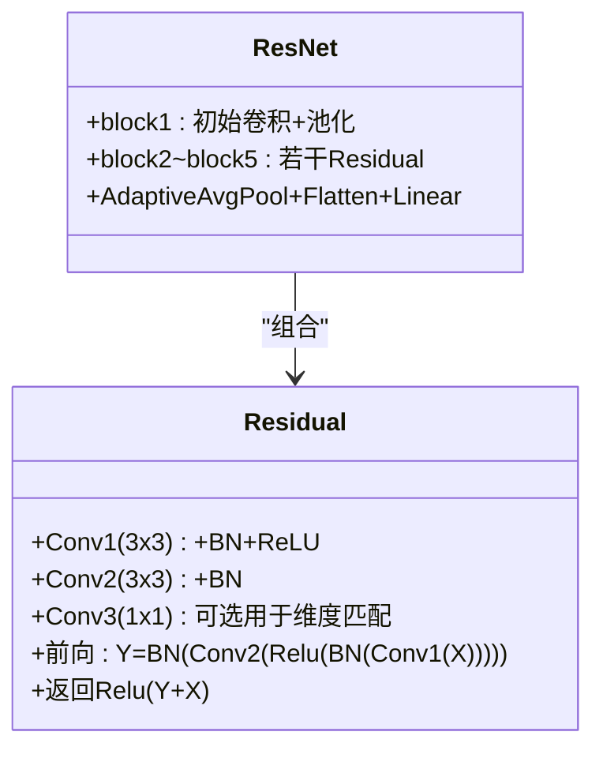
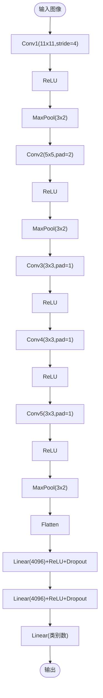
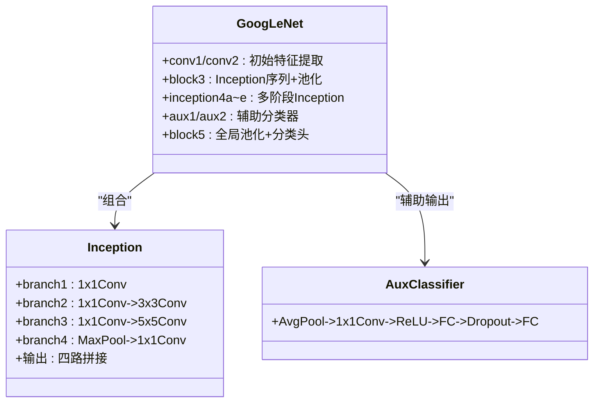
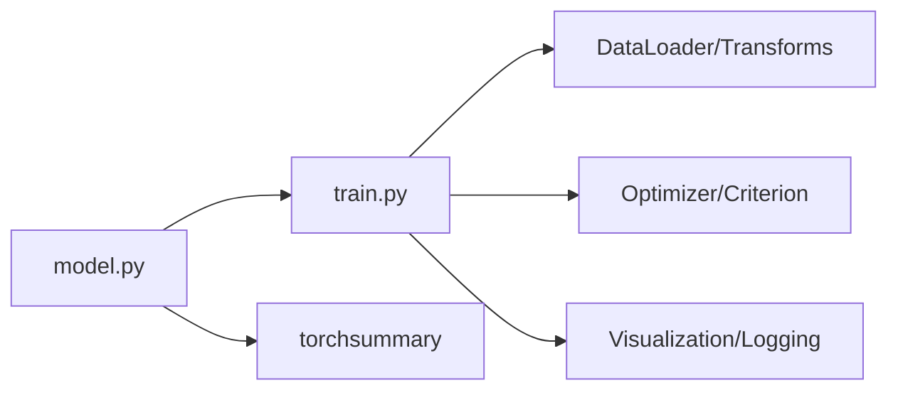
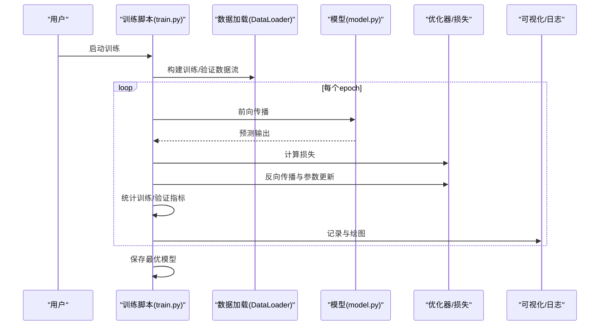

# 高级模型学习

<cite>
**本文引用的文件**   
- [DenseNet.ipynb](file://study/研究生学习/10.DenseNet/DenseNet.ipynb)
- [AlexNet/model.py（学习版）](file://study/研究生学习/6.AlexNet/model.py)
- [AlexNet/train.py（学习版）](file://study/研究生学习/6.AlexNet/train.py)
- [AlexNet/model.py（课件版）](file://study/上传课件、源码/源码/AlexNet/model.py)
- [ResNet/model.py（学习版）](file://study/研究生学习/9.ResNet/model.py)
- [ResNet/train.py（学习版）](file://study/研究生学习/9.ResNet/train.py)
- [VGG_16/model.py](file://study/研究生学习/7.VGG_16/model.py)
- [GoogLeNet/model.py](file://study/研究生学习/8.GoogLeNet/model.py)
- [LeNet/model.py](file://study/研究生学习/5.LeNet/model.py)
</cite>

## 目录
1. [引言](#引言)
2. [项目结构](#项目结构)
3. [核心组件](#核心组件)
4. [架构总览](#架构总览)
5. [详细组件分析](#详细组件分析)
6. [依赖关系分析](#依赖关系分析)
7. [性能与复杂度对比](#性能与复杂度对比)
8. [训练流程与最佳实践](#训练流程与最佳实践)
9. [故障排查指南](#故障排查指南)
10. [结论与设计建议](#结论与设计建议)
11. [附录：数学推导与可视化](#附录数学推导与可视化)

## 引言
本技术文档面向希望系统掌握现代卷积神经网络设计与实现的学习者，重点围绕以下目标展开：
- 深入解析 DenseNet 的密集连接机制、特征复用与梯度传播优势，并给出关键设计要点。
- 总结 AlexNet 与 ResNet 的关键创新点与改进思路，结合代码实现进行对照分析。
- 提供模型对比分析框架，涵盖参数量、计算复杂度、训练时间与准确率等指标，并说明如何在本仓库中复现实验。
- 解释现代深度学习模型的设计模式与最佳实践，包括模块化设计、注意力机制思想与应用场景适配。
- 通过数学推导与可视化图表帮助理解不同模型的适用场景和优化方向。

## 项目结构
仓库按“学习笔记 + 源码”组织，包含经典网络（LeNet、AlexNet、VGG、GoogLeNet、ResNet）以及 DenseNet 的系统性笔记。每个网络通常包含 model.py（模型定义）、train.py/test.py（训练/测试脚本），部分附带数据预处理或实验脚本。

图示来源
- [DenseNet.ipynb:1-558](file://study/研究生学习/10.DenseNet/DenseNet.ipynb#L1-L558)
- [AlexNet/model.py（学习版）:1-50](file://study/研究生学习/6.AlexNet/model.py#L1-L50)
- [AlexNet/train.py（学习版）:1-218](file://study/研究生学习/6.AlexNet/train.py#L1-L218)
- [AlexNet/model.py（课件版）:1-52](file://study/上传课件、源码/源码/AlexNet/model.py#L1-L52)
- [ResNet/model.py（学习版）:1-69](file://study/研究生学习/9.ResNet/model.py#L1-L69)
- [ResNet/train.py（学习版）:1-206](file://study/研究生学习/9.ResNet/train.py#L1-L206)
- [VGG_16/model.py:1-85](file://study/研究生学习/7.VGG_16/model.py#L1-L85)
- [GoogLeNet/model.py:1-144](file://study/研究生学习/8.GoogLeNet/model.py#L1-L144)
- [LeNet/model.py:1-38](file://study/研究生学习/5.LeNet/model.py#L1-L38)

章节来源
- [DenseNet.ipynb:1-558](file://study/研究生学习/10.DenseNet/DenseNet.ipynb#L1-L558)
- [AlexNet/model.py（学习版）:1-50](file://study/研究生学习/6.AlexNet/model.py#L1-L50)
- [AlexNet/train.py（学习版）:1-218](file://study/研究生学习/6.AlexNet/train.py#L1-L218)
- [AlexNet/model.py（课件版）:1-52](file://study/上传课件、源码/源码/AlexNet/model.py#L1-L52)
- [ResNet/model.py（学习版）:1-69](file://study/研究生学习/9.ResNet/model.py#L1-L69)
- [ResNet/train.py（学习版）:1-206](file://study/研究生学习/9.ResNet/train.py#L1-L206)
- [VGG_16/model.py:1-85](file://study/研究生学习/7.VGG_16/model.py#L1-L85)
- [GoogLeNet/model.py:1-144](file://study/研究生学习/8.GoogLeNet/model.py#L1-L144)
- [LeNet/model.py:1-38](file://study/研究生学习/5.LeNet/model.py#L1-L38)

## 核心组件
- LeNet：早期卷积网络范式，使用卷积+池化+全连接的串行结构，适合手写数字识别等小数据集任务。
- AlexNet：引入 ReLU、Dropout、大卷积核与多阶段下采样，显著提升图像分类能力。
- VGG：以堆叠小卷积核（3x3）和规则模块为特点，强调深度与统一结构。
- GoogLeNet：Inception 模块并行多尺度特征提取，配合辅助分类器提升深层网络训练稳定性。
- ResNet：残差连接解决退化问题，使极深网络可训练；支持通道数变化时的 1x1 投影捷径。
- DenseNet：密集连接将前面所有层输出拼接作为当前层输入，强化特征复用与梯度传播。

章节来源
- [LeNet/model.py:1-38](file://study/研究生学习/5.LeNet/model.py#L1-L38)
- [AlexNet/model.py（学习版）:1-50](file://study/研究生学习/6.AlexNet/model.py#L1-L50)
- [VGG_16/model.py:1-85](file://study/研究生学习/7.VGG_16/model.py#L1-L85)
- [GoogLeNet/model.py:1-144](file://study/研究生学习/8.GoogLeNet/model.py#L1-L144)
- [ResNet/model.py（学习版）:1-69](file://study/研究生学习/9.ResNet/model.py#L1-L69)
- [DenseNet.ipynb:1-558](file://study/研究生学习/10.DenseNet/DenseNet.ipynb#L1-L558)

## 架构总览
下图展示各模型的核心结构与连接方式差异，便于从整体视角理解设计动机与效果。

图示来源
- [ResNet/model.py（学习版）:1-69](file://study/研究生学习/9.ResNet/model.py#L1-L69)
- [DenseNet.ipynb:1-558](file://study/研究生学习/10.DenseNet/DenseNet.ipynb#L1-L558)
- [GoogLeNet/model.py:1-144](file://study/研究生学习/8.GoogLeNet/model.py#L1-L144)
- [AlexNet/model.py（学习版）:1-50](file://study/研究生学习/6.AlexNet/model.py#L1-L50)
- [VGG_16/model.py:1-85](file://study/研究生学习/7.VGG_16/model.py#L1-L85)
- [LeNet/model.py:1-38](file://study/研究生学习/5.LeNet/model.py#L1-L38)

## 详细组件分析

### DenseNet 组件分析
DenseNet 的核心在于 dense block、growth rate、transition layer、bottleneck 与 compression 的组合，形成高效且稳定的深层网络。

图示来源
- [DenseNet.ipynb:120-305](file://study/研究生学习/10.DenseNet/DenseNet.ipynb#L120-L305)

#### 关键要点
- 稠密连接公式：x_l = H_l([x_0, x_1, ..., x_{l-1}])，其中 H_l 通常为 BN→ReLU→Conv 序列。
- growth rate k 控制每层新增通道数，避免通道爆炸。
- transition layer 负责下采样与通道压缩，保证块内特征图尺寸一致。
- bottleneck 用 1x1 卷积减少计算量，compression 在过渡层降低通道数。

章节来源
- [DenseNet.ipynb:57-106](file://study/研究生学习/10.DenseNet/DenseNet.ipynb#L57-L106)
- [DenseNet.ipynb:120-166](file://study/研究生学习/10.DenseNet/DenseNet.ipynb#L120-L166)
- [DenseNet.ipynb:181-204](file://study/研究生学习/10.DenseNet/DenseNet.ipynb#L181-L204)
- [DenseNet.ipynb:218-246](file://study/研究生学习/10.DenseNet/DenseNet.ipynb#L218-L246)
- [DenseNet.ipynb:261-305](file://study/研究生学习/10.DenseNet/DenseNet.ipynb#L261-L305)

### ResNet 组件分析
ResNet 通过残差连接缓解退化问题，支持通道数变化的 1x1 投影捷径，并在多个 block 中重复使用。

图示来源
- [ResNet/model.py（学习版）:1-69](file://study/研究生学习/9.ResNet/model.py#L1-L69)

#### 关键要点
- 残差单元允许恒等映射，当输入输出通道不一致时使用 1x1 卷积进行投影。
- 多阶段 block 逐步增加通道数并下采样，最后全局平均池化后接分类头。

章节来源
- [ResNet/model.py（学习版）:5-24](file://study/研究生学习/9.ResNet/model.py#L5-L24)
- [ResNet/model.py（学习版）:26-63](file://study/研究生学习/9.ResNet/model.py#L26-L63)

### AlexNet 组件分析
AlexNet 采用大卷积核、ReLU、Dropout 与多级池化，显著提升了非线性表达能力与泛化性能。

图示来源
- [AlexNet/model.py（学习版）:1-50](file://study/研究生学习/6.AlexNet/model.py#L1-L50)
- [AlexNet/model.py（课件版）:1-52](file://study/上传课件、源码/源码/AlexNet/model.py#L1-L52)

章节来源
- [AlexNet/model.py（学习版）:1-50](file://study/研究生学习/6.AlexNet/model.py#L1-L50)
- [AlexNet/model.py（课件版）:1-52](file://study/上传课件、源码/源码/AlexNet/model.py#L1-L52)

### GoogLeNet 组件分析
GoogLeNet 通过 Inception 模块并行多尺度特征提取，并使用辅助分类器增强训练信号。

图示来源
- [GoogLeNet/model.py:1-144](file://study/研究生学习/8.GoogLeNet/model.py#L1-L144)

章节来源
- [GoogLeNet/model.py:5-51](file://study/研究生学习/8.GoogLeNet/model.py#L5-L51)
- [GoogLeNet/model.py:54-69](file://study/研究生学习/8.GoogLeNet/model.py#L54-L69)
- [GoogLeNet/model.py:71-137](file://study/研究生学习/8.GoogLeNet/model.py#L71-L137)

### VGG 与 LeNet 概览
- VGG：以 3x3 小卷积核堆叠为主，结构规整，易于扩展深度。
- LeNet：经典卷积+池化+全连接范式，适合小规模数据与简单任务。

章节来源
- [VGG_16/model.py:1-85](file://study/研究生学习/7.VGG_16/model.py#L1-L85)
- [LeNet/model.py:1-38](file://study/研究生学习/5.LeNet/model.py#L1-L38)

## 依赖关系分析
- 模型定义与训练脚本解耦：model.py 仅负责网络结构，train.py 负责数据加载、优化器、损失函数与评估流程。
- 第三方库依赖：torchsummary 用于打印模型结构与参数统计；torchvision.transforms 用于数据增强；matplotlib/pandas 用于可视化与记录。
- 设备管理：根据 CUDA 可用性选择 CPU/GPU 设备。

图示来源
- [AlexNet/train.py（学习版）:1-218](file://study/研究生学习/6.AlexNet/train.py#L1-L218)
- [ResNet/train.py（学习版）:1-206](file://study/研究生学习/9.ResNet/train.py#L1-L206)
- [AlexNet/model.py（学习版）:1-50](file://study/研究生学习/6.AlexNet/model.py#L1-L50)
- [ResNet/model.py（学习版）:1-69](file://study/研究生学习/9.ResNet/model.py#L1-L69)

章节来源
- [AlexNet/train.py（学习版）:1-218](file://study/研究生学习/6.AlexNet/train.py#L1-L218)
- [ResNet/train.py（学习版）:1-206](file://study/研究生学习/9.ResNet/train.py#L1-L206)

## 性能与复杂度对比
本节提供对比框架与参考依据，具体数值需基于实际运行结果统计。

- 参数量与计算复杂度
  - 影响因子：卷积核大小、通道数、网络深度、是否使用瓶颈层与压缩策略。
  - DenseNet：增长率为 k，通道随层线性增长；bottleneck 与 compression 可有效控制复杂度。
  - ResNet：残差连接不改变通道数（除非使用 1x1 投影），复杂度主要由卷积核与通道决定。
  - AlexNet/VGG：较大卷积核与较多通道导致较高计算量。
  - GoogLeNet：Inception 多分支并行，但通过 1x1 降维控制计算量。

- 训练时间
  - 受 batch size、数据增强强度、优化器与学习率策略、硬件资源影响。
  - DenseNet 因 concat 保存中间特征，显存占用较高，可能限制 batch size。

- 准确率
  - 在相同任务与数据增强条件下，比较验证集准确率与收敛速度。
  - 参考 DenseNet 笔记中的实验结论：在相近精度下，DenseNet 常具备更高参数效率。

- 复现实验建议
  - 使用 FashionMNIST 作为基准数据集，统一输入尺寸（如 224 或 227）。
  - 固定随机种子与数据划分，确保可比性。
  - 记录每 epoch 的训练/验证损失与准确率，绘制曲线。

章节来源
- [DenseNet.ipynb:368-394](file://study/研究生学习/10.DenseNet/DenseNet.ipynb#L368-L394)
- [AlexNet/train.py（学习版）:1-218](file://study/研究生学习/6.AlexNet/train.py#L1-L218)
- [ResNet/train.py（学习版）:1-206](file://study/研究生学习/9.ResNet/train.py#L1-L206)

## 训练流程与最佳实践
- 数据预处理与增强
  - Resize、随机水平翻转、旋转、仿射变换等增强手段有助于提升泛化。
  - 验证集仅做必要缩放，避免引入额外随机性。

- 优化器与正则化
  - Adam 常用于快速收敛；必要时加入权重衰减。
  - Dropout 优先使用 nn.Dropout 模块；若使用 F.dropout，需在 eval 模式下关闭随机失活。

- 设备与路径管理
  - 动态选择 GPU/CPU。
  - 路径应基于脚本所在目录生成，避免硬编码绝对路径。

- 模型保存与恢复
  - 保存验证集最优模型权重，便于后续推理或继续训练。
  - 注意接口一致性（例如 GoogLeNet 有辅助输出，ResNet 只有主输出）。

图示来源
- [AlexNet/train.py（学习版）:60-189](file://study/研究生学习/6.AlexNet/train.py#L60-L189)
- [ResNet/train.py（学习版）:36-168](file://study/研究生学习/9.ResNet/train.py#L36-L168)

章节来源
- [AlexNet/train.py（学习版）:1-218](file://study/研究生学习/6.AlexNet/train.py#L1-L218)
- [ResNet/train.py（学习版）:1-206](file://study/研究生学习/9.ResNet/train.py#L1-L206)

## 故障排查指南
- 路径问题
  - 避免使用相对路径 ./data 或绝对路径，应基于脚本所在目录构造路径。
- Dropout 行为
  - 使用 nn.Dropout 更安全；若使用 F.dropout，必须传入 training=self.training，否则验证阶段仍会随机失活。
- 接口一致性
  - 复制训练/测试脚本时，需同步模型输出接口与导入类，尤其是存在辅助输出的网络（如 GoogLeNet）。

章节来源
- [AlexNet/LESSONS.md:1-5](file://study/研究生学习/6.AlexNet/LESSONS.md#L1-L5)
- [ResNet/LESSONS.md:1-4](file://study/研究生学习/9.ResNet/LESSONS.md#L1-L4)

## 结论与设计建议
- 设计模式
  - 模块化：将复杂网络拆分为可复用的模块（如 Residual、Inception、DenseBlock）。
  - 跨层连接：残差与密集连接均能改善梯度传播，选择取决于任务与资源约束。
  - 多尺度与注意力：Inception 体现多尺度思想；注意力机制可作为通用增强模块嵌入现有架构。
- 模型选择
  - 小数据/轻量需求：优先考虑参数效率高的 DenseNet-B/C/BC 或轻量化变体。
  - 深层稳定训练：ResNet 是稳健选择，尤其对极深网络。
  - 多尺度特征：GoogLeNet 的 Inception 模块适合需要融合多尺度信息的任务。
- 优化方向
  - 控制通道增长（growth rate、bottleneck、compression）。
  - 合理的数据增强与正则化策略。
  - 监控显存占用，调整 batch size 与输入分辨率。

[本节为总结性内容，不直接分析具体文件]

## 附录：数学推导与可视化

### 稠密连接与特征复用
- 稠密连接公式：x_l = H_l([x_0, x_1, ..., x_{l-1}])
- 连接数量：L(L+1)/2，短路径增多，梯度更稳定。
- 特征复用：浅层边缘纹理可直接被深层利用，减少重复学习。

章节来源
- [DenseNet.ipynb:57-106](file://study/研究生学习/10.DenseNet/DenseNet.ipynb#L57-L106)
- [DenseNet.ipynb:461-491](file://study/研究生学习/10.DenseNet/DenseNet.ipynb#L461-L491)

### 过渡层与压缩
- 过渡层：BN→ReLU→1x1Conv→2x2平均池化，控制通道与下采样。
- 压缩系数 θ：输出通道数为 floor(θm)，常用 θ=0.5。

章节来源
- [DenseNet.ipynb:218-246](file://study/研究生学习/10.DenseNet/DenseNet.ipynb#L218-L246)
- [DenseNet.ipynb:275-291](file://study/研究生学习/10.DenseNet/DenseNet.ipynb#L275-L291)

### 残差连接与维度匹配
- 残差单元：Y=BN(Conv2(Relu(BN(Conv1(X))))), 返回 Relu(Y+X)。
- 维度匹配：当输入输出通道不一致时，使用 1x1 卷积进行投影。

章节来源
- [ResNet/model.py（学习版）:5-24](file://study/研究生学习/9.ResNet/model.py#L5-L24)

### Inception 多尺度并行
- 四条分支并行：1x1、1x1→3x3、1x1→5x5、MaxPool→1x1。
- 输出拼接：在通道维度合并，丰富表征能力。

章节来源
- [GoogLeNet/model.py:5-51](file://study/研究生学习/8.GoogLeNet/model.py#L5-L51)